# 高阶数字插值滤波器设计与 FPGA 验证

## 当前正式实板通过发布：397 LUT / 4 DSP P3-L 共享保护时基版（2026-08-04）

当前正式分支为 `national-finals-p3l-safe-packedrom-395target`，最终布局布线资源为 **397 LUT / 409 FF / 161 Slice / 4 DSP / 2 BRAM Tile / 2 MMCM**，WNS/WHS 为 **+44.408/+0.121 ns**，AD9708 setup/hold slack 为 **+76.116/+78.117 ns**，vectorless 功耗为 **0.271 W（Medium confidence）**。正式 bitstream SHA-256 为 `AC8735BAD24450FA038C79B104072DA70CEFA6FEF7B599C52CE16ECA5F091440`。

本版已完成 Smoke/Release **16/16 PASS**、完整链冲激/随机/满量程/强信号的 4x/8x/128x **0 LSB** 对拍、8 类复位恢复、10 次动态倍率切换、默认档和六模式 routed-DCP DAC 活动测试、RAMB18 INIT、Timing、DRC/CDC、功耗及 bitstream 闭环。**2026-08-04 用户完成物理板复测，确认 DAC 输出正常，44.1/48 kHz 两个家族下各倍率档位的实际采样频率均正确**。因此 P3-L 已从工具候选正式提升为板级验证通过版本；P3-K 427-LUT 版降为安全历史回退。

正式标签为 `nf-p3l-final-397lut-409ff-161slice-4dsp-2bram-boardverified`。完整优化、验证与板测记录见 [P3-L 395～405 LUT 目标优化执行反馈](matlab_fir/national_finals/results/p3l_395lut_target_optimization_execution_feedback.md)，发布证据见 [`p3l_safe_packedrom_sharedguard`](matlab_fir/national_finals/vivado_results/p3l_safe_packedrom_sharedguard)。

## 前一实板通过回退：427 LUT / 4 DSP DAC-ROM 安全版（2026-08-03）

用户在实物板上发现此前 412-LUT bitstream 的 `DA_CLK` 存在，但 `dac_data` 固定为中点码 128，DAC 不出波。使用同一个已布线 DCP 做完整板级功能仿真后精确复现：2 ms 内有 11,290 个 DAC 时钟边沿，但数据跳变为 0；复位、静音、模式、valid 与各级历史填充均正常，测试音 ROM 的采样值却始终为 0。

根因是 424-LUT Packed-ROM 优化把“下一地址”写进推断 BRAM 的空闲高 8 bit，并在 `$readmemh` 后用第二个 procedural `for` 循环补写高位。RTL 仿真接受这种二次初始化，但 Vivado 2018.3 没有把补写后的高位可靠固化进 RAMB18 INIT；地址 0 的高位保持 0，硬件因而永久自循环在首个零样点。该问题同时影响 424-LUT Packed-ROM 与继承它的 412-LUT 指针推导版本，两个旧 bitstream/tag 均已撤销上板推荐资格，不能再作为稳定回退。

当前分支 `national-finals-p3k-4dsp-dac-rom-fix` 恢复 24-bit 纯同步 ROM 和普通时序地址计数。修复版 post-route 为 **427 LUT / 416 FF / 177 Slice / 4 DSP / 2 BRAM Tile / 2 MMCM**，WNS/WHS **+44.983/+0.105 ns**，AD9708 setup/hold **+76.116/+78.117 ns**，vectorless 总/动态/静态功耗 **0.271/0.199/0.072 W**。修复版 routed DCP 在相同完整板级测试中达到 **11,290 个时钟边沿、7,461 次 DAC 数据跳变、88 次 ROM 样点更新**，Stage1/Stage2/CIC 均持续变化；bitstream SHA-256 为 `0FFEC2DC929AE3A16E2CB08B32F5B056F378902416E1E191B9D7D08CC6B0EA7D`。

修复版相对失效的 412-LUT 版本增加 15 LUT，并不是滤波器数据通路退化。旧 Packed-ROM 在综合后的 BRAM 高 8 bit 实际成为常量 0，使“下一地址”反馈、地址递增、范围比较与回绕选择等逻辑被常量传播或合并；较低 LUT 数包含了功能失效带来的虚假收益。修复后恢复真实的 8-bit 地址递增器、44.1/48 kHz 地址范围比较和回绕/家族选择逻辑，综合由 449/420 LUT/FF 变为 456/422，post-route 由 412/418 变为 427/416。综合只增加 7 LUT、布线后增加 15 LUT，是 `opt_design` 跨层合并与映射变化所致；DSP、BRAM、MMCM、滤波系数、频响和功耗均不变。

本轮新增了可重复的布局布线后板级门禁：`run_postroute_board_dac_activity.ps1` 从 routed DCP 导出 functional netlist，完整运行真实双 MMCM、65535 拍上电复位、ROM、插值链和 DAC ODDR，并要求 DAC 时钟与数据活动同时达标。详细定位、修复和证据见 [P3-K DAC-ROM 修复执行反馈](matlab_fir/national_finals/results/p3k_dac_rom_hardware_fix_execution_feedback.md)，bit、DCP、报告和回归日志见 [`p3k_final_427lut_416ff_177slice_4dsp_2bram_dacromfix`](matlab_fir/national_finals/vivado_results/p3k_final_427lut_416ff_177slice_4dsp_2bram_dacromfix)。**2026-08-03 用户已完成修复 bitstream 实板复测，确认 DAC 输出正常、采样率正常**；至此 MATLAB、RTL、综合实现、post-route、bitstream 与实板 DAC/采样率验证形成闭环。当前未提供逐档实测频率和频谱数据，因此本文不虚构这些测量值。

## 已撤销发布：412 LUT / 4 DSP 指针推导历史状态版（2026-08-03）

当前工具侧默认为 `national-finals-p3k-4dsp-pointer-fill` 分支的 **412 LUT / 418 FF / 168 Slice / 4 DSP / 2 BRAM Tile / 2 MMCM** 版本。正式实现没有采用会延迟首样点的“复位后 64 拍清 RAM”，而是复用现有环形写指针推导历史填充深度：Stage1 的两组 6-bit fill 状态压缩为 1 个满标志，Stage2/3 的三组 4-bit fill/任务快照压缩为 3 个满标志。短复位读掩码、任务头快照、滤波系数、字长、舍入、饱和、valid 时序和板级接口均保持不变。

正式 post-route 的 WNS/WHS 为 **+45.083/+0.056 ns**，TNS/THS=0，AD9708 setup/hold 为 **+76.116/+78.117 ns**，vectorless 总/动态/静态功耗为 **0.271/0.199/0.072 W**。Release RTL **15/15 PASS**：14 组全链输入的 4x/8x/128x 全部 0 LSB，8 个短复位场景各比较 4096 个 128x 输出，10 次动态切换通过。bitstream SHA-256 为 `E7512D603231276CDCED13C5FEA3A7284558B941CF4102FA1E3339CD5F5EF1CF`。

相对前一 424-LUT Packed-ROM 签核版，本版净减 **12 LUT、13 FF、1 Slice**，DSP、BRAM、MMCM 和功耗不变。滤波传递函数不变，MATLAB 六工况最差绝对通带偏差/峰峰纹波/阻带仍为 **0.007730/0.006192/72.371 dB**，严格线性相位。Default/AddRemap/Explore 均为 412/418/168，ExploreWithRemap 为 415/418/169，因此保留 Default。完整方法、首轮失败原因、RTL/实现证据和回退路线见 [P3-K 指针推导执行反馈](matlab_fir/national_finals/results/p3k_pointer_derived_fill_execution_feedback.md)。物理板下载和仪器测量尚未在当前环境执行，不能写成实板已通过。

## 前一发布结论：424 LUT / 4 DSP Packed-ROM 版（2026-08-03）

该轮工具侧默认由 P3-J 430-LUT 基线更新为 `national-finals-p3j-4dsp-bram-microengine` 分支的 **424 LUT / 431 FF / 169 Slice / 4 DSP / 2 BRAM Tile / 2 MMCM** 版本。它不改变 FIR/CIC 系数、字长、舍入、饱和或输出序列，而是把测试音 ROM 的空闲高 8 bit用于保存下一地址，删除 fabric 地址递增/范围比较/回绕 mux，并用 4-bit `{valid,family,mode}` 压缩矩阵键盘扫描上下文。相对前一 430-LUT 签核基线减少 **6 LUT/7 Slice**，DSP、BRAM、MMCM、FF和功耗不增加。

正式 clean-source 结果的 WNS/WHS 为 **+45.042/+0.080 ns**，TNS/THS=0，AD9708 setup/hold 为 **+76.116/+78.117 ns**，vectorless 总/动态/静态功耗为 **0.271/0.199/0.072 W**。MATLAB 六工况最差绝对通带偏差/峰峰纹波/阻带为 **0.007730/0.006192/72.371 dB**，严格线性相位；Release RTL 为 **15/15 PASS**，14 组全链输入的 4x/8x/128x 全部 0 LSB。普通 Vivado GUI 工程从零重建也复现 424/431/4-DSP/4-RAMB18/2-MMCM 并生成 bitstream。物理板下载和仪器测量尚未在当前环境执行，不能写成实板已通过。

本轮同时实测了 5-RAMB18 的 Stage1/Stage2/3 拆分、两相共享 CIC、高/中/默认综合和 Default/AddRemap 实现。增加到 5 个 RAMB18E1 分别得到 478 或 477 LUT，没有出现 BRAM 换入 200 多 LUT 的收益；最终保留点仍只用 4 个 RAMB18E1。完整逐项数据、失败原因、超时处理和复现命令见 [P3-J 4-DSP BRAM/微引擎执行反馈](matlab_fir/national_finals/results/p3j_4dsp_bram_microengine_execution_feedback.md)，正式报告/bitstream/Release/GUI 日志见 [`p3j_final_424lut_431ff_169slice_4dsp_2bram_packedrom`](matlab_fir/national_finals/vivado_results/p3j_final_424lut_431ff_169slice_4dsp_2bram_packedrom)。bitstream SHA-256 为 `2BA97CCE337638D57268EE04CCE0D09D2FDF6637B1A4A25D35E57BCB49C3ED4B`。

## 424-LUT 后续 LUT-only / FF 换 LUT 审计（2026-08-03）

在 DSP=4、BRAM Tile=2、MMCM=2 不变且允许 FF 小幅增加（目标不超过440、上限448）的条件下，已继续实测系数 BRAM 终止标志、键盘移位去抖、CIC 15-bit 移位尾状态、共享启动/扫描计数以及五种 `opt_design` 策略。所有完成 RTL 的候选均通过对应 XSim；组合候选另通过完整 Smoke **15/15**。但最终布局布线均未低于当前 424-LUT 版本：

| 后续候选 | Synth LUT/FF | Placed LUT/FF/Slice | DSP | BRAM Tile | WNS/WHS | 结论 |
|---|---:|---:|---:|---:|---:|---|
| 当前 Packed-ROM 基线 | 453/433 | **424/431/169** | 4 | 2 | **+45.042/+0.080 ns** | 保留 |
| 系数 BRAM 终止标志 | 453/428 | 430/426/177 | 4 | 2 | +45.674/+0.096 ns | 少5 FF但多6 LUT，No-Go |
| 系数标志+共享启动计数 | 451/428 | 429/426/182 | 4 | 2 | +45.156/+0.056 ns | 综合下降、实现反升，No-Go |
| 仅共享启动计数 | 452/433 | 427/431/173 | 4 | 2 | +44.926/+0.096 ns | 多3 LUT，No-Go |
| 原始 RTL 同环境重跑 | 453/433 | **424/431/169** | 4 | 2 | **+45.042/+0.080 ns** | 精确复现 |

固定451-LUT综合 DCP 的实现策略结果为：Default/Explore/AddRemap/ExploreWithRemap 均为429 LUT，ExploreArea 为495 LUT。CIC 移位状态则在综合阶段已增至457 LUT/439 FF；键盘移位去抖在全局综合中净收益为0，二者均按停止线未进入实现。这说明当前424版的优势来自 Vivado 对原结构的跨层合并，局部 RTL 数量下降不能直接等价为 post-route LUT 下降。

当前推荐版本、资源、Timing、功耗、bitstream 和频响指标均保持不变；本轮没有实物板，不能把工具侧验证写成新候选已通过板测。完整逐项方法、失败原因、验证证据、分支、提交和标签见 [P3-J LUT-only / FF 换 LUT 执行反馈](matlab_fir/national_finals/results/p3j_lut_only_ff_tradeoff_execution_feedback.md)。

## 424-LUT 后续结构优化：环形指针推导填充深度（2026-08-03）

前一轮局部逻辑替换没有降低 post-route LUT；本轮改为删除冗余状态本身。Stage1 在首次回绕前可直接把 `wr_ptr` 解释为已写深度，Stage2/3 则用 `-job_history_head` 推导任务启动时的深度；达到 52/9/6 点后各用一位粘滞满标志。由此把 24 bit fill 状态压缩为 4 bit 满状态，保持未写地址屏蔽和 8 拍短复位语义。

| 候选 | Synth LUT/FF | Routed LUT/FF/Slice | DSP | BRAM Tile | WNS/WHS | 结论 |
|---|---:|---:|---:|---:|---:|---|
| **DAC-ROM 安全修复版** | **456/422** | **427/416/177** | **4** | **2** | **+44.983/+0.105 ns** | **当前可上板候选** |
| Packed-ROM 旧签核版 | 453/433 | 424/431/169 | 4 | 2 | +45.042/+0.080 ns | ROM 地址锁死，禁止上板 |
| 指针推导旧版 | 449/420 | 412/418/168 | 4 | 2 | +45.083/+0.056 ns | ROM 地址锁死，禁止上板 |
| AddRemap / Explore | 同一 DCP | 412/418/168 | 4 | 2 | +45.083/+0.056 ns | 与 Default 同资源 |
| ExploreWithRemap | 同一 DCP | 415/418/169 | 4 | 2 | +45.387/+0.121 ns | 多3 LUT/1 Slice，No-Go |

首个“复位后 64 拍主动清 RAM”候选因丢失短复位后的首批输入而在全链位真门禁失败，已在综合前撤销；最终指针推导版不增加启动延迟，并通过 Smoke/Release 15/15、14 组全链 0 LSB、8 组复位恢复、10 次动态切换、布局布线、时序、DRC/CDC、功耗评估和 bitstream 生成。该结果仍待物理板复测。

## 优化演进总览（建议先读）

本节按时间顺序统一整理“最初 4x+2x 结构、区域赛全 2x 优化、FIR-CIC 优化、全国赛全 2x 回退对照、全国赛 6-DSP CIC、440/442/434-LUT 演进、Route 1、comb-LUT 低 DSP 版、P1 真 Q15 正确性修复、P3 工程闭环、P4-A～P4-F、P3-J Stage3/均衡器联合设计、Packed-ROM/Ultra-Keypad、环形指针推导填充状态，以及 DAC-ROM 综合语义修复”。重要纠错：旧 424-LUT/6-DSP 与 436-LUT/5-DSP 版本有 8x/128x 约 −6.02 dB 标度缺陷；412-LUT/4-DSP 与 424-LUT/4-DSP 又有测试音 ROM 地址锁死缺陷。当前正式实板通过版本为 P3-L `397 LUT / 409 FF / 161 Slice / 4 DSP / 2 BRAM Tile`；P3-K 427-LUT、Packed-ROM 之前的 430-LUT P3-J 与 P4-D R2 是安全历史回退。

### 统计与比较口径

不同阶段曾使用不同顶层和输入采样率。为避免把模块级结果、完整板级结果和 MATLAB 候选混为一谈，本文统一使用以下标记：

| 口径 | 含义 | 可以比较什么 |
|---|---|---|
| **独立链** | 只综合插值数据通路，不含 PCM ROM、按键、DAC 包装、双采样率时钟等板级功能 | 适合判断滤波结构本身的面积变化 |
| **单采样率板级** | 44.1 kHz 完整演示顶层，通常含 PCM ROM、模式控制和 DAC 接口 | 区域赛各版本可以纵向比较 |
| **全国赛板级** | 44.1/48 kHz 双采样率、4x/8x/128x 完整顶层，含 2 个 MMCM | 全国赛 FIR-CIC 与全国赛全 2x 可以直接比较 |
| **MATLAB 候选** | 只完成数学或定点搜索，未进入完整 RTL/实现 | 只能比较频响，不能填写 FPGA 资源 |

下文的 LUT、FF、DSP、BRAM 和 MMCM 均取 Vivado 布局布线后结果；明确标为“独立链”的早期数据除外。BRAM 按 BRAM Tile 计数，两个 RAMB18E1 等于一个 BRAM Tile。功耗均为 Vivado vectorless 估计，不是实测值；`0.168/0.169 W` 来自早期单采样率顶层且为 Low confidence，`0.271 W` 来自全国赛双采样率顶层且为 Medium confidence，因此两组数值不能用于推导滤波器本身的功耗增量。

### P3-J 前一签核基线：Stage3 吸收 128x CIC 均衡器

P3-J 把 P4-D 独立的 11-tap shift-add CIC 均衡器折叠进第三级 FIR：4x/8x 使用原 flat Stage3 系数，128x 使用联合设计的 compensated Stage3 系数，然后直接进入 N3 Hold CIC16。两组系数占用统一 RAMB18E1 的空闲地址，signed-18 高两位存入 parity；模式在 Stage3 job 边界快照，补偿输出保留经满量程证明所需的 signed-21。独立均衡器不再进入板级网表，DSP、BRAM、MMCM不增加。

Release 从零回归 **15/15 PASS**：冲激、10 个固定 seed×4096、正/负满量程和新增 997 Hz/−1 dBFS 强信号共 14 组全链输入，4x/8x/128x 逐样本 **0 LSB**；另通过 8 个内部状态复位场景、10 次不停机倍率切换、1200 次原子 CDC 切换和 RAMB18 parity 原语测试。最终从 clean source 复现的板级 post-route 为 **430 LUT / 431 FF / 176 Slice / 4 DSP / 2 BRAM Tile / 2 MMCM**，相对 P4-D R2 减少 **49 LUT / 37 FF / 22 Slice**；WNS/WHS **+45.636/+0.119 ns**，AD9708 setup/hold **+76.116/+78.117 ns**，功耗 **0.271 W**。详细结构见 [P3-J RTL 签核](matlab_fir/national_finals/results/p3_joint_stage3_rtl_signoff.md)，后续正交扫描、失败原因和可复现性修复见 [P3-J 后续优化指导执行反馈](matlab_fir/national_finals/results/p3j_next_optimization_execution_guide_execution_feedback.md)。

### P3-J 后续指导执行：DSP/BRAM Pareto、有限字长与可复现构建

指导中的 P1/P2/P3/P5 已按停止线执行。默认 4-DSP、低 DSP、低 BRAM和交叉点的实测结果如下；所有保留点均已完成 post-route、正时序和 bitstream，默认版另于 2026-08-03 重跑 MATLAB 与 Release RTL 15/15。

| P3-J 候选 | LUT | FF | Slice | DSP | RAMB18 / BRAM Tile | WNS/WHS | 结论 |
|---|---:|---:|---:|---:|---:|---:|---|
| **DAC-ROM 修复候选** | **427** | **416** | **177** | **4** | **4 / 2.0** | **+44.983/+0.105 ns** | 当前可上板候选 |
| 指针推导旧版 | 412 | 418 | 168 | 4 | 4 / 2.0 | +45.083/+0.056 ns | ROM 地址锁死，禁止上板 |
| Packed-ROM 旧版 | 424 | 431 | 169 | 4 | 4 / 2.0 | +45.042/+0.080 ns | ROM 地址锁死，禁止上板 |
| P3-J Packed-ROM 前基线 | 430 | 431 | 176 | 4 | 4 / 2.0 | +45.636/+0.119 ns | 安全历史回退 |
| 3-DSP | 466 | 457 | 188 | 3 | 4 / 2.0 | +45.785/+0.121 ns | 低 DSP Pareto |
| 2-DSP | 488 | 486 | 191 | 2 | 4 / 2.0 | +45.736/+0.060 ns | 最低 DSP Pareto |
| 1.5-BRAM | 456 | 450 | 181 | 4 | 3 / 1.5 | +46.033/+0.116 ns | 低 BRAM Pareto |
| 3-DSP + 1.5-BRAM | 478 | 476 | 191 | 3 | 3 / 1.5 | +45.610/+0.115 ns | 交叉 Pareto |
| 1-BRAM | 495 | 480 | 186 | 4 | 2 / 1.0 | +45.807/+0.108 ns | 超过 490-LUT 停止线，No-Go |
| 9-tap Stage3 | 441 | 431 | 177 | 4 | 4 / 2.0 | +46.190/+0.121 ns | 比 430 基线多 11 LUT，No-Go |

历史“430 报告但手动重跑 436”的原因也已闭环：430 实际来自 `AreaOptimized_high/full/on`，旧包装器却默认 `rebuilt` 并可复用未标记来源的 DCP。现在批处理默认和 GUI 都统一为 `full`，综合写 `national_finals_synth_provenance.txt`，实现前强制校验指纹；本机默认 `-Step all` 约 102 秒完成。`-jobs` 固定为 4，避免 GUI 曾以 19 jobs 触发内存不足或 route 假死。

### P1 正确性修复：Stage 3 真 Q15 与绝对增益门禁

独立复核冲激直流和发现：旧 Stage 3 整数系数只有 Q14 幅度，共享 MAC 却固定右移 15 bit。4x 不经过 Stage 3，绝对增益为 -0.001599 dB；8x/128x 则分别为 -6.023392/-6.024933 dB。旧频响脚本对每个节点分别除以自身冲激和，因此只证明了频响形状，没有证明模式间幅度一致。

P1 将 Stage 3 统一为真 Q15，修正 MATLAB、RTL 系数 ROM、统一 RAMB18E1 INIT 与原语测试，恢复完整 38-bit signed 饱和路径，并新增 `±0.01 dB` 绝对增益和 `0.01 dB` 模式间增益差门禁。修复后 4x/8x/128x 为 -0.001599/-0.002709/-0.003480 dB，最大差 0.001881 dB；RTL 10/10 和全链路 0 LSB 回归通过。

修复版 post-route 为 **446 LUT / 471 FF / 5 DSP / 3 BRAM Tile / 2 MMCM**，WNS/WHS **+45.104/+0.121 ns**，功耗 0.271 W。多出的 10 LUT 是恢复 38-bit 饱和检查的正确性成本。完整证据见 [P1 Stage 3 Q 格式修复签核](matlab_fir/national_finals/results/p1_stage3_qformat_fix_summary.md)。

### P3 工程闭环：原子 CDC、同步复位与 AD9708 STA

P3 保持 P1 的系数和位真样点不变，把两位模式选择改成 request/ack 原子握手，数据通路改为同步复位，并加入 MMCM 锁定同步、安全静音、IOB 数据寄存器和 ODDR DAC 时钟转发。XSim 从零重跑为 **11/11 PASS**，其中模式 CDC 覆盖 1200 次全方向事务，双 MMCM 家族切换压力测试 100 次，动态倍率切换的边沿数为 32/128/256/4096 且无 runt/X。

post-route 为 **462 LUT / 447 FF / 180 Slice / 5 DSP / 3 BRAM Tile / 2 MMCM**，WNS/WHS **+46.140/+0.050 ns**，功耗 **0.271 W**。AD9708 约束包含 2.0 ns setup、1.5 ns hold 和 0.5 ns 附加裕量，最差输出 setup/hold 为 **+76.116/+78.117 ns**。bitstream SHA-256 为 `A38C6D4F4B3C023DBD22897505B85864990CFC7C5D974A84FA38C5F0ADE21033`。详细证据和 CDC/DRC waiver 见 [P3 工程闭环签核](matlab_fir/national_finals/results/p3_engineering_closure_summary.md)，指导合理性与后续 P4/P5 分工见 [下一阶段优化指导执行记录](matlab_fir/national_finals/results/next_stage_optimization_guide_execution.md)。

### P4-A 4-DSP Pareto 版：N3 Hold 严格等价改写

P4-A 将三级 CIC 的 `C³ → ↑16 → I³` 按多速率恒等式改写为 `C² → Hold16 → I²`，保持 33-bit 模运算、输出归一化、valid 周期和所有滤波系数不变。新增测试与旧 CIC 比较 7680 个输出样本，连续输入、随机停顿和中途复位均为 0 LSB；完整 XSim 为 **12/12 PASS**。

同一全国赛板级顶层 post-route 为 **491 LUT / 444 FF / 197 Slice / 4 DSP / 3 BRAM Tile / 2 MMCM**，WNS/WHS **+45.738/+0.052 ns**，功耗 **0.271 W**，bitstream SHA-256 为 `D262BA94186D992016FE9FACD157E34FDB29EDF0F9A3433A38833A65B101C334`。相对 P3 的变化为 `+29 LUT / -3 FF / +17 Slice / -1 DSP`，因此它是最低 DSP 的 Pareto 候选，不替代最低 LUT 的 P3 版本。完整证据见 [P4-A N3 Hold 签核](matlab_fir/national_finals/results/p4a_n3_hold_4dsp_summary.md)。

### P4-B 2-BRAM-Tile Pareto 版：历史存储单端口时分复用

P4-B 保持 P4-A 的所有系数、位宽、舍入、饱和、valid 和输出样点不变，只重排历史 RAM。Stage 1 将当前输入旁路为第 0 对左样本，其余 51 次历史读在相邻 64 拍 `ce2_out` 窗口内串行完成，使双读历史从 2 个 RAMB18E1 降为 1 个；Stage 2/3 用 bank 地址把两组浅历史合并到另一个 RAMB18E1，并用一项写队列解决同拍更新。两处都使用显式 RAMB18E1，避免综合回退到 LUTRAM。

新增 Stage 1 新旧核对拍 1400 个输出、Stage 2/3 对拍 336/671 个输出，均为 0 LSB；完整 XSim 为 **14/14 PASS**。最终 post-route 为 **504 LUT / 493 FF / 202 Slice / 4 DSP / 2 BRAM Tile（4 RAMB18E1）/ 2 MMCM**，WNS/WHS **+45.637/+0.119 ns**，功耗 **0.271 W**。相对 P4-A 用 `+13 LUT / +49 FF / +5 Slice` 换掉 `1 个 BRAM Tile`；因此 P4-A 适合优先 LUT/FF，P4-B 适合优先 BRAM。bitstream SHA-256 为 `DA0665E43A8DA5230AB93FC786AB0EED47BD83FE393C9B1416BA3360B8DE5E85`，完整证据见 [P4-B 单 BRAM签核](matlab_fir/national_finals/results/p4b_single_bram_4dsp_summary.md)。

### P4-C 当前默认版：固定 CE 精简、DSP48 预加器和 CIC 4/3/2-DSP Pareto

P4-C 在 P4-B 的正确标度和 2-BRAM-Tile 结构上继续做严格等价优化：只在板级连续 2 的幂 CE 配置删除不可达的 Stage2/3 25-bit 写队列；在当前 Stage1 单 BRAM 核上重新实测并启用 DSP48E1 `D+A` 预加器；把 N3 Hold CIC 的两个保守 33-bit 状态按解析界收紧为 26/29 bit。通用模块仍保留写队列，CIC 也保留 4/3/2-DSP 可配置映射。

本轮还修复了 48 kHz 切换后首 ROM 地址、CDC `SETTLE_CYCLES>3` 截断和 GUI 仿真宏漂移，并增加历史 RAMB18 原语独立对拍。最终 RTL 为 **15/15 PASS**，MATLAB 重新分析当前 RTL impulse 的六工况频响和严格线性相位全部 PASS。

| P4-C 档位 | LUT | FF | Slice | DSP | BRAM | MMCM | WNS/WHS | 功耗估计 |
|---|---:|---:|---:|---:|---:|---:|---:|---:|
| **默认低 LUT/FF** | **479** | **468** | **198** | **4** | **2** | **2** | **+45.734/+0.121 ns** | **0.271 W** |
| 低 DSP-A | 504 | 494 | 198 | 3 | 2 | 2 | +45.853/+0.121 ns | 0.271 W |
| 低 DSP-B | 523 | 523 | 197 | 2 | 2 | 2 | +45.802/+0.121 ns | 0.270 W |

相对 P4-B，默认档减少 25 LUT、25 FF、4 Slice；3-DSP 和 2-DSP 档分别以 `+25 LUT/+26 FF`、`+44 LUT/+55 FF` 交换 1/2 个 DSP。三档均为同一最终 RTL 从头综合、布局布线和 bitstream 结果。默认 SHA-256 为 `814465320512830C98D0EDA5352D36797BF5C442CD27E3520B5B89601F1C52D3`；逐项指导判断、数学证明、策略扫描和未执行项见 [P4-C 执行反馈](matlab_fir/national_finals/results/p4b_rtl_next_optimization_guide_execution.md)。

### P4-D 当前发布闭环：固定签核配置、10-seed Release 与 CDC 物理约束

P4-D 不改变 P4-C 的滤波系数、定点路径、吞吐或资源拓扑，而是修复“脚本通过但 GUI/资产/回归规模可能漂移”的发布风险。新增固定参数的 `nf_signedoff_filter_core`，把算法配置与 Smoke/Release 规模完全解耦；GUI `sim_1` 显式登记 8 个日常 `.mem`，全链 testbench 在 `$readmemh` 前逐一预检资产。故意移走输入文件的负向测试已确认会立即报 `NF_ASSET_MISSING`。

发布级 MATLAB 生成冲激和 10 个固定 seed×4096 输入，共 44 个 `.mem`、41,293,728 字节；完整 Release XSim 为 **15/15 PASS**，每个 seed 的 4x/8x/128x 输出数分别为 `16605/33219/531584`，三个节点逐样本 **0 LSB**。旧 TB/指导中的 `531552` 少 32 点，已按 `138368+(4096-1024)×128=531584` 和十组实际 golden 行数修正。

request/ack bundled-data CDC 新增 `50.000 ns` bus-skew 约束，post-route 实测 `1.816 ns`、裕量 `48.184 ns`。重新实现仍为 **479 LUT / 468 FF / 198 Slice / 4 DSP / 2 BRAM Tile / 2 MMCM**，WNS/WHS **+45.734/+0.121 ns**，AD9708 setup/hold **+76.116/+78.117 ns**，vectorless 功耗 **0.271 W**；独立 Tcl 和普通 GUI `impl_1 -> write_bitstream` 均通过。新 bitstream SHA-256 为 `44879C48B2A15481A2B7DE598EAA83DE02CD1DABBD9C9BD5D26F0E8399E3E378`。完整 TIMING-18/CDC 证据、发布清单和物理板待办见 [P4-D 发布闭环签核](matlab_fir/national_finals/results/p4d_release_closure_summary.md)。

P4-D Release V2 又完成了导出包深度审计：修正 20/21-bit golden，增加正负满量程边界用例和 reset-zero prefix 断言，将 CDC 改为精确 false path 加 50 ns bus-skew/absolute max-delay，并从干净提交 `e55dca0` 重建。Release/Smoke 均为 **15/15 PASS**，13 组 Release 向量的 4x/8x/128x 全部 **0 LSB**；post-route 仍为 **479 LUT / 468 FF / 4 DSP / 2 BRAM Tile / 2 MMCM**，WNS/WHS **+45.734/+0.121 ns**，mode bus skew **1.813 ns**、最大绝对延迟 **0.912 ns**，bit SHA-256 为 `8630210663629357237AAA3F076348FBE65610EAAB61ADA4706E81F75AAF02A6`。完整干净构建清单和六工况数值见 [P4-D Release V2 签核](matlab_fir/national_finals/results/p4d_release_v2_clean_signoff.md)。

### P4-E/P4-F：按深度审计指导验证低 BRAM Pareto

P4-E 将板级 PCM ROM 与 Stage1 历史映射到同一个 512×36 RAMB18E1：Stage1 读优先，PCM 请求保持到已证明的空闲窗口，RAM 输出寄存器同时作为 PCM 预取缓冲。P4-F 再把 Stage2/3 历史从 RAMB18E1 改为 8 个 RAM32M。两版都不改变系数、DSP 数据通路、定点舍入、饱和或 valid 序列，Release 对拍证明 4x/8x/128x 与 P4-D 逐样本 0 LSB，因此继承相同六工况频响。

| 版本 | LUT | FF | Slice | DSP | RAMB18 / BRAM Tile | MMCM | WNS/WHS | 功耗（总/动态/静态） | 验证与定位 |
|---|---:|---:|---:|---:|---:|---:|---:|---:|---|
| **P4-D 默认** | **479** | **468** | **198** | **4** | **4 / 2.0** | **2** | **+45.734/+0.121 ns** | **0.271/0.199/0.072 W** | 默认最低 LUT/FF；15/15 |
| P4-E PCM/Stage1 共享 | 491 | 487 | 202 | 4 | 3 / 1.5 | 2 | +46.132/+0.105 ns | 0.271/0.199/0.072 W | 低 BRAM Pareto；16/16 |
| P4-F Stage2/3 LUTRAM | 531 | 487 | 204 | 4 | 2 / 1.0 | 2 | +45.898/+0.105 ns | 0.270/0.198/0.072 W | 最低 BRAM Pareto；16/16 |

P4-F 没有达到指导预估的约 500～510 LUT，而是用相对 P4-D 的 `+52 LUT/+19 FF/+6 Slice` 换掉 1 BRAM Tile，所以不能称为综合资源更优。补偿器与 CIC C² 共享串行 ALU 也实际实现并通过 Smoke，但为 504 LUT / 488 FF，面积反升，已按 No-Go 独立保留。完整的执行/问题/取舍见 [P4-C 深度审计指导执行反馈](matlab_fir/national_finals/results/p4c_rtl_deep_audit_and_next_optimization_guide_execution.md)。

### X3：20 MHz 统一三级 FIR 创新结构（功能 Go，资源 No-Go）

最新指导中尚未尝试的创新点也已在独立分支落地：把 Stage1/2/3 全部搬到 20 MHz 域，用 4-deep Gray FIFO 接收输入、用 y2/y4/y8 ping-pong bank 返回音频域，三级 FIR 共用一颗 DSP48E1；补偿器和 N3 Hold CIC 保持原音频域结构。160 个 sys clock 完成一帧，低于 48 kHz 的约 416.67-clock 最坏输入间隔。冲激加 10 个固定 seed×4096 的 Release 回归 **11/11 PASS**，三节点逐样本 **0 LSB**，因此六工况频响与 P4-D 完全相同。

| 滤波核心口径 | LUT | FF | DSP | RAMB18 / BRAM Tile | 结论 |
|---|---:|---:|---:|---:|---|
| P4-D 已布线滤波层级 | 377 | 361 | 4 | 3 / 1.5 | 当前基准 |
| X3 20 MHz 统一 FIR OOC post-route | 910 | 692 | 3 | 5 / 2.5 | 功能通过，资源 No-Go |
| X3 增量 | **+533** | **+331** | **-1** | **+2 / +1.0** | 1 DSP 的收益不足以抵消控制与 CDC 存储 |

X3 两个时钟域 WNS/WHS 分别为 20 MHz `+34.839/+0.072 ns`、6.144 MHz `+149.833/+0.081 ns`。OOC vectorless 功耗为 `0.076 W`，因不含双 MMCM 与板级包装，不能与 P4-D 的完整板级 `0.271 W` 直接比较。核心资源已明显越过停止线，所以没有污染 P4-D 工程，也没有继续生成 X3 板级 bitstream；默认推荐保持 P4-D。架构、修复、RTL 回归、CDC/DRC 和停止理由见 [X3 20 MHz 统一 FIR 执行报告](matlab_fir/national_finals/results/x3_20m_unified_fir_nogo.md)。

通带指标也统一区分两种定义：

- **通带最大绝对偏差**：通带内相对 0 dB 的最大偏离，直接对应赛题“±0.05 dB”门槛。
- **通带峰峰纹波**：通带最大值减最小值。早期报告未保存该值时以“—”表示，不用最大绝对偏差代替。

整体演进路线如下：

```text
最初 4x + 5×2x
  -> 七级全 2x：先统一结构和提高频响余量
  -> 全 2x Phase 1～6：canonical、多相、严格半带、BRAM、DSP 共享、混合字长
  -> FIR-CIC：用 CIC16 替换高采样率四级 2x FIR
  -> 区域赛低 LUT CIC：2-DSP / 9-DSP / 8-DSP Pareto 收敛到 472 LUT
  -> 全国赛双采样率：补齐 44.1/48 kHz 与 4x/8x/128x 正式节点
  -> 全国赛全 2x 回退对照：714 LUT/3 DSP 与 728 LUT/2 DSP
  -> 全国赛 6-DSP CIC：573 LUT 基线连续优化到 440 LUT
  -> 第六轮复位映射：442 LUT / 432 FF，形成低 FF Pareto 点
  -> 第七轮余量后移：均衡器保留 21-bit 无损余量，CIC 末端统一量化，降至 434 LUT
  -> Route 1：统一 Stage1/Stage2/3 系数 RAM，降至 424 LUT / 6 DSP
  -> 第八轮：低速 CIC comb 迁移到 LUT/CARRY4，形成 436 LUT / 5 DSP Pareto 点
  -> P1/P3：修复真 Q15 绝对增益，并闭合 CDC、复位和 AD9708 STA
  -> P4-A：N3 Hold 严格等价改写，形成 491 LUT / 4 DSP Pareto 点
  -> P4-B：Stage1 与 Stage2/3 历史 RAM 时分复用，形成 504 LUT / 4 DSP / 2 BRAM Tile Pareto 点
  -> P4-C：固定 CE 删除死队列、Stage1 预加器、26/29-bit CIC，形成 479 LUT / 4 DSP 默认版及 3/2-DSP Pareto
  -> P4-D：固定签核 wrapper、Release 长回归、CDC bus-skew 与 bitstream 清单闭环
  -> P4-E：PCM/Stage1 共享 RAMB18，形成 491 LUT / 4 DSP / 1.5 BRAM Tile Pareto
  -> P4-F：Stage2/3 历史改 RAM32M，形成 531 LUT / 4 DSP / 1 BRAM Tile Pareto
  -> X3：20 MHz 三级 FIR 共用 1 DSP，Release 0 LSB，但核心为 910 LUT / 692 FF / 3 DSP / 2.5 BRAM，资源 No-Go
  -> P3-J：按模式将128x均衡响应折叠进Stage3，删除独立均衡器，形成430 LUT / 431 FF / 4 DSP新默认版
  -> P3-J 后续：形成466-LUT/3-DSP、488-LUT/2-DSP、456-LUT/1.5-BRAM Pareto；signed-20与9-tap均No-Go
```

### Route 1：历史 424-LUT 资源点做了什么

Route 1 的优化对象不是滤波器系数、CIC 阶数或定点字长，而是两条 FIR DSP 通道之间重复的**系数存储和地址译码**。名称中的“统一引擎”也不表示把 Stage1、Stage2、Stage3 强行合并为一颗 DSP：48 kHz 最紧工况下，一个 128 拍输入超周期内，Stage1、Stage2、Stage3 最坏分别需要 27、42、60 拍，单 DSP 合计 **129 拍**，已经超过可用预算。因此正式版本继续保留 Stage1 和 Stage2/3 两颗 FIR DSP。

434-LUT 基线的系数路径为：

```text
Stage1：26 路 case 常量系数网络 -> FIR DSP 1
Stage2/3：独立同步系数 BRAM    -> FIR DSP 2
```

Route 1 将其改为一个显式 true-dual-port `RAMB18E1`：

```text
统一系数 RAMB18E1
  A口地址 64..89 -> Stage1 的 26 个 signed 16-bit 对称系数 -> FIR DSP 1
  B口地址  0..63 -> Stage2/3 两相系数                 -> FIR DSP 2
```

两个端口可以在同一拍分别供数，因此不会引入 DSP 互斥或吞吐下降；同时复用原系数 RAMB18 的空闲地址，不增加 BRAM。Stage1/Stage2/Stage3 历史存储、MAC 调度、Q15 舍入、饱和、均衡器和 CIC16 全部不变，频响与 434-LUT 版逐点一致。

资源下降的直接原因是删除 Stage1 的26路常量译码和宽系数选择网络：综合由 **452 LUT / 469 FF** 降到 **436 LUT / 469 FF**，Stage1 层级从136 LUT降到120 LUT；布局布线由 **434 LUT / 469 FF / 190 Slice** 降到 **424 LUT / 471 FF / 188 Slice**。最终少10 LUT和2 Slice，多2 FF，仍为 **6 DSP / 3 BRAM / 2 MMCM / 17 IO**，Vectorless功耗仍为0.271 W。

为避免行为模型掩盖RAM初始化错误，Route 1还增加了原语级验证，逐地址核对32个Stage1地址和64个Stage2/3地址，并发现、修复了`INIT_05`漏写一个十六进制数字导致的半字节错位。最终验证为：XSim回归10/10 PASS、4x/8x/128x冲激和固定随机全部0 LSB、8种复位恢复与10次动态切档通过、六工况频响/线性相位通过、WNS/WHS为 **+45.356/+0.117 ns**、TNS/THS为0、DRC Error=0，并成功生成bitstream。

曾尝试把Stage2两次量化融合为一次Q17→20-bit量化，结果为437 LUT / 467 FF：虽然少2 FF，却比正式Route 1多1 LUT，因此按最低LUT目标否决。正式提交为`aaac3be`，标签为`national-finals-route1-424LUT-471FF-6DSP-3BRAM-2MMCM`，bitstream SHA-256为`77D67B9E53FF43A0774A2F0093B5A89F22F27371C8CD9FD59DB018834C757BF4`。完整实验记录见 [Route 1 优化记录](matlab_fir/national_finals/results/route1_unified_engine_progress.md)。

### 第八轮：436-LUT / 5-DSP comb-LUT Pareto 版

Route 1 的 6 个 DSP 分配为 Stage1 一颗、Stage2/3 共享一颗、三级串行 CIC comb 一颗、三级高速 integrator 三颗。本轮只把低采样率 comb 的 23-bit 减法迁移到 LUT/CARRY4；comb 每个 8x 输入有 16 个 128x 主时钟周期可用，原三周期串行差分调度、位宽和模运算语义均不改变。三个每拍更新的 integrator 继续定向映射到 DSP48E1，因此总量变为 `1 + 1 + 0 + 3 = 5 DSP`。

最终布局布线为 **436 LUT / 471 FF / 181 Slice / 5 DSP / 3 BRAM / 2 MMCM**。相对 Route 1 多 12 LUT、FF 不变、少 7 Slice和1 DSP，功耗报告仍为0.271 W；这是“近最低 LUT 下进一步节省 DSP”的新 Pareto 点，而不是替代424-LUT Route 1 的绝对最低 LUT 地位。完整 XSim 回归10/10 PASS，六工况频响不变，WNS/WHS为 **+45.662/+0.116 ns**，TNS/THS为0，DRC Error/Critical Warning为0，bitstream SHA-256为`B344EB816AF39F0F0C14DCFCEAF9F0735E94EEDF509116BC68569BB0938C8F17`。签核记录见 [5-DSP comb-LUT 优化摘要](matlab_fir/national_finals/results/cic5_comb_lut_optimization_summary.md)。

同时实现过三段 FIR 共用一颗 DSP 的原型，但局部64拍截止期内最低需要72拍，XSim捕获Stage1未按时完成，故作为 No-Go 保留而未进入正式板级路径。证明见 [共享 FIR MAC No-Go 记录](matlab_fir/national_finals/results/shared_fir_mac_v1_nogo.md)。

### 第一阶段：最初 4x+2x 基线与全 2x 重构

最初版本采用“前级 4x FIR + 后续 5 级 2x FIR”。它首先完成了 44.1 kHz 到 5.6448 MHz 的 128 倍插值功能，但有两个明显问题：前级 4x 多相滤波器控制和并行数据通路较重；最终阻带只有 70.339 dB，距离 70 dB 门槛仅 0.339 dB，系数量化或字长继续缩减的余量很小。

因此第一步不是立刻追求最低 LUT，而是把结构统一成七级 2x：

1. 每级只处理偶相/奇相，结构和 valid 时序更规则；
2. 半带零系数与对称系数可以在所有级重复利用；
3. 最终通带最大绝对偏差由约 0.01727 dB 降到 0.00730 dB，阻带由 70.339 dB 提高到 77.679 dB；
4. 直接并行写法一度达到 38 DSP，说明“数学结构更规整”并不自动等于“RTL 更省资源”，后续必须依靠串行 MAC 和时分复用。

早期独立链结果如下。该表只反映插值核，不应与后面的完整板级 440/472 LUT 直接相减。

| 版本 | 结构/优化方法 | LUT | FF | DSP | BRAM | 通带最大绝对偏差 | 最终阻带 |
|---|---|---:|---:|---:|---:|---:|---:|
| 最初版本 | `4x + 5×2x`，功能基线 | 9002 | 4497 | 2 | 0 | 约 0.01727 dB | 70.339 dB |
| 全 2x 并行基线 | 七级直接并行，尚未做硬件复用 | 9376 | 4118 | 38 | 0 | 0.00730 dB | 77.679 dB |
| 全 2x 首个稳定串行版 | Stage1 串行 DSP MAC，其余级移位加法 | 5912 | 4218 | 1 | 0 | 0.00730 dB | 77.679 dB |

这一阶段的关键认识是：全 2x 的主要价值是提供规则、可分解的优化载体；真正节省资源的是随后对零系数、对称性、存储、字长和运算时间的系统性利用。

### 第二阶段：全 2x Phase 1～6 的逐轮优化

全 2x 路线没有用一次“大改”完成，而是逐步消除综合报告中的主要热点：

1. **Phase 1，canonical 半带尾级**：Stage4～7 的小整数系数改成移位加减，删除通用乘法器及其宽加法树。
2. **Phase 2，Stage2/3 真多相**：不再对插零样点执行无效 MAC；只计算当前相位需要的非零系数，并缩短 valid 管线。
3. **Phase 3，Stage1 严格半带与 BRAM 历史**：重新设计 105 tap 严格半带滤波器，利用中心抽头、零抽头和对称抽头；把长历史从 FF 移入双读 BRAM，重点降低寄存器数量。
4. **Phase 4，Stage2/3 共享 DSP**：用 48 MHz 系统时钟相对音频采样使能的巨大周期余量，让两个 FIR 级时分复用一颗 DSP48E1。这里主动增加 1 个 DSP，换来大幅 LUT 下降，是第一次明确采用 Pareto 思路。
5. **Phase 5，Q15 单次舍入与紧凑饱和**：把多个级间宽舍入器合并为边界处一次舍入，ACC40 保留足够动态范围，同时移除重复符号扩展和比较逻辑。
6. **Phase 6，逐级混合字长**：通过定点搜索把七级数据宽度收敛为 `24/22/20/18/18/18/18 bit`，共享 DSP 累加器收窄到 ACC38；3-DSP 候选资源反而增加，因此最终保留 2 DSP。

完整单采样率板级结果如下，`Δ` 均相对上一行：

| 版本 | LUT | LUT Δ | FF | FF Δ | DSP | BRAM | 功耗估计 | 主要收益 |
|---|---:|---:|---:|---:|---:|---:|---:|---|
| 全 2x 初始板级 | 6426 | — | 4416 | — | 1 | 0 | — | 建立可实现基线 |
| Phase 2 板级 | 4428 | -1998 | 3279 | -1137 | 1 | 0 | — | canonical 尾级 + 真多相 |
| Phase 3 板级 | 3676 | -752 | 1106 | -2173 | 1 | 1 | — | 严格半带 + BRAM 历史 |
| Phase 4 共享 DSP | 2122 | -1554 | 1198 | +92 | 2 | 1 | — | 用 1 DSP 换 1554 LUT |
| Phase 4 四档正式版 | 1817 | -305 | 1182 | -16 | 2 | 1 | — | 板级控制与数据通路继续合并 |
| Phase 5 | 1536 | -281 | 1181 | -1 | 2 | 1 | — | 单舍入、紧凑饱和、ACC40 |
| **Phase 6** | **1395** | **-141** | **1040** | **-141** | **2** | **1** | **0.168 W** | 混合字长、ACC38；完成实板验证 |

Phase 6 相对全 2x 初始板级累计减少 **5031 LUT（78.29%）** 和 **3376 FF（76.45%）**，代价是增加 1 DSP 和 1 BRAM Tile。最终 128x 的通带最大绝对偏差为 **0.00523192 dB**，阻带衰减为 **78.61965812 dB**；RTL 冲激与随机 PCM 均为 0 LSB，四档仿真、实现、bitstream 和物理板测均通过。完整过程见 [Phase 6 执行报告](matlab_fir/all2x_phase6_execution_report.md)。

### 第三阶段：FIR-CIC 替换与区域赛低 LUT 优化

Phase 6 已经把全 2x 做到 1395 LUT，但 Stage4～7 位于 352.8 kHz～5.6448 MHz 的高采样率区间，而有效音频带宽始终只有 20 kHz。继续压缩四套高倍率 FIR 的收益开始变小，因此改用：

```text
Stage1 2x -> Stage2 2x -> Stage3 2x + CIC 逆下垂补偿 -> CIC16(N=3)
```

设计思路分为两步：

1. **算法级替换**：用三级 CIC16 的 comb/integrator 加减累加替代四级 2x FIR，并把补偿折叠进原 11 tap Stage3，不增加 Stage3 抽头数、历史深度或 DSP 数。
2. **实现级 Pareto 优化**：先保留 2-DSP 低 DSP 版本，再把 CIC 的宽位加减定向映射到空闲 DSP48E1，以 DSP 换 LUT；随后把历史/系数/PCM ROM 移入 BRAM，压缩键盘扫描、舍入器和控制计数器，并扫描 Vivado 面积策略。

主要完整单采样率板级里程碑如下：

| 版本 | LUT | LUT Δ | FF | FF Δ | DSP | BRAM | 功耗估计 | 主要优化 |
|---|---:|---:|---:|---:|---:|---:|---:|---|
| Phase 6 全 2x | 1395 | — | 1040 | — | 2 | 1 | 0.168 W | 对照基线 |
| FIR-CIC 折叠补偿 | 1128 | -267 | 964 | -76 | 2 | 1 | — | 四级 FIR 换 CIC16，补偿折入 Stage3 |
| PCM ROM + 紧凑舍入 | 941 | -187 | 940 | -24 | 2 | 1.5 | 0.168 W | ROM 入 BRAM，删除 42-bit 宽偏置加法 |
| CIC 映射 DSP | 729 | -212 | 920 | -20 | 9 | 1.5 | 0.168 W | 7 个 CIC 宽位加减器用 DSP 换 LUT |
| Stage2/3 串行 LUTRAM | 578 | -151 | 619 | -301 | 9 | 1.5 | 0.168 W | 环形历史 + 单 DSP 串行 MAC |
| 紧凑键盘扫描 | 557 | -21 | 579 | -40 | 9 | 1.5 | — | 合并板级控制逻辑 |
| Stage2/3 历史入 BRAM | 521 | -36 | 579 | 0 | 9 | 2.5 | — | 用 1 BRAM Tile 换 LUTRAM |
| 系数同步 BRAM | 506 | -15 | 579 | 0 | 9 | 3 | — | 删除组合系数选择网络 |
| 共享扫描使能 | 496 | -10 | 565 | -14 | 9 | 3 | — | 复用上电计数器/扫描时基 |
| `ExploreArea` 候选 | 478 | -18 | 565 | 0 | 9 | 3 | — | 实测实现策略收敛 |
| **区域赛最终实板版** | **472** | **-6** | **564** | **-1** | **8** | **3** | **0.169 W** | 禁止 5-bit burst 计数器误占 DSP |

这条路线形成了清晰的 Pareto 前沿：

- **941 LUT / 2 DSP**：DSP 最省；
- **729～478 LUT / 9 DSP**：逐步用 DSP/BRAM 换通用逻辑；
- **472 LUT / 8 DSP**：把误映射的控制减法放回 CARRY 链，保留六个真正有价值的 CIC DSP 运算。

FIR-CIC 正式 128x RTL 冲激的通带最大绝对偏差为 **0.00303062 dB**，阻带衰减为 **72.34929 dB**；4x 为 **0.00301125 dB / 78.67042 dB**。8x 是带 CIC 预加重的内部节点，当时不是区域赛正式验收输出，因此没有把它包装成“±0.05 dB 的 8x 正式指标”。472-LUT 版本完成冲激/随机 bit-true、复位、动态切档、实现、bitstream 和物理板测，四档 `DA_CLK` 及 DA 正弦输出均正常。

### 第四阶段：全国赛全 2x 回退与公平对照

全国赛增加 48 kHz 输入家族，并把 4x、8x、128x 都定义为正式输出。为了回答“保留七级全 2x 是否比 CIC 更省资源”，在提交 `648fd94` 上重新对全 2x 做了专门优化，而不是直接拿早期 1395-LUT Phase 6 与 CIC 比较：

1. Stage1 保留严格半带和串行 DSP MAC；
2. Stage2/3 继续共享一个 DSP、BRAM 历史和逐级窄字长；
3. Stage4～7 不再实例化四套独立内核，而是合并为共享的 7-tap 半带尾级引擎；
4. 对尾级分别实现 `shift-add` 和 DSP48 两个 Pareto 点；
5. 与 FIR-CIC 使用完全相同的双采样率板级顶层、器件、约束和实现流程。

同口径布局布线结果如下：

| 全国赛完整板级架构 | LUT | FF | DSP | BRAM | MMCM | WNS/WHS | 功耗估计 | 相对 573-LUT CIC |
|---|---:|---:|---:|---:|---:|---:|---:|---|
| FIR-CIC 串行 comb | 573 | 621 | 6 | 3 | 2 | +46.339/+0.072 ns | 0.271 W | 基线 |
| 全 2x 共享尾级，DSP48 | 714 | 662 | 3 | 3 | 2 | +46.438/+0.105 ns | 0.271 W | +141 LUT、+41 FF、-3 DSP |
| 全 2x 共享尾级，shift-add | 728 | 662 | 2 | 3 | 2 | +46.441/+0.105 ns | 0.271 W | +155 LUT、+41 FF、-4 DSP |

三种实现均完整布局布线、满足 setup/hold、DRC Error=0 并生成 bitstream。全国赛全 2x 独立回归为 4/4 PASS，冲激和随机 PCM 的 4x/8x/128x 全部 0 LSB，共享尾级还与四套独立尾级对拍 33949 个样点无误差；但这两个全 2x 全国赛 bitstream **尚未完成物理板测**。

结论不是“全 2x 不可用”，而是目标不同：

- 若优先节省 DSP，`728 LUT / 2 DSP` 全 2x 是更合适的 Pareto 点；
- 若优先节省 LUT 和总体通用逻辑，`573 LUT / 6 DSP` FIR-CIC 比最优全 2x 少 141～155 LUT；
- 全 2x 的 128x 阻带约 78.45～78.88 dB，优于 CIC 的约 72.35 dB；CIC 用仍满足赛题的频响余量换取更低 LUT。

### 第五阶段：全国赛 6-DSP CIC 从 573 LUT 优化到 434 LUT，并形成 432-FF Pareto 点

全国赛最初功能基线为 **602 LUT / 616 FF / 8 DSP / 3 BRAM / 2 MMCM**。第一轮先把三级 CIC comb 改为单 DSP 三周期串行差分，并禁止无价值的控制运算占用 DSP，形成用户指定的 **573 LUT / 621 FF / 6 DSP** 回退基线。随后每一轮都保持滤波系数、节点输出和定点舍入语义不变，并以完整 RTL 零误差回归为准入条件。

| 全国赛 6-DSP CIC 版本 | LUT | LUT Δ | FF | FF Δ | Slice | DSP | BRAM | MMCM | WNS/WHS | 功耗估计 | 主要方法 |
|---|---:|---:|---:|---:|---:|---:|---:|---:|---:|---:|---|
| 双采样率功能基线 | 602 | — | 616 | — | — | 8 | 3 | 2 | +46.309/+0.103 ns | 0.271 W | 44.1/48 kHz、三正式节点 |
| 6-DSP 回退基线 | 573 | -29 | 621 | +5 | 255 | 6 | 3 | 2 | +46.339/+0.072 ns | 0.271 W | comb 三周期串行化，8 DSP 降到 6 DSP |
| 实现策略改为 `Default` | 556 | -17 | 621 | 0 | 229 | 6 | 3 | 2 | +45.294/+0.092 ns | — | 同一综合 DCP 小范围策略实扫 |
| DSP PREG 状态复用 | 556 | 0 | 557 | -64 | 231 | 6 | 3 | 2 | +45.936/+0.106 ns | — | CIC 内部状态留在原生 PREG |
| 组合均衡直交 CIC | 557 | +1 | 536 | -21 | 228 | 6 | 3 | 2 | +45.614/+0.105 ns | — | 删除冗余寄存边界 |
| comb 历史轮转/字长压缩 | 528 | -29 | 532 | -4 | 229 | 6 | 3 | 2 | +45.075/+0.078 ns | — | 22-bit 轮转历史、Stage1 41-bit |
| Stage2/3 累加器复用器消除 | 487 | -41 | 532 | 0 | 205 | 6 | 3 | 2 | +46.420/+0.105 ns | — | 首抽头直接使用已清零 PREG |
| FIR PREG 累加与提交 | 461 | -26 | 464 | -68 | 199 | 6 | 3 | 2 | +45.405/+0.114 ns | — | Stage1、Stage2/3 删除外部宽累加寄存器 |
| DSP `CARRYIN` 精确舍入 | 451 | -10 | 464 | 0 | — | 6 | 3 | 2 | +45.647/+0.140 ns | — | 空闲提交周期实现正负对称 Q15 舍入 |
| **第五轮最低 LUT 正式版** | **440** | **-11** | **464** | **0** | **191** | **6** | **3** | **2** | **+46.046/+0.127 ns** | **0.271 W** | Stage3 最坏界证明后删除不可能触发的饱和逻辑 |
| **第六轮低 FF Pareto 版** | **442** | **+2** | **432** | **-32** | **194** | **6** | **3** | **2** | **+45.617/+0.106 ns** | **0.271 W** | 最终 CIC 积分状态改用同步复位并吸收到 DSP48 内部 A/B 寄存器 |
| **第七轮最低 LUT 正式版** | **434** | **-8** | **469** | **+37** | **190** | **6** | **3** | **2** | **+45.539/+0.108 ns** | **0.271 W** | 均衡器 21-bit 无损余量直交 CIC，删除中间 20-bit 饱和选择器 |

573-LUT 基线到第七轮最低 LUT 版的总变化为：

- LUT：`573 -> 434`，减少 **139（24.26%）**；
- FF：`621 -> 469`，减少 **152（24.48%）**；
- Slice：`255 -> 190`，减少 **65（25.49%）**；
- DSP / BRAM / MMCM：保持 **6 / 3 / 2**；
- Vectorless 功耗：报告精度下保持 **0.271 W**。

这一阶段的核心思路不是继续改变滤波算法，而是让 RTL 更贴合 DSP48E1 的实际数据通路：

1. 用 PREG 保存累加状态，删除 DSP 外侧同宽寄存器和反馈复用器；
2. 利用已知的清零/提交周期固定 OPMODE，删除运行时宽选择器；
3. 用 `CARRYIN` 完成正负数不对称的精确舍入偏置；
4. 在数学最坏界证明安全后才裁剪字长或饱和逻辑；
5. 任何微优化都重新跑 impulse、随机 PCM、复位、动态切档和完整实现；综合报告下降但 bit-true 不通过的候选不进入正式版；
6. Stage1 DSP48 预加器也做了实测 A/B：显式 A/B 预加器为 491 LUT，织构预加加 DSP PREG 为 469 LUT，因此当前正式版保持预加器关闭，选择真实结果而不是结构直觉。

第六轮继续检查 CIC 状态寄存器的物理映射。第五轮中两个内部积分状态已经采用同步复位，但最终积分状态仍因异步复位占用 32 个 Slice FF。把该内部状态移入同步复位进程后，Vivado 将它吸收到最终积分器 DSP48E1 的 A/B 输入寄存器，综合结果由 `459 LUT / 464 FF` 变为 `459 LUT / 432 FF`。完整布局布线为 `442 LUT / 432 FF / 194 Slice`：相对 440-LUT 版增加 2 LUT 和 3 Slice，但减少 32 FF；DSP/BRAM/MMCM 和 0.271 W 功耗不变。因此它继续作为**低 FF Pareto 版本**保留，而最低 LUT 正式版本已在第七轮更新为 434 LUT。

第七轮转而检查补偿均衡器与 CIC 之间的量化边界。对任意 signed 20-bit 的当前样本和两级历史，`[-1,10,-1]/8` 均衡器精确结果的范围只需要 **21 bit**；旧结构却先饱和回 20 bit，再进入具有 32-bit 内部动态范围的 CIC，形成一套可后移的中间饱和选择器。当前版让均衡器无损输出 21 bit、CIC 输入相应加宽 1 bit，并仍由 CIC 最终量化器输出 20 bit。均衡器由 60 LUT 降到 41 LUT，CIC 增加少量宽度开销后，整机综合由 459 LUT 降到 452 LUT，布局布线由 440 LUT 降到 **434 LUT**。这不是删除削顶保护：最终 20-bit 输出仍执行相同舍入和饱和，只是把量化边界移动到具有完整累加余量的位置。

本轮的 Stop/Go 结果如下：

| 第七轮候选 | 综合/实现结果 | 验证 | 结论 |
|---|---|---|---|
| 仅收紧均衡器内部理论位宽 | 459 LUT / 464 FF | 9/9 RTL PASS | Vivado 已自动裁掉冗余符号位，资源不变，回退 |
| 单 LUT 加法器分时均衡 | 465 LUT / 510 FF | 2009 点单元逐位 PASS | 操作数复用和状态控制抵消收益，回退 |
| 21-bit 余量后移 | 452 LUT / 469 FF；布局布线 434 LUT / 190 Slice | 9/9 RTL、六工况 MATLAB、实现/bitstream PASS | **保留为最低 LUT 正式版** |
| `ExploreArea` 实现 | 468 LUT / 469 FF / 177 Slice | timing/DRC/bitstream PASS | Slice 更少但多 34 LUT，不采用 |

这一轮还执行了三项 Stop/Go 候选和实现策略复扫：

| 第六轮候选 | 综合资源/验证 | 结论 |
|---|---|---|
| 最终 CIC 状态同步复位 | 459 LUT / 432 FF / 6 DSP；9/9 RTL PASS | 保留；布局布线 442 LUT / 432 FF |
| 均衡器复用串行 comb DSP | 490 LUT / 453 FF / 6 DSP；9/9 RTL PASS | 功能正确但面积变差，回退 |
| 级间算术截位 | 454 LUT / 426 FF / 6 DSP；冲激出现 1412 点失配 | 资源下降但 bit-true 失败，回退 |
| BRAM 上电 scrub | 615 LUT / 517 FF / 6 DSP / 1 BRAM Tile；9/9 RTL PASS | 破坏历史 BRAM 推断，回退 |

同一综合 DCP 的 `Default / AddRemap / ExploreArea` 完整实现结果分别为 `442/432/194`、`442/432/194` 和 `460/432/180`（LUT/FF/Slice）。`ExploreArea` 只适合 Slice 优先场景；本分支继续选择 LUT 更低、流程更简单的 `Default`。

第六轮完整取舍与签核见 [低 FF 优化摘要](matlab_fir/national_finals/results/cic6_round6_ff_optimization_summary.txt)，策略原始汇总见 [第六轮实现策略表](matlab_fir/national_finals/results/cic6_round6_strategy_scan.csv)。

### 各结构频响汇总

早期版本只归档最终 128x 指标；全国赛版本才对 44.1/48 kHz 下的 4x、8x、128x 六工况全部签核。所有“—”都表示原报告未保存该口径，不表示测试失败。

| 架构/版本 | 输入采样率 | 节点 | 通带最大绝对偏差 | 通带峰峰纹波 | 阻带衰减 | 说明 |
|---|---:|---:|---:|---:|---:|---|
| 最初 `4x+5×2x` | 44.1 kHz | 128x | 约 0.01727 dB | — | 70.339 dB | 早期 MATLAB/RTL 最终节点 |
| 全 2x 初始 | 44.1 kHz | 128x | 0.007298 dB | — | 77.679 dB | 初始全 2x 数学基线 |
| Phase 6 全 2x | 44.1 kHz | 128x | 0.005232 dB | — | 78.620 dB | 混合字长正式结果 |
| Phase 7 FIR-CIC | 44.1 kHz | 4x | 0.003011 dB | — | 78.670 dB | 区域赛 RTL 冲激 |
| Phase 7 FIR-CIC | 44.1 kHz | 128x | 0.003031 dB | — | 72.349 dB | 区域赛 RTL 冲激 |
| 全国赛全 2x | 44.1 kHz | 4x | 0.004610 dB | 0.005703 dB | 78.669 dB | RTL 冲激，0 LSB |
| 全国赛全 2x | 44.1 kHz | 8x | 0.005395 dB | 0.006183 dB | 78.562 dB | RTL 冲激，0 LSB |
| 全国赛全 2x | 44.1 kHz | 128x | 0.005444 dB | 0.007823 dB | 78.447 dB | RTL 冲激，0 LSB |
| 全国赛全 2x | 48 kHz | 4x | 0.004610 dB | 0.005703 dB | 78.669 dB | RTL 冲激，0 LSB |
| 全国赛全 2x | 48 kHz | 8x | 0.005395 dB | 0.005719 dB | 78.562 dB | RTL 冲激，0 LSB |
| 全国赛全 2x | 48 kHz | 128x | 0.005444 dB | 0.005909 dB | 78.881 dB | RTL 冲激，0 LSB |
| **434基线 / Route 1 / 5-DSP** | **44.1 kHz** | **4x** | **0.004610 dB** | **0.005703 dB** | **78.669 dB** | **三版系数与定点输出不变，RTL冲激0 LSB** |
| **434基线 / Route 1 / 5-DSP** | **44.1 kHz** | **8x** | **0.005495 dB** | **0.006274 dB** | **78.161 dB** | **三版系数与定点输出不变，RTL冲激0 LSB** |
| **434基线 / Route 1 / 5-DSP** | **44.1 kHz** | **128x** | **0.006918 dB** | **0.008111 dB** | **72.348 dB** | **三版系数与定点输出不变，RTL冲激0 LSB** |
| **434基线 / Route 1 / 5-DSP** | **48 kHz** | **4x** | **0.004610 dB** | **0.005703 dB** | **78.669 dB** | **三版系数与定点输出不变，RTL冲激0 LSB** |
| **434基线 / Route 1 / 5-DSP** | **48 kHz** | **8x** | **0.005495 dB** | **0.005738 dB** | **78.161 dB** | **三版系数与定点输出不变，RTL冲激0 LSB** |
| **434基线 / Route 1 / 5-DSP** | **48 kHz** | **128x** | **0.006918 dB** | **0.006917 dB** | **72.348 dB** | **三版系数与定点输出不变，RTL冲激0 LSB** |
| **P1 / P3 / P4-A / P4-B / P4-C / P4-D 正确标度版** | **44.1 kHz** | **4x** | **0.004610 dB** | **0.005703 dB** | **78.669 dB** | **各版逐点位真一致；绝对增益 -0.001599 dB** |
| **P1 / P3 / P4-A / P4-B / P4-C / P4-D 正确标度版** | **44.1 kHz** | **8x** | **0.005395 dB** | **0.006174 dB** | **78.562 dB** | **各版逐点位真一致；绝对增益 -0.002709 dB** |
| **P1 / P3 / P4-A / P4-B / P4-C / P4-D 正确标度版** | **44.1 kHz** | **128x** | **0.006116 dB** | **0.008056 dB** | **72.331 dB** | **各版逐点位真一致；绝对增益 -0.003480 dB** |
| **P1 / P3 / P4-A / P4-B / P4-C / P4-D 正确标度版** | **48 kHz** | **4x** | **0.004610 dB** | **0.005703 dB** | **78.669 dB** | **各版逐点位真一致；绝对增益 -0.001599 dB** |
| **P1 / P3 / P4-A / P4-B / P4-C / P4-D 正确标度版** | **48 kHz** | **8x** | **0.005395 dB** | **0.005719 dB** | **78.562 dB** | **各版逐点位真一致；绝对增益 -0.002709 dB** |
| **P1 / P3 / P4-A / P4-B / P4-C / P4-D 正确标度版** | **48 kHz** | **128x** | **0.006116 dB** | **0.006116 dB** | **72.331 dB** | **各版逐点位真一致；绝对增益 -0.003480 dB** |
| **P3-J Stage3/均衡器联合版** | **44.1 kHz** | **4x** | **0.003022 dB** | **0.005709 dB** | **78.568 dB** | **flat Stage3；Release 0 LSB** |
| **P3-J Stage3/均衡器联合版** | **44.1 kHz** | **8x** | **0.003521 dB** | **0.006192 dB** | **78.609 dB** | **flat Stage3；Release 0 LSB** |
| **P3-J Stage3/均衡器联合版** | **44.1 kHz** | **128x** | **0.007730 dB** | **0.005848 dB** | **72.371 dB** | **compensated Stage3；Release 0 LSB** |
| **P3-J Stage3/均衡器联合版** | **48 kHz** | **4x** | **0.003022 dB** | **0.005709 dB** | **78.568 dB** | **flat Stage3；Release 0 LSB** |
| **P3-J Stage3/均衡器联合版** | **48 kHz** | **8x** | **0.003007 dB** | **0.005678 dB** | **78.609 dB** | **flat Stage3；Release 0 LSB** |
| **P3-J Stage3/均衡器联合版** | **48 kHz** | **128x** | **0.007606 dB** | **0.005724 dB** | **72.371 dB** | **compensated Stage3；Release 0 LSB** |

### 时序 Timing 统一结算

Timing 以 Vivado 完成布局布线后的 timing summary 为准，不使用综合前估算。验收规则为：

| 指标 | 含义 | PASS 条件 | 当前结果 |
|---|---|---:|---:|
| WNS | 最差建立时间余量 | `>= 0 ns` | **+45.662 ns** |
| TNS | 所有建立违例的负余量总和 | `= 0 ns` | **0 ns** |
| setup failing endpoints | 建立时间失败端点数 | `= 0` | **0** |
| WHS | 最差保持时间余量 | `>= 0 ns` | **+0.116 ns** |
| THS | 所有保持违例的负余量总和 | `= 0 ns` | **0 ns** |
| hold failing endpoints | 保持时间失败端点数 | `= 0` | **0** |
| 路由完整性 | 可布线网络与 routing error | 全部完成且 error=0 | **1329/1329，error=0** |

需要注意：WNS/WHS 只有在使用相同顶层、相同 XDC 和相同实现阶段时才能公平横向比较。早期独立链使用模块级测试时钟，区域赛板级是 44.1 kHz 单家族顶层，全国赛板级则包含 44.1/48 kHz 两套 MMCM 和异步时钟组；因此下面按三种口径分别结算。

#### 独立插值链 Timing

早期全 2x 独立链报告主要归档 WNS，WHS/TNS/THS 未统一保留；这些数据用于证明结构优化没有引入建立时间违例，不与全国赛板级的约 46 ns WNS 直接比较。

| 独立链版本 | 时钟/约束口径 | WNS | WHS | TNS/THS | 结果 |
|---|---|---:|---:|---:|---|
| 最初 `4x+5×2x` | 早期 OOC 约束 | +165.584 ns | — | — | setup PASS |
| 全 2x 并行基线 | 早期 OOC 约束 | +134.988 ns | — | — | setup PASS |
| 全 2x 稳定基线 | 早期 OOC 约束 | +165.930 ns | — | — | setup PASS |
| Phase 3 BRAM | 早期 OOC 约束 | +159.809 ns | — | — | setup PASS |
| Phase 4 共享 DSP | 早期 OOC 约束 | +161.944 ns | — | — | setup PASS |
| Phase 6 混合字长 | 早期 OOC 约束 | +165.427 ns | — | — | setup PASS |
| Phase 6 48 MHz 对照 | 48 MHz OOC | +9.107 ns | +0.127 ns | 0/0 ns | PASS |
| Phase 7 折叠 FIR-CIC | 48 MHz OOC | +9.107 ns | +0.063 ns | 0/0 ns | PASS |

在相同 48 MHz OOC 约束下，Phase 6 全 2x 改为 Phase 7 折叠 FIR-CIC 后 WNS 保持 **+9.107 ns**，WHS 从 +0.127 ns 变为 +0.063 ns，仍有正保持余量且 THS=0。也就是说，CIC 替换取得面积下降时没有牺牲 setup 收敛。

#### 区域赛单采样率板级 Timing

| 版本 | WNS | 相对上一行 | WHS | TNS/THS | 结论 |
|---|---:|---:|---:|---:|---|
| Phase 6 全 2x | +45.145 ns | — | +0.121 ns | 0/0 ns | PASS |
| Phase 7 FIR-CIC 首版 | +45.113 ns | -0.032 ns | +0.142 ns | 0/0 ns | PASS |
| 941 LUT / 2 DSP | +44.839 ns | -0.274 ns | +0.050 ns | 0/0 ns | PASS |
| 729 LUT / 9 DSP | +44.853 ns | +0.014 ns | +0.077 ns | 0/0 ns | PASS |
| 578 LUT / 9 DSP | +44.153 ns | -0.700 ns | +0.095 ns | 0/0 ns | PASS |
| 472 LUT / 8 DSP | +46.446 ns | +2.293 ns | +0.093 ns | 0/0 ns | PASS |

区域赛从 Phase 6 的 1395 LUT 收敛到 472 LUT 后，WNS 反而由 +45.145 ns 增加到 **+46.446 ns**，提高 **1.301 ns**；WHS 由 +0.121 ns 变为 **+0.093 ns**，减少 0.028 ns，但仍为正，TNS/THS 始终为 0。面积优化没有造成时序违例。

#### 全国赛双采样率板级 Timing

全国赛各结构使用同一器件、板级顶层和时钟约束，可以直接比较：

| 全国赛架构 | WNS | 相对 573-LUT CIC | WHS | 相对 573-LUT CIC | TNS/THS | 结果 |
|---|---:|---:|---:|---:|---:|---|
| 602 LUT / 8 DSP 功能基线 | +46.309 ns | -0.030 ns | +0.103 ns | +0.031 ns | 0/0 ns | PASS |
| 573 LUT / 6 DSP CIC 基线 | +46.339 ns | 基线 | +0.072 ns | 基线 | 0/0 ns | PASS |
| 714 LUT / 3 DSP 全 2x | +46.438 ns | +0.099 ns | +0.105 ns | +0.033 ns | 0/0 ns | PASS |
| 728 LUT / 2 DSP 全 2x | +46.441 ns | +0.102 ns | +0.105 ns | +0.033 ns | 0/0 ns | PASS |
| **440 LUT / 6 DSP 第五轮锚点** | **+46.046 ns** | **-0.293 ns** | **+0.127 ns** | **+0.055 ns** | **0/0 ns** | **PASS** |
| **442 LUT / 432 FF 低 FF CIC** | **+45.617 ns** | **-0.722 ns** | **+0.106 ns** | **+0.034 ns** | **0/0 ns** | **PASS** |
| **434 LUT / 6 DSP 第七轮基线** | **+45.539 ns** | **-0.800 ns** | **+0.108 ns** | **+0.036 ns** | **0/0 ns** | **PASS** |
| **Route 1：424 LUT / 6 DSP** | **+45.356 ns** | **-0.983 ns** | **+0.117 ns** | **+0.045 ns** | **0/0 ns** | **PASS** |
| **第八轮：436 LUT / 5 DSP** | **+45.662 ns** | **-0.677 ns** | **+0.116 ns** | **+0.044 ns** | **0/0 ns** | **PASS** |
| **P1：真 Q15 修复** | **+45.104 ns** | **-1.235 ns** | **+0.121 ns** | **+0.049 ns** | **0/0 ns** | **PASS** |
| **P3：工程闭环** | **+46.140 ns** | **-0.199 ns** | **+0.050 ns** | **-0.022 ns** | **0/0 ns** | **PASS** |
| **P4-A：4 DSP / 3 BRAM Tile** | **+45.738 ns** | **-0.601 ns** | **+0.052 ns** | **-0.020 ns** | **0/0 ns** | **PASS** |
| **P4-B：4 DSP / 2 BRAM Tile** | **+45.637 ns** | **-0.702 ns** | **+0.119 ns** | **+0.047 ns** | **0/0 ns** | **PASS** |
| **P4-D 默认：479 LUT / 4 DSP** | **+45.734 ns** | **-0.605 ns** | **+0.121 ns** | **+0.049 ns** | **0/0 ns** | **PASS；另有50 ns bus-skew，实际1.816 ns** |
| **P3-K DAC-ROM 修复候选：427 LUT / 4 DSP** | **+44.983 ns** | **-1.356 ns** | **+0.105 ns** | **+0.033 ns** | **0/0 ns** | **Timing PASS；AD9708 setup/hold +76.116/+78.117 ns** |
| P3-K 指针推导旧版：412 LUT / 4 DSP | +45.083 ns | -1.256 ns | +0.056 ns | -0.016 ns | 0/0 ns | Timing PASS，但 ROM 功能失败 |
| P3-J Packed-ROM 旧版：424 LUT / 4 DSP | +45.042 ns | -1.297 ns | +0.080 ns | +0.008 ns | 0/0 ns | Timing PASS，但 ROM 功能失败 |
| P3-J Packed-ROM 前基线：430 LUT / 4 DSP | +45.636 ns | -0.703 ns | +0.119 ns | +0.047 ns | 0/0 ns | 安全历史回退 |
| **P4-E：491 LUT / 4 DSP / 1.5 BRAM** | **+46.132 ns** | **-0.207 ns** | **+0.105 ns** | **+0.033 ns** | **0/0 ns** | **PASS；50 ns bus-skew实际2.023 ns** |
| **P4-F：531 LUT / 4 DSP / 1 BRAM** | **+45.898 ns** | **-0.441 ns** | **+0.105 ns** | **+0.033 ns** | **0/0 ns** | **PASS；50 ns bus-skew实际1.859 ns** |
| **P4-C 低 DSP-A：504 LUT / 3 DSP** | **+45.853 ns** | **-0.486 ns** | **+0.121 ns** | **+0.049 ns** | **0/0 ns** | **PASS** |
| **P4-C 低 DSP-B：523 LUT / 2 DSP** | **+45.802 ns** | **-0.537 ns** | **+0.121 ns** | **+0.049 ns** | **0/0 ns** | **PASS** |

Route 1相对573-LUT基线减少149 LUT和150 FF，WNS减少 **0.983 ns**，WHS增加 **0.045 ns**。第八轮5-DSP版相对同一基线减少137 LUT、150 FF和1 DSP，WNS减少0.677 ns、WHS增加0.044 ns。所有版本均为正WNS/WHS、零TNS/THS、零失败端点；按LUT最低选择424-LUT Route 1，按近最低LUT且节省DSP选择436-LUT/5-DSP版。

需要结合 P1 纠错理解上段历史结论：424/436-LUT 两版因 Stage 3 标度错误不再是发布候选。正确标度并完成工程闭环后，P4-C 默认档在 2 BRAM Tile 下把 P4-B 的 LUT/FF 分别减少 25/25；3-DSP、2-DSP 档也都保持约 +45.8 ns WNS、+0.121 ns WHS 和零失败端点，说明 26/29-bit CARRY 积分器没有造成时序风险。

第五轮实现策略也体现了面积与时序的取舍：`CARRYIN Default` 为 451 LUT、WNS/WHS `+45.647/+0.140 ns`，`ExploreArea` 为 475 LUT、`+46.154/+0.099 ns`。后者多用 24 LUT，只换得 0.507 ns setup 余量且 hold 余量更小；在当前已经没有任何时序违例的情况下不值得，因此选择 `Default`。随后 Stage3 证明字长版本达到 440 LUT，WNS/WHS 回到 **+46.046/+0.127 ns**。

第六轮低 FF 版的 WNS/WHS 为 **+45.617/+0.106 ns**，相对 440-LUT 版分别减少 0.429 ns 和 0.021 ns，但仍然没有 setup/hold 失败端点。`ExploreArea` 可把 Slice 从 194 降到 180，却把 LUT 提高到 460；`AddRemap` 与 `Default` 均为 442 LUT / 432 FF / 194 Slice，故保留 `Default`。

第七轮 21-bit 余量版在 `Default` 下为 **434 LUT / 469 FF / 190 Slice**，WNS/WHS 为 **+45.539/+0.108 ns**；同一综合 DCP 的 `ExploreArea` 为 **468 LUT / 469 FF / 177 Slice**，WNS/WHS 为 `+46.357/+0.095 ns`。后者只减少13 Slice，却增加34 LUT，故该轮正式流程选择`Default`；Route 1与第八轮也继续使用这一实现指令。

由于全国赛顶层包含多个时钟和异步时钟组，不能只用“时钟周期减 WNS”推导一个全局 Fmax；输出采样率 6.144 MHz 也不等同于所有内部路径的约束频率。正式结论应写为“在完整 XDC 下 setup/hold 全部满足”，而不是从全局 WNS 反算一个可能误导的最高频率。当前原始数据见 [5-DSP硬件签核摘要](matlab_fir/national_finals/results/cic5_comb_lut_optimization_summary.md)，历史策略数据见 [实现策略扫描表](matlab_fir/national_finals/results/cic6_implementation_strategy_scan.csv)。

### 最终资源与验证状态汇总

下表选择能代表结构转折点的版本。“变化”按同一比较口径内的前一个关键版本说明；从单采样率切到全国赛双采样率时明确标为范围变化，不做虚假的百分比比较。

| 版本 | 口径 | LUT | FF | DSP | BRAM | MMCM | WNS/WHS | 功耗估计 | 相对关键基线的变化 | RTL/实现/物理板 |
|---|---|---:|---:|---:|---:|---:|---:|---:|---|---|
| 最初 `4x+5×2x` | 独立链 | 9002 | 4497 | 2 | 0 | — | +165.584/— ns | — | 最初功能基线 | MATLAB/RTL；早期资料未统一板级口径 |
| 全 2x 首个稳定版 | 独立链 | 5912 | 4218 | 1 | 0 | — | +165.930/— ns | — | 比最初独立链少 3090 LUT、279 FF、1 DSP | RTL/综合通过 |
| Phase 6 全 2x | 单采样率板级 | 1395 | 1040 | 2 | 1 | 1 | +45.145/+0.121 ns | 0.168 W | 比全 2x 初始板级少 5031 LUT、3376 FF | RTL/实现/bitstream/物理板均通过 |
| FIR-CIC 首版 | 单采样率板级 | 1128 | 964 | 2 | 1 | 1 | +45.113/+0.142 ns | — | 比 Phase 6 少 267 LUT、76 FF | RTL/实现通过 |
| FIR-CIC 低 DSP | 单采样率板级 | 941 | 940 | 2 | 1.5 | 1 | +44.839/+0.050 ns | 0.168 W | 用 0.5 BRAM 再减 187 LUT、24 FF | RTL/实现/bitstream |
| FIR-CIC 低 LUT 中间版 | 单采样率板级 | 578 | 619 | 9 | 1.5 | 1 | +44.153/+0.095 ns | 0.168 W | 比 941-LUT 版少 363 LUT、321 FF，增加 7 DSP | 完整 RTL/实现/bitstream |
| 区域赛 FIR-CIC 最终版 | 单采样率板级 | 472 | 564 | 8 | 3 | 1 | +46.446/+0.093 ns | 0.169 W | 比 578-LUT 版少 106 LUT、55 FF、1 DSP，增加 1.5 BRAM | **RTL/实现/bitstream/物理板均通过** |
| 全国赛功能基线 | 全国赛板级 | 602 | 616 | 8 | 3 | 2 | +46.309/+0.103 ns | 0.271 W | 新增双采样率与三正式节点，范围发生变化 | RTL/实现/bitstream |
| 全国赛全 2x，最低 LUT | 全国赛板级 | 714 | 662 | 3 | 3 | 2 | +46.438/+0.105 ns | 0.271 W | 比 573-LUT CIC 多 141 LUT、41 FF，少 3 DSP | RTL/实现/bitstream；未物理板测 |
| 全国赛全 2x，最低 DSP | 全国赛板级 | 728 | 662 | 2 | 3 | 2 | +46.441/+0.105 ns | 0.271 W | 比 573-LUT CIC 多 155 LUT、41 FF，少 4 DSP | RTL/实现/bitstream；未物理板测 |
| 全国赛 6-DSP CIC 基线 | 全国赛板级 | 573 | 621 | 6 | 3 | 2 | +46.339/+0.072 ns | 0.271 W | 比 602-LUT/8-DSP 基线少 29 LUT、2 DSP | 9/9 RTL、实现、bitstream；未物理板测 |
| **全国赛第五轮 440-LUT 锚点** | **全国赛板级** | **440** | **464** | **6** | **3** | **2** | **+46.046/+0.127 ns** | **0.271 W** | **比 573 基线少 133 LUT、157 FF，DSP/BRAM/MMCM 不变** | **9/9 RTL、GUI/脚本实现、bitstream；待物理板测** |
| **全国赛低 FF Pareto 版** | **全国赛板级** | **442** | **432** | **6** | **3** | **2** | **+45.617/+0.106 ns** | **0.271 W** | **比 440-LUT 版少 32 FF，多 2 LUT/3 Slice** | **9/9 RTL、MATLAB 六工况、实现、bitstream；待物理板测** |
| **全国赛第七轮基线** | **全国赛板级** | **434** | **469** | **6** | **3** | **2** | **+45.539/+0.108 ns** | **0.271 W** | **比 440-LUT 版少 6 LUT/1 Slice，多 5 FF；比 573 基线少 139 LUT/152 FF** | **9/9 RTL、MATLAB 六工况、实现、DRC、bitstream；待物理板测** |
| **Route 1 历史最低 LUT（标度缺陷）** | **全国赛板级** | **424** | **471** | **6** | **3** | **2** | **+45.356/+0.117 ns** | **0.271 W** | **比434基线少10 LUT/2 Slice，多2 FF；统一双端口系数RAM** | **存在8x/128x约-6.02 dB缺陷，不可发布** |
| **第八轮低 DSP Pareto 版** | **全国赛板级** | **436** | **471** | **5** | **3** | **2** | **+45.662/+0.116 ns** | **0.271 W** | **比Route 1多12 LUT、少7 Slice和1 DSP；comb迁入LUT/CARRY4** | **10/10 RTL、六工况、实现、DRC、bitstream；待物理板测** |
| **P1 真 Q15 修复版** | **全国赛板级** | **446** | **471** | **5** | **3** | **2** | **+45.104/+0.121 ns** | **0.271 W** | **修复旧 8x/128x -6.02 dB 标度错误，恢复绝对增益门禁** | **10/10 RTL、六工况、实现、DRC、bitstream；待物理板测** |
| **P3 工程闭环版** | **全国赛板级** | **462** | **447** | **5** | **3** | **2** | **+46.140/+0.050 ns** | **0.271 W** | **原子 CDC、同步复位、MMCM 安全切换、AD9708 ODDR/IOB STA** | **11/11 RTL、实现、DRC/CDC、bitstream；待物理板测** |
| **P4-A 4-DSP Pareto 版** | **全国赛板级** | **491** | **444** | **4** | **3** | **2** | **+45.738/+0.052 ns** | **0.271 W** | **N3 Hold 严格等价，较 P3 少1 DSP、多29 LUT** | **12/12 RTL、实现、DRC/CDC、bitstream；待物理板测** |
| **P4-B 2-BRAM-Tile Pareto 版** | **全国赛板级** | **504** | **493** | **4** | **2** | **2** | **+45.637/+0.119 ns** | **0.271 W** | **较 P4-A 多13 LUT/49 FF，少1 BRAM Tile** | **14/14 RTL、实现、DRC/CDC、bitstream；待物理板测** |
| **P4-D 默认发布闭环版** | **全国赛板级** | **479** | **468** | **4** | **2** | **2** | **+45.734/+0.121 ns** | **0.271 W** | **继承P4-C资源结构；固定签核wrapper、Release长回归、CDC bus-skew** | **Smoke/Release 15/15、GUI行为/实现、双路径bitstream；待物理板测** |
| **P3-L 共享保护时基正式版** | **全国赛板级** | **397** | **409** | **4** | **2** | **2** | **+44.408/+0.121 ns** | **0.271 W** | **相对实板通过 P3-K 少30 LUT、7 FF、16 Slice；离线单镜像 Packed-ROM + 复用键盘计数器低10位** | **Smoke/Release 16/16、默认及六模式 post-route、DRC/CDC、bitstream、实板 DAC 与六档采样频率通过** |
| **P3-K DAC-ROM 实板通过版** | **全国赛板级** | **427** | **416** | **4** | **2** | **2** | **+44.983/+0.105 ns** | **0.271 W** | **显式ROM地址计数；保留指针推导历史优化** | **Smoke/Release 15/15、post-route、DRC/CDC、bitstream、实板 DAC/采样率正常** |
| P3-K 指针推导旧版 | 全国赛板级 | 412 | 418 | 4 | 2 | 2 | +45.083/+0.056 ns | 0.271 W | 环形指针推导填充深度 | **RAMB18下一地址为0，禁止上板** |
| P3-J Packed-ROM 旧版 | 全国赛板级 | 424 | 431 | 4 | 2 | 2 | +45.042/+0.080 ns | 0.271 W | ROM高位保存下一地址 | **RAMB18下一地址为0，禁止上板** |
| **P3-J Packed-ROM 前可复现基线** | **全国赛板级** | **430** | **431** | **4** | **2** | **2** | **+45.636/+0.119 ns** | **0.271 W** | **128x均衡响应折叠进Stage3** | **安全历史回退；待实板测** |
| **P3-J 3-DSP Pareto** | **全国赛板级** | **466** | **457** | **3** | **2** | **2** | **+45.785/+0.121 ns** | **0.271 W** | **较默认多36 LUT/26 FF，少1 DSP** | **Release 15/15、实现、bitstream；待物理板测** |
| **P3-J 2-DSP Pareto** | **全国赛板级** | **488** | **486** | **2** | **2** | **2** | **+45.736/+0.060 ns** | **0.270 W** | **较默认多58 LUT/55 FF，少2 DSP** | **Release 15/15、实现、bitstream；待物理板测** |
| **P3-J 1.5-BRAM Pareto** | **全国赛板级** | **456** | **450** | **4** | **1.5** | **2** | **+46.033/+0.116 ns** | **0.271 W** | **较默认多26 LUT/19 FF，少0.5 BRAM Tile** | **RTL、实现、bitstream；待物理板测** |
| **P4-E 1.5-BRAM Pareto** | **全国赛板级** | **491** | **487** | **4** | **1.5** | **2** | **+46.132/+0.105 ns** | **0.271 W** | **PCM ROM与Stage1历史共享RAMB18；较P4-D少0.5 BRAM、多12 LUT/19 FF** | **Smoke/Release 16/16、GUI行为/实现、bitstream；待物理板测** |
| **P4-F 1-BRAM Pareto** | **全国赛板级** | **531** | **487** | **4** | **1** | **2** | **+45.898/+0.105 ns** | **0.270 W** | **Stage2/3历史改8个RAM32M；较P4-D少1 BRAM、多52 LUT/19 FF** | **Smoke/Release 16/16、GUI行为/实现、bitstream；待物理板测** |
| **P4-C 3-DSP Pareto 版** | **全国赛板级** | **504** | **494** | **3** | **2** | **2** | **+45.853/+0.121 ns** | **0.271 W** | **较默认版多25 LUT/26 FF，少1 DSP** | **CIC三映射0 LSB、实现、bitstream；待物理板测** |
| **P4-C 2-DSP Pareto 版** | **全国赛板级** | **523** | **523** | **2** | **2** | **2** | **+45.802/+0.121 ns** | **0.270 W** | **较默认版多44 LUT/55 FF，少2 DSP** | **CIC三映射0 LSB、实现、bitstream；待物理板测** |

综合结论：

- 旧 Route 1 `424 LUT / 6 DSP` 和第八轮 `436 LUT / 5 DSP` 是重要资源演进点，但存在 Stage 3 Q14/Q15 标度缺陷，不再作为发布候选；
- **当前正式且最低 LUT 的实板通过版为 P3-L：397 LUT / 409 FF / 4 DSP / 2 BRAM Tile**；已通过 Release 16/16、六模式布局后 DAC 门禁以及用户实板 DAC/六档采样频率复测；
- **P3-K DAC-ROM 修复版 427 LUT / 416 FF / 4 DSP / 2 BRAM Tile 现为安全历史回退**；旧 412-LUT 指针推导版和 424-LUT Packed-ROM 版均因 ROM 地址锁死撤销；
- **P4-D R2：479 LUT / 468 FF / 4 DSP / 2 BRAM Tile 保留为联合 Stage3 之前的稳定回退点**；
- **P4-E 与 P4-F 分别以增加 12/52 LUT 换取 0.5/1 BRAM Tile，是低 BRAM Pareto，不支配 P4-D**；
- **P4-A：491 LUT / 444 FF / 4 DSP / 3 BRAM Tile 仍是最低 FF 的 4-DSP 回退点**；
- **P4-B 已被同为 4 DSP/2 BRAM Tile、但少25 LUT/25 FF的 P4-C 默认档支配，只保留为回退**；
- **当前最低 FF 的全国赛 6-DSP CIC 是 442 LUT / 432 FF 版本；它与 434 LUT / 469 FF 版本互为 Pareto 点**；
- **当前最低 DSP 的已签核 P3-J 方案是 488 LUT / 2 DSP / 2 BRAM Tile；另有 466 LUT / 3 DSP 中间档**；
- 全 2x 最低 DSP 版仍具有更高最终阻带，但在相同2 DSP下比P4-C多205 LUT、139 FF和1 BRAM Tile；FIR-CIC 以仍高于70 dB的阻带余量换取明显更低资源；
- P3、P4-A、P4-B、P4-C、P4-D 和 P3-J 均已完成 MATLAB、RTL、XSim、综合、布局布线、时序、DRC/CDC 和 bitstream 工具侧签核；P3-J 与 P4-D 均完成 10-seed×4096 加正负满量程的发布门槛；仍需实物板下载复测，不能把区域赛472-LUT版本的实板结论直接代替。

## 全国总决赛当前正式实板通过版（2026-08-04，P3-L 397-LUT 共享保护时基版）

当前候选分支为 `national-finals-p3l-safe-packedrom-395target`，布局布线后为 **397 LUT / 409 FF / 161 Slice / 4 DSP / 2 BRAM Tile / 2 MMCM**。它在 P3-K 实板通过版之上完成两项可独立审计的优化：首先由 MATLAB 离线把 24-bit PCM 与下一播放地址打包成单个 32-bit `.mem` 镜像，RTL 只执行一次 `$readmemh`，避免旧 Packed-ROM 的第二段 procedural 初始化未进入 RAMB INIT；随后复用一直为紧凑键盘运行的 16-bit 上电计数器低 10 位作为 1024-cycle 家族切换时基，以 3-bit 状态机替代独立宽计数器。切换前立即静音，首次 tick 提交新家族，切换后仍保持 3072 个 20 MHz 周期复位。

验证不是“综合、实现跑通”口径。Smoke 与 Release 均为 **16/16 PASS**，分别保存在 `_work/rtl_regression/20260803_231835` 和 `_work/rtl_regression/20260803_232831`；覆盖独立 24-bit ROM 对照、1029 点 DAC offset-binary 等价、RAMB18 原语、Stage1/Stage2/3、CIC 三种 DSP 映射、完整链 0-LSB、8 类复位恢复和 10 次不停机倍率切换。路由网表默认档在 2 ms 内得到 11290 个 DAC 上升沿和 7461 次数据变化；新增公开引脚六模式测试按真实矩阵键盘消抖依次测得 44.1 kHz 家族 `177 / 353 / 5645 edges/ms`，48 kHz 家族 `192 / 384 / 6144 edges/ms`，六档数据均持续变化、无 X，beep 保持关闭。该测试不 force 内部 mode/reset，实际覆盖 POR、按键、MMCM/BUFGMUX、家族保护窗、Packed-ROM、完整滤波链和 DAC ODDR。

最终 WNS/WHS 为 **+44.408/+0.121 ns**，模式总线实际 skew 为 1.875 ns（约束 50 ns），1028/1028 个可布线网络完成且 route error 为 0。Vectorless 功耗仍为 **0.271 W（Medium confidence）**。路由 DCP 中测试音 RAMB18 的 INIT 审计得到 22 个非零 `INIT_xx` 和 2 个非零 `INITP_xx`；bitstream SHA-256 为 `AC8735BAD24450FA038C79B104072DA70CEFA6FEF7B599C52CE16ECA5F091440`。CDC 报告保留预期的 BUFGMUX 控制 `CDC-13 ×2` 和原子模式握手 `CDC-15 ×4`，构建脚本锁定其 ID/数量，六模式布局后切换测试提供对应功能证据。完整过程见 [P3-L 395-LUT 目标优化执行反馈](matlab_fir/national_finals/results/p3l_395lut_target_optimization_execution_feedback.md)。

**物理板状态：已通过。** 2026-08-04 用户下载本版 bitstream 后确认 DAC 输出正常，44.1/48 kHz × 4x/8x/128x 各档位的实测采样频率均正确。用户未提供逐档仪器数值，本文只记录已确认的通过结论，不虚构额外测量数据；P3-K 427-LUT 版继续保留为安全历史回退。

## 全国总决赛当前实板通过回退（2026-08-03，P3-K 4-DSP DAC-ROM 安全版）

当前修复分支为 `national-finals-p3k-4dsp-dac-rom-fix`，候选为 **427 LUT / 416 FF / 177 Slice / 4 DSP / 2 BRAM Tile**。旧 412-LUT 标签 `nf-p3k-final-412lut-418ff-168slice-4dsp-2bram-pointerfill` 与 424-LUT 标签 `nf-p3j-final-424lut-431ff-169slice-4dsp-2bram-packedrom` 仅保留作审计，禁止上板；430-LUT P3-J 和 P4-D R2 是安全历史回退。修复 bitstream SHA-256 为 `0FFEC2DC929AE3A16E2CB08B32F5B056F378902416E1E191B9D7D08CC6B0EA7D`，完整反馈见 [P3-K DAC-ROM 修复执行反馈](matlab_fir/national_finals/results/p3k_dac_rom_hardware_fix_execution_feedback.md)。

2026-08-03 用户已下载修复 bitstream 并反馈 **DAC 输出正常、采样率正常**，当前版本据此记为板级验证通过。用户尚未提供六档逐档频率、DAC 建立保持和频谱仪截图/数值；如需形成赛前仪器验收报告，仍建议逐项记录这些数据，但不影响本次已确认的 DAC 与采样率板级通过结论。

## 历史全国赛双采样率版本（2026-07-31，5-DSP CIC 第八轮优化详细签核）

全国赛升级版当前位于分支 `codex/national-finals-cic-comb-lut-v1`：支持 signed 24 bit、44.1/48 kHz 输入家族以及 4x/8x/128x 正式输出。最终 RTL 六工况的通带最大绝对偏差为 **0.004610～0.006918 dB**，阻带衰减为 **72.348～78.669 dB**，冲激对称误差均为 **0 LSB**；完整 XSim 回归 **10/10 PASS**，全链路 impulse + 随机 PCM 的 4x/8x/128x 三节点均为 **0 LSB mismatch**，另通过 8 个内部状态复位场景和 10 次不停机倍率切换。

Vivado 2018.3 对 `XC7A35T-FGG484-2` 的最终布局布线结果为 **436 LUT / 471 FF / 181 Slice / 5 DSP / 3 BRAM Tile / 2 MMCM**，WNS/WHS 为 **+45.662/+0.116 ns**，1329/1329 个可布线网络全部完成、路由错误 0、DRC Error/Critical Warning 0；Vectorless 功耗估计为 **0.271 W（Medium confidence）**。最终 bitstream 已生成，SHA-256 为 `B344EB816AF39F0F0C14DCFCEAF9F0735E94EEDF509116BC68569BB0938C8F17`。

### 全国赛版主要改进与优化方法

#### 当前正式结构与资源映射

当前正式版不是全七级 2x FIR，而是将计算密集的低倍率部分保留为 FIR、高倍率部分替换为 CIC：

```text
signed 24-bit PCM，44.1/48 kHz
  -> Stage1：105-tap 严格半带 FIR，2x
  -> Stage2：17-tap FIR，2x
  -> Stage3：11-tap 平坦 FIR，2x
  -> [-1, 10, -1]/8 无乘法 CIC 通带均衡器
  -> CIC16，N=3
  -> 4x / 8x / 128x 正式输出
```

DSP48E1 的最终分配如下：

| 运算模块 | DSP 数量 | 复用方法 |
|---|---:|---|
| Stage1 | 1 | 严格半带、对称抽头、串行 MAC |
| Stage2/3 | 1 | 两级按任务时分复用同一颗 DSP |
| CIC 三级 comb | 0 | 三个周期串行完成三级差分，23-bit 减法使用 LUT/CARRY4 |
| CIC 三级 integrator | 3 | 每个 128x 输出使能并行更新 |
| **总计** | **5** | 控制计数器与低速 comb 显式禁止占用 DSP |

正式 Vivado 配置固定为：

```text
Synthesis directive  = AreaOptimized_high
Flatten hierarchy    = rebuilt
Resource sharing     = on
opt_design directive = Default
Stage1 DSP preadder  = off
Serial CIC comb      = on
CIC comb DSP mapping = off
Narrow Stage2/3      = on
```

需要特别说明，该历史 5-DSP 架构的 Stage1 显式 DSP48 预加器 A/B 曾劣于织构预加，因此当时保持关闭；其 Stage3 35-bit/饱和删除后来也因 P1 真 Q15 纠错而撤销。P4-C 已在不同的 Stage1 单 BRAM 核上重新 A/B，当前发布配置开启预加器并保留完整38-bit Stage3饱和路径，不能把历史结论当成当前设置。

1. **双采样率共用滤波数据通路**：44.1 kHz 和 48 kHz 共用同一套 FIR、CIC、DSP、BRAM、定点舍入及饱和逻辑，仅用两路 MMCM 产生两组音频主时钟，再由 `BUFGMUX_CTRL` 完成无毛刺家族切换，避免复制整条插值链。
2. **三级 2x FIR 加 16x CIC 的 128x 分级结构**：前三级采用 `105 tap 严格半带 FIR -> 17 tap FIR -> 11 tap FIR`，分别形成 4x、8x 正式输出；后端以三级 CIC16 代替四级 2x FIR，把高倍率部分的乘法运算改为加减和累加。
3. **严格半带、多相和对称抽头优化**：利用半带零系数、线性相位对称性和多相分解，只计算有效抽头；利用 48 MHz 系统时钟相对音频采样使能的周期余量进行串行 MAC，减少并行乘法器和加法树。
4. **Stage 2/3 共享 DSP 与 BRAM 存储**：Stage 2/3 时分复用一颗 DSP48E1；历史样本和顺序系数采用同步 BRAM 环形存储，避免大规模移位寄存器、LUTRAM 多读网络及组合系数选择器。
5. **CIC 宽位运算分速率映射，整机 5 DSP**：Stage1 和共享 Stage2/3 各使用1个DSP48E1；三级128x integrator使用3个DSP。低采样率三级comb仍在三个周期内串行执行，但其23-bit减法显式使用`use_dsp="no"`映射到LUT/CARRY4；4-bit burst控制计数器同样禁止占用DSP，最终全系统为 **5 DSP**。
6. **128x 无乘法通带均衡**：在 8x 与 CIC16 之间加入 `[-1, 10, -1]/8` 三抽头对称均衡器，使用加减和算术右移实现，不增加 DSP；4x/8x 节点仍保持平坦 FIR 响应。
7. **逐级字长与舍入饱和优化**：按各级动态范围保留必要位宽，在输出边界统一执行对称舍入和 24 bit 饱和；所有优化均通过最终 RTL 与 MATLAB golden 的逐点 bit-true 对拍，4x/8x/128x 均为 0 LSB mismatch。
8. **实现策略实测扫描**：固定同一个综合 DCP，完整扫描 `Default / Explore / ExploreWithRemap / ExploreArea / AddRemap`，每个候选都完成布局布线、时序、DRC 和 bitstream。`Default` 相比旧 `ExploreArea` 基线把 LUT 从 573 降到 556，因此正式流程改用 `Default`，不再凭策略名称推测面积。
9. **复用 DSP48E1 PREG 并消除冗余寄存器边界**：仅将两个内部 CIC 积分状态改为 DSP 原生同步复位，使状态保留在已有 PREG 中；外部可见控制、最终状态、valid 和输出仍保持异步复位。串行 CIC 模式下再把均衡器组合结果直接交给 CIC 事务捕获，默认的均衡器寄存输出兼容模式仍保留。
10. **第二轮宽位复用器、字长和状态压缩**：三级 comb 历史统一为 22 bit 并在三个串行周期轮转，消除 DSP 输入前的 23 bit 三选一复用器；Stage1 累加器在最坏界证明后由 42 bit 收窄到 41 bit；Stage2/3 级号由 2 bit 压成 1 bit，固定 MAC 次数由状态组合生成。
11. **第三轮消除 Stage2/3 累加器宽复用器**：调度器在每个 MAC 任务开始时已经把 `acc_reg` 清零，因此首抽头无需再用 `job_mac_index==0` 在 0 和累加器之间选择。DSP48E1 的 C 输入改为恒接 `acc_reg`，OPMODE 固定为 M+C，在不改变运算序列的前提下移除一组 41 bit 级零/累加器复用逻辑，形成 487 LUT / 532 FF 的第三轮中间版本。
12. **历史第四轮由 DSP48E1 PREG 直接保存 FIR 累加结果**：Stage1 和共享 Stage2/3 均取消外部 `ACC_W` 累加器及冗余结果寄存器，让同一颗 DSP 的 PREG 在 MAC 周期内执行 `M+P` 反馈并保存最终和。该轮架构中织构预加优于显式 DSP48 预加器，因此当时保持关闭；P4-C 已在不同的 Stage1 单 BRAM 核上重新 A/B 并得到相反的有效结果，不能混用两次结论。
13. **利用 DSP 空闲提交周期完成精确 Q15 舍入**：MAC 结束后的空闲周期把常数 16383 送入 DSP，并用 `CARRYIN` 仅为非负数再加 1，精确实现“非负 +16384、负数 +16383”。该变换消除了符号驱动的宽常数选择器，保持负半值处理与 golden 完全一致。
14. **重叠任务快照和共享读头优化**：Stage2/3 延迟增加后，启动任务时锁存环形历史的 `head/fill`，防止下一次写入改变正在执行任务的读地址；随后把两级重复快照选择器合并为一个共享 `history_read_head`。这一修复在完整链回归中真实暴露并修正，不依赖单元测试盲区。
15. **第五轮实现策略复扫**：在 `CARRYIN` 候选的同一综合 DCP 上分别执行 `Default / AddRemap / ExploreArea`，结果为 451 / 451 / 475 LUT，正式流程继续选择 `Default`。
16. **历史 Stage 3 字长裁剪（已撤销）**：旧半幅 Q14 系数下曾以35-bit界删除饱和逻辑并降至440 LUT；P1绝对增益门禁随后证明该版本8x/128x低约6.02 dB。真Q15发布路径恢复完整38-bit MAC视图和signed 20-bit饱和，该历史资源点不可作为当前优化依据。
17. **GUI 与脚本配置统一的首次修复**：第五轮曾固定串行 comb、Stage1 预加器关闭等当时的正式参数，解决 GUI 显示482 LUT/8 DSP而脚本为低DSP结构的问题。P4-C 已把一致性检查扩展到当前 N3 Hold、单BRAM、预加器开启、CIC DSP模式和精确仿真宏；当前默认实现为479 LUT/4 DSP。
18. **均衡器余量后移与统一量化**：数学最坏界证明 `[-1,10,-1]/8` 对任意 20-bit 输入只需 21-bit 有符号结果。均衡器不再先执行 20-bit 饱和，而是无损输出 21 bit；串行/并行 CIC 接口均支持 21-bit 输入，并仍由最终输出舍入器产生 20-bit 结果。该项保留最终削顶保护，同时把均衡器从 60 LUT 降到 41 LUT，整机布局布线由 440 LUT 降到 434 LUT。新增双实例单元测试对 2009 组含满量程样本同时验证旧 20-bit 饱和输出和新 21-bit 未削顶输出。
19. **第八轮 comb 的 DSP→LUT 迁移**：Route 1统一系数RAM后，进一步检查6颗DSP的更新速率。comb只在每个8x样本到来时启动一次，并在16拍间隔内用3拍完成三级差分，适合用CARRY4；三个integrator则在128x burst内逐拍更新，继续留在DSP。该非对称映射用12 LUT换1 DSP，并减少7 Slice，所有数值输出保持逐点一致。
20. **P4-C 固定 CE 删除死队列**：正式板级 Stage2/3 phase0 写集合可证明不相交，因此仅在连续 2 的幂 CE 配置删除 25-bit 待写队列；通用停顿 CE 模式仍保留队列和碰撞断言。
21. **在当前 Stage1 单 BRAM 核重新启用 DSP48 预加器**：早期架构中预加器 A/B 曾变差，但当前串行双读核中 `D+A` 实测再减少7个综合 LUT；优化结论按具体结构而不是按器件直觉复用。
22. **CIC 解析状态收窄与三档映射**：第一/第二积分器从保守33 bit收紧为可证明的26/29 bit；两个积分器可分别映射 DSP48E1 或 LUT CARRY4，形成479-LUT/4-DSP、504-LUT/3-DSP、523-LUT/2-DSP三档。
23. **正确性与复现补强**：修复48 kHz首ROM地址和CDC settle计数宽度；GUI顶层/宏与CLI签核一致；历史RAMB18原语对行为模型独立对拍；最终15/15 RTL与六工况MATLAB重跑通过。
24. **P3-J GUI 手动构建稳定性修复**：工程文件显式保存 `USE_NATIONAL_FINALS_P3_JOINT_STAGE3=1`，并把普通 GUI run 固定为 `AreaOptimized_high / flatten full / resource sharing on + opt_design Default`。校验脚本将综合和实现并行度限制为4，避免 Vivado GUI 按19 jobs启动后在 `opt_design` 发生内存耗尽，或因系统内存压力留下无进展的 route worker。修复后从干净综合结果重跑，综合约30秒、实现到 bitstream 约61秒，资源、Slice和时序与 P3-J 签核值完全一致。
25. **P3-L 单镜像安全 Packed-ROM**：MATLAB 在生成 ROM 时把每个 24-bit PCM 与下一播放地址离线打包成 32-bit word，RTL 只执行一次 `$readmemh`。这保留低 LUT 的地址查表结构，同时消除旧版“先读数据文件、再用第二个 initial 补高位”在 RAMB18 推断后高位 INIT 丢失的风险。独立 24-bit 参考逐地址对照、路由 RAMB INIT 审计和 48 kHz post-route 数据活动共同验证高位地址有效。
26. **P3-L 家族保护计数器复用**：先把 12-bit guard counter 改为 10-bit cycle + 2-bit phase，得到408 LUT；实例热点仍显示约19个 family-switch LUT。最终复用持续运行的键盘/上电计数器低10位产生1024-cycle tick，只保留3-bit状态机，布局布线降至397 LUT/409 FF。非共享键盘参数分支继续保留独立计数器，避免破坏历史配置。Default/AddRemap在中间候选均为408 LUT，ExploreArea反增至473 LUT，因此正式策略保持Default。

### 4x / 8x / 128x 分级滤波指标

下表来自 **最终定点 RTL 的 XSim 冲激响应**。赛题的“通带纹波不超过 ±0.05 dB”按“相对 0 dB 的最大绝对偏差”判定；同时给出通带内最大值与最小值之差，即峰峰纹波，避免两种口径混淆。阻带入口按正式验收频带计算。

| 输入采样率 | 正式输出节点 | 输出采样率 | 通带最大绝对偏差 | 通带峰峰纹波 | 阻带衰减 | 线性相位/对称性 | 结果 |
|---:|---:|---:|---:|---:|---:|---:|---|
| 44.1 kHz | 4x | 176.4 kHz | 0.003022 dB | 0.005709 dB | 78.568 dB | 0 LSB | PASS |
| 44.1 kHz | 8x | 352.8 kHz | 0.003521 dB | 0.006192 dB | 78.609 dB | 0 LSB | PASS |
| 44.1 kHz | 128x | 5.6448 MHz | 0.007730 dB | 0.005848 dB | 72.371 dB | 0 LSB | PASS |
| 48 kHz | 4x | 192 kHz | 0.003022 dB | 0.005709 dB | 78.568 dB | 0 LSB | PASS |
| 48 kHz | 8x | 384 kHz | 0.003007 dB | 0.005678 dB | 78.609 dB | 0 LSB | PASS |
| 48 kHz | 128x | 6.144 MHz | 0.007606 dB | 0.005724 dB | 72.371 dB | 0 LSB | PASS |

六个工况均满足 10 Hz～20 kHz 通带、最大绝对偏差不超过 0.05 dB、阻带衰减不低于 70 dB 和严格线性相位要求。原始精度数据见 [`nf_rtl_impulse_summary.txt`](matlab_fir/national_finals/results/nf_rtl_impulse_summary.txt)，完整频响图见 [`nf_rtl_impulse_response.png`](matlab_fir/national_finals/figures/nf_rtl_impulse_response.png)。

### 全国赛当前 P3-L 正式版 FPGA 资源消耗

以下数据来自 `XC7A35T-FGG484-2` 最终布局布线后的资源报告，不是综合前估算值。

| 资源 | 使用量 | 器件总量 | 利用率 |
|---|---:|---:|---:|
| Slice | **161** | 8,150 | **1.98%** |
| LUT（Slice LUT） | **397** | 20,800 | **1.91%** |
| FF（Slice Register） | **409** | 41,600 | **0.98%** |
| DSP（DSP48E1） | **4** | 90 | **4.44%** |
| BRAM（BRAM Tile） | **2** | 50 | **4.00%** |
| MMCM（MMCME2_ADV） | **2** | 5 | **40.00%** |
| BUFGCTRL | 2 | 32 | 6.25% |

当前 P3-L 实现全部布线完成，WNS/TNS为`+44.408 ns / 0 ns`，WHS/THS为`+0.121 ns / 0 ns`，setup/hold失败端点均为0，route error为0。当前原始报告、bitstream 和验证反馈见 [`p3l_safe_packedrom_sharedguard`](matlab_fir/national_finals/vivado_results/p3l_safe_packedrom_sharedguard) 与 [`p3l_395lut_target_optimization_execution_feedback.md`](matlab_fir/national_finals/results/p3l_395lut_target_optimization_execution_feedback.md)。2026-08-04 用户已确认本版 DAC 输出与六档采样频率均正常；P3-K 427-LUT 版继续作为实板安全回退。

GUI 与批处理配置均固定为 `AreaOptimized_high/full/on + Default`。当前 P3-L build 综合后为425 LUT / 411 FF / 4 DSP / 4 RAMB18E1，布局布线后为397 LUT / 409 FF / 161 Slice / 4 DSP / 2 BRAM Tile / 2 MMCM，WNS/WHS=`+44.408/+0.121 ns`，vectorless 总功耗=`0.271 W`，bitstream 生成成功。每次新候选必须同时运行 `run_postroute_board_dac_activity.ps1` 和 `run_postroute_six_mode_dac.ps1`，确认综合后 DAC 数据不是常量且六个正式采样率/倍率均正确。手动点击 Vivado 的 Generate Bitstream 时将 Number of jobs 设为4。

软件、RTL、FPGA 实现及物理板 DAC/六档采样频率签核均已通过。完整架构、指标、RTL 一键回归、bitstream、SW1～SW8 映射和板测记录见 [全国总决赛交付说明](matlab_fir/national_finals/README.md)。

> **版本口径说明**：当前正式实板通过版本是 P3-L 397 LUT / 409 FF / 4 DSP / 2 BRAM / 2 MMCM；P3-K 427 LUT / 416 FF 为安全实板回退。旧 412-LUT P3-K 与 424-LUT P3-J 虽然真 Q15 和 RTL 0-LSB 均通过，但测试音 ROM 在综合后锁死，不能上板；430-LUT P3-J 与 P4-D R2 是更早安全历史回退。历史 424 LUT / 6 DSP Route 1 和 436 LUT / 5 DSP 版则另有 Stage3 约 −6.02 dB 标度错误。

> 当前最低 LUT 实板通过版：44.1 kHz 专用、Phase 7 折叠补偿 FIR-CIC、Stage 2/3 BRAM 历史/系数、共享按键扫描、472 LUT / 8 DSP，自动化验证、完整实现与四档板测通过<br>
> 上一面积策略候选：相同滤波算法与板级功能、478 LUT / 565 FF / 9 DSP / 3 BRAM Tile<br>
> 默认综合策略对照：相同 RTL 与顶层参数、496 LUT / 565 FF / 9 DSP / 3 BRAM Tile<br>
> 已推送低 LUT 回退基线：Stage 2/3 单读 LUTRAM 串行 MAC、578 LUT / 619 FF / 9 DSP / 1.5 BRAM Tile<br>
> 低 DSP 回退候选：相同算法与逐点输出、941 LUT / 2 DSP / 1.5 BRAM Tile<br>
> 已实板验证回退：Phase 6 混合数据字长、7 级全 2x、2 DSP、ACC38<br>
> FPGA：Xilinx Artix-7 `XC7A35T-FGG484-2`<br>
> 工具：MATLAB R2023a、Vivado 2018.3<br>
> V3 实板回退提交：`6132cbb`<br>
> V3 实板回退标签：`LUT3676_DSP1_FF1106_board_successful`<br>
> Phase 5 优化基线提交：`d8f4946`<br>
> 12864 可视化功能版：四档模式 + 1～20kHz 可调正弦 NCO + 动态频率显示，821 LUT / 727 FF / 8 DSP / 4 BRAM Tile

本项目面向“高阶数字插值滤波器设计与验证”赛题，完成了从 MATLAB 数学建模、等波纹 FIR 设计、定点量化、bit-true 验证、RTL 编码、功能仿真、综合实现到 FPGA 板级测试的完整闭环。

当前 Phase 7 实板通过版输入为 **44.1 kHz、24 bit signed PCM**，采用 `2x × 2x × 2x × CIC16 = 128x` 得到 **5.6448 MHz** 输出。CIC 通带补偿折叠进原 11tap Stage3，Stage2/3 共享一个 DSP；低 LUT 路线用 6 个 DSP48E1 承担三级 CIC 的宽位差分与积分，再利用系统时钟余量串行执行对称抽头 MAC，随后把 Stage2/3 历史与顺序系数迁入 BRAM，并复用上电计数器产生矩阵键盘扫描使能。当前最低 LUT 版本使用 `AreaOptimized_high` 综合指令与 `ExploreArea` 逻辑优化指令，并通过局部 `use_dsp="no"` 约束阻止 5 bit burst 计数器误占 DSP，布局布线后为 472 LUT / 8 DSP。该版本已完成正式顶层 daily/nightly 逐点对拍、复位/动态切换回归、板级控制仿真、完整实现、bitstream 生成和四档实板验证；实测 `DA_CLK` 为 44.09 kHz、176.43 kHz、352.86 kHz 和 5.64 MHz，四档 DA 输出均为正常正弦波。Phase 6 七级全 2x 版本、Phase 7 的 941 LUT / 2 DSP、729 LUT / 9 DSP、578 LUT / 9 DSP 和 478 LUT / 9 DSP 版本继续作为独立回退路径。

独立目录 `XC7A35T_interp_audio_pcm_wordlen_opt_display_function` 在该低LUT
链路上加入了倒装12864T图形界面和1kHz～20kHz可调正弦NCO。SW1～SW4
选择1x/4x/8x/128x，SW5～SW8分别执行+1kHz、-1kHz、恢复15kHz和
AUTO扫频；LCD同步显示当前倍率、输出采样率、`IN:xx kHz`及AUTO状态。
四组定向XSim、完整综合实现和bitstream均已通过，详细接口、资源和
首次上板步骤见
[`LCD12864_DISPLAY_README.md`](XC7A35T_interp_opt_df/LCD12864_DISPLAY_README.md)。

## 0. Phase 7 折叠补偿 FIR-CIC 候选

### 0.1 为什么从全 FIR 尝试 FIR-CIC

Phase 6 的 Stage4～7 只负责从 352.8 kHz 提升到 5.6448 MHz，而有效音频带宽仍为 20 kHz。Phase 7 使用无乘法 CIC16 替换这四级后端 FIR，并把 CIC 通带逆下垂折叠进原 Stage3：

```text
44.1 kHz -> Stage1 2x -> Stage2 2x
          -> Stage3 2x + CIC 补偿 -> CIC16 -> 5.6448 MHz
```

标准插值 CIC 的顺序为：

```text
低速 comb -> 16 倍插零 -> 高速 integrator
```

独立 15tap 补偿 FIR 方案虽然数学和 RTL 均通过，但增加到 3 DSP，资源 Stop/Go 失败；折叠方案不增加 Stage3 taps、MAC 次数或历史深度，最终保留 2 DSP。

### 0.2 最终数学与定点参数

| 项目 | Phase 7 N=3 结果 | 验收门槛 | 判定 |
|---|---:|---:|---|
| 结构 | `2x × 2x × 2x × CIC16` | 128x | 通过 |
| CIC 参数 | `R=16, M=1, N=3` | - | - |
| Stage3 | 11tap Q15 折叠补偿 | 线性相位 | 通过 |
| 通带最大绝对误差 | **0.00303062 dB** | <0.01 dB | 通过 |
| 总阻带衰减 | **72.349 dB** | >70 dB | 通过 |
| 随机 PCM Delta-SNR | **96.403 dB** | >=94 dB | 通过 |
| 15 kHz / 20 kHz SINAD | **78.550 / 70.912 dB** | 记录项 | 通过 |
| CIC 溢出 / 饱和 | **0 / 0** | 0 / 0 | 通过 |
| 正式顶层 MATLAB/RTL | **冲激、4×1024 和 10×4096 随机 PCM 均 0 LSB** | 0 LSB | 通过 |

最终 Stage3 Q15 系数：

```text
561, 137, -4234, -1555, 20057, 35604,
20057, -1555, -4234, 137, 561
```

中心系数 `35604` 在 RTL 中严格等价拆为 `-29932 + 65536`，恢复 25x16 signed DSP 乘法器。直通项预装进现有累加器，输出保持 0 LSB 不变。

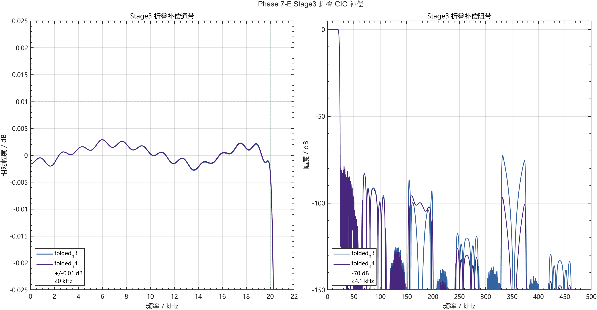

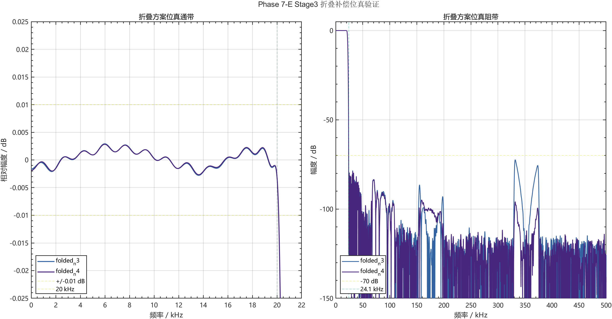

### 0.3 资源 Stop/Go

统一 48 MHz 约束的独立链结果：

| 版本 | LUT | FF | DSP | BRAM | WNS | 结论 |
|---|---:|---:|---:|---:|---:|---|
| Phase 6 基线 | 1222 | 868 | 2 | 1 | +9.107 ns | 基线 |
| 独立补偿 N3 | 1199 | 1154 | 3 | 1 | +7.889 ns | No-Go |
| 独立补偿 N4 | 1366 | 1243 | 3 | 1 | +6.876 ns | No-Go |
| **折叠补偿 N3** | **957** | **791** | **2** | **1** | **+9.107 ns** | **Go** |
| 折叠补偿 N4 | 1116 | 876 | 2 | 1 | +7.625 ns | No-Go，LUT 降幅不足 15% |

最终 N=3 相对 Phase 6 独立链减少 **265 LUT（21.69%）** 和 **77 FF（8.87%）**，DSP/BRAM 不变。

完整四档板级实现：

| 项目 | Phase 6 | Phase 7 N3 | 变化 |
|---|---:|---:|---:|
| LUT | 1395 | **1128** | -267，-19.14% |
| FF | 1040 | **964** | -76，-7.31% |
| DSP / BRAM | 2 / 1 | **2 / 1** | 不变 |
| WNS / WHS | +45.145 / +0.121 ns | **+45.113 / +0.142 ns** | 均通过 |
| DRC Error | 0 | **0** | 通过 |

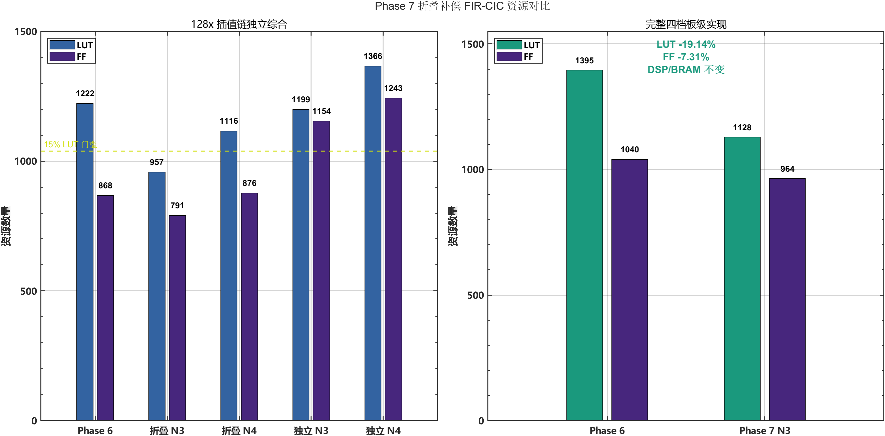

### 0.4 正式顶层 RTL 验证补全

原有前三级和 CIC 分段测试继续保留；本轮新增的正式顶层测试直接实例化 `interp128_all2x_v7_folded_fir_cic_top_ce`，从 24 bit 输入一直比较到 4x、8x 和 128x 三个正式输出节点：

| 测试 | 规模 | 结果 |
|---|---:|---|
| 冲激 | 256 输入；4x/8x/128x 为 1245/2499/40032 输出 | 全部 0 LSB |
| daily 随机 | 4 seed × 1024 输入 | 三节点全部 0 LSB |
| nightly 随机 | 10 seed × 4096 输入 | 三节点全部 0 LSB |
| nightly 128x | 5,315,520 个随机输出点 | 0 mismatch |
| CIC 定向 | 656 输入、10496 输出 | comb、16 拍 burst、数据全部通过 |
| 补码边界 | 三级积分器 6 组正负回绕 | 精确模 `2^32` |
| Stage3 中心拆分 | 4107 组边界/随机值 | 精确相等 |
| CIC / 完整顶层复位 | 4 / 8 个内部阶段场景 | 与冷启动参考一致 |

正常合法输入下，32 bit 全精度 CIC 的回绕和输出饱和均为 0；独立边界单测专门覆盖了通常不会触发的补码模回绕。另有预期失败测试故意连续送入两个样点，在 65 ns 命中 `pending overwrite` 断言，确认输入速率约束不会静默覆盖数据。

### 0.5 直接由 RTL 冲激提取频响和相位

下面两图读取正式顶层 XSim 导出的 RTL 冲激 CSV，而不是仅画 MATLAB 设计系数：

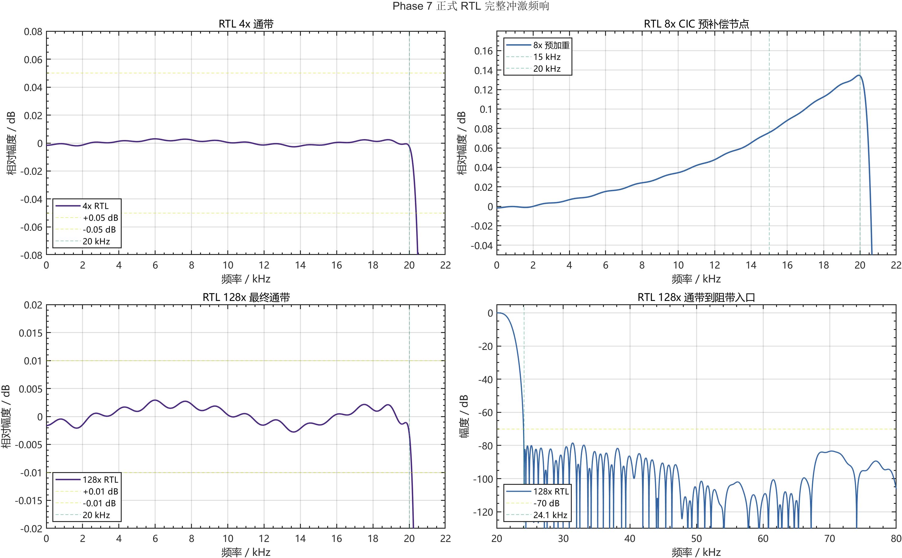

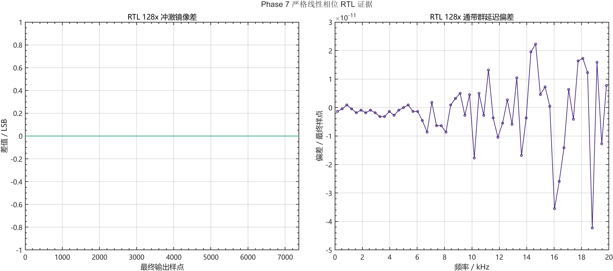

| RTL 指标 | 结果 | 判定 |
|---|---:|---|
| 4x 通带最大绝对偏差 | 0.00301125 dB | 通过 |
| 4x 阻带衰减 | 78.67042 dB | 通过 |
| 128x 通带最大绝对偏差 | 0.00303062 dB | 通过 |
| 128x 阻带衰减 | 72.34929 dB | 通过 |
| 128x 冲激对称误差 | 0 output LSB | 严格对称 |
| 128x 群延迟 | 3686.5 sample | 符合理论 |
| 分块拟合群延迟峰峰值 | `6.457e-11` sample | 线性相位 |
| 相位拟合残差 | `2.842e-14 rad` | 线性相位 |

8x 是为后级 CIC 预加重的内部展示节点，其 15 kHz / 20 kHz 增益约为 `+0.0757 / +0.1343 dB`，不能误套最终 128x 的 ±0.05 dB 门槛。分赛区验收的最终 128x 输出已经由 CIC 下垂把该预加重抵消。

### 0.6 动态切档修复、实现和板级边界

首轮动态相位压力测试捕获到组合时钟切换产生的 4 个 `0 ns` 窄脉冲。板级包装层现已把 `mode_request` 与 `mode_state` 分开，只在 1x、4x、8x 候选时钟同时为低电平的 128x 下降沿提交模式。修复后连续完成 10 次无复位切换，`DA_CLK` 无毛刺、无 X，边沿数仍为 `32 / 128 / 256 / 4096`。

Vivado 工程继续默认使用 Phase 7，同时保留 `USE_PHASE7_FOLDED=0` 的 Phase 6 generate 回退路径。当前实现层次明确包含 `gen_phase7_folded`、折叠 Stage2/3 和 CIC16：

| 项目 | 当前修正版 |
|---|---:|
| LUT / FF | 1120 / 962 |
| DSP / BRAM Tile | 2 / 1 |
| WNS / WHS | +44.752 / +0.071 ns |
| TNS / THS | 0 / 0 ns |
| DRC | 0 Error、31 Warning |
| Vectorless 功耗 | 0.168 W，Low confidence |

补充实现报告确认两个域内路径均为 `Clean / Timed`，5 条 20 MHz 控制域到音频域的路径按 XDC 归入异步时钟组。实现网表只有 2 个 `DSP48E1`：Stage1 使用 `DSP48_X1Y0`，共享 Stage2/3 使用 `DSP48_X1Y1`，没有误综合出额外乘法器。

Phase 7 0.50FS 削顶诊断 bitstream：

```text
matlab_fir/alt_all2x_v7/vivado_results/board_folded_n3/
board_demo_competition_dac8_top_phase7_folded_n3_amp050.bit

SHA256:
EEF8679066B27CE55055705737DC85A28309CF494F2363AFF0FFF1E3816EB5E9
```

上一版 Phase 7 已实测 `4x=176.37 kHz`、`8x=352.86 kHz`、`128x=5.64 MHz`。针对后续实测出现的平顶、平底梯形波，本轮完成了严格的幅度 A/B：在 RTL、探头、量程、接线和档位不变时，0.80FS 输出梯形波，0.50FS 恢复正弦波，由此确认根因是板上模拟输出链路削顶，而不是 FIR 数字溢出。当前正式默认采用 0.50FS；RTL 四档 DAC 码值约为 `1x=64~191`、`4x=64~191`、`8x=63~192`、`128x=64~191`，滤波数据通路、系数、字长和分频均未改变。

详细证据见 [Phase 7 验证汇总](matlab_fir/alt_all2x_v7/verification/reports/phase7_verification_final_summary.md)、[指导采纳反馈](matlab_fir/alt_all2x_v7/verification/phase7_verification_guide_assessment.md) 和 [Phase 7 执行报告](matlab_fir/all2x_phase7_fir_cic_execution_report.md)。

### 0.7 PCM ROM Block RAM 资源优化的 0.50FS 复核

本轮在已经板测恢复正弦的 `0.50FS` 输入基线上重新启用 PCM ROM 资源优化。优化只调整演示信号存储方式：由完整 `.mem` 初始化 ROM，并把 24 bit 同步读寄存器移入无异步复位的独立进程，使 `147 x 24 bit` ROM 稳定映射到一个 `RAMB18E1`；FIR-CIC 滤波数据通路、各级系数、定点字长、舍入饱和和四档输出逻辑均未改动。

复核包含两层 RTL 验证。首先连续检查 300 次 PCM 更新，覆盖两次以上 ROM 地址回绕，优化实现与原始读出序列为 0 LSB；随后运行 `1x/4x/8x/128x` 四档链路，内部峰值分别保持在约 `±4.19M`，DAC 码值范围为 `64~191 / 64~191 / 63~192 / 64~191`，四档均未出现 `0/255` 或近满量程数字削顶。由此可确认优化没有改变 ROM 内容、读出顺序和数字幅度。

| 指标 | Phase 7 稳定版 | PCM ROM BRAM 优化版 | 变化 |
|---|---:|---:|---:|
| LUT | 1120 | **1044** | -76，-6.79% |
| FF | 962 | **940** | -22，-2.29% |
| RAMB18E1 | 2 | **3** | +1，对应 PCM ROM |
| DSP48E1 | 2 | **2** | 不变 |
| WNS / WHS | +44.752 / +0.071 ns | **+44.527 / +0.052 ns** | 仍有充足余量 |
| TNS / THS | 0 / 0 ns | **0 / 0 ns** | 不变 |
| Vectorless 功耗 | 0.168 W | **0.168 W** | 不变，Low confidence |
| DRC | 0 Error、31 Warning | **0 Error、31 Warning** | 未新增违规 |

实现层次确认新增的第三个 `RAMB18E1` 为 `u_audio_pcm_rom_source/rom_data_q_reg`，原有两个 FIR 系数/样本存储 BRAM 和两个 `DSP48E1` 均保持不变。候选 bitstream 为：

```text
matlab_fir/alt_all2x_v7/vivado_results/board_folded_n3_bram_rom/
board_demo_competition_dac8_top_phase7_folded_n3_bram_rom_amp050.bit

SHA256:
D0CC87524B61A5784344E6CF868067FD13F22C540F035A553C742A25A3676B46
```

该阶段将 BRAM ROM 作为独立候选保留，并在继续优化前维持原有稳定 bitstream 与 MCS。后续 472 LUT / 8 DSP 最终版本继承了该 BRAM ROM 实现，现已通过四档频率和正弦波形实板验证。

### 0.8 Stage 1 紧凑舍入资源优化

在 PCM ROM 已映射到 Block RAM 的 1044 LUT 基线上，进一步对实现层次进行热点分析。Stage 1 的通用 round_sat_q16_to24 单独占用 106 LUT；其原实现先在 42 bit 全宽数据上加舍入偏置，再执行算术右移和 24 bit 饱和。优化版保持相同的对称舍入规则，但先截取商和余数，只由符号位、半 LSB 位和低位余数生成一个单比特进位，最终仅在较窄的商上执行加一与符号扩展检查。滤波系数、累加器位宽、级间字长、CIC 和 DAC 逻辑均未改变。

Stage 1 的 26 个非零半带系数绝对值和为 44756。按两个 24 bit 满幅样点组成一个预加和进行保守估计，42 bit 累加器的可达绝对上界为：

    44756 x 2^24 = 750881079296

该值距离 42 bit 正数上限 2^41 仍有约 1.55 bit 余量，因此全宽偏置加法器的最高位溢出区在该 FIR 中不可达。等价验证覆盖舍入中点、24 bit 正负饱和边界、可达累加上下界和 200000 组随机输入，共 200024 组，输出全部为 0 LSB。正式顶层 daily 与 nightly 回归继续比较 4x、8x、128x 三个节点：冲激加 10 组 4096 点随机 PCM 的 nightly 测试中，仅 128x 节点就比较了 5355552 个输出点，所有节点均为 0 LSB。

| 指标 | PCM ROM BRAM 基线 | 紧凑舍入候选 | 变化 |
|---|---:|---:|---:|
| LUT | 1044 | **941** | -103，-9.87% |
| FF | 940 | **940** | 不变 |
| RAMB18E1 | 3 | **3** | 不变 |
| DSP48E1 | 2 | **2** | 不变 |
| WNS / WHS | +44.527 / +0.052 ns | **+44.839 / +0.050 ns** | 时序仍充分满足 |
| TNS / THS | 0 / 0 ns | **0 / 0 ns** | 不变 |
| Vectorless 功耗 | 0.168 W | **0.168 W** | 不变，Low confidence |
| DRC | 0 Error、31 Warning | **0 Error、31 Warning** | 未新增违规 |

由于正式 RTL 输出与原 golden 逐点相同，既有 RTL 冲激测得的 0.00303062 dB 通带最大偏差、72.349 dB 阻带衰减和严格线性相位结论保持不变。候选 bitstream 为：

    matlab_fir/alt_all2x_v7/vivado_results/board_folded_n3_bram_rom_rounder_opt/
    board_demo_competition_dac8_top_phase7_rounder_compact_amp050.bit

    SHA256:
    88E67BD36C23A6C3F50880DFADEBF3E97EC58015FDF48A451B6A7825358556A2

在“暂不增加 DSP/BRAM”的紧凑舍入阶段，对十项优化建议的工程判断如下。Stage 1 只有 26 x 17 bit 系数，Stage 2/3 只有 15 个小型系数选择，强制进入 BRAM 会引入同步读延迟、地址控制和额外 RAMB18；而乘法器、对称预加、多相分解、strict-halfband 零抽头消除和 Stage 2/3 单 DSP 折叠已经实现。逐级字长搜索也已在 Phase 6/7 完成，当前阻带只余约 2.35 dB 发布裕量，不再做无证据的激进截位。该阶段真正采纳的是“舍入逻辑预算”和“综合 A/B”两项，并以 103 LUT 的实测下降确认有效。

| 建议 | 当前工程状态 | 本轮决定 |
|---|---|---|
| 系数表搬入 BRAM | 系数总量很小，常量 case 已被综合器有效化简 | 暂不采用，避免新增同步读延迟和 BRAM |
| MAC 优先 DSP48 | Stage 1 使用 1 个 DSP，Stage 2/3 共享 1 个 DSP | 已实现，保持 2 DSP |
| 逐节点定点字长 | Phase 6/7 已完成 24/22/20 bit 与 32 bit CIC 搜索 | 已实现，不压缩当前 2.35 dB 阻带裕量 |
| 多相消除插零计算 | 三个 2x FIR 均为真多相，CIC 后端天然无零值 FIR MAC | 已实现 |
| 简化控制路径 | 级间桥约 2 LUT，主要热点不在控制桥 | 保持，优先处理 106 LUT 舍入器 |
| 对称、半带、预加 | Stage 1 为 strict-halfband 对称预加，Stage 2/3 也使用对称样点 | 已实现 |
| 最小安全并行度 | Stage 1 串行 26 MAC，Stage 2/3 单 DSP 折叠共享 | 已实现 |
| systolic / DSP cascade | 当前仅 2 个时分复用 DSP，增加级联会改变资源目标 | 暂不采用 |
| 舍入策略预算 | 42 bit 全宽偏置加法器是明确 LUT 热点 | **采用，顶层减少 103 LUT** |
| 自动推断与显式实现 A/B | 原基线和候选独立完整实现 | **采用，以 post-route 结果决策** |

该版本状态为“单元等价、daily/nightly 正式顶层对拍、完整实现和 bitstream 均通过，待实板四档复测”。复测前不生成或覆盖稳定 MCS。

随后在 0.9 节针对“最低 LUT”目标重新放宽 DSP 约束，把 CIC 宽位运算映射到空闲 DSP48E1；这不是推翻上述判断，而是在资源优化目标由“维持 2 DSP”改为“优先降低 LUT”后形成的另一 Pareto 候选。

### 0.9 CIC 宽位运算 DSP48 资源迁移

紧凑舍入候选达到 941 LUT 后，完整实现层次显示 CIC16 仍占用 245 LUT，主要来源为 32 bit comb 差分和积分器累加。XC7A35T 共有 90 个 DSP48E1，而前三级 FIR 只使用 2 个，因此本轮采用“专用算术资源换取通用逻辑”的低 LUT 路线：保持 CIC 的 `R=16、M=1、N=3`、32 bit 模运算、末级剪枝、valid 时序和输出舍入完全不变，仅对 CIC 内部宽位加减法施加 `use_dsp` 映射约束。

完整布线后的 CIC 层级由 245 LUT / 216 FF / 0 DSP 变为 49 LUT / 195 FF / 7 DSP。整板结果如下：

| 指标 | 紧凑舍入低 DSP 候选 | CIC DSP48 低 LUT 候选 | 变化 |
|---|---:|---:|---:|
| Slice LUT | 941 | **729** | -212，-22.53% |
| Slice Registers | 940 | **920** | -20，-2.13% |
| DSP48E1 | 2 | **9** | +7，使用率 10.00% |
| RAMB18E1 / BRAM Tile | 3 / 1.5 | **3 / 1.5** | 不变 |
| WNS / WHS | +44.839 / +0.050 ns | **+44.853 / +0.077 ns** | 均满足时序 |
| TNS / THS | 0 / 0 ns | **0 / 0 ns** | 不变 |
| Vectorless 功耗 | 0.168 W | **0.168 W** | 不变，Low confidence |
| DRC Error | 0 | **0** | 通过 |

验证不是只比较模块接口：正式 128 倍顶层先完成冲激和 4 组 daily 随机 PCM 对拍，再完成冲激和 10 组 4096 点 nightly 随机 PCM 对拍，4x、8x、128x 三个节点均为 0 LSB。由于候选输出逐点等于原 golden，既有 RTL 冲激得到的 0.00303062 dB 通带最大偏差、72.349 dB 阻带衰减和严格线性相位结论保持不变。

同时评估了让 Stage2 与 Stage3 各自独占 DSP48 的方案。该候选因复制系数选择、舍入和状态逻辑，OOC 结果为 464 LUT / 453 FF / 2 DSP，高于当前共享核在完整工程中的 401 LUT / 416 FF / 1 DSP，因此判定 No-Go。由此可见，DSP 资源迁移只在宽位连续累加等匹配 DSP48 数据通路的热点上有效，不能机械地增加 DSP 数量。

低 LUT 候选 bitstream：

```text
matlab_fir/alt_all2x_v7/vivado_results/board_folded_n3_cic_dsp_low_lut/
board_demo_competition_dac8_top_phase7_cic_dsp_low_lut_amp050.bit

SHA256:
98E9612B3D7D5D773303CCC7AF42077A6D687CDC7F4069559E5B5B38088FDCE7
```

该版本状态为“daily/nightly 逐点对拍、完整综合实现、时序、DRC 和 bitstream 均通过，待实板四档复测”。已生成并验证的 941 LUT / 2 DSP bitstream 原样保留；在低 LUT 候选完成板测以前，不覆盖稳定 MCS。

### 0.10 Stage 2/3 单读 LUTRAM 与串行 MAC 优化

729 LUT 候选完成后，路由后层级报告显示 Stage2/3 共享 FIR 仍占用 401 LUT、416 FF 和 1 DSP。主要原因不是 FIR 阶数，而是两级历史样点采用带异步复位的移位寄存器：每接收一个新样点都要搬移整条历史链，同时对称抽头并行读取还需要较宽的选择和预加逻辑。

本轮保持 MATLAB 系数、Stage2/3 的 22/20 bit 数据格式、38 bit 模累加、Q15 舍入饱和及 CIC 完全不变，只改变硬件调度：

1. Stage2 和 Stage3 各使用一个 16 深度单读口分布式 RAM 环形缓存，写入新样点时只移动头指针，不搬移历史数据。
2. 对称抽头由“同周期双读并预加”改为“逐抽头单读并串行 MAC”。Stage2 两相分别执行 9/8 次 MAC，Stage3 两相分别执行 6/5 次 MAC。
3. 两级继续共享一颗 DSP48E1，显式使用 `A×B+C` 数据通路；系数和累加顺序改变，但每个抽头只计算一次，结果严格等价。
4. 当 Stage2/3 请求同周期到达时改为 Stage2 优先，保证新的 4x 样点在下一次 8x CE 之前完成。早期 Stage3 优先实验在整链测试中被检测出越过 CE 边界，已判定 No-Go，没有进入板级工程。
5. LUTRAM 不做全阵列异步复位，使用“已写历史深度”屏蔽复位后的未写槽位，因此既保持运行中复位语义，又避免存储器退化为大量触发器。

完整布局布线后的资源结果如下：

| 指标 | 729 LUT CIC-DSP 候选 | Stage2/3 单读 LUTRAM 候选 | 变化 |
|---|---:|---:|---:|
| Slice LUT | 729 | **578** | -151，-20.71% |
| LUT as Logic | 729 | **546** | -183，-25.10% |
| LUT as Distributed RAM | 0 | **32** | +32，用于两级历史环形缓存 |
| Slice Registers | 920 | **619** | -301，-32.72% |
| DSP48E1 | 9 | **9** | 不变 |
| RAMB18E1 / BRAM Tile | 3 / 1.5 | **3 / 1.5** | 不变 |
| WNS / WHS | +44.853 / +0.077 ns | **+44.153 / +0.095 ns** | 均满足时序 |
| TNS / THS | 0 / 0 ns | **0 / 0 ns** | 不变 |
| Vectorless 功耗 | 0.168 W | **0.168 W** | 不变，Low confidence |

候选 Stage2/3 在完整实现层级中为 245 LUT、115 FF、1 DSP，其中 32 LUT 为分布式 RAM；相对原 401 LUT、416 FF、1 DSP 分别减少 156 LUT 和 301 FF。整板仍保留 90 个 DSP 中的 81 个和 50 个 BRAM Tile 中的 48.5 个，因此该版本是在资源余量范围内用专用 DSP 与少量 LUTRAM 换取更低通用逻辑的 Pareto 点。

验证采用由局部到系统的分层门槛：

| 验证层级 | 覆盖内容 | 结果 |
|---|---|---|
| Stage2/3 单元等价 | 冲激、满幅伪随机、同周期请求、中途异步复位 | Stage2 336 点、Stage3 671 点，全部 0 LSB |
| 正式顶层 daily | 冲激 + 4 组 × 1024 点随机 PCM | 4x、8x、128x 全部 0 LSB |
| 正式顶层 nightly | 冲激 + 10 组 × 4096 点随机 PCM | 4x、8x、128x 全部 0 LSB；最终端合计核对 5,355,552 个输出点 |
| 整链复位恢复 | Stage1 MAC、Stage2/3 pending/job、CIC burst 的 8 种内部状态 | 每种复位后比较 4096 个 128x 样点，全部通过 |
| 四档动态切换 | 1x/4x/8x/128x 往返 10 次，全程不复位 | 边沿数正确，无 runt pulse、X 或数据停滞 |
| 完整 Vivado 实现 | 综合、布局布线、bitstream、时序、功耗、DRC | 生成成功，WNS/WHS 均为正，DRC Error=0 |

由于 nightly 三节点输出逐点等于既有 MATLAB golden，既有 RTL 冲激验收的 `0.00303062 dB` 通带最大偏差、`72.349 dB` 阻带衰减和严格线性相位结论不变。路由后 DRC 报告包含未流水 DSP、异步复位驱动和 BRAM 异步控制等优化建议，但没有 Error；在 5.6448 MHz 音频时钟下仍有 44.153 ns 的最差建立余量，因此本轮不为消除建议性告警而增加流水延迟或改变复位语义。

最低 LUT 候选 bitstream：

```text
matlab_fir/alt_all2x_v7/vivado_results/board_folded_n3_stage23_lutram_low_lut/
board_demo_competition_dac8_top_phase7_stage23_lutram_low_lut_amp050.bit

SHA256:
7345B6D1852B65A31EE121884AD41E28528F7C979B72F0911B5F38570E363AE1
```

该版本已完成自动化验证和实现，当前边界是“待实板 1x/4x/8x/128x 四档复测”。稳定 MCS、941 LUT / 2 DSP bitstream 和 729 LUT / 9 DSP bitstream 均未覆盖。

### 0.11 配置存储器固化与版本识别

JTAG 下载 `.bit` 只会暂时配置 FPGA 内部 SRAM，掉电、按下配置复位键或触发重新配置后都会失效；板卡随后会从 SPI Flash 重新装载原有固件。因此，若 JTAG 下载后为正弦波，而重新上电后又恢复为梯形波，通常表示板载 Flash 中仍保存着其他工程的固件，并不表示本工程的正弦 ROM 自动改变。

Vivado 2018.3 已使用 `write_cfgmem`、`SPIx1` 和 `128 Mbit` 为回退后的稳定 bitstream 重新生成 MCS。`SPIx1` 是对支持 x1/x2/x4 的 MT25QL128 较保守的启动接口；实际添加 Configuration Memory Device 时，仍须根据板上 Flash 丝印或原理图确认器件型号，不应只依据 Vivado 搜索列表猜测。

| MCS 文件 | 对应版本 | 使用建议 |
|---|---|---|
| `phase7_stable_rebuilt_amp050_spi_x1.mcs` | 非 BRAM ROM、0.50FS 正弦稳定版本 | 已通过幅度 A/B，可用于固化 |

文件统一存放在：

```text
matlab_fir/alt_all2x_v7/vivado_results/config_memory/
```

推荐的安全烧录顺序如下：

1. 在 Hardware Manager 中先用 **Program Device** 直接下载文件名带 `amp050` 的诊断版 `.bit`。
2. 不断电立即测量 128x 档 `DA_CLK` 和 DA 波形；应约为 `5.6448 MHz` 且为平滑正弦波。
3. 确认板上实际 Flash 型号后，执行 **Add Configuration Memory Device**，选择与实物完全一致的器件。
4. 右键配置存储器并选择 **Program Configuration Memory Device**，配置文件选择稳定版 `.mcs`。
5. 勾选 `Erase`、`Program` 和 `Verify`，完成后彻底断电再上电。
6. 再测 128x 档；若仍为约 `5.64 MHz` 且正弦波正常，说明 Flash 固化成功。

`.prm` 是 Vivado 同时生成的地址映射说明文件，Hardware Manager 实际选择的是 `.mcs`。若直接 JTAG 下载指定 `.bit` 后仍立即出现梯形波，应先核对 Program Device 对话框中的 bit 路径和 128x `DA_CLK`：约 `6.25 MHz` 可直接证明当前运行的不是本工程固件；约 `5.64 MHz` 但仍异常时，才继续排查所选 bitstream 与 DAC 数据通路。

## 1. Phase 6 已实板验证回退结论

### 1.1 核心指标

| 项目 | 赛题要求 | Phase 6 MATLAB / RTL 结果 | 判定 |
|---|---:|---:|---|
| 输入格式 | 24 bit signed | 24 bit signed PCM | 通过 |
| 输入采样率 | 44.1 kHz | 44.1 kHz | 通过 |
| 输出采样率 | 5.6448 MHz | 5.6448 MHz | 通过 |
| 插值倍数 | 128 倍 | `2^7 = 128` | 通过 |
| 板级展示档位 | 方法不限 | 1x、4x、8x、128x | 通过 |
| 通带 | 10 Hz～20 kHz | 10 Hz～20 kHz | 通过 |
| 通带纹波 | 不超过 ±0.05 dB | 最大绝对误差约 0.00523 dB | 通过 |
| 阻带衰减 | 不低于 70 dB | 约 78.62 dB | 通过 |
| 相位 | 严格线性相位 | 群延迟波动约 `7e-12` sample | 通过 |
| MATLAB 与 RTL | 功能一致 | Stage2、Stage3 与完整链冲激/随机 PCM 均为 0 LSB | 通过 |
| 级间字长 | 自行优化 | `24/22/20/18/18/18/18 bit` | 通过 |

### 1.2 当前板级实现结果

| 项目 | 实现后结果 | XC7A35T 可用量 | 利用率 |
|---|---:|---:|---:|
| Slice LUTs | **1395** | 20800 | 6.71% |
| Slice Registers | **1040** | 41600 | 2.50% |
| DSP48E1 | **2** | 90 | 2.22% |
| Block RAM Tile | **1**，对应 2 个 RAMB18E1 | 50 | 2.00% |
| IOB | 19 | 250 | 7.60% |
| MMCM | 1 | 5 | 20.00% |
| WNS / TNS | `+45.145 ns / 0 ns` | - | 时序通过 |

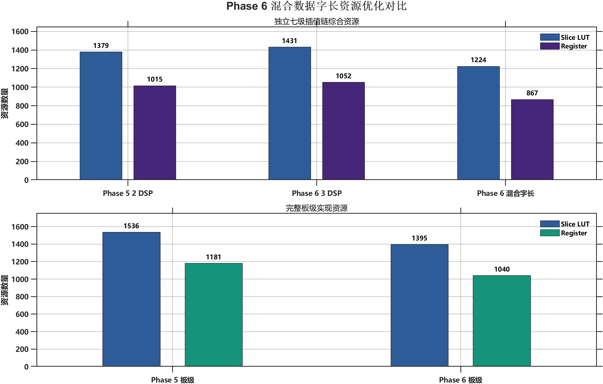

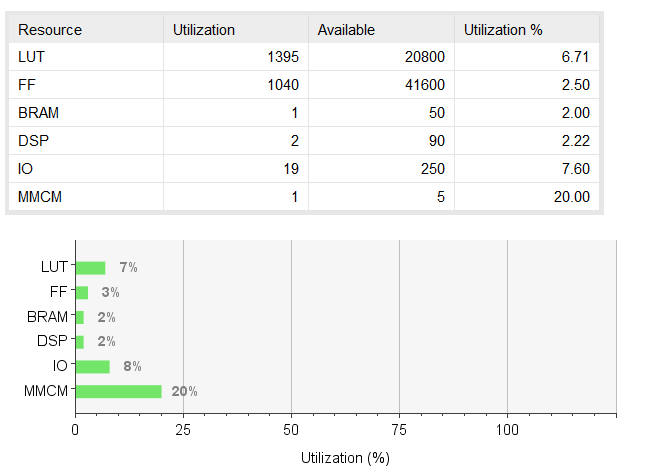

当前四档 V4 板测基线为 `1817 LUT / 1182 FF / 2 DSP / 1 BRAM Tile`。Phase 5 板级实现为 `1536 LUT / 1181 FF`；Phase 6 进一步降至 `1395 LUT / 1040 FF`，相对 Phase 5 减少 **141 LUT（9.18%）** 和 **141 FF（11.94%）**，DSP 与 BRAM 不变。完整工程已经从 RTL 重新综合、实现并生成 bitstream，构建日志确认使用的是 `interp128_all2x_v6_mixed_width_top_ce`，不是旧综合网表。

### 1.3 Phase 6 四档板级验证

实板下载 Phase 6 bitstream 后，矩阵按键四档切换正常，AD9708 均能输出稳定波形。板测结果如下：

| 模式 | 理论 DA_CLK | 实测 DA_CLK | 相对误差 | 示波器观察 |
|---|---:|---:|---:|---|
| 1x | 44.1 kHz | 未单独记录 | - | 原始 PCM 阶梯最明显 |
| 4x | 176.4 kHz | 176.37 kHz | 约 -0.017% | 相比 1x 更平滑 |
| 8x | 352.8 kHz | 352.86 kHz | 约 +0.017% | 阶梯进一步减小 |
| 128x | 5.6448 MHz | 5.64 MHz | 约 -0.085% | 四档中最平滑 |

三档插值时钟都与理论值高度一致，最大相对误差约为 0.085%。更重要的是，示波器上可以直观看到 DA 输出从 1x、4x、8x 到 128x 逐级变得光滑，完成了赛题要求的可视化板级验证闭环。Phase 6 当前已通过 MATLAB、RTL、综合实现、时序、bitstream 和实板展示全部验证；`d8f4946`、`e9882fc` 和 `6132cbb` 继续作为回退点。

---

## 2. 赛题需求与当前设计边界

赛题要求完成插值滤波器的 MATLAB 建模与仿真、RTL 设计与功能仿真、电路规模与功耗评估，以及 FPGA 板级验证。核心指标为：

```text
输入：44.1 kHz，24 bit signed PCM
输出：176.4 kHz、352.8 kHz、5.6448 MHz
通带：10 Hz～20 kHz
通带纹波：<= ±0.05 dB
阻带衰减：>= 70 dB
相位：严格线性相位
```

1x 原始 PCM 档位是为了在示波器上直观比较“未插值、4x、8x、128x”的阶梯粗糙度而增加的展示功能，不改变赛题要求的 128 倍插值链及其指标。

仓库早期版本曾支持 44.1 kHz / 48 kHz 双采样率家族。当前分赛区决赛展示只要求 44.1 kHz，因此稳定版移除了 48 kHz MMCM 和双时钟切换逻辑，集中优化 44.1 kHz 到 5.6448 MHz 的 128 倍插值链路。

当前工程目录为：

```text
XC7A35T_interp_audio_pcm_wordlen_opt/
```

当前 Vivado 板级顶层为：

```text
board_demo_competition_dac8_top
```

---

## 3. 系统总体结构

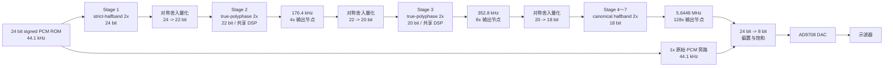

板载 20 MHz 晶振进入 Clock Wizard，产生连续的 5.6448 MHz 音频时钟。所有 FIR 级工作在同一时钟域内，各级使用整数时钟使能 `ce2_out`～`ce128_out` 控制采样节拍，避免在 FPGA 内部生成大量派生逻辑时钟。

四档 DAC 输出节点为：

```text
1x   ：原始 PCM 旁路，44.1 kHz
4x   ：Stage 2 输出，176.4 kHz
8x   ：Stage 3 输出，352.8 kHz
128x ：Stage 7 输出，5.6448 MHz
```

---

## 4. 插值滤波器的数学原理

### 4.1 插零上采样与频谱镜像

对离散序列 `x[n]` 进行 `L` 倍插值时，先在相邻输入样本之间插入 `L-1` 个零：

$$
x_u[n] =
\begin{cases}
x[n/L], & n = 0, \pm L, \pm 2L, \ldots \\
0, & \text{其他位置}
\end{cases}
$$

插零后的频域关系为：

$$
X_u(e^{j\omega}) = X(e^{jL\omega})
$$

原频谱被压缩，并在新的奈奎斯特区间内周期性重复。插值 FIR 的任务是保留 0～20 kHz 音频通带，同时抑制插零产生的镜像。


### 4.2 为什么使用 FIR

FIR 输出为有限长度卷积：

$$
y[n] = \sum_{k=0}^{N-1} h[k]x[n-k]
$$

本项目选择 FIR 而不是 IIR，主要原因如下：

1. FIR 没有反馈路径，定点实现天然稳定。
2. 对称 FIR 可以严格实现线性相位，适合高保真音频重构。
3. 对称系数可以将乘法数量近似减半。
4. FIR 的乘加结构适合 DSP48、LUT shift-add 和时分复用 MAC。
5. MATLAB 定点模型与 RTL 更容易做逐点 bit-true 对拍。

若系数满足：

$$
h[k] = h[N-1-k]
$$

则频率响应可整理为：

$$
H(e^{j\omega}) = e^{-j\omega(N-1)/2}A(\omega)
$$

其中 `A(ω)` 为实函数，相位项只包含固定延迟，因此群延迟为：

$$
\tau_g = \frac{N-1}{2}
$$

通带内各频率分量经历相同延迟，瞬态波形不会因不同频率的延迟差异而变形。

### 4.3 为什么使用等波纹法

MATLAB 设计采用 Parks-McClellan / Remez 等波纹思想，本质上求解加权最小最大误差：

$$
\min_h \max_{\omega \in \Omega}
W(\omega)|H_d(\omega)-H(\omega)|
$$

其中：

| 符号 | 含义 |
|---|---|
| `Hd(ω)` | 理想低通响应 |
| `H(ω)` | 实际 FIR 响应 |
| `W(ω)` | 通带和阻带权重 |
| `Ω` | 参与优化的通带与阻带频率集合 |

70 dB 阻带衰减对应的线性幅度上限为：

$$
\delta_s = 10^{-70/20} \approx 3.16\times10^{-4}
$$

等波纹法将误差预算均匀分配到最危险的频率点。与海明窗、汉宁窗等窗函数法相比，在相同通带、阻带和过渡带要求下通常能用更低阶数达到指标，更适合资源敏感的 FPGA 设计。

### 4.4 为什么采用 7 级全 2x

128 可以分解为：

$$
128 = 2^7
$$

多级插值让每一级只负责抑制当前采样率下新产生的镜像。Stage 1 的过渡带最窄、滤波压力最大；随着采样率逐级升高，镜像远离 20 kHz 音频通带，后级 FIR 可以快速缩短到 7 tap。

全 2x 结构还具有以下工程优势：

1. 各级控制结构统一，便于参数化和验证。
2. 每一级都可以单独进行字长、阶数和结构优化。
3. 中间自然产生 4x、8x 展示节点。
4. 后级可利用精确半带核实现乘法器消除。
5. 相比旧 `4x + 5×2x` 方案，通带误差和阻带余量更好。

---

## 5. MATLAB 设计与最终参数

### 5.1 七级参数

| 级数 | 采样率变化 | taps | 数据宽度 | 系数格式 | 累加器 | RTL 结构 |
|---:|---|---:|---:|---|---:|---|
| Stage 1 | 44.1 -> 88.2 kHz | 105 | 24 bit | 17 bit / Q15 | 42 bit | strict-halfband、单 DSP MAC、BRAM 历史 |
| Stage 2 | 88.2 -> 176.4 kHz | 17 | 22 bit | 16 bit / Q15 | 38 bit 共享 | true-polyphase，Stage2/3 共用 DSP |
| Stage 3 | 176.4 -> 352.8 kHz | 11 | 20 bit | 16 bit / Q15 | 38 bit 共享 | true-polyphase，Stage2/3 共用 DSP |
| Stage 4 | 352.8 -> 705.6 kHz | 7 | 18 bit | 精确 `/16` 核 | 35 bit | canonical halfband shift-add |
| Stage 5 | 705.6 kHz -> 1.4112 MHz | 7 | 18 bit | 精确 `/16` 核 | 33 bit | canonical halfband shift-add |
| Stage 6 | 1.4112 -> 2.8224 MHz | 7 | 18 bit | 精确 `/16` 核 | 32 bit | canonical halfband shift-add |
| Stage 7 | 2.8224 -> 5.6448 MHz | 7 | 18 bit | 精确 `/16` 核 | 32 bit | canonical halfband shift-add |

Stage 4～7 使用同一个精确半带核：

$$
h = \frac{1}{16}[-1,\ 0,\ 9,\ 16,\ 9,\ 0,\ -1]
$$

其乘法可精确转换为移位与加减法，不需要 DSP，也不会引入额外系数量化误差。

### 5.2 Stage 1 Pareto 搜索

Stage 1 对系统资源和阻带性能影响最大。MATLAB 同时搜索 taps、`FRAC_W`、`COEFF_W`、`ACC_W` 和严格半带结构成本，并保留三类候选：

| Profile | 目标 | 代表候选 | 总链路阻带 |
|---|---|---:|---:|
| A 保守版 | 总通带 <= 0.01 dB，总阻带 >= 75 dB，Stage1 >= 76 dB | 105 tap Q15 | 78.62 dB |
| B 系统级版 | 总通带 <= 0.01 dB，总阻带 >= 75 dB | 101 tap Q15 | 75.38 dB |
| C 比赛余量版 | 总通带 <= 0.02 dB，总阻带 >= 73 dB | 97 tap Q15 | 74.32 dB |

最终选择 105 tap Q15 保守候选。101/97 tap 只减少 1～2 次 MAC，却损失约 3～4 dB 阻带余量，不适合作为稳定展示首选。

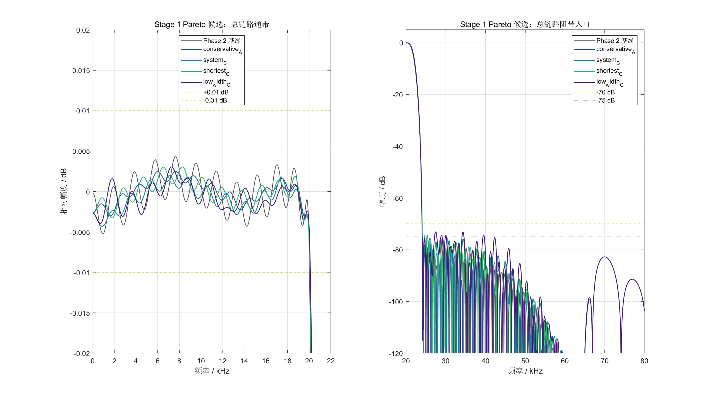

### 5.3 当前 Phase 6 沿用的 MATLAB 指标

| 项目 | 数值 |
|---|---:|
| Stage 1 taps | 105 |
| Stage 1 滤波相长度 | 52 |
| Stage 1 对称系数对 | 26 |
| Stage 1 真实历史长度 | 52 samples |
| Stage 1 阻带衰减 | 77.4749 dB |
| 总通带最大绝对误差 | 约 0.00523 dB |
| 总阻带衰减 | 78.6197 dB |
| 总 DC 增益 | 127.96094，理论值 128 |
| 总群延迟 | 3709 个最终输出样点 |
| 群延迟波动 | 约 `7e-12` sample |
| 线性相位 | 通过 |
| 总链路判定 | 通过 |

对应最终输出采样率，算法群延迟约为：

$$
3709 / 5.6448\text{ MHz} \approx 0.657\text{ ms}
$$

### 5.4 全 2x 设计基线频响

下图为全 2x 逐级设计得到的总链路频响。Phase 6 没有重新设计 FIR 系数：Stage 1 继续使用 strict-halfband BRAM 结构，Stage 2/3 使用 Phase 5 的 Q15 系数，Stage 4～7 使用精确 canonical 核，因此系数决定的通带、阻带和线性相位指标不变。级间混合字长带来的量化误差由独立的音频质量和 RTL bit-true 测试约束。

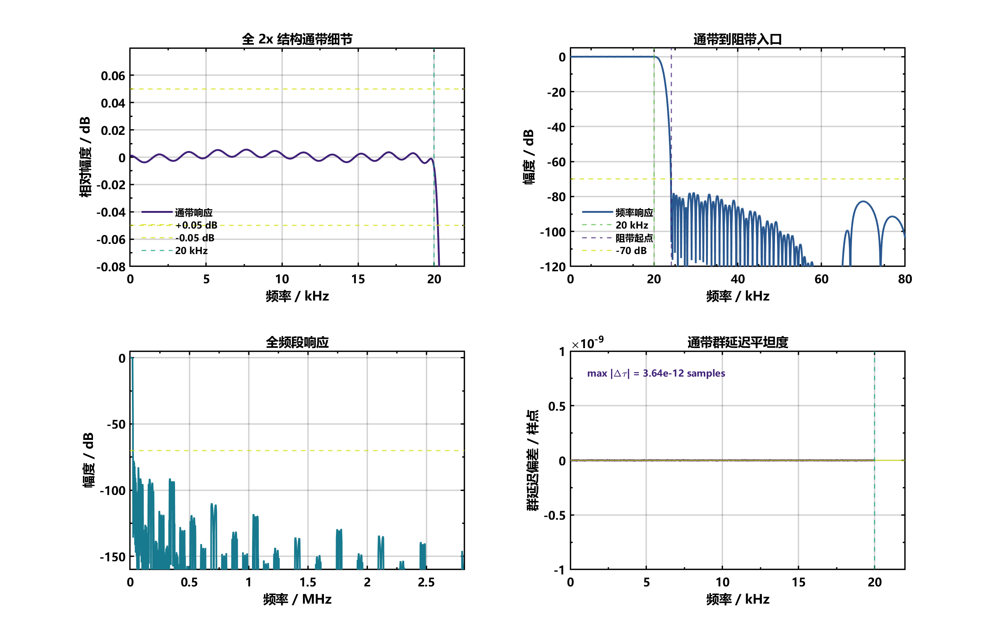

图中四个子图依次给出通带细节、通带到阻带入口、全频段响应和群延迟平坦度。阻带最高峰低于 -70 dB 指标线，通带曲线远小于 ±0.05 dB 限制，群延迟误差接近双精度数值噪声。

---

## 6. 4x+2x 与全 2x 方案对比

### 6.1 MATLAB 指标对比

| 项目 | 旧 `4x + 5×2x` | 全 2x 初始设计 | 当前 Phase 6 两 DSP |
|---|---:|---:|---:|
| 输入采样率 | 44.1 kHz | 44.1 kHz | 44.1 kHz |
| 输出采样率 | 5.6448 MHz | 5.6448 MHz | 5.6448 MHz |
| 通带最大误差 | 约 0.01727 dB | 0.00730 dB | 约 0.00523 dB |
| 阻带衰减 | 70.339 dB | 77.679 dB | 78.620 dB |
| 最终采样点群延迟 | 2898 | 3325 | 3709 |
| 非零半系数估算 | 138 | 77 | Stage1 为 26 对，其余进一步结构化 |
| 主要优势 | 双采样率兼容、已有经验 | 频响余量更大 | 频响不变，板级 LUT 进一步下降 |

### 6.2 频响图对比

| 旧 4x + 5×2x | 全 2x 七级 |
|---|---|
| 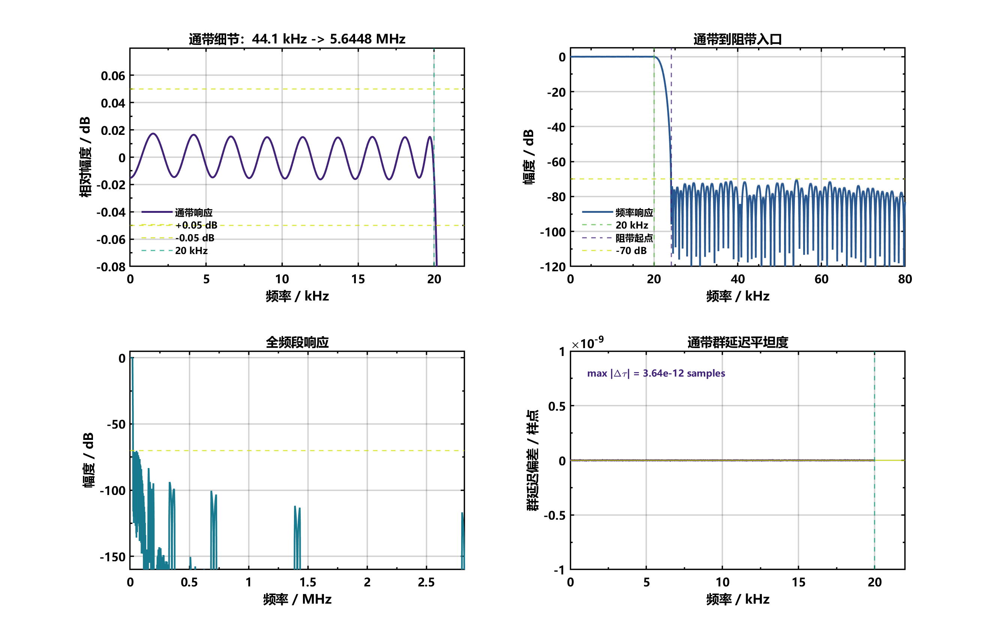 |  |

旧方案已经满足赛题最低指标，但阻带只有约 0.34 dB 余量。全 2x 初始设计把阻带提升到约 77.68 dB；V3 strict-halfband Stage 1 又把最终阻带提升到约 78.62 dB。V4 只优化运算资源映射，不改变这组频响结果。

### 6.3 结构选择结论

当前不再采用旧 4x 前级，原因不是 4x 结构不可用，而是本次展示只需 44.1 kHz。全 2x 能针对每一级的真实采样率分别分配误差和字长，后级还可以统一使用 canonical halfband，从而同时取得更好的频响和更低的 FPGA 资源。

---

## 7. RTL 结构优化

### 7.1 Stage 1 strict-halfband true-polyphase

105 tap 严格半带 FIR 的中心下标为 52。总增益为 2 时，一个相位退化为纯延迟，另一个相位只保留 52 个非零系数：

$$
y[2m] = x[m-26]
$$

$$
y[2m+1] = \sum_{r=0}^{25}c[r]
\left(x[m-r]+x[m-(51-r)]\right)
$$

因此每个原始输入样点只需要 26 次对称 MAC。与旧 93 tap 显式插零结构相比：

```text
旧结构：两个输出相位约 94 次乘法，保存 93 个插零历史点
新结构：滤波相 26 次 MAC，保存 52 个真实输入点
```

### 7.2 BRAM 循环缓冲

Stage 1 使用 64 深度、24 bit 宽的双口 BRAM 循环缓冲保存 52 个有效输入样点：

1. phase0 写入当前真实输入。
2. 同时输出中心延迟相。
3. 后续 26 个周期由双口 BRAM 读取对称样点对。
4. 单个 DSP48E1 完成时分复用 MAC。
5. phase1 输出 Q15 舍入饱和后的滤波相结果。
6. BRAM 内容不做全阵列复位，`fill_count` 屏蔽启动阶段陈旧数据。

使用 BRAM 后，Stage 1 不再由大量 FF 保存历史样点，完整板级 FF 从 V2 的 3279 降到 1106。

### 7.3 Stage 2/3 true-polyphase 共享 DSP

Stage 2 和 Stage 3 不再先显式插零再进入普通 FIR，而是直接按偶相、奇相计算：

$$
y[2m+p] = \sum_r h[2r+p]x[m-r],\quad p\in\{0,1\}
$$

V3 中两个相位共享各自级内的数据通路，但系数乘法仍被综合为较大的 LUT 常系数网络。V4 保留同一组 polyphase 公式与系数，将 Stage 2/3 的乘法统一调度到一个 DSP48E1。Phase 5 把两级系数统一为 Q15；Phase 6 再把 Stage 2/3 数据宽度分别收缩为 22 bit 和 20 bit，但 MAC 次数和调度周期保持不变：

| 级数 | phase0 | phase1 | CE 到达间隔 | 最坏 MAC 数 |
|---:|---:|---:|---:|---:|
| Stage 2 | 5 MAC | 4 MAC | 32 个 5.6448 MHz 时钟 | 5 |
| Stage 3 | 3 MAC | 3 MAC | 16 个 5.6448 MHz 时钟 | 3 |

当 Stage 2/3 任务同拍到达时，调度器始终先执行速率更高的 Stage 3，再执行 Stage 2。64 拍超周期的最坏调度为：

```text
arrival=0  : Stage3 phase1，3 MAC，finish=4，deadline=8，slack=4
arrival=0  : Stage2 phase1，4 MAC，finish=9，deadline=16，slack=7
arrival=16 : Stage3 phase0，3 MAC，finish=20，deadline=24，slack=4
arrival=32 : Stage3 phase1，3 MAC，finish=36，deadline=40，slack=4
arrival=32 : Stage2 phase0，5 MAC，finish=42，deadline=48，slack=6
arrival=48 : Stage3 phase0，3 MAC，finish=52，deadline=56，slack=4
```

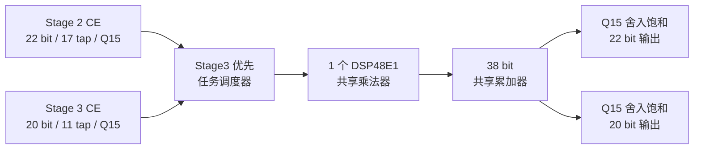

RTL 仿真中的 `pending overwrite` 与 `deadline miss` 断言均为 0。级间桥传递 `data + valid`；Phase 6 的量化桥只在有效样点上做确定性的对称舍入，共享计算引入的是固定流水延迟，不改变输出采样节拍。

### 7.4 Stage 4～7 canonical halfband

后四级使用精确核：

```text
[-1, 0, 9, 16, 9, 0, -1] / 16
```

其中 `9x = 8x + x`，除以 16 对应算术右移，因此整个核可由加减和移位实现。四级替换后相对全 2x 稳定基线减少 1610 LUT 和 540 FF，且 MATLAB/RTL 对拍保持 0 LSB。

### 7.5 定点舍入与饱和

各级内部使用保护位累加，输出前执行有符号舍入和对应级宽度的饱和。正常音频、直流、冲激和随机测试均无累加器溢出；仅在刻意构造的满幅交替或满幅随机压力输入下出现预期饱和。

为了保持板级接口不变，4x、8x 和 128x 节点在输出包装层按其缩减位数左移恢复到 24 bit 标度，再取高 8 位并加 128 偏置，转换为 AD9708 所需的无符号 8 bit 数据。`dac_data` 在 5.6448 MHz 时钟下降沿更新，AD9708 在 `dac_clk` 上升沿采样，从而留出建立时间。

### 7.6 Phase 6 混合数据字长

Phase 6 不删除 FIR 系数，也不修改 7 级频率响应，而是减少后级保存和运算的无效低位。相邻两种数据格式之间统一缩减 2 bit：

$$
x_{W-2}=\operatorname{sat}_{W-2}
\left(\operatorname{round}\left(\frac{x_W}{2^2}\right)\right)
$$

搜索从 24 bit 基线出发，对冲激、直流、多频正弦、随机 PCM 和满幅压力向量逐级比较，最后选择：

```text
Stage 1 -> Stage 7：24 / 22 / 20 / 18 / 18 / 18 / 18 bit
Stage 2/3 共享累加器：38 bit
历史数据位成本：744 -> 606 bit，减少 138 bit
```

| 定点质量指标 | Phase 6 结果 | 验收门槛 | 判定 |
|---|---:|---:|---|
| 最大增益误差 | `8.3466e-05 dB` | `<= 0.01 dB` | 通过 |
| 最小差分 SNR | `91.531 dB` | `>= 90 dB` | 通过 |
| 最小 SINAD | `76.676 dB` | 与 24 bit 基线比较 | 通过 |
| 最大 SINAD 下降 | `0.10921 dB` | `<= 0.5 dB` | 通过 |
| 最差 THD | `-114.71 dB` | 与 24 bit 基线对照 | 通过 |
| 溢出 / 饱和次数 | `0 / 0` | 必须为 0 | 通过 |

这里采用“相对 24 bit 基线的差分 SNR”作为量化误差门槛。原因是测试链自身的最小 SINAD 约为 76.7 dB，若机械要求输出信号的绝对 SNR 大于 90 dB，会把原滤波链固有失真误判为 Phase 6 量化噪声。

---

## 8. MATLAB、bit-true 与 RTL 验证

### 8.1 bit-true 测试

| 测试向量 | 累加器溢出 | 正常输入输出饱和 | 功能判定 |
|---|---:|---:|---|
| impulse | 0 | 0 | 通过 |
| dc | 0 | 0 | 通过 |
| sine 1 kHz / -1 dBFS | 0 | 0 | 通过 |
| sine 19 kHz / -6 dBFS | 0 | 0 | 通过 |
| sine 20 kHz / -6 dBFS | 0 | 0 | 通过 |
| random PCM | 0 | 0 | 通过 |
| alternate full-scale | 0 | 压力输入下预期饱和 | 功能匹配 |
| random full-scale | 0 | 压力输入下预期饱和 | 功能匹配 |

### 8.2 完整七级 RTL 对拍

| 版本 / 测试 | MATLAB golden 点数 | 固定对齐 shift | 最大误差 | mismatch |
|---|---:|---:|---:|---:|
| V3 Stage1 FF / impulse | 40059 | 127 | 0 LSB | 0 |
| V3 Stage1 FF / random | 23675 | 127 | 0 LSB | 0 |
| V3 Stage1 BRAM / impulse | 40059 | 127 | 0 LSB | 0 |
| V3 Stage1 BRAM / random | 23675 | 127 | 0 LSB | 0 |
| **V4 shared DSP / impulse** | **40059** | **127** | **0 LSB** | **0** |
| **V4 shared DSP / random** | **23675** | **127** | **0 LSB** | **0** |
| **Phase 6 mixed-width / impulse** | **40059** | **127** | **0 LSB** | **0** |
| **Phase 6 mixed-width / random** | **23675** | **127** | **0 LSB** | **0** |

固定 `shift=127` 是 RTL 流水、CE 调度和级间 valid 传播造成的实现延迟，不是频率响应中的算法群延迟。Phase 6 与其混合字长 MATLAB golden 对齐后，所有有效输出逐点完全一致。

Phase 6 还对 Stage 2/3 中间节点进行了冲激和随机 PCM 独立分级回归：

| 节点 | 测试 | 比较点数 | 固定 shift | 最大误差 | mismatch |
|---|---|---:|---:|---:|---:|
| Stage 2 | impulse | 1245 | 3 | 0 LSB | 0 |
| Stage 2 | random PCM | 733 | 3 | 0 LSB | 0 |
| Stage 3 | impulse | 2499 | 7 | 0 LSB | 0 |
| Stage 3 | random PCM | 1475 | 7 | 0 LSB | 0 |

这组对拍证明 RTL 正确实现了 MATLAB 定义的逐级舍入。Phase 6 的资源下降来自有门槛约束的数据字长优化，而不是删除系数或放宽滤波指标。

### 8.3 四档 DAC 与矩阵按键仿真

Phase 6 用完整板级公共模块重新运行四档仿真；每档预热后，用固定 4096 个 5.6448 MHz 时钟周期统计 DA_CLK：

| 模式编码 | 档位 | 预期 DA_CLK 边沿 | 实测边沿 | DAC 数据变化次数 | 判定 |
|---:|---:|---:|---:|---:|---|
| 0 | 1x | 32 | 32 | 32 | PASS |
| 1 | 4x | 128 | 128 | 127 | PASS |
| 2 | 8x | 256 | 256 | 251 | PASS |
| 3 | 128x | 4096 | 4096 | 3306 | PASS |

矩阵按键电气连接、同步与消抖逻辑沿用已经实板验证的四档版本。Phase 6 四档 XSim 临时文件位于 `%TEMP%/codex_fir_interpolation/phase6_four_mode_sim/`，不会在仓库根目录生成 `.jou`、`.log`、`.wdb` 或 `xsim.dir`。

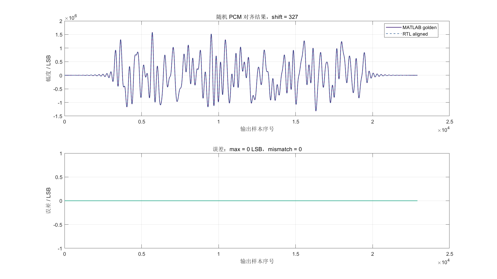

上图是全 2x 稳定基线的图形化对拍，图中固定延迟为 `shift=327`；上半部分是 MATLAB golden 与 RTL 对齐波形，下半部分是逐点误差。V3 重构级间调度后固定延迟变为 `shift=127`，对应结果记录在 `stage1_strict_rtl_summary.txt` 和 `stage1_strict_bram_rtl_summary.txt` 中。两个版本对齐后的最大误差均为 0 LSB。

---

## 9. 版本演进与资源对比

### 9.1 独立插值链对比

下表只统计 128 倍插值链本身，不包含 MMCM、按键、PCM ROM、DAC 接口和板级控制逻辑。

| 版本 | 主要结构 | LUT | FF | DSP | BRAM Tile | WNS / ns | 0 LSB |
|---|---|---:|---:|---:|---:|---:|---|
| 旧 4x+5×2x | 4x polyphase + 公共 2x | 9002 | 4497 | 2 | 0 | +165.584 | - |
| 全 2x 并行基线 | 7 级直接并行 | 9376 | 4118 | 38 | 0 | +134.988 | - |
| 全 2x 稳定基线 | Stage1 单 DSP MAC | 5912 | 4218 | 1 | 0 | +165.930 | 是 |
| Phase 1 | Stage4～7 canonical | 4302 | 3678 | 1 | 0 | +165.930 | 是 |
| Phase 2 | Stage2/3 polyphase + light bridge | 3975 | 3103 | 1 | 0 | +156.988 | 是 |
| Phase 3 FF | Stage1 strict-HB + FF 历史 | 3537 | 2105 | 1 | 0 | +159.856 | 是 |
| **Phase 3 BRAM** | **Stage1 strict-HB + BRAM 历史** | **3222** | **925** | **1** | **1** | **+159.809** | **是** |
| **Phase 4 V4** | **Stage2/3 共享 DSP + Stage1 BRAM** | **1648** | **1016** | **2** | **1** | **+161.944** | **是** |
| **Phase 5 ACC40** | **Q15 紧凑舍入 + ACC40** | **1379** | **1015** | **2** | **1** | **+165.332** | **是** |
| Phase 6 三 DSP 候选 | Stage2/3 各用独立 DSP | 1431 | 1052 | 3 | 1 | +165.937 | 是 |
| **Phase 6 混合字长** | **24/22/20/18 bit + ACC38** | **1224** | **867** | **2** | **1** | **+165.427** | **是** |
| **Phase 7 折叠 FIR-CIC N3** | **Stage3 补偿 + CIC16** | **957** | **791** | **2** | **1** | **+9.107 @ 48MHz** | **是** |

Phase 3 BRAM 相对全 2x 稳定基线：

```text
LUT：5912 -> 3222，减少 2690，下降约 45.5%
FF ：4218 ->  925，减少 3293，下降约 78.1%
DSP：1 -> 1
BRAM Tile：0 -> 1
```

Phase 4 V4 相对 Phase 3 BRAM 独立链：

```text
LUT：3222 -> 1648，减少 1574，下降约 48.85%
FF ： 925 -> 1016，增加   91，上升约  9.84%
DSP：1 -> 2
BRAM Tile：1 -> 1
WNS：+159.809 ns -> +161.944 ns
```

增加 1 个 DSP 后，Stage 2/3 常系数乘法选择网络大幅缩小。FF 小幅增加来自 pending job、相位、MAC 索引和共享调度状态寄存器，但仍低于独立链 `FF <= 1100` 的 Go 门槛。

Phase 6 首先验证了“Stage 2/3 各占一个 DSP”的三 DSP 方案。该候选虽然 0 LSB 和时序均通过，但相对 Phase 5 增加 52 LUT、37 FF 和 1 个 DSP，因此判定为 **No-Go**。随后执行混合字长搜索，保留两 DSP 共享结构并取得：

```text
独立链 LUT：1379 -> 1224，减少 155，下降约 11.24%
独立链 FF ：1015 ->  867，减少 148，下降约 14.58%
DSP：2 -> 2
BRAM Tile：1 -> 1
```

### 9.2 完整板级版本对比

完整板级统计包含插值链、20 MHz/5.6448 MHz 时钟、PCM ROM、矩阵按键、DAC 和复位逻辑。

| 板级版本 | LUT | FF | DSP | BRAM Tile | 说明 |
|---|---:|---:|---:|---:|---|
| 全 2x 初始稳定板级 | 6426 | 4416 | 1 | 0 | 首个可板级展示的全 2x 版本 |
| V2 Phase 2 板级 | 4428 | 3279 | 1 | 0 | canonical + Stage2/3 polyphase |
| V3 BRAM 板级 | 3676 | 1106 | 1 | 1 | 已完成实板三档验证的回退基线 |
| V4 共享 DSP 三档板级 | 2122 | 1198 | 2 | 1 | 已实板验证的三档版本 |
| V4 四档板测基线 | 1817 | 1182 | 2 | 1 | 1x/4x/8x/128x 均正常，提交 `e9882fc` |
| **Phase 5 ACC40 四档板级** | **1536** | **1181** | **2** | **1** | **实现与 bitstream 通过，待实板复测** |
| **Phase 6 混合字长四档板级** | **1395** | **1040** | **2** | **1** | **1x/4x/8x/128x 实板验证通过** |
| **Phase 7 折叠 FIR-CIC 四档板级** | **1128** | **964** | **2** | **1** | **静态板测通过；安全切档修正版待动态复测** |
| Phase 7 0.50FS 非 BRAM 稳定版 | 1120 | 962 | 2 | 1 | 幅度 A/B 与 bitstream 已通过，可随时回退 |
| Phase 7 0.50FS PCM ROM BRAM 候选 | 1044 | 940 | 2 | 1.5 | RTL、实现与 bitstream 通过，待实板复测 |
| **Phase 7 紧凑舍入候选** | **941** | **940** | **2** | **1.5** | **daily/nightly 0 LSB、实现与 bitstream 通过，待实板复测** |
| **Phase 7 CIC DSP48 低 LUT 候选** | **729** | **920** | **9** | **1.5** | **输出逐点不变；实现与 bitstream 通过，待实板复测** |
| **Phase 7 Stage2/3 LUTRAM 最低 LUT 候选** | **578** | **619** | **9** | **1.5** | **nightly、复位、动态切换与实现通过，待实板复测** |
| Phase 7 Stage2/3 BRAM + 紧凑键盘候选 | 506 | 579 | 9 | 3 | Stage2/3 历史与系数迁入 BRAM，完整回归通过 |
| Phase 7 共享扫描默认策略候选 | 496 | 565 | 9 | 3 | 相同 RTL 的默认综合/优化指令对照，完整回归通过 |
| Phase 7 面积策略 9-DSP 候选 | 478 | 565 | 9 | 3 | 完整实现与 bit-true 通过，作为独立回退对照 |
| **Phase 7 计数器 LUT 最低资源实板版** | **472** | **564** | **8** | **3** | **nightly 0 LSB、完整实现、bitstream 与四档实板验证通过** |

Phase 7 PCM ROM BRAM 优化候选相对 Phase 7 稳定版：

```text
LUT：1120 -> 1044，减少 76，下降约 6.79%
FF ： 962 ->  940，减少 22，下降约 2.29%
RAMB18E1：2 -> 3，增加 1 个；Block RAM Tile：1 -> 1.5
DSP：2 -> 2
WNS：+44.752 ns -> +44.527 ns
```

该变化来自把板级演示 ROM 从 LUT/FF 转为专用块 RAM，不涉及 128 倍 FIR-CIC 滤波数据通路，因此不会改变 MATLAB/RTL 频响、线性相位或定点量化结果。

紧凑舍入候选相对 PCM ROM BRAM 候选：

    LUT：1044 -> 941，减少 103，下降约 9.87%
    FF ： 940 -> 940，不变
    RAMB18E1：3 -> 3，不变
    DSP：2 -> 2，不变
    WNS：+44.527 ns -> +44.839 ns

该变化来自把 Stage 1 的 42 bit 全宽舍入偏置加法改为截位后的单比特进位。正式顶层 nightly 回归在 4x、8x 和 128x 三个节点均为 0 LSB，因此数字滤波性能与基线逐点一致。

CIC DSP48 低 LUT 候选相对紧凑舍入候选：

    LUT：941 -> 729，减少 212，下降约 22.53%
    FF ：940 -> 920，减少 20，下降约 2.13%
    RAMB18E1：3 -> 3，不变
    DSP：2 -> 9，增加 7 个，使用率仍为 10.00%
    WNS/WHS：+44.839/+0.050 ns -> +44.853/+0.077 ns

该变化只把 CIC 的 32 bit comb 与积分器宽位运算迁移到 DSP48E1；daily/nightly 三节点 0 LSB 对拍证明算法、字长和输出时序均未改变。它与 941 LUT / 2 DSP 版共同形成两个可复现的 Pareto 点，分别适合“最低 LUT”和“最低 DSP”目标。

Stage2/3 单读 LUTRAM 候选相对 CIC DSP48 低 LUT 候选：

    LUT：729 -> 578，减少 151，下降约 20.71%
    FF ：920 -> 619，减少 301，下降约 32.72%
    LUTRAM：0 -> 32，作为 Stage2/3 环形历史缓存
    RAMB18E1：3 -> 3，不变
    DSP：9 -> 9，不变
    WNS/WHS：+44.853/+0.077 ns -> +44.153/+0.095 ns

该变化利用 48 MHz 系统时钟相对音频采样使能的周期余量，把对称抽头双读预加改成单读串行 MAC。模块等价、正式顶层 nightly、8 场景复位恢复和四档动态切换均通过，证明资源下降没有改变样点值、复位语义或板级切档时序。

Stage2/3 BRAM 与共享扫描候选继续针对实现热点做局部优化，演进结果如下：

| 迭代 | LUT | FF | LUTRAM | BRAM Tile | DSP | WNS/WHS / ns | 主要变化 |
|---|---:|---:|---:|---:|---:|---:|---|
| 578 LUT 基线 | 578 | 619 | 32 | 1.5 | 9 | +44.153/+0.095 | Stage2/3 单读 LUTRAM |
| 紧凑键盘 | 557 | 579 | 32 | 1.5 | 9 | +46.451/+0.105 | 仅实现 SW1～SW8 的四档映射 |
| BRAM 历史 | 521 | 579 | 0 | 2.5 | 9 | +46.169/+0.118 | Stage2/3 两个历史环迁入 RAMB18E1 |
| BRAM 历史与系数 | 506 | 579 | 0 | 3 | 9 | +45.995/+0.050 | 顺序系数预取替代组合系数选择网络 |
| 共享扫描默认策略 | 496 | 565 | 0 | 3 | 9 | +45.414/+0.120 | 复用上电计数器产生 16384 拍扫描使能 |
| 面积策略 9-DSP 候选 | 478 | 565 | 0 | 3 | 9 | +46.612/+0.121 | 综合使用 `AreaOptimized_high`，逻辑优化使用 `ExploreArea` |
| **计数器 LUT 最终候选** | **472** | **564** | **0** | **3** | **8** | **+46.446/+0.093** | **5 bit burst 减一使用进位链，六个 CIC 宽位加减器继续使用 DSP48E1** |

计数器 LUT 最终候选相对 578 LUT 基线减少 106 LUT（18.34%）和 55 FF（8.89%），增加 1.5 BRAM Tile；相对最初 6426 LUT 板级版本累计减少 5954 LUT（92.65%）。完整设计仅使用 2.27% LUT、1.36% FF、8.89% DSP 和 6.00% BRAM，post-route 功耗估计为 0.169 W。6 个 RAMB18E1 分别承担 PCM ROM、Stage1 双读历史复制、Stage2/3 历史及顺序系数存储，没有把滤波乘加重新映射回 LUT。

相对 478 LUT / 9 DSP 面积策略候选，本轮减少 6 LUT、1 FF 和 1 DSP。此前 CIC 模块级 `use_dsp="yes"` 使三级差分、三级积分以及 5 bit `burst_remaining-1` 都优先进入 DSP48E1；局部 `use_dsp="no"` 约束把控制计数器减法恢复为普通进位链，六个 32 bit CIC 运算仍保留在 DSP 中。该变化不涉及 FIR 系数、CIC 阶数、数据字长、舍入或 valid 时序，重新编译的 nightly 回归仍为三节点 0 LSB。

最终候选的验证覆盖不是只看综合是否通过：

| 验证层级 | 激励或场景 | 结果 |
|---|---|---|
| Stage2/3 单元等价 | Stage2 336 点、Stage3 671 点 | 全部 0 LSB |
| 正式顶层 daily | 冲激 + 4 组随机，各 1024 输入点 | 4x/8x/128x 全部 0 LSB |
| 正式顶层 nightly | 冲激 + 10 组随机，各 4096 输入点 | 5,355,552 个 128x 输出点及中间节点全部 0 LSB |
| 完整链复位恢复 | 8 个 FIR/CIC 内部状态，每场景比较 4096 点 | 全部通过 |
| 动态档位切换 | 10 次无复位 1x/4x/8x/128x 切换 | 无窄脉冲、X、停顿或计数错误 |
| 紧凑键盘等价 | SW1～SW8、抖动、多键优先级、SW9～SW16 忽略 | 与原控制器要求一致 |
| 板级共享扫描 | 65535 拍上电复位、16384 拍扫描周期、SW2 去抖 | 全部通过 |

同时保留了两项 No-Go 对照。独立 16384 分频计数器得到 515 LUT，反而比 506 LUT 版本增加 9 LUT；Stage1 的 26×17 bit 小系数表强制 BRAM 后没有推断出额外 RAMB18E1，Stage1 反而从 1 DSP 增至 2 DSP、整板回升到 506 LUT/10 DSP。因此两项均未进入正式候选，说明优化决策以实现报告和逐样本验证为依据，而不是预设“所有 ROM 都应搬入 BRAM”。

最终候选 bitstream：

```text
matlab_fir/alt_all2x_v7/vivado_results/board_folded_n3_stage23_bram_coeff_compact_keypad_sharedscan_areaopt_dsp8/phase7_bram_sharedscan_areaopt_dsp8_amp050.bit
SHA256: 8CD7CAEAE949204A4D86875C82379424209E169849E3BEAAD2AC010383C2237C
```

该文件保持 0.50FS、15 kHz 正弦演示信号和 1x/4x/8x/128x 四档数据路径，并已完成四档实板验证：

| 输出档位 | 理论 `DA_CLK` | 实测 `DA_CLK` | 相对偏差 | DA 输出 |
|---|---:|---:|---:|---|
| 1x | 44.10 kHz | 44.09 kHz | -0.023% | 正常正弦波 |
| 4x | 176.40 kHz | 176.43 kHz | +0.017% | 正常正弦波 |
| 8x | 352.80 kHz | 352.86 kHz | +0.017% | 正常正弦波 |
| 128x | 5.6448 MHz | 5.64 MHz | -0.085% | 正常正弦波 |

四档实测采样时钟均与理论倍率一致，最大相对偏差约为 0.085%。结合 MATLAB 指标检查、RTL 逐点对拍、复位和动态切换回归、综合实现、时序检查与本次实板测试，472 LUT / 8 DSP 版本已经完成从数学模型到模拟输出的验证闭环。已推送的 578 LUT 基线、478/496 LUT 候选和既有稳定回退 bitstream 继续保留，便于后续复现和对照。

### 9.8 Phase 8 存储打包与尾级架构边界搜索

Phase 8 首先保持 FIR 系数、CIC 阶数、字长和 valid 协议不变，只利用 Stage2/3 计算互斥关系，把两级历史和交叉级系数打包进两个双用途 `RAMB18E1`。该候选通过 Stage2/3 单元对拍、正式顶层 daily/nightly、8 场景复位恢复、10 次动态切档以及完整实现，nightly 的 5,355,552 个 128x 输出点和全部中间节点均为 0 LSB。

| 指标 | 472 LUT 板测基线 | Phase 8 打包 BRAM 候选 | 变化 |
|---|---:|---:|---:|
| LUT | 472 | 484 | +12 |
| FF | 564 | 564 | 0 |
| DSP48E1 | 8 | 8 | 0 |
| BRAM Tile | 3.0 | 2.5 | -0.5 |
| WNS / WHS | +46.446 / +0.093 ns | +46.156 / +0.113 ns | 均通过 |
| 功耗估计 | 0.169 W | 0.169 W | 不变 |

该实验形成了有效的存储优先 Pareto 点，但没有降低 LUT，因此工程默认值已经恢复为实板通过的 472 LUT / 8 DSP 基线。打包版由 `USE_PACKED_BRAM_STAGE23` 参数独立启用，候选 bitstream 的 SHA256 为 `842EE7BE734BF7AAE5EDC2F1DF23EAC19E11C5EB135AC7C3E05C476CD788DA57`。

随后对 16 倍尾级进行 CIC/Halfband 联合搜索。对 `CIC16`、`CIC8+1级Halfband` 和 `CIC4+2级Halfband` 的不同排列重新设计 Stage3 折叠补偿 FIR，并统一使用 `<=0.01 dB` 通带误差、`>=72 dB` 阻带和严格对称门槛。通过候选如下：

| 尾级结构 | CIC 阶数 | DSP 共享估算 | DSP 独立估算 | 通带误差 / dB | 阻带 / dB |
|---|---:|---:|---:|---:|---:|
| CIC16 | 3 | 8 | 8 | 0.00318129 | 72.3663 |
| 2x Halfband + CIC8 | 3 | 9 | 9 | 0.00292962 | 78.5921 |
| 2x Halfband + 2x Halfband + CIC4 | 3 | 9 | 10 | 0.00305852 | 78.5912 |
| 2x Halfband + CIC4 + 2x Halfband | 3 | 9 | 10 | 0.00315603 | 78.5926 |

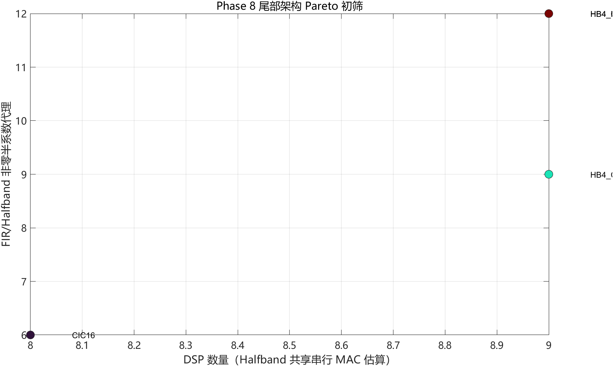

所有满足 72 dB 门槛的候选仍需 3 阶 CIC；加入 Halfband 只能用额外计算换取约 78.6 dB 阻带，不能减少 DSP。最接近降 DSP 目标的是 `两个2x Halfband + CIC4(N=2)`：若两个 Halfband 共用一颗串行 MAC，理论资源下界为 7 DSP。为避免只凭初筛结果过早否定该路线，又执行了以下四轮定点优化和 `2^20` 点精确复算：

| 7 DSP 数学候选 | 通带最大绝对误差 / dB | 阻带衰减 / dB | 距 72 dB | 结果 |
|---|---:|---:|---:|---|
| 初始 7 tap Halfband + 原 Stage3 | 0.00296014 | 71.54678770 | -0.45321230 | NO-GO |
| 7 tap Halfband 与 Stage3 联合优化 | 0.00319857 | 71.54703673 | -0.45296327 | NO-GO |
| 两级 Halfband 加长到 11 tap | 0.00689974 | 71.55077836 | -0.44922164 | NO-GO |
| 既有 Stage1 库复筛最佳项 | 0.00515985 | **71.58790137** | **-0.41209863** | NO-GO |
| 二阶 CIC 专用 Stage1 重设计 | 0.00425055 | 71.58681595 | -0.41318405 | NO-GO |

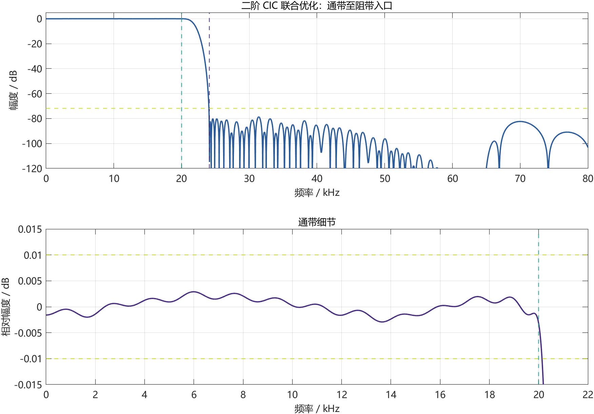

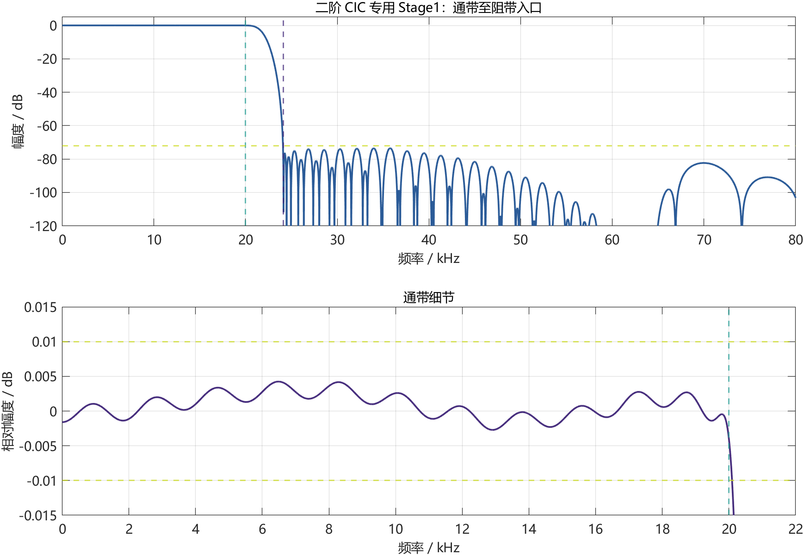

加长尾部 Halfband 只带来约 `0.004 dB` 的阻带变化，因为 24.1 kHz 阻带入口在这两级 Halfband 中仍位于低频通带，主要限制来自前级半带响应与二阶 CIC 的联合响应。Stage1 复筛虽把阻带提高到 `71.58790137 dB`，仍未达到本轮保守的 `72 dB` 工程门槛。

本轮严格执行 Stop/Go：数学指标未通过，因此没有创建 7 DSP RTL、没有登记 Vivado 源文件，也没有综合、实现或生成 bitstream。表中的 7 DSP 仅是共享调度成立时的理论估算，不能当作实现资源。最终正式版本仍为已完成 MATLAB、RTL 0 LSB 对拍、实现及时序检查和四档板测的 **472 LUT / 564 FF / 8 DSP / 3 BRAM** 基线；484 LUT / 8 DSP / 2.5 BRAM 打包版仅作为存储优先 Pareto 候选。详细过程见 [Phase 8 优化指导评估与执行报告](matlab_fir/alt_all2x_v8/phase8_guidance_assessment_and_execution.md)。

V3 相对全 2x 初始稳定板级：

```text
LUT：6426 -> 3676，减少 2750，下降约 42.8%
FF ：4416 -> 1106，减少 3310，下降约 75.0%
```

V3 相对 V2 Phase 2 板级：

```text
LUT：4428 -> 3676，减少 752，下降约 17.0%
FF ：3279 -> 1106，减少 2173，下降约 66.3%
```

V4 相对 V3 BRAM 板级：

```text
LUT：3676 -> 2122，减少 1554，下降约 42.27%
FF ：1106 -> 1198，增加   92，上升约  8.32%
DSP：1 -> 2
BRAM Tile：1 -> 1
```

从全 2x 初始稳定板级到 V4：

```text
LUT：6426 -> 2122，累计减少 4304，下降约 66.98%
FF ：4416 -> 1198，累计减少 3218，下降约 72.87%
DSP：1 -> 2
BRAM Tile：0 -> 1
```

这说明 V3 通过 BRAM 消除了 Stage 1 大量历史寄存器，V4 再用第 2 个 DSP 替换 Stage 2/3 的 LUT 乘法网络。两次优化针对不同资源瓶颈，可以叠加而不会改变 FIR 数学响应。

Phase 5 相对 V4 四档板测基线：

```text
LUT：1817 -> 1536，减少 281，下降约 15.5%
FF ：1182 -> 1181，减少   1
DSP：2 -> 2
BRAM Tile：1 -> 1
```

Phase 6 相对 Phase 5 四档板级：

```text
LUT：1536 -> 1395，减少 141，下降约  9.18%
FF ：1181 -> 1040，减少 141，下降约 11.94%
DSP：2 -> 2
BRAM Tile：1 -> 1
WNS：+44.892 ns -> +45.145 ns
```

---

## 10. Vivado 实现结果

### 10.1 时序

| 指标 | 结果 |
|---|---:|
| WNS | +45.145 ns |
| TNS | 0 ns |
| Setup failing endpoints | 0 |
| WHS | +0.121 ns |
| THS | 0 ns |
| Hold failing endpoints | 0 |
| Timing constraints | 全部满足 |

当前关键音频时钟为 5.6448 MHz，板级还包含 20 MHz 矩阵按键与控制时钟。Phase 6 实现后全部用户时序约束满足，setup/hold 失败端点均为 0。全局 WNS 为 `+45.145 ns`，音频时钟域 WNS 为 `+85.415 ns`，全局 WHS 为 `+0.121 ns`。

### 10.2 功耗

| 项目 | Vivado 估算 |
|---|---:|
| Total On-Chip Power | 0.168 W |
| Dynamic | 0.096 W |
| Device Static | 0.072 W |
| Junction Temperature | 25.5 °C |
| Confidence Level | Low |

当前功耗报告没有使用实测 SAIF/VCD 活动文件，只适合作为结构版本间的初步比较，不应作为精确板级功耗测量值。

### 10.3 DRC 说明

Phase 6 实现后 DRC 为 0 Error、30 Warning：

| 规则 | 数量 | 含义 |
|---|---:|---|
| CHECK-3 | 1 | 报告达到规则显示上限 |
| DPIP-1 | 5 | 两个 DSP 的部分输入未使用内部流水寄存器 |
| DPOP-1 | 2 | 两个 DSP 的 PREG 输出流水建议 |
| DPOP-2 | 2 | 两个 DSP 的 MREG 输出流水建议 |
| REQP-1840 | 20 | 推断 RAMB18 的异步控制检查 |

这些均为性能或结构建议，不是实现错误。当前 Phase 6 post-route setup/hold 全部通过。若后续为 DSP 增加内部流水，必须同步调整调度时延并重新进行 bit-true 与板级回归。

### 10.4 Phase 6 bitstream

```text
文件：matlab_fir/alt_all2x_v6/vivado_results/board_mixed_width/
      board_demo_competition_dac8_top_phase6_mixed_width.bit
大小：2,192,139 byte
SHA256：E122FC402FB10E43954BDC5E9E134BD2789F1645F138D6FFAAD83C52581612C3
```

该 bitstream 由 Phase 6 Tcl 脚本先 Reset `synth_1` 和 `impl_1`，再从当前 RTL 完整重建得到。下载前可用上述 SHA256 校验文件，避免误用旧版本。

---

## 11. 板级接口与操作

### 11.1 主要引脚

| 接口 | FPGA 引脚 |
|---|---|
| 20 MHz `clk` | Y18 |
| DAC `DA_CLK` | G16 |
| DAC `DA_D0..D7` | H19、E19、H18、G18、F18、G17、E17、C17 |
| 矩阵按键 `KR0..KR3` | W21、R19、T20、P19 |
| 矩阵按键 `KC0..KC3` | T21、U21、V22、W22 |
| 蜂鸣器 `BEEP-IO` | AB18，高电平关闭 |

### 11.2 15 kHz 示波器对比信号

原测试 ROM 是按 48 kHz 生成的 440 Hz、880 Hz、1760 Hz 多频音频，在当前 44.1 kHz 节拍播放时最高分量约为 1.62 kHz。信号周期相对各档 DA_CLK 很长，因此 4x、8x、128x 在示波器连线显示下都显得较平滑。

当前改为 44.1 kHz 采样、0.80FS 的 15 kHz 单正弦。147 点 ROM 正好包含 50 个完整周期，循环边界连续：

| 档位 | DA_CLK | 每个 15 kHz 周期的采样点 | 预期观感 |
|---|---:|---:|---|
| 1x | 44.1 kHz | 2.94 | 最粗糙，直接显示原始 PCM 阶梯 |
| 4x | 176.4 kHz | 11.76 | 阶梯明显 |
| 8x | 352.8 kHz | 23.52 | 明显比 4x 平滑 |
| 128x | 5.6448 MHz | 376.32 | 最平滑 |

15 kHz 仍位于 10 Hz～20 kHz 设计通带内，所以该修改只改变演示激励，不改变 FIR 系数、通带纹波或阻带衰减。

### 11.3 按键映射

| 按键 | 插值节点 | 理论 DA_CLK |
|---|---:|---:|
| SW1 或 SW5 | 1x 原始 PCM | 44.1 kHz |
| SW2 或 SW6 | 4x | 176.4 kHz |
| SW3 或 SW7 | 8x | 352.8 kHz |
| SW4 或 SW8 | 128x | 5.6448 MHz |

上电默认进入 128x 模式。矩阵按键由 20 MHz 时钟域扫描、同步和消抖，模式信号通过两级同步器进入 5.6448 MHz 音频域。1x 只旁路 DAC 显示选择器，七级插值链仍在后台连续运行，因此切换档位不需要重新锁定时钟或复位 FIR。

### 11.4 DAC 数据时序

`dac_data[7:0]` 在音频时钟下降沿更新，AD9708 在 `dac_clk` 上升沿采样。1x、4x 和 8x 模式下，`dac_clk` 分别取 CE 计数器的 44.1 kHz、176.4 kHz、352.8 kHz 分频位；128x 模式直接输出 5.6448 MHz 连续时钟。

---

## 12. 主要文件说明

### 12.1 MATLAB

| 文件 | 作用 |
|---|---|
| `matlab_fir/alt_all2x/design_all2x_interp128_compare.m` | 七级全 2x 初始设计、逐级搜索与总链路检查 |
| `matlab_fir/alt_all2x_v2/v2_02_test_canonical_halfband7.m` | Stage4～7 canonical halfband 验证 |
| `matlab_fir/alt_all2x_v2/v2_03_validate_canonical_bittrue.m` | canonical 定点验证 |
| `matlab_fir/alt_all2x_v2/v2_04_compare_canonical_rtl.m` | MATLAB/RTL 对拍 |
| `matlab_fir/alt_all2x_v2/v2_05_export_stage23_polyphase.m` | Stage2/3 true-polyphase 系数导出 |
| `matlab_fir/alt_all2x_v2/v2_07_design_stage1_strict_halfband.m` | Stage1 strict-halfband 搜索 |
| `matlab_fir/alt_all2x_v2/v2_08_validate_stage1_strict_bittrue.m` | Stage1 定点压力测试 |
| `matlab_fir/alt_all2x_v2/v3_01_select_stage1_pareto.m` | Pareto 候选选择 |
| `matlab_fir/alt_all2x_v2/v3_02_export_stage1_rtl.m` | V3 系数头文件导出 |
| `matlab_fir/alt_all2x_v2/v3_03_generate_stage1_rtl_golden.m` | Stage1 与完整链 golden 生成 |
| `matlab_fir/alt_all2x_v2/v3_04_compare_stage1_rtl.m` | FF 历史版本 RTL 对拍 |
| `matlab_fir/alt_all2x_v2/v3_05_compare_stage1_bram_rtl.m` | BRAM 历史版本 RTL 对拍 |
| `matlab_fir/alt_all2x_v4/v4_01_analyze_stage23_shared_dsp_schedule.m` | Stage2/3 共享 DSP 64 拍超周期调度分析 |
| `matlab_fir/alt_all2x_v4/v4_02_compare_shared_dsp_rtl.m` | V4 分级与完整链 0 LSB 对拍 |
| `matlab_fir/all2x_phase4_dsp_sharing_plan.md` | Phase4 Stop/Go 计划、执行记录和结果汇总 |
| `matlab_fir/alt_all2x_v6/phase6_01_search_stage_data_wordlength.m` | 逐级数据字长搜索、音频质量与溢出门槛检查 |
| `matlab_fir/alt_all2x_v6/phase6_02_export_mixed_width_golden.m` | 导出混合字长冲激/随机 RTL golden |
| `matlab_fir/alt_all2x_v6/phase6_03_plot_resource_comparison.m` | 生成 Phase 5/6 独立链与板级资源对比图 |
| `matlab_fir/all2x_phase6_execution_plan.md` | Phase 6 执行计划与逐项状态 |
| `matlab_fir/all2x_phase6_execution_report.md` | 指导采纳、Pareto、字长搜索、RTL 和实现完整报告 |
| `matlab_fir/alt_all2x_v7/search_cic_order.m` | CIC N=3/4/5 频响与位增长搜索 |
| `matlab_fir/alt_all2x_v7/search_cic_compensation.m` | 独立低速补偿 FIR Pareto 搜索 |
| `matlab_fir/alt_all2x_v7/phase7_05_search_folded_stage3.m` | 11tap Stage3 折叠补偿搜索 |
| `matlab_fir/alt_all2x_v7/phase7_06_validate_folded_bittrue.m` | 折叠方案定点与剪枝验证 |
| `matlab_fir/alt_all2x_v7/verification/phase7_generate_verification_vectors.m` | 生成 daily/nightly 正式顶层与 CIC golden |
| `matlab_fir/alt_all2x_v7/verification/phase7_analyze_cic_wrap.m` | CIC 逐级动态范围、回绕和直流相位统计 |
| `matlab_fir/alt_all2x_v7/verification/phase7_analyze_full_rtl_impulse.m` | 从正式 RTL 冲激 CSV 提取频率和线性相位指标 |
| `matlab_fir/all2x_phase7_cic_execution_plan.md` | Phase 7 Stop/Go 计划和最终状态 |
| `matlab_fir/all2x_phase7_fir_cic_execution_report.md` | Phase 7 数学、RTL、资源和板级完整报告 |
| `matlab_fir/alt_all2x_v8/phase8_01_search_tail_architectures.m` | CIC16、CIC8+Halfband、CIC4+两级 Halfband 尾级架构统一搜索 |
| `matlab_fir/alt_all2x_v8/phase8_02_optimize_cic2_halfband.m` | 二阶 CIC、两级 7 tap Halfband 与 Stage3 定点联合优化 |
| `matlab_fir/alt_all2x_v8/phase8_03_optimize_cic2_halfband11.m` | 两级 11 tap strict-halfband 加长候选复核 |
| `matlab_fir/alt_all2x_v8/phase8_04_search_stage1_margin.m` | 既有 Stage1 候选库在二阶 CIC 尾级下的余量复筛 |
| `matlab_fir/alt_all2x_v8/phase8_05_redesign_stage1_cic2.m` | 保持 32 MAC 对上限的二阶 CIC 专用 Stage1 重设计 |
| `matlab_fir/alt_all2x_v8/phase8_guidance_assessment_and_execution.md` | Phase 8 存储打包、7 DSP 数学边界与 Stop/Go 完整记录 |
| `audio_data/generate_demo_sine_15k_44k1.m` | 生成 44.1 kHz / 24 bit / 15 kHz 示波器对比 ROM |

### 12.2 RTL

| 文件 / 模块 | 作用 |
|---|---|
| `board_demo_competition_dac8_top.v` | 板级顶层、时钟、复位、按键与 DAC 接口 |
| `demo_interp_dac8_audio_pcm_common.v` | PCM 输入、Phase 7 默认实例、Phase 6 generate 回退与 DAC 转换 |
| `audio_pcm_rom_source.v` | 24 bit signed PCM ROM 输入源 |
| `demo_sine_15k_44k1_24bit_147.mem` | 147 点、50 周期、0.50FS 的 15 kHz 单正弦 |
| `all2x_v3/interp2_stage1_strict_halfband_bram_ce.v` | Stage1 strict-halfband 双口 BRAM 单 DSP MAC |
| `all2x_v3/interp128_all2x_v3_stage1_select_top_ce.v` | V3 七级公共顶层 |
| `all2x_v3/interp128_all2x_v3_strict_s1_bram_top_ce.v` | 已实板验证的 V3 BRAM 回退包装顶层 |
| `all2x_v3/all2x_v3_stage1_coeff_pkg.vh` | MATLAB 自动导出的 Stage1 Q15 系数 |
| `all2x_v4/interp2_stage23_shared_dsp_ce.v` | Stage2/3 单 DSP 时分复用调度、MAC 与双格式舍入 |
| `all2x_v4/interp128_all2x_v4_shared_dsp_top_ce.v` | V4/Phase 5 七级 128x 回退顶层 |
| `all2x_v6/round_sat_shift_compact.v` | 任意缩减位数的紧凑对称舍入与饱和 |
| `all2x_v6/bridge_valid_quantized_to_interp2_ce.v` | 级间 `data + valid` 量化桥 |
| `all2x_v6/interp128_all2x_v6_mixed_width_top_ce.v` | 当前 Phase 6 七级混合字长 128x 顶层 |
| `all2x_v6/interp2_stage23_independent_dsp_ce.v` | 仅用于 3-DSP Pareto 的 Stage2/3 独立 DSP 候选 |
| `all2x_v6/interp128_all2x_v6_three_dsp_top_ce.v` | 仅用于 No-Go 对照的 3-DSP 包装顶层 |
| `all2x_v7/interp2_stage23_folded_cic_dsp_ce.v` | Stage2/3 共享 DSP 与 Stage3 折叠补偿 |
| `all2x_v7/interp2_stage23_lutram_cic_dsp_ce.v` | Stage2/3 单读 LUTRAM 环形缓存与共享串行 DSP 候选 |
| `all2x_v7/cic_interp16_core_ce.v` | 低速 comb、16 倍插零、高速 integrator CIC 核 |
| `all2x_v7/cic_interp16_core_dsp_ce.v` | 与正式 CIC 逐点等价的 DSP48 优先映射低 LUT 核 |
| `all2x_v7/interp128_all2x_v7_folded_fir_cic_top_ce.v` | Phase 7 N=3 128x 顶层及 Stage2/3 稳定/LUTRAM 参数化选择 |
| `matrix_keypad_mode_ctrl_compact.v` | SW1～SW8 四档映射、整轮消抖及共享扫描使能接口 |
| `all2x_v2/interp2_stage23_polyphase_ce.v` | Stage2/3 true-polyphase 实现 |
| `all2x_v2/interp2_halfband7_shiftadd_ce.v` | Stage4～7 canonical shift-add 实现 |
| `all2x_v2/bridge_valid_only_to_interp2_ce.v` | 级间轻量 valid 桥 |
| `round_sat_q16_to24.v` | 舍入与 24 bit 饱和 |

### 12.3 Phase 6 / Phase 7 仿真与 Vivado 脚本

| 文件 | 作用 |
|---|---|
| `sim_1/new/all2x_v4/tb_interp128_all2x_v4_shared_dsp_ce.v` | V3/V4 并行输入，导出 Stage2、Stage3 和链尾结果 |
| `sim_1/new/all2x_v4/tb_demo_interp_dac8_four_mode.v` | 验证四档 DA_CLK 倍率和 DAC 数据变化 |
| `sim_1/new/all2x_v4/tb_matrix_keypad_four_mode.v` | 验证 SW1～SW8 的两组四档按键映射 |
| `alt_all2x_v4/vivado/synth_stage23_shared_dsp.tcl` | V4 独立链同口径综合与报告导出 |
| `alt_all2x_v4/vivado/build_board_v4_shared_dsp.tcl` | V4 板级源文件登记、综合、实现和报告自动构建 |
| `sim_1/new/all2x_v6/tb_phase6_three_dsp_multiseed.v` | Phase 5 与 3-DSP 候选多激励逐点比较 |
| `sim_1/new/all2x_v6/tb_round_sat_shift_compact.v` | 紧凑量化器 100000 组边界/随机单元测试 |
| `sim_1/new/all2x_v6/tb_phase6_mixed_width_bittrue.v` | Phase 6 Stage2、Stage3、链尾冲激/随机对拍 |
| `alt_all2x_v6/vivado/synth_phase6_three_dsp_pareto.tcl` | 3-DSP 候选独立综合与 DSP 映射报告 |
| `alt_all2x_v6/vivado/synth_phase6_mixed_width.tcl` | 混合字长独立链综合 |
| `alt_all2x_v6/vivado/build_board_phase6_mixed_width.tcl` | Reset 工程 run、完整实现、报告和 bitstream 导出 |
| `alt_all2x_v7/vivado/build_board_phase7_cic_dsp_low_lut.tcl` | CIC DSP48 低 LUT 候选完整实现、报告与 bitstream 导出 |
| `alt_all2x_v7/vivado/build_board_phase7_stage23_lutram_low_lut.tcl` | 578 LUT Stage2/3 单读 LUTRAM 候选完整构建与报告导出 |
| `sim_1/new/all2x_v7/tb_phase7_folded_front3_bittrue.v` | Phase 7 前三级 N3/N4 冲激/随机 0 LSB |
| `sim_1/new/all2x_v7/tb_cic_interp16_folded_core.v` | Phase 7 CIC 核 N3/N4 冲激/随机 0 LSB |
| `sim_1/new/all2x_v7/verification/tb_phase7_full_chain_bittrue.v` | 正式顶层冲激与 daily/nightly 三节点 0 LSB |
| `sim_1/new/all2x_v7/verification/tb_phase7_cic_directed.v` | comb、16 输出 burst、valid 和 CIC 逐点对拍 |
| `sim_1/new/all2x_v7/verification/tb_phase7_cic_modulo_boundary.v` | 三级积分器 32 bit 正负模回绕边界 |
| `sim_1/new/all2x_v7/verification/tb_phase7_cic_reset_recovery.v` | CIC pending/burst 中途复位与冷启动恢复 |
| `sim_1/new/all2x_v7/verification/tb_phase7_full_chain_reset_recovery.v` | 完整顶层 8 个内部阶段复位恢复 |
| `sim_1/new/all2x_v7/verification/tb_phase7_mode_switch_dynamic.v` | 无复位动态切档、频率、毛刺和 X 检查 |
| `sim_1/new/all2x_v7/verification/tb_stage23_lutram_dsp_equiv.v` | Stage2/3 稳定实现与 LUTRAM 候选按 valid 序列 0 LSB 对拍 |
| `sim_1/new/all2x_v7/verification/tb_matrix_keypad_mode_ctrl_compact.v` | 紧凑键盘与原扫描器的按键、抖动及优先级等价验证 |
| `sim_1/new/all2x_v7/verification/tb_board_phase7_shared_keypad_scan.v` | 上电复位、共享扫描周期、音频域复位及 SW2 去抖验证 |
| `alt_all2x_v7/vivado/synth_phase7_folded_fir_cic.tcl` | Phase 7 N3/N4 同口径独立综合 |
| `alt_all2x_v7/vivado/register_phase7_board_sources.tcl` | Phase 7 工程源文件登记 |
| `alt_all2x_v7/vivado/build_board_phase7_folded_n3.tcl` | Phase 7 板级完整实现与 bitstream 导出 |
| `alt_all2x_v7/vivado/build_board_phase7_rounder_compact_opt.tcl` | Stage 1 紧凑舍入候选的独立实现、报告与 bitstream 导出 |
| `alt_all2x_v7/vivado/build_board_phase7_stage23_lutram_compact_keypad.tcl` | 578～472 LUT 的 LUTRAM/BRAM/紧凑键盘/面积策略/DSP 计数器候选统一构建脚本 |
| `alt_all2x_v7/vivado/generate_phase7_stable_mcs.tcl` | 回退后稳定版 SPIx1 MCS 导出 |
| `alt_all2x_v7/vivado/report_phase7_implementation_verification.tcl` | 从当前实现补导出时钟交互和 DSP 单元报告 |

---

## 13. 复现步骤

### 13.1 MATLAB

首先运行全 2x 初始设计：

```matlab
cd('matlab_fir/alt_all2x');
run('design_all2x_interp128_compare.m');
```

然后在 `matlab_fir/alt_all2x_v2/` 中按顺序运行：

```text
v2_01_extract_current_baseline.m
v2_02_test_canonical_halfband7.m
v2_03_validate_canonical_bittrue.m
v2_04_compare_canonical_rtl.m
v2_05_export_stage23_polyphase.m
v2_06_compare_stage23_rtl.m
v2_07_design_stage1_strict_halfband.m
v2_08_validate_stage1_strict_bittrue.m
v3_01_select_stage1_pareto.m
v3_02_export_stage1_rtl.m
v3_03_generate_stage1_rtl_golden.m
v3_04_compare_stage1_rtl.m
v3_05_compare_stage1_bram_rtl.m
```

MATLAB 会输出频响 PNG、候选 CSV、定点 summary、Verilog 系数头文件和 RTL golden 数据。

V4 共享 DSP 验证按以下顺序执行：

```matlab
cd('matlab_fir/alt_all2x_v4');
run('v4_01_analyze_stage23_shared_dsp_schedule.m');
run('v4_02_compare_shared_dsp_rtl.m');
```

Phase 6 字长搜索、golden 导出和资源图按以下顺序执行：

```matlab
cd('matlab_fir/alt_all2x_v6');
run('phase6_01_search_stage_data_wordlength.m');
run('phase6_02_export_mixed_width_golden.m');
run('phase6_03_plot_resource_comparison.m');
```

Phase 7 FIR-CIC 搜索与折叠补偿按以下顺序执行：

```matlab
cd('matlab_fir/alt_all2x_v7');
run('search_cic_order.m');
run('search_cic_compensation.m');
run('phase7_03_validate_bittrue.m');
run('phase7_04_search_hogenauer_pruning.m');
run('phase7_05_search_folded_stage3.m');
run('phase7_06_validate_folded_bittrue.m');
run('phase7_07_plot_resource_comparison.m');
```

Phase 7 验证补全的 MATLAB 入口：

```matlab
cd('matlab_fir/alt_all2x_v7/verification');
phase7_generate_verification_vectors('daily');
phase7_generate_verification_vectors('nightly');
phase7_analyze_cic_wrap();
phase7_analyze_full_rtl_impulse();
```

其中 `phase7_analyze_full_rtl_impulse` 需要先运行 `tb_phase7_full_chain_bittrue.v`，把冲激输出 CSV 放到 `verification/rtl_outputs/`。大型 `.mem` golden 和 RTL CSV 均可由脚本重建，已排除在 Git 追踪之外；摘要、测试平台、频响图和最终报告保留在仓库中。

搜索结果写入 `wordlength_results/`，混合字长 golden 写入 `mixed_width_golden/`。CSV 属于可再生中间结果，仓库以 summary、RTL、图和最终报告为主要追踪对象。

生成当前 15 kHz 示波器对比 ROM：

```matlab
cd('audio_data');
run('generate_demo_sine_15k_44k1.m');
```

其中 `v4_02_compare_shared_dsp_rtl.m` 需要先运行 V4 XSim 测试平台，RTL CSV 放在系统临时目录 `%TEMP%/codex_fir_interpolation/phase4_sim/`，不会污染仓库根目录。

### 13.2 Vivado

打开工程：

```text
XC7A35T_interp_audio_pcm_wordlen_opt/XC7A35T_interp.xpr
```

当前 `XC7A35T_interp.xpr` 已正式登记 V4/Phase 5、Phase 6、Phase 7 板级 RTL、紧凑键盘控制器、`all2x_v2`～`all2x_v7` include 目录、Phase 7 测试平台和 15 kHz `.mem` 文件，不需要再次手动 Add Sources。顶层 generic 已指向 `472 LUT / 8 DSP` 候选：Stage2/3 历史与系数 BRAM、紧凑键盘、共享扫描均启用；当前 run 同时保存了 `AreaOptimized_high` 综合指令和 `ExploreArea` 逻辑优化指令。Phase 7 构建脚本已经 Reset 并重跑 `synth_1`、`impl_1` 与 bitstream；后续手动复现时可依次执行：

```text
Run Synthesis
Run Implementation
Generate Bitstream
Open Hardware Manager
Program Device
```

为避免看到旧报告，在运行前应 Reset `synth_1` 与 `impl_1`，运行后关闭旧 Utilization 标签页并从最新 run 重新打开报告。可在综合后确认层次结构包含：

```text
gen_phase7_folded
u_interp128_all2x_v7_folded_fir_cic_top_ce
u_interp2_stage23_folded_cic_dsp_ce
u_cic_interp16_core_ce
u_bridge_2_to_4_quantized
u_bridge_4_to_8_quantized
```

也可以在 Vivado Tcl Console 执行完整构建脚本；该脚本会统一导出利用率、时序、功耗、DRC 和 bitstream：

```tcl
source matlab_fir/alt_all2x_v7/vivado/build_board_phase7_folded_n3.tcl
```

当前 472 LUT / 8 DSP 候选应在 PowerShell 中使用以下参数化命令复建：

```powershell
& 'E:\app\Xilinx2018.3\Vivado\2018.3\bin\vivado.bat' -mode batch `
  -source 'matlab_fir\alt_all2x_v7\vivado\build_board_phase7_stage23_lutram_compact_keypad.tcl' `
  -tclargs 1 1 0 1 1 1
```

六个参数依次表示：Stage2/3 历史使用 BRAM、系数使用 BRAM、保留 20000 键盘参数、共享上电扫描计数器、启用面积优先策略、CIC burst 计数器使用 LUT 进位链。

该 bitstream 已完成实板四档测试。依次切换 1x、4x、8x、128x 后，`DA_CLK` 实测为 44.09 kHz、176.43 kHz、352.86 kHz、5.64 MHz，AD9708 四档模拟输出均为正常正弦波。

---

## 14. Git 稳定基线与后续工作

已实板验证的回退版本：

```text
branch : release/regional-final-demo
commit : 6132cbb
tag    : LUT3676_DSP1_FF1106_board_successful
```

当前 V4 实现分支：

```text
codex/all2x-phase4-dsp-sharing
```

当前 Phase 5 优化分支：

```text
codex/phase5-q15-single-rounder
```

当前 Phase 6 工作分支：

```text
codex/phase6-three-dsp-pareto
```

当前 Phase 7 工作分支：

```text
codex/phase7-conservative-resource-opt
```

Phase 4 已增加第 2 个 DSP，由 Stage 2/3 共享，并完成以下 Stop/Go 闭环：

1. FIR 系数和 MATLAB 指标不变。
2. Stage2、Stage3 与完整链冲激/随机 PCM 对拍均为 0 LSB。
3. MAC 调度最坏 slack 为 4 拍，deadline miss 和 pending overwrite 均为 0。
4. 独立链达到 1648 LUT / 1016 FF / 2 DSP / 1 BRAM Tile。
5. 板级实现达到 2122 LUT / 1198 FF / 2 DSP / 1 BRAM Tile。
6. post-route WNS +44.960 ns、WHS +0.121 ns，时序全部通过。

V4 四档版本已完成 bitstream 和实板回归。Phase 5 在此基础上完成 Q15 单舍入、紧凑饱和和 ACC40，作为提交 `d8f4946` 的稳定优化基线。Phase 6 先证明 3-DSP 候选资源反而增加，再选择 `24/22/20/18/18/18/18 bit + ACC38` 的两 DSP 混合字长方案；独立链达到 1224 LUT / 867 FF，完整四档板级达到 1395 LUT / 1040 FF。bit-true、四档仿真、综合、实现、bitstream 和实板四档展示均已通过，实测 `DA_CLK` 为 176.37 kHz、352.86 kHz 和 5.64 MHz，DA 波形从 1x 到 128x 呈现清晰的逐级平滑变化。详细过程见 `matlab_fir/all2x_phase6_execution_report.md`。

Phase 7 在正确 CIC 插值结构上先完成独立低速补偿 FIR，确认其资源 No-Go 后，把补偿折叠进原 11tap Stage3。最终 N=3 独立链为 957 LUT / 791 FF / 2 DSP / 1 BRAM；安全切档修正版完整板级为 1128 LUT / 964 FF。正式顶层冲激、daily 4×1024 和 nightly 10×4096 在 4x/8x/128x 均为 0 LSB，RTL 冲激直接测得最终通带最大偏差 0.00303062 dB、阻带衰减 72.349 dB、冲激对称误差 0 LSB。上一版 Phase 7 静态板测为 176.37 kHz、352.86 kHz、5.64 MHz 且 DA 正常；当前只差把安全切档修正版 bitstream 下载后再做一次动态切档确认。完成前，Phase 6 继续作为稳定回退版本。

在此基础上把 `147×24 bit` 演示 PCM ROM 从 LUT/FF 映射为一个 `RAMB18E1`。0.50FS 复核候选完整板级为 1044 LUT / 940 FF / 2 DSP / 1.5 BRAM Tile，ROM 连续 300 次更新对拍为 0 LSB，四档 RTL 幅值均无数字削顶，post-route WNS/WHS 为 +44.527/+0.052 ns。先前梯形波已由 0.50FS/0.80FS 同条件 A/B 确认为模拟输出链路削顶，不能归因于 BRAM 映射。候选版已生成独立 bitstream，等待实板四档复测；非 BRAM、0.50FS 稳定版继续保留为回退版本。

随后按实现热点而不是经验猜测继续优化 Stage 1 舍入器：42 bit 全宽偏置加法改为截位值上的单比特进位，可达范围单元测试 200024 组为 0 LSB，正式顶层 nightly 冲激与 10 组长随机 PCM 在 4x/8x/128x 全部为 0 LSB。完整板级达到 941 LUT / 940 FF / 2 DSP / 1.5 BRAM Tile，相对 1044 LUT 基线再减少 103 LUT；WNS/WHS 为 +44.839/+0.050 ns，功耗仍为 0.168 W，DRC 未新增违规。候选 bitstream 已独立导出，当前仍等待实板四档复测，不覆盖稳定 MCS。

在低 LUT 目标下，又把 CIC 的 32 bit comb 差分与积分器累加优先映射到 7 个空闲 DSP48E1。完整板级达到 729 LUT / 920 FF / 9 DSP / 1.5 BRAM Tile，相对 941 LUT 候选再减少 212 LUT；WNS/WHS 为 +44.853/+0.077 ns，功耗仍为 0.168 W。冲激、daily 和 nightly 三节点对拍全部为 0 LSB，独立 Stage2/3 双 DSP 候选则因 LUT 反增而被淘汰。729 LUT / 9 DSP 与 941 LUT / 2 DSP 两个 bitstream 均独立保留，等待实板 A/B 后再决定最终提交版本。

最新最低 LUT 候选进一步把 Stage2/3 历史移位寄存器改为两个 16 深度单读 LUTRAM 环形缓存，并将对称抽头改为同一 DSP48E1 上的串行 MAC。完整板级达到 578 LUT / 619 FF / 9 DSP / 1.5 BRAM Tile，相对 729 LUT 候选再减少 151 LUT 和 301 FF；WNS/WHS 为 +44.153/+0.095 ns，功耗仍为 0.168 W。Stage2/3 单元对拍、正式顶层 daily/nightly、8 场景复位恢复和无复位四档动态切换全部通过。该 bitstream 已独立导出并用 SHA256 固定版本，当前仅剩 1x/4x/8x/128x 实板复测，既有三个回退 bitstream 与稳定 MCS 均未覆盖。

在 578 LUT 基线上继续按层级热点收敛：紧凑键盘、Stage2/3 BRAM 历史、同步系数表和上电计数器复用依次把完整板级降到 557、521、506 和 496 LUT。随后保持 RTL、系数、字长、generic 和接口全部不变，仅将 Vivado 综合/逻辑优化指令设为 `AreaOptimized_high`/`ExploreArea`，布局布线结果进一步降至 478 LUT / 565 FF / 9 DSP / 3 BRAM Tile。最后阻止 5 bit CIC burst 计数器误占 DSP48E1，得到 472 LUT / 564 FF / 8 DSP / 3 BRAM Tile，WNS/WHS 为 +46.446/+0.093 ns，功耗 0.169 W。重新编译的 nightly 冲激与 10 组长随机输入在 4x/8x/128x 全部为 0 LSB；既有 8 场景复位恢复、10 次动态切档和板级共享扫描验证继续覆盖未改变的数据/控制协议。最终 bitstream SHA256 为 `8CD7CAEAE949204A4D86875C82379424209E169849E3BEAAD2AC010383C2237C`。实板四档 `DA_CLK` 分别为 44.09 kHz、176.43 kHz、352.86 kHz 和 5.64 MHz，四档 DA 输出均为正常正弦波，至此完成 MATLAB、RTL、实现与板级输出的验证闭环；578 LUT 推送基线与 478/496 LUT 候选仍可直接回退。

Phase 8 进一步验证了两个边界方向。Stage2/3 交叉打包候选以 484 LUT / 564 FF / 8 DSP / 2.5 BRAM 通过完整 RTL 回归与实现，形成节省 0.5 BRAM Tile、增加 12 LUT 的存储优先 Pareto 点，但不替代最低 LUT 基线。随后针对理论 7 DSP 的 `两个2x Halfband + CIC4(N=2)` 路线，完成 Halfband、Stage3 和 Stage1 的多轮定点联合优化；最佳精确结果为 0.00515985 dB 通带误差和 71.58790137 dB 阻带，低于本阶段 72 dB 保守门槛。该路线按 Stop/Go 规则止步于 MATLAB，没有创建 RTL 或 bitstream。无论成功候选还是失败边界均已保留在 `matlab_fir/alt_all2x_v8`，当前正式提交继续采用经过四档实板验证的 472 LUT / 564 FF / 8 DSP / 3 BRAM 版本。

---

## 15. 全国赛 P4-D 导出审计 V2 与后续优化

指导文件 `matlab_fir/p4d_export_audit_and_next_optimization_guide_v2.md` 已按 Stop/Go 顺序执行。P0 clean release-v2 修复了旧导出中的 20/21-bit golden 边界、绝对频响门禁、CDC absolute delay 和源码到 bitstream 哈希闭环；P1 用 DSP48E1 `TWO24` 尝试一颗 DSP 承担两级 CIC 积分器；P2 从 P4-E 把只读系数迁移为两组 distributed ROM；P3 先通过 Stage3/均衡器联合设计 MATLAB 门禁，随后又完成 P3-J RTL、Release、post-route 和 bitstream。单纯 CREG→PREG 省 40～55 FF 的假设已被 routed DCP 否定，MMCM 动态关断留作独立 SAIF/实板功耗课题。

| 版本 | LUT | FF | DSP | RAMB18 / Tile | WNS/WHS | 功耗估计 | 定位 |
|---|---:|---:|---:|---:|---:|---:|---|
| **P4-D R2** | **479** | **468** | **4** | **4 / 2.0** | +45.734/+0.121 ns | 0.271 W | 默认 clean 发布版 |
| P4-C 低 DSP-A | 504 | 494 | 3 | 4 / 2.0 | +45.853/+0.121 ns | 0.271 W | 当前较小的 3-DSP 实现 |
| P1 TWO24 | 518 | 498 | 3 | 4 / 2.0 | +45.933/+0.114 ns | 0.270 W | 原语创新通过，但未赢过 504/494 |
| P4-E | 491 | 487 | 4 | 3 / 1.5 | +46.132/+0.105 ns | 0.271 W | 1.5-Tile Pareto |
| **P2-A distributed ROM** | **513** | **496** | **4** | **2 / 1.0** | +45.949/+0.117 ns | 0.270 W | 推荐 1-Tile Pareto |
| P4-F | 531 | 487 | 4 | 2 / 1.0 | +45.898/+0.105 ns | 0.271 W | 旧 1-Tile 对照 |
| **P3-J 联合设计最终版** | **430** | **431** | **4** | **4 / 2.0** | **+45.636/+0.119 ns** | **0.271 W** | **MATLAB/RTL Release/post-route/bitstream实测，当前默认** |

P4-D/P1/P2/P3-J 都通过完整 RTL Release、post-route 与 bitstream。P1 相对 P4-D 以 `+39 LUT/+30 FF` 换 `-1 DSP`；P2-A 以 `+34 LUT/+28 FF` 换 `-1 BRAM Tile`。P3-J 删除独立均衡器并增加双系数 bank、模式快照、18-bit 系数 parity 和 21-bit 边界逻辑，最终相对 P4-D 净省 `49 LUT/37 FF/22 Slice`，优于 MATLAB 阶段保守预测的 `29 LUT/31 FF`。

P4-D/P1/P2 的滤波传递函数不变，六工况绝对通带误差/阻带衰减为：44.1 kHz 下 4x `0.003011/78.670 dB`、8x `0.003470/78.565 dB`、128x `0.005146/72.335 dB`；48 kHz 下分别为 `0.003011/78.670 dB`、`0.003033/78.565 dB`、`0.003477/72.335 dB`。P3-J 的六工况最差绝对通带误差为 0.007730 dB，最差峰峰纹波 0.006192 dB，最差阻带为 72.371 dB，对称误差 0、相位残差不超过 `1.42e-13 rad`。

当前分支为 `national-finals-p3j-cic-dsp-pareto`，不再使用 `codex/` 前缀；P4-D 稳定回退标签为 `nf-p4d-r2-479lut-468ff-4dsp-2bram-2mmcm-clean`。P1、P2、P3-J 都有独立提交/分支或标签，逐项执行内容、失败原因、修复过程、验证证据和回退命令见 [P3-J 后续优化指导执行反馈](matlab_fir/national_finals/results/p3j_next_optimization_execution_guide_execution_feedback.md)。
