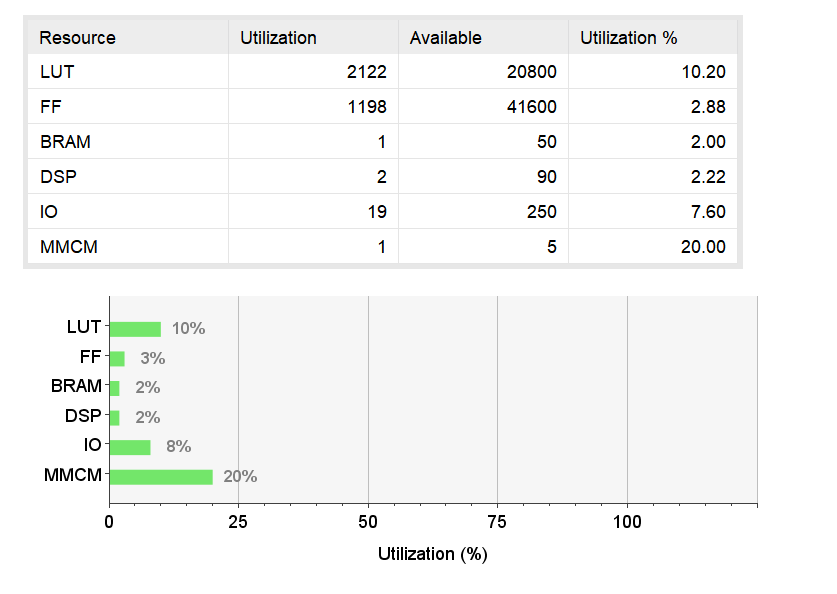
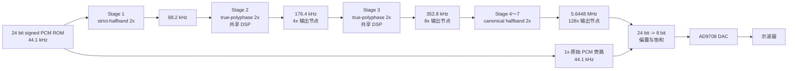
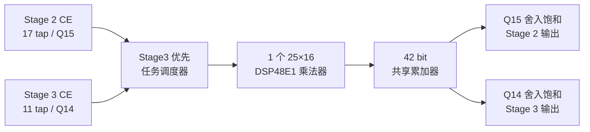

# 高阶数字插值滤波器设计与 FPGA 验证

> 当前实现版本：44.1 kHz 专用、7 级全 2x、Phase 5 Q15 紧凑舍入 ACC40<br>
> FPGA：Xilinx Artix-7 `XC7A35T-FGG484-2`<br>
> 工具：MATLAB R2023a、Vivado 2018.3<br>
> V3 实板回退提交：`6132cbb`<br>
> V3 实板回退标签：`LUT3676_DSP1_FF1106_board_successful`

本项目面向“高阶数字插值滤波器设计与验证”赛题，完成了从 MATLAB 数学建模、等波纹 FIR 设计、定点量化、bit-true 验证、RTL 编码、功能仿真、综合实现到 FPGA 板级测试的完整闭环。

当前版本输入为 **44.1 kHz、24 bit signed PCM**，经过 7 级 2 倍 FIR 插值后得到 **5.6448 MHz** 的 128 倍输出，同时提供 1 倍旁路、4 倍与 8 倍中间节点，经 AD9708 8 bit 并行 DAC 输出到示波器。Phase 5 保持 FIR 频响和有效输出序列不变，将 Stage 3 精确改写为 Q15，使 Stage 2/3 共用紧凑舍入饱和单元，并把共享累加器从 42 bit 优化为 40 bit。

## 1. 当前结论

### 1.1 核心指标

| 项目 | 赛题要求 | 当前 V4 MATLAB / RTL 结果 | 判定 |
|---|---:|---:|---|
| 输入格式 | 24 bit signed | 24 bit signed PCM | 通过 |
| 输入采样率 | 44.1 kHz | 44.1 kHz | 通过 |
| 输出采样率 | 5.6448 MHz | 5.6448 MHz | 通过 |
| 插值倍数 | 128 倍 | `2^7 = 128` | 通过 |
| 板级展示档位 | 方法不限 | 1x、4x、8x、128x | 通过 |
| 通带 | 10 Hz～20 kHz | 10 Hz～20 kHz | 通过 |
| 通带纹波 | 不超过 ±0.05 dB | 最大绝对误差约 0.00523 dB | 通过 |
| 阻带衰减 | 不低于 70 dB | 约 78.62 dB | 通过 |
| 相位 | 严格线性相位 | 群延迟波动约 `7e-12` sample | 通过 |
| MATLAB 与 RTL | 功能一致 | Stage2、Stage3 与完整链冲激/随机 PCM 均为 0 LSB | 通过 |

### 1.2 当前板级实现结果

| 项目 | 实现后结果 | XC7A35T 可用量 | 利用率 |
|---|---:|---:|---:|
| Slice LUTs | **1536** | 20800 | 7.38% |
| Slice Registers | **1181** | 41600 | 2.84% |
| DSP48E1 | **2** | 90 | 2.22% |
| Block RAM Tile | **1**，对应 2 个 RAMB18E1 | 50 | 2.00% |
| IOB | 19 | 250 | 7.60% |
| MMCM | 1 | 5 | 20.00% |
| WNS / TNS | `+44.892 ns / 0 ns` | - | 时序通过 |



当前四档 V4 板测基线为 `1817 LUT / 1182 FF / 2 DSP / 1 BRAM Tile`。Phase 5 完整重跑综合、实现和 bitstream 后降至 1536 LUT，减少 **281 LUT（约 15.5%）**；FF 减少 1，DSP 和 BRAM 不变。Phase 5 bitstream 已生成，等待四档实板复测。

### 1.3 四档实测与 Phase 5 状态

| 模式 | 理论 DA_CLK | 实测 DA_CLK | 相对误差 | DA 波形 |
|---|---:|---:|---:|---|
| 4x | 176.4 kHz | 176.37 kHz | 约 -0.017% | 正常 |
| 8x | 352.8 kHz | 352.86 kHz | 约 +0.017% | 正常 |
| 128x | 5.6448 MHz | 5.64 MHz | 约 -0.085% | 正常 |

包含 1x 的四档 V4 基线已经完成板测并提交为 `e9882fc`。Phase 5 经过固定延迟 0 LSB、多种子满幅、四档功能仿真和完整实现验证，尚需下载新 bitstream 完成最后的四档实板确认；`e9882fc` 和 `6132cbb` 均可作为回退点。

---

## 2. 赛题需求与当前设计边界

赛题要求完成插值滤波器的 MATLAB 建模与仿真、RTL 设计与功能仿真、电路规模与功耗评估，以及 FPGA 板级验证。核心指标为：

```text
输入：44.1 kHz，24 bit signed PCM
输出：176.4 kHz、352.8 kHz、5.6448 MHz
通带：10 Hz～20 kHz
通带纹波：<= ±0.05 dB
阻带衰减：>= 70 dB
相位：严格线性相位
```

1x 原始 PCM 档位是为了在示波器上直观比较“未插值、4x、8x、128x”的阶梯粗糙度而增加的展示功能，不改变赛题要求的 128 倍插值链及其指标。

仓库早期版本曾支持 44.1 kHz / 48 kHz 双采样率家族。当前分赛区决赛展示只要求 44.1 kHz，因此稳定版移除了 48 kHz MMCM 和双时钟切换逻辑，集中优化 44.1 kHz 到 5.6448 MHz 的 128 倍插值链路。

当前工程目录为：

```text
XC7A35T_interp_audio_pcm_wordlen_opt/
```

当前 Vivado 板级顶层为：

```text
board_demo_competition_dac8_top
```

---

## 3. 系统总体结构



板载 20 MHz 晶振进入 Clock Wizard，产生连续的 5.6448 MHz 音频时钟。所有 FIR 级工作在同一时钟域内，各级使用整数时钟使能 `ce2_out`～`ce128_out` 控制采样节拍，避免在 FPGA 内部生成大量派生逻辑时钟。

四档 DAC 输出节点为：

```text
1x   ：原始 PCM 旁路，44.1 kHz
4x   ：Stage 2 输出，176.4 kHz
8x   ：Stage 3 输出，352.8 kHz
128x ：Stage 7 输出，5.6448 MHz
```

---

## 4. 插值滤波器的数学原理

### 4.1 插零上采样与频谱镜像

对离散序列 `x[n]` 进行 `L` 倍插值时，先在相邻输入样本之间插入 `L-1` 个零：

$$
x_u[n] =
\begin{cases}
x[n/L], & n = 0, \pm L, \pm 2L, \ldots \\
0, & \text{其他位置}
\end{cases}
$$

插零后的频域关系为：

$$
X_u(e^{j\omega}) = X(e^{jL\omega})
$$

原频谱被压缩，并在新的奈奎斯特区间内周期性重复。插值 FIR 的任务是保留 0～20 kHz 音频通带，同时抑制插零产生的镜像。


### 4.2 为什么使用 FIR

FIR 输出为有限长度卷积：

$$
y[n] = \sum_{k=0}^{N-1} h[k]x[n-k]
$$

本项目选择 FIR 而不是 IIR，主要原因如下：

1. FIR 没有反馈路径，定点实现天然稳定。
2. 对称 FIR 可以严格实现线性相位，适合高保真音频重构。
3. 对称系数可以将乘法数量近似减半。
4. FIR 的乘加结构适合 DSP48、LUT shift-add 和时分复用 MAC。
5. MATLAB 定点模型与 RTL 更容易做逐点 bit-true 对拍。

若系数满足：

$$
h[k] = h[N-1-k]
$$

则频率响应可整理为：

$$
H(e^{j\omega}) = e^{-j\omega(N-1)/2}A(\omega)
$$

其中 `A(ω)` 为实函数，相位项只包含固定延迟，因此群延迟为：

$$
\tau_g = \frac{N-1}{2}
$$

通带内各频率分量经历相同延迟，瞬态波形不会因不同频率的延迟差异而变形。

### 4.3 为什么使用等波纹法

MATLAB 设计采用 Parks-McClellan / Remez 等波纹思想，本质上求解加权最小最大误差：

$$
\min_h \max_{\omega \in \Omega}
W(\omega)|H_d(\omega)-H(\omega)|
$$

其中：

| 符号 | 含义 |
|---|---|
| `Hd(ω)` | 理想低通响应 |
| `H(ω)` | 实际 FIR 响应 |
| `W(ω)` | 通带和阻带权重 |
| `Ω` | 参与优化的通带与阻带频率集合 |

70 dB 阻带衰减对应的线性幅度上限为：

$$
\delta_s = 10^{-70/20} \approx 3.16\times10^{-4}
$$

等波纹法将误差预算均匀分配到最危险的频率点。与海明窗、汉宁窗等窗函数法相比，在相同通带、阻带和过渡带要求下通常能用更低阶数达到指标，更适合资源敏感的 FPGA 设计。

### 4.4 为什么采用 7 级全 2x

128 可以分解为：

$$
128 = 2^7
$$

多级插值让每一级只负责抑制当前采样率下新产生的镜像。Stage 1 的过渡带最窄、滤波压力最大；随着采样率逐级升高，镜像远离 20 kHz 音频通带，后级 FIR 可以快速缩短到 7 tap。

全 2x 结构还具有以下工程优势：

1. 各级控制结构统一，便于参数化和验证。
2. 每一级都可以单独进行字长、阶数和结构优化。
3. 中间自然产生 4x、8x 展示节点。
4. 后级可利用精确半带核实现乘法器消除。
5. 相比旧 `4x + 5×2x` 方案，通带误差和阻带余量更好。

---

## 5. MATLAB 设计与最终参数

### 5.1 七级参数

| 级数 | 采样率变化 | taps | 系数格式 | 累加器 | RTL 结构 |
|---:|---|---:|---|---:|---|
| Stage 1 | 44.1 -> 88.2 kHz | 105 | 17 bit / Q15 | 42 bit | strict-halfband、单 DSP MAC、BRAM 历史 |
| Stage 2 | 88.2 -> 176.4 kHz | 17 | 16 bit / Q15 | 42 bit 共享累加器 | true-polyphase，Stage2/3 共用 DSP |
| Stage 3 | 176.4 -> 352.8 kHz | 11 | 15 bit / Q14 | 42 bit 共享累加器 | true-polyphase，Stage2/3 共用 DSP |
| Stage 4 | 352.8 -> 705.6 kHz | 7 | 精确 Q4 | 41 bit | canonical halfband shift-add |
| Stage 5 | 705.6 kHz -> 1.4112 MHz | 7 | 精确 Q4 | 39 bit | canonical halfband shift-add |
| Stage 6 | 1.4112 -> 2.8224 MHz | 7 | 精确 Q4 | 38 bit | canonical halfband shift-add |
| Stage 7 | 2.8224 -> 5.6448 MHz | 7 | 精确 Q4 | 38 bit | canonical halfband shift-add |

Stage 4～7 使用同一个精确半带核：

$$
h = \frac{1}{16}[-1,\ 0,\ 9,\ 16,\ 9,\ 0,\ -1]
$$

其乘法可精确转换为移位与加减法，不需要 DSP，也不会引入额外系数量化误差。

### 5.2 Stage 1 Pareto 搜索

Stage 1 对系统资源和阻带性能影响最大。MATLAB 同时搜索 taps、`FRAC_W`、`COEFF_W`、`ACC_W` 和严格半带结构成本，并保留三类候选：

| Profile | 目标 | 代表候选 | 总链路阻带 |
|---|---|---:|---:|
| A 保守版 | 总通带 <= 0.01 dB，总阻带 >= 75 dB，Stage1 >= 76 dB | 105 tap Q15 | 78.62 dB |
| B 系统级版 | 总通带 <= 0.01 dB，总阻带 >= 75 dB | 101 tap Q15 | 75.38 dB |
| C 比赛余量版 | 总通带 <= 0.02 dB，总阻带 >= 73 dB | 97 tap Q15 | 74.32 dB |

最终选择 105 tap Q15 保守候选。101/97 tap 只减少 1～2 次 MAC，却损失约 3～4 dB 阻带余量，不适合作为稳定展示首选。


### 5.3 当前 V4 沿用的 MATLAB 指标

| 项目 | 数值 |
|---|---:|
| Stage 1 taps | 105 |
| Stage 1 滤波相长度 | 52 |
| Stage 1 对称系数对 | 26 |
| Stage 1 真实历史长度 | 52 samples |
| Stage 1 阻带衰减 | 77.4749 dB |
| 总通带最大绝对误差 | 约 0.00523 dB |
| 总阻带衰减 | 78.6197 dB |
| 总 DC 增益 | 127.96094，理论值 128 |
| 总群延迟 | 3709 个最终输出样点 |
| 群延迟波动 | 约 `7e-12` sample |
| 线性相位 | 通过 |
| 总链路判定 | 通过 |

对应最终输出采样率，算法群延迟约为：

$$
3709 / 5.6448\text{ MHz} \approx 0.657\text{ ms}
$$

### 5.4 全 2x 设计基线频响

下图为全 2x 逐级设计得到的总链路频响。V4 没有重新设计系数：Stage 1 继续使用 V3 strict-halfband BRAM 结构，Stage 2～7 的系数和各级舍入格式也完全不变，因此 V4 的数学频响、通带纹波、阻带衰减和线性相位指标与 V3 一致。


图中四个子图依次给出通带细节、通带到阻带入口、全频段响应和群延迟平坦度。阻带最高峰低于 -70 dB 指标线，通带曲线远小于 ±0.05 dB 限制，群延迟误差接近双精度数值噪声。

---

## 6. 4x+2x 与全 2x 方案对比

### 6.1 MATLAB 指标对比

| 项目 | 旧 `4x + 5×2x` | 全 2x 初始设计 | 当前 V4 共享 DSP |
|---|---:|---:|---:|
| 输入采样率 | 44.1 kHz | 44.1 kHz | 44.1 kHz |
| 输出采样率 | 5.6448 MHz | 5.6448 MHz | 5.6448 MHz |
| 通带最大误差 | 约 0.01727 dB | 0.00730 dB | 约 0.00523 dB |
| 阻带衰减 | 70.339 dB | 77.679 dB | 78.620 dB |
| 最终采样点群延迟 | 2898 | 3325 | 3709 |
| 非零半系数估算 | 138 | 77 | Stage1 为 26 对，其余进一步结构化 |
| 主要优势 | 双采样率兼容、已有经验 | 频响余量更大 | 频响不变，板级 LUT 进一步下降 |

### 6.2 频响图对比

| 旧 4x + 5×2x | 全 2x 七级 |
|---|---|
|  |  |

旧方案已经满足赛题最低指标，但阻带只有约 0.34 dB 余量。全 2x 初始设计把阻带提升到约 77.68 dB；V3 strict-halfband Stage 1 又把最终阻带提升到约 78.62 dB。V4 只优化运算资源映射，不改变这组频响结果。

### 6.3 结构选择结论

当前不再采用旧 4x 前级，原因不是 4x 结构不可用，而是本次展示只需 44.1 kHz。全 2x 能针对每一级的真实采样率分别分配误差和字长，后级还可以统一使用 canonical halfband，从而同时取得更好的频响和更低的 FPGA 资源。

---

## 7. RTL 结构优化

### 7.1 Stage 1 strict-halfband true-polyphase

105 tap 严格半带 FIR 的中心下标为 52。总增益为 2 时，一个相位退化为纯延迟，另一个相位只保留 52 个非零系数：

$$
y[2m] = x[m-26]
$$

$$
y[2m+1] = \sum_{r=0}^{25}c[r]
\left(x[m-r]+x[m-(51-r)]\right)
$$

因此每个原始输入样点只需要 26 次对称 MAC。与旧 93 tap 显式插零结构相比：

```text
旧结构：两个输出相位约 94 次乘法，保存 93 个插零历史点
新结构：滤波相 26 次 MAC，保存 52 个真实输入点
```

### 7.2 BRAM 循环缓冲

Stage 1 使用 64 深度、24 bit 宽的双口 BRAM 循环缓冲保存 52 个有效输入样点：

1. phase0 写入当前真实输入。
2. 同时输出中心延迟相。
3. 后续 26 个周期由双口 BRAM 读取对称样点对。
4. 单个 DSP48E1 完成时分复用 MAC。
5. phase1 输出 Q15 舍入饱和后的滤波相结果。
6. BRAM 内容不做全阵列复位，`fill_count` 屏蔽启动阶段陈旧数据。

使用 BRAM 后，Stage 1 不再由大量 FF 保存历史样点，完整板级 FF 从 V2 的 3279 降到 1106。

### 7.3 Stage 2/3 true-polyphase 共享 DSP

Stage 2 和 Stage 3 不再先显式插零再进入普通 FIR，而是直接按偶相、奇相计算：

$$
y[2m+p] = \sum_r h[2r+p]x[m-r],\quad p\in\{0,1\}
$$

V3 中两个相位共享各自级内的数据通路，但系数乘法仍被综合为较大的 LUT 常系数网络。V4 保留同一组 polyphase 公式、系数与舍入方式，将 Stage 2/3 的乘法统一调度到一个 `25×16 signed` DSP48E1：

| 级数 | phase0 | phase1 | CE 到达间隔 | 最坏 MAC 数 |
|---:|---:|---:|---:|---:|
| Stage 2 | 5 MAC | 4 MAC | 32 个 5.6448 MHz 时钟 | 5 |
| Stage 3 | 3 MAC | 3 MAC | 16 个 5.6448 MHz 时钟 | 3 |

当 Stage 2/3 任务同拍到达时，调度器始终先执行速率更高的 Stage 3，再执行 Stage 2。64 拍超周期的最坏调度为：

```text
arrival=0  : Stage3 phase1，3 MAC，finish=4，deadline=8，slack=4
arrival=0  : Stage2 phase1，4 MAC，finish=9，deadline=16，slack=7
arrival=16 : Stage3 phase0，3 MAC，finish=20，deadline=24，slack=4
arrival=32 : Stage3 phase1，3 MAC，finish=36，deadline=40，slack=4
arrival=32 : Stage2 phase0，5 MAC，finish=42，deadline=48，slack=6
arrival=48 : Stage3 phase0，3 MAC，finish=52，deadline=56，slack=4
```



RTL 仿真中的 `pending overwrite` 与 `deadline miss` 断言均为 0。级间桥继续只传递 `data + valid`，共享计算引入的是固定流水延迟，不改变有效输出样点序列。

### 7.4 Stage 4～7 canonical halfband

后四级使用精确核：

```text
[-1, 0, 9, 16, 9, 0, -1] / 16
```

其中 `9x = 8x + x`，除以 16 对应算术右移，因此整个核可由加减和移位实现。四级替换后相对全 2x 稳定基线减少 1610 LUT 和 540 FF，且 MATLAB/RTL 对拍保持 0 LSB。

### 7.5 定点舍入与饱和

各级内部使用保护位累加，输出前执行有符号舍入和 24 bit 饱和。正常音频、直流、冲激和随机测试均无累加器溢出；仅在刻意构造的满幅交替或满幅随机压力输入下出现预期的 24 bit 输出饱和。

DAC 显示路径取 24 bit 数据高 8 位并加 128 偏置，转换为 AD9708 所需的无符号 8 bit 数据。`dac_data` 在 5.6448 MHz 时钟下降沿更新，AD9708 在 `dac_clk` 上升沿采样，从而留出建立时间。

---

## 8. MATLAB、bit-true 与 RTL 验证

### 8.1 bit-true 测试

| 测试向量 | 累加器溢出 | 正常输入输出饱和 | 功能判定 |
|---|---:|---:|---|
| impulse | 0 | 0 | 通过 |
| dc | 0 | 0 | 通过 |
| sine 1 kHz / -1 dBFS | 0 | 0 | 通过 |
| sine 19 kHz / -6 dBFS | 0 | 0 | 通过 |
| sine 20 kHz / -6 dBFS | 0 | 0 | 通过 |
| random PCM | 0 | 0 | 通过 |
| alternate full-scale | 0 | 压力输入下预期饱和 | 功能匹配 |
| random full-scale | 0 | 压力输入下预期饱和 | 功能匹配 |

### 8.2 完整七级 RTL 对拍

| 版本 / 测试 | MATLAB golden 点数 | 固定对齐 shift | 最大误差 | mismatch |
|---|---:|---:|---:|---:|
| V3 Stage1 FF / impulse | 40059 | 127 | 0 LSB | 0 |
| V3 Stage1 FF / random | 23675 | 127 | 0 LSB | 0 |
| V3 Stage1 BRAM / impulse | 40059 | 127 | 0 LSB | 0 |
| V3 Stage1 BRAM / random | 23675 | 127 | 0 LSB | 0 |
| **V4 shared DSP / impulse** | **40059** | **127** | **0 LSB** | **0** |
| **V4 shared DSP / random** | **23675** | **127** | **0 LSB** | **0** |

固定 `shift=127` 是 RTL 流水、CE 调度和级间 valid 传播造成的实现延迟，不是频率响应中的算法群延迟。V4 共享 DSP 没有改变链尾有效样点 shift，对齐后所有有效输出逐点完全一致。

V4 还对 Stage 2/3 中间节点进行了独立分级回归：

| 节点 | 测试 | 比较点数 | 固定 shift | 最大误差 | mismatch |
|---|---|---:|---:|---:|---:|
| Stage 2 | impulse | 2188 | 0 | 0 LSB | 0 |
| Stage 2 | random PCM | 2188 | 0 | 0 LSB | 0 |
| Stage 3 | impulse | 4375 | 0 | 0 LSB | 0 |
| Stage 3 | random PCM | 4375 | 0 | 0 LSB | 0 |

这组分级对拍证明资源下降来自运算调度和 DSP 映射，而不是删除系数、降低字长或放宽滤波指标。

### 8.3 四档 DAC 与矩阵按键仿真

`tb_demo_interp_dac8_four_mode.v` 在每档预热 10000 拍后，用固定 4096 个 5.6448 MHz 时钟周期统计 DA_CLK：

| 模式编码 | 档位 | 预期 DA_CLK 边沿 | 实测边沿 | DAC 数据变化次数 | 判定 |
|---:|---:|---:|---:|---:|---|
| 0 | 1x | 32 | 32 | 32 | PASS |
| 1 | 4x | 128 | 128 | 127 | PASS |
| 2 | 8x | 256 | 256 | 251 | PASS |
| 3 | 128x | 4096 | 4096 | 3306 | PASS |

`tb_matrix_keypad_four_mode.v` 进一步模拟矩阵电气连接、同步与消抖，SW1～SW8 依次得到模式编码 `0/1/2/3/0/1/2/3`，全部通过。两项测试的 XSim 临时文件均位于 `%TEMP%/codex_fir_interpolation/four_mode_sim/`。


上图是全 2x 稳定基线的图形化对拍，图中固定延迟为 `shift=327`；上半部分是 MATLAB golden 与 RTL 对齐波形，下半部分是逐点误差。V3 重构级间调度后固定延迟变为 `shift=127`，对应结果记录在 `stage1_strict_rtl_summary.txt` 和 `stage1_strict_bram_rtl_summary.txt` 中。两个版本对齐后的最大误差均为 0 LSB。

---

## 9. 版本演进与资源对比

### 9.1 独立插值链对比

下表只统计 128 倍插值链本身，不包含 MMCM、按键、PCM ROM、DAC 接口和板级控制逻辑。

| 版本 | 主要结构 | LUT | FF | DSP | BRAM Tile | WNS / ns | 0 LSB |
|---|---|---:|---:|---:|---:|---:|---|
| 旧 4x+5×2x | 4x polyphase + 公共 2x | 9002 | 4497 | 2 | 0 | +165.584 | - |
| 全 2x 并行基线 | 7 级直接并行 | 9376 | 4118 | 38 | 0 | +134.988 | - |
| 全 2x 稳定基线 | Stage1 单 DSP MAC | 5912 | 4218 | 1 | 0 | +165.930 | 是 |
| Phase 1 | Stage4～7 canonical | 4302 | 3678 | 1 | 0 | +165.930 | 是 |
| Phase 2 | Stage2/3 polyphase + light bridge | 3975 | 3103 | 1 | 0 | +156.988 | 是 |
| Phase 3 FF | Stage1 strict-HB + FF 历史 | 3537 | 2105 | 1 | 0 | +159.856 | 是 |
| **Phase 3 BRAM** | **Stage1 strict-HB + BRAM 历史** | **3222** | **925** | **1** | **1** | **+159.809** | **是** |
| **Phase 4 V4** | **Stage2/3 共享 DSP + Stage1 BRAM** | **1648** | **1016** | **2** | **1** | **+161.944** | **是** |
| **Phase 5 ACC40** | **Q15 紧凑舍入 + ACC40** | **1379** | **1015** | **2** | **1** | **+165.332** | **是** |

Phase 3 BRAM 相对全 2x 稳定基线：

```text
LUT：5912 -> 3222，减少 2690，下降约 45.5%
FF ：4218 ->  925，减少 3293，下降约 78.1%
DSP：1 -> 1
BRAM Tile：0 -> 1
```

Phase 4 V4 相对 Phase 3 BRAM 独立链：

```text
LUT：3222 -> 1648，减少 1574，下降约 48.85%
FF ： 925 -> 1016，增加   91，上升约  9.84%
DSP：1 -> 2
BRAM Tile：1 -> 1
WNS：+159.809 ns -> +161.944 ns
```

增加 1 个 DSP 后，Stage 2/3 常系数乘法选择网络大幅缩小。FF 小幅增加来自 pending job、相位、MAC 索引和共享调度状态寄存器，但仍低于独立链 `FF <= 1100` 的 Go 门槛。

### 9.2 完整板级版本对比

完整板级统计包含插值链、20 MHz/5.6448 MHz 时钟、PCM ROM、矩阵按键、DAC 和复位逻辑。

| 板级版本 | LUT | FF | DSP | BRAM Tile | 说明 |
|---|---:|---:|---:|---:|---|
| 全 2x 初始稳定板级 | 6426 | 4416 | 1 | 0 | 首个可板级展示的全 2x 版本 |
| V2 Phase 2 板级 | 4428 | 3279 | 1 | 0 | canonical + Stage2/3 polyphase |
| V3 BRAM 板级 | 3676 | 1106 | 1 | 1 | 已完成实板三档验证的回退基线 |
| V4 共享 DSP 三档板级 | 2122 | 1198 | 2 | 1 | 已实板验证的三档版本 |
| V4 四档板测基线 | 1817 | 1182 | 2 | 1 | 1x/4x/8x/128x 均正常，提交 `e9882fc` |
| **Phase 5 ACC40 四档板级** | **1536** | **1181** | **2** | **1** | **实现与 bitstream 通过，待实板复测** |

V3 相对全 2x 初始稳定板级：

```text
LUT：6426 -> 3676，减少 2750，下降约 42.8%
FF ：4416 -> 1106，减少 3310，下降约 75.0%
```

V3 相对 V2 Phase 2 板级：

```text
LUT：4428 -> 3676，减少 752，下降约 17.0%
FF ：3279 -> 1106，减少 2173，下降约 66.3%
```

V4 相对 V3 BRAM 板级：

```text
LUT：3676 -> 2122，减少 1554，下降约 42.27%
FF ：1106 -> 1198，增加   92，上升约  8.32%
DSP：1 -> 2
BRAM Tile：1 -> 1
```

从全 2x 初始稳定板级到 V4：

```text
LUT：6426 -> 2122，累计减少 4304，下降约 66.98%
FF ：4416 -> 1198，累计减少 3218，下降约 72.87%
DSP：1 -> 2
BRAM Tile：0 -> 1
```

这说明 V3 通过 BRAM 消除了 Stage 1 大量历史寄存器，V4 再用第 2 个 DSP 替换 Stage 2/3 的 LUT 乘法网络。两次优化针对不同资源瓶颈，可以叠加而不会改变 FIR 数学响应。

Phase 5 相对 V4 四档板测基线：

```text
LUT：1817 -> 1536，减少 281，下降约 15.5%
FF ：1182 -> 1181，减少   1
DSP：2 -> 2
BRAM Tile：1 -> 1
```

---

## 10. Vivado 实现结果

### 10.1 时序

| 指标 | 结果 |
|---|---:|
| WNS | +44.960 ns |
| TNS | 0 ns |
| Setup failing endpoints | 0 |
| WHS | +0.121 ns |
| THS | 0 ns |
| Hold failing endpoints | 0 |
| Timing constraints | 全部满足 |

当前关键音频时钟为 5.6448 MHz，板级还包含 20 MHz 矩阵按键与控制时钟。V4 实现后所有用户时序约束均满足；增加第 2 个 DSP 的目的是降低 Stage 2/3 LUT，而不是修复时序违例。与 V3 相比，WNS 从 +44.204 ns 提升到 +44.960 ns，WHS 从 +0.108 ns 提升到 +0.121 ns。

### 10.2 功耗

| 项目 | Vivado 估算 |
|---|---:|
| Total On-Chip Power | 0.168 W |
| Dynamic | 0.096 W |
| Device Static | 0.072 W |
| Junction Temperature | 25.5 °C |
| Confidence Level | Low |

当前功耗报告没有使用实测 SAIF/VCD 活动文件，只适合作为结构版本间的初步比较，不应作为精确板级功耗测量值。

### 10.3 DRC 说明

V4 实现后 DRC 为 0 Error、30 Warning：

| 规则 | 数量 | 含义 |
|---|---:|---|
| CHECK-3 | 1 | 报告达到规则显示上限 |
| DPIP-1 | 5 | 两个 DSP 的部分输入未使用内部流水寄存器 |
| DPOP-1 | 2 | 两个 DSP 的 PREG 输出流水建议 |
| DPOP-2 | 2 | 两个 DSP 的 MREG 输出流水建议 |
| REQP-1840 | 20 | 推断 RAMB18 的异步控制检查 |

这些均为性能或结构建议，不是实现错误。当前 V4 post-route setup/hold 全部通过；DPIP/DPOP 数量增加是因为设计从 1 个 DSP 增加到 2 个 DSP。若后续为 DSP 增加内部流水，必须同步调整调度时延并重新进行 bit-true 与板级回归。

---

## 11. 板级接口与操作

### 11.1 主要引脚

| 接口 | FPGA 引脚 |
|---|---|
| 20 MHz `clk` | Y18 |
| DAC `DA_CLK` | G16 |
| DAC `DA_D0..D7` | H19、E19、H18、G18、F18、G17、E17、C17 |
| 矩阵按键 `KR0..KR3` | W21、R19、T20、P19 |
| 矩阵按键 `KC0..KC3` | T21、U21、V22、W22 |
| 蜂鸣器 `BEEP-IO` | AB18，高电平关闭 |

### 11.2 15 kHz 示波器对比信号

原测试 ROM 是按 48 kHz 生成的 440 Hz、880 Hz、1760 Hz 多频音频，在当前 44.1 kHz 节拍播放时最高分量约为 1.62 kHz。信号周期相对各档 DA_CLK 很长，因此 4x、8x、128x 在示波器连线显示下都显得较平滑。

当前改为 44.1 kHz 采样、0.80FS 的 15 kHz 单正弦。147 点 ROM 正好包含 50 个完整周期，循环边界连续：

| 档位 | DA_CLK | 每个 15 kHz 周期的采样点 | 预期观感 |
|---|---:|---:|---|
| 1x | 44.1 kHz | 2.94 | 最粗糙，直接显示原始 PCM 阶梯 |
| 4x | 176.4 kHz | 11.76 | 阶梯明显 |
| 8x | 352.8 kHz | 23.52 | 明显比 4x 平滑 |
| 128x | 5.6448 MHz | 376.32 | 最平滑 |

15 kHz 仍位于 10 Hz～20 kHz 设计通带内，所以该修改只改变演示激励，不改变 FIR 系数、通带纹波或阻带衰减。

### 11.3 按键映射

| 按键 | 插值节点 | 理论 DA_CLK |
|---|---:|---:|
| SW1 或 SW5 | 1x 原始 PCM | 44.1 kHz |
| SW2 或 SW6 | 4x | 176.4 kHz |
| SW3 或 SW7 | 8x | 352.8 kHz |
| SW4 或 SW8 | 128x | 5.6448 MHz |

上电默认进入 128x 模式。矩阵按键由 20 MHz 时钟域扫描、同步和消抖，模式信号通过两级同步器进入 5.6448 MHz 音频域。1x 只旁路 DAC 显示选择器，七级插值链仍在后台连续运行，因此切换档位不需要重新锁定时钟或复位 FIR。

### 11.4 DAC 数据时序

`dac_data[7:0]` 在音频时钟下降沿更新，AD9708 在 `dac_clk` 上升沿采样。1x、4x 和 8x 模式下，`dac_clk` 分别取 CE 计数器的 44.1 kHz、176.4 kHz、352.8 kHz 分频位；128x 模式直接输出 5.6448 MHz 连续时钟。

---

## 12. 主要文件说明

### 12.1 MATLAB

| 文件 | 作用 |
|---|---|
| `matlab_fir/alt_all2x/design_all2x_interp128_compare.m` | 七级全 2x 初始设计、逐级搜索与总链路检查 |
| `matlab_fir/alt_all2x_v2/v2_02_test_canonical_halfband7.m` | Stage4～7 canonical halfband 验证 |
| `matlab_fir/alt_all2x_v2/v2_03_validate_canonical_bittrue.m` | canonical 定点验证 |
| `matlab_fir/alt_all2x_v2/v2_04_compare_canonical_rtl.m` | MATLAB/RTL 对拍 |
| `matlab_fir/alt_all2x_v2/v2_05_export_stage23_polyphase.m` | Stage2/3 true-polyphase 系数导出 |
| `matlab_fir/alt_all2x_v2/v2_07_design_stage1_strict_halfband.m` | Stage1 strict-halfband 搜索 |
| `matlab_fir/alt_all2x_v2/v2_08_validate_stage1_strict_bittrue.m` | Stage1 定点压力测试 |
| `matlab_fir/alt_all2x_v2/v3_01_select_stage1_pareto.m` | Pareto 候选选择 |
| `matlab_fir/alt_all2x_v2/v3_02_export_stage1_rtl.m` | V3 系数头文件导出 |
| `matlab_fir/alt_all2x_v2/v3_03_generate_stage1_rtl_golden.m` | Stage1 与完整链 golden 生成 |
| `matlab_fir/alt_all2x_v2/v3_04_compare_stage1_rtl.m` | FF 历史版本 RTL 对拍 |
| `matlab_fir/alt_all2x_v2/v3_05_compare_stage1_bram_rtl.m` | BRAM 历史版本 RTL 对拍 |
| `matlab_fir/alt_all2x_v4/v4_01_analyze_stage23_shared_dsp_schedule.m` | Stage2/3 共享 DSP 64 拍超周期调度分析 |
| `matlab_fir/alt_all2x_v4/v4_02_compare_shared_dsp_rtl.m` | V4 分级与完整链 0 LSB 对拍 |
| `matlab_fir/all2x_phase4_dsp_sharing_plan.md` | Phase4 Stop/Go 计划、执行记录和结果汇总 |
| `audio_data/generate_demo_sine_15k_44k1.m` | 生成 44.1 kHz / 24 bit / 15 kHz 示波器对比 ROM |

### 12.2 RTL

| 文件 / 模块 | 作用 |
|---|---|
| `board_demo_competition_dac8_top.v` | 板级顶层、时钟、复位、按键与 DAC 接口 |
| `demo_interp_dac8_audio_pcm_common.v` | PCM 输入、V4 插值链实例、节点选择与 DAC 数据转换 |
| `audio_pcm_rom_source.v` | 24 bit signed PCM ROM 输入源 |
| `demo_sine_15k_44k1_24bit_147.mem` | 147 点、50 周期、0.80FS 的 15 kHz 单正弦 |
| `all2x_v3/interp2_stage1_strict_halfband_bram_ce.v` | Stage1 strict-halfband 双口 BRAM 单 DSP MAC |
| `all2x_v3/interp128_all2x_v3_stage1_select_top_ce.v` | V3 七级公共顶层 |
| `all2x_v3/interp128_all2x_v3_strict_s1_bram_top_ce.v` | 已实板验证的 V3 BRAM 回退包装顶层 |
| `all2x_v3/all2x_v3_stage1_coeff_pkg.vh` | MATLAB 自动导出的 Stage1 Q15 系数 |
| `all2x_v4/interp2_stage23_shared_dsp_ce.v` | Stage2/3 单 DSP 时分复用调度、MAC 与双格式舍入 |
| `all2x_v4/interp128_all2x_v4_shared_dsp_top_ce.v` | 当前 V4 七级 128x 顶层 |
| `all2x_v2/interp2_stage23_polyphase_ce.v` | Stage2/3 true-polyphase 实现 |
| `all2x_v2/interp2_halfband7_shiftadd_ce.v` | Stage4～7 canonical shift-add 实现 |
| `all2x_v2/bridge_valid_only_to_interp2_ce.v` | 级间轻量 valid 桥 |
| `round_sat_q16_to24.v` | 舍入与 24 bit 饱和 |

### 12.3 V4 仿真与 Vivado 脚本

| 文件 | 作用 |
|---|---|
| `sim_1/new/all2x_v4/tb_interp128_all2x_v4_shared_dsp_ce.v` | V3/V4 并行输入，导出 Stage2、Stage3 和链尾结果 |
| `sim_1/new/all2x_v4/tb_demo_interp_dac8_four_mode.v` | 验证四档 DA_CLK 倍率和 DAC 数据变化 |
| `sim_1/new/all2x_v4/tb_matrix_keypad_four_mode.v` | 验证 SW1～SW8 的两组四档按键映射 |
| `alt_all2x_v4/vivado/synth_stage23_shared_dsp.tcl` | V4 独立链同口径综合与报告导出 |
| `alt_all2x_v4/vivado/build_board_v4_shared_dsp.tcl` | V4 板级源文件登记、综合、实现和报告自动构建 |

---

## 13. 复现步骤

### 13.1 MATLAB

首先运行全 2x 初始设计：

```matlab
cd('matlab_fir/alt_all2x');
run('design_all2x_interp128_compare.m');
```

然后在 `matlab_fir/alt_all2x_v2/` 中按顺序运行：

```text
v2_01_extract_current_baseline.m
v2_02_test_canonical_halfband7.m
v2_03_validate_canonical_bittrue.m
v2_04_compare_canonical_rtl.m
v2_05_export_stage23_polyphase.m
v2_06_compare_stage23_rtl.m
v2_07_design_stage1_strict_halfband.m
v2_08_validate_stage1_strict_bittrue.m
v3_01_select_stage1_pareto.m
v3_02_export_stage1_rtl.m
v3_03_generate_stage1_rtl_golden.m
v3_04_compare_stage1_rtl.m
v3_05_compare_stage1_bram_rtl.m
```

MATLAB 会输出频响 PNG、候选 CSV、定点 summary、Verilog 系数头文件和 RTL golden 数据。

V4 共享 DSP 验证按以下顺序执行：

```matlab
cd('matlab_fir/alt_all2x_v4');
run('v4_01_analyze_stage23_shared_dsp_schedule.m');
run('v4_02_compare_shared_dsp_rtl.m');
```

生成当前 15 kHz 示波器对比 ROM：

```matlab
cd('audio_data');
run('generate_demo_sine_15k_44k1.m');
```

其中 `v4_02_compare_shared_dsp_rtl.m` 需要先运行 V4 XSim 测试平台，RTL CSV 放在系统临时目录 `%TEMP%/codex_fir_interpolation/phase4_sim/`，不会污染仓库根目录。

### 13.2 Vivado

打开工程：

```text
XC7A35T_interp_audio_pcm_wordlen_opt/XC7A35T_interp.xpr
```

当前 `XC7A35T_interp.xpr` 已正式登记 V4 RTL、Phase 5 紧凑舍入 RTL、`all2x_v2`～`all2x_v5` include 目录和 15 kHz `.mem` 文件，不需要再次手动 Add Sources。Phase 5 构建脚本已经 Reset 并重跑 `synth_1`、`impl_1` 与 bitstream；后续手动复现时可依次执行：

```text
Run Synthesis
Run Implementation
Generate Bitstream
Open Hardware Manager
Program Device
```

为避免看到旧报告，在运行前应 Reset `synth_1` 与 `impl_1`，运行后关闭旧 Utilization 标签页并从最新 run 重新打开报告。可在综合后确认层次结构包含：

```text
u_interp128_all2x_v4_shared_dsp_top_ce
u_interp2_stage23_shared_dsp_ce
```

下载新 bitstream 后依次按下 1x、4x、8x、128x 按键，测量 `DA_CLK` 并观察 AD9708 模拟输出波形。预期频率为 44.1 kHz、176.4 kHz、352.8 kHz、5.6448 MHz，四档模拟波形应呈现从粗糙阶梯到平滑正弦的渐进差异。

---

## 14. Git 稳定基线与后续工作

已实板验证的回退版本：

```text
branch : release/regional-final-demo
commit : 6132cbb
tag    : LUT3676_DSP1_FF1106_board_successful
```

当前 V4 实现分支：

```text
codex/all2x-phase4-dsp-sharing
```

当前 Phase 5 优化分支：

```text
codex/phase5-q15-single-rounder
```

Phase 4 已增加第 2 个 DSP，由 Stage 2/3 共享，并完成以下 Stop/Go 闭环：

1. FIR 系数和 MATLAB 指标不变。
2. Stage2、Stage3 与完整链冲激/随机 PCM 对拍均为 0 LSB。
3. MAC 调度最坏 slack 为 4 拍，deadline miss 和 pending overwrite 均为 0。
4. 独立链达到 1648 LUT / 1016 FF / 2 DSP / 1 BRAM Tile。
5. 板级实现达到 2122 LUT / 1198 FF / 2 DSP / 1 BRAM Tile。
6. post-route WNS +44.960 ns、WHS +0.121 ns，时序全部通过。

V4 四档版本已完成 bitstream 和实板回归。Phase 5 在此基础上完成 Q15 单舍入、紧凑饱和和 ACC40，独立链为 1379 LUT，四档板级为 1536 LUT；固定延迟、多种子、四档功能、综合、实现和 bitstream 均已通过，目前只剩新 bitstream 的四档实板复测。详细过程见 `matlab_fir/all2x_phase5_execution_report.md`。
