# 🎧 高阶数字插值滤波器设计与 FPGA 验证

本项目面向全国大学生集成电路创新创业大赛“高阶数字插值滤波器设计与验证”任务，在 Xilinx Artix-7 `XC7A35T-FGG484-2` 上实现 24 bit PCM、44.1/48 kHz 双采样率族、4×/8×/128×可切换数字插值滤波器，并完成 MATLAB、RTL、综合、布局布线、bitstream 和物理板验证。

## 🏆 当前版本概览

当前板测通过版本基于 Vivado 2025.2，资源为 **239 LUT / 388 FF / 3 DSP48E1 / 4 RAMB18E1（2 BRAM Tile）/ 17 IO / 2 MMCM**，三级 FIR 有效字长为 **24/20/20 bit**。整板时序、DRC、RTL 回归和物理板功能均已通过。

| 项目 | 当前结果 |
|---|---:|
| 完整板级 Post-Route | **239 LUT / 388 FF / 3 DSP / 4 RAMB18E1 / 2 MMCM** |
| 插值滤波器核心 OOC | **212 LUT / 302 FF / 3 DSP / 3 RAMB18E1** |
| WNS / WHS | **+44.703 / +0.079 ns** |
| TNS / THS / DRC Error | **0 / 0 ns / 0** |
| Vectorless 功耗估计 | **0.271 W**，Medium confidence |
| RTL 回归 | **✅ Smoke 17/17 PASS；Release 17/17 PASS** |
| 物理板 | **✅ 44.1/48 kHz 两族各倍率采样率正确，DAC 波形正常** |
| 正式标签 | `nf-vivado2025.2-239lut-388ff-3dsp-2bram-24-20-20-board-pass` |

## 📋 1. 赛题要求

| 类别 | 要求 |
|---|---|
| 输入 | 24 位有符号 PCM，采样率 44.1 kHz 或 48 kHz |
| 输出 | 24 位有符号数据，支持 4×、8×、128×插值 |
| 输出采样率 | 176.4/192 kHz、352.8/384 kHz、5.6448/6.144 MHz |
| 通带 | 10 Hz～20 kHz |
| 通带纹波 | 不超过 ±0.05 dB |
| 阻带衰减 | 不低于 70 dB |
| 相位 | 严格线性相位 |
| 设计工作 | MATLAB 建模与仿真、RTL 设计与功能仿真、电路规模与功耗评估、FPGA 板级验证 |
| 优化目标 | 在满足音频质量、吞吐、时序和板级功能的条件下尽量降低 LUT、FF、DSP 和 BRAM 消耗 |

## ✅ 2. 完成情况

| 验收项目 | 完成结果 | 状态 |
|---|---|---|
| 双采样率输入 | 44.1 kHz、48 kHz 均支持 | ✅ PASS |
| 三档正式输出 | 4×、8×、128×全部实现 | ✅ PASS |
| 4×输出 | 最大通带绝对偏差 0.003022 dB；峰峰纹波 0.005714 dB；阻带 78.277 dB | ✅ PASS |
| 8×输出 | 最大通带绝对偏差 0.003447 dB；峰峰纹波 0.006162 dB；阻带 78.359 dB | ✅ PASS |
| 128×输出 | 最大通带绝对偏差 0.007605 dB；峰峰纹波 0.005733 dB；阻带 72.355 dB | ✅ PASS |
| 六工况综合门禁 | 最差通带绝对偏差 0.007844 dB；最差阻带 72.355 dB | ✅ PASS |
| 线性相位 | 冲激响应对称误差 0 LSB，相位拟合残差小于 `1e-13 rad` | ✅ PASS |
| MATLAB 与 RTL 位真 | 4×/8×/128×节点按 24/20/20 金标准逐样本 0 LSB | ✅ PASS |
| RTL 可靠性 | 复位恢复、随机停顿、动态切档、CDC、双时钟族和 RAMB18 原语测试 | ✅ 17/17 PASS |
| 实现签核 | Setup/Hold 均满足，TNS/THS=0，DRC Error=0，bitstream 成功生成 | ✅ PASS |
| 路由后六模式 | 44.1 kHz 族约 176.4/352.8/5644.8 kHz；48 kHz 族约 192/384/6144 kHz，DAC 数据持续变化且无 X | ✅ PASS |
| 物理板 | 用户实测各档采样率正确，DAC 输出波形正常 | ✅ PASS |

板级测试还保留 1×直通档用于调试和输入波形观察，但全国赛正式指标与六模式回归均按“两种采样率族 × 4×/8×/128×”统计。

### 🔬 2.1 验证方法与结果

- MATLAB：滤波器设计、频响、相位、六工况、单音频谱和有限字长金标准。
- 定向RTL：各级FIR、桥接量化、历史RAM、CIC连续/停顿/复位、双时钟族、按键和CDC。
- 全链RTL：冲激、10个固定随机种子、正/负满量程、−1 dBFS强信号，4×/8×/128×逐样本0 LSB。
- 动态可靠性：8类复位恢复、10次不停机动态切档、1200次CDC原子提交和100次时钟族切换压力。
- 工具签核：综合、布局布线、Setup/Hold、DRC/CDC、功耗估算和bitstream。
- 路由后验证：两种采样率族的六个正式档位均检查输出边沿、DAC数据变化和X传播。
- 物理板：用户已确认当前239-LUT/3-DSP版各档采样率正确且DAC输出波形正常。

相关文档：

- 🧠 [三项核心结构创新](matlab_fir/national_finals/reports/项目三项核心结构创新详细说明报告.md)
- 🧪 [创新验证与消融实验](matlab_fir/national_finals/reports/创新点验证实验报告.md)
- 📊 [定点、频响与实现补充测试](matlab_fir/national_finals/reports/test_report.md)
- ✅ [239-LUT 物理板验证记录](XC7A35T_interp_opt_2025.2/tools/vivado_2025_2/results/active_239lut_3dsp/BOARD_PASS.md)
- 🛠️ [MATLAB/RTL 技术档案与复现入口](matlab_fir/national_finals/README.md)

### 📷 2.2 验证图片

#### 🌐 百兆以太网实时回传验证

独立网络测量工程通过 RTL8211E PHY 的 100BASE-TX/RGMII 接口建立双向 UDP 链路：上位机从
UDP 4001 端口上传 24-bit 测试波形，FPGA 完成正式插值数据通路处理，在 AD9708 截位前抓取
24-bit 数字节点，再从 UDP 4000 端口分包回传。上位机依据事务编号和样点索引重组数据，完成
时域、频谱、频率响应与冲激响应分析。

```text
PC测试波形 ──UDP 4001──> 100BASE-TX PHY/RGMII ──> FPGA插值滤波器
                                                        │
PC分析界面 <──UDP 4000── 帧封装与样点索引 <── DAC前24-bit数字节点
```

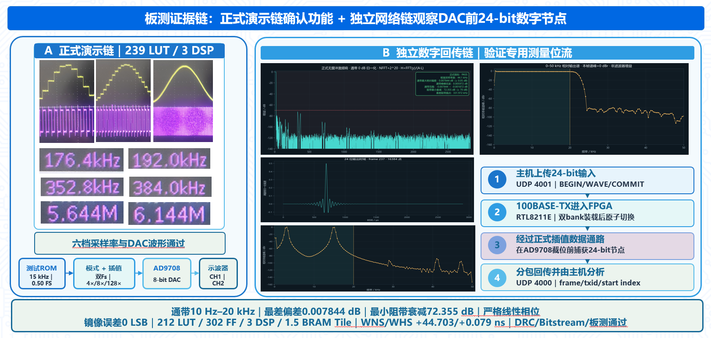

| 正式链输出频谱 | 0～50 kHz 频率响应 |
|---|---|
| 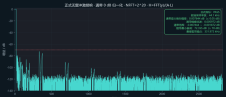 | 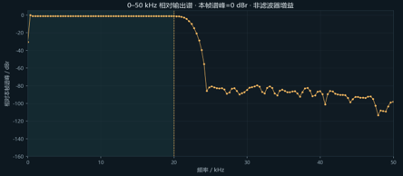 |

| 24-bit 冲激响应 | 3 kHz + 15 kHz 双音频谱响应 |
|---|---|
| 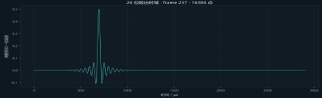 | 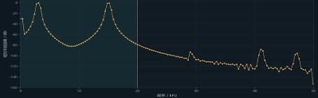 |

百兆以太网链验证的是 AD9708 截位前 24-bit 内部数字节点和网络传输协议；物理 DAC 输出仍由
示波器板测验证。网络测量功能位于独立的
[`XC7A35T_interp_LUTmin_df/network_capture`](XC7A35T_interp_LUTmin_df/network_capture) 工程，不计入
239-LUT / 3-DSP 正式演示链的资源统计。

#### ⏱️ 六档输出采样率实测

| 44.1 kHz 输入族 | 44.1 kHz 输入族 | 44.1 kHz 输入族 |
|---|---|---|
| **4×：176.4 kHz**<br>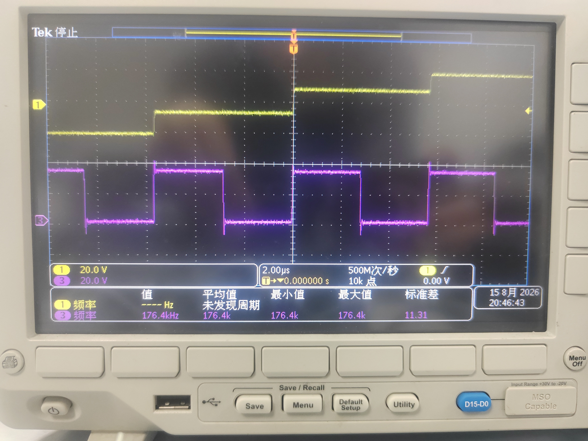 | **8×：352.8 kHz**<br>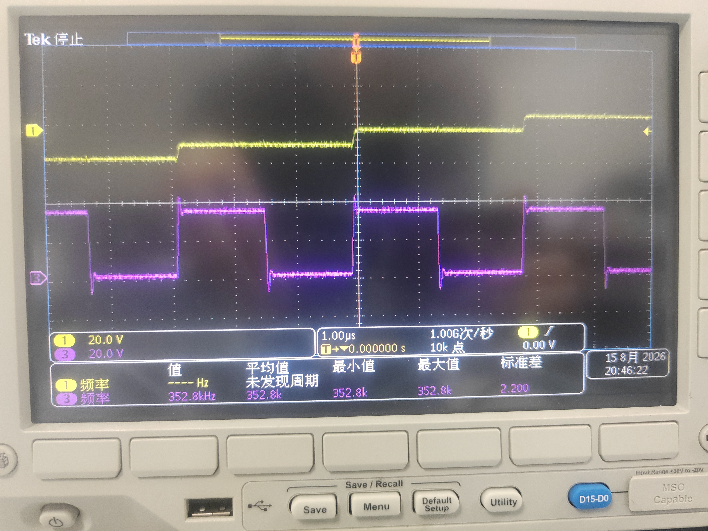 | **128×：5.6448 MHz**<br>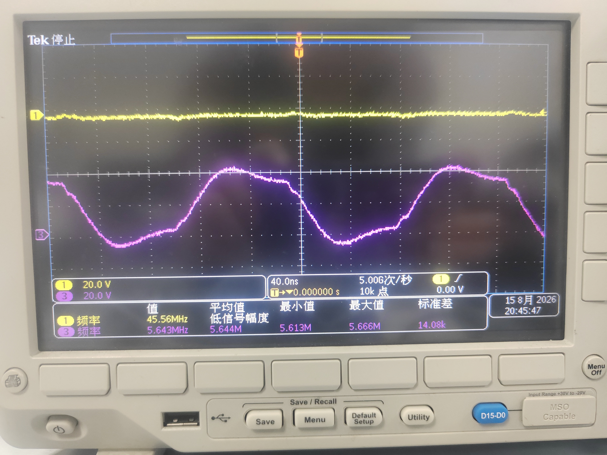 |

| 48 kHz 输入族 | 48 kHz 输入族 | 48 kHz 输入族 |
|---|---|---|
| **4×：192 kHz**<br>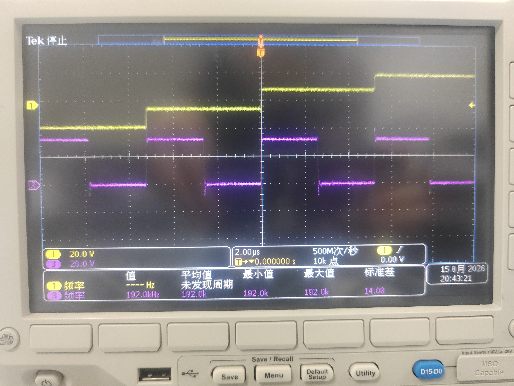 | **8×：384 kHz**<br>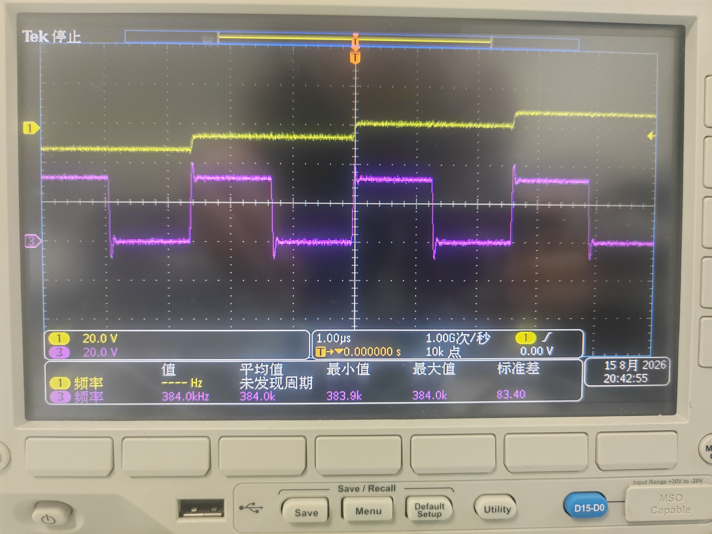 | **128×：6.144 MHz**<br>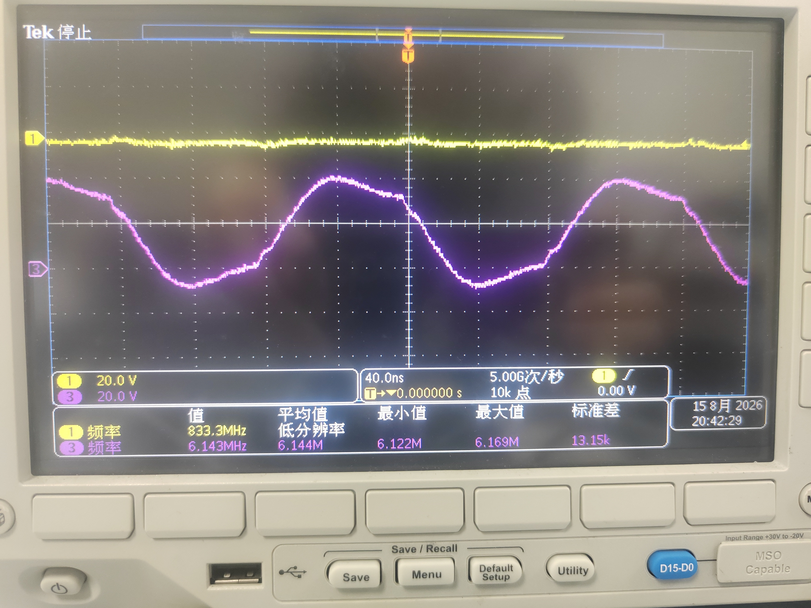 |

<details>
<summary><strong>🩺 展开查看 1×诊断档采样率</strong></summary>

| 44.1 kHz 直通诊断档 | 48 kHz 直通诊断档 |
|---|---|
| 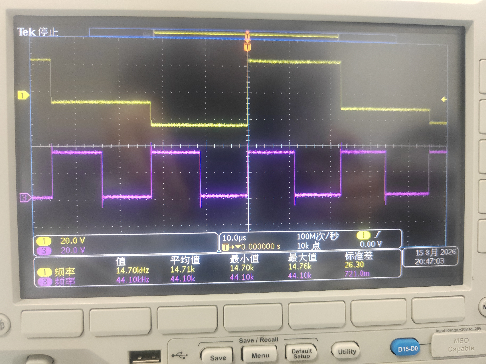 | 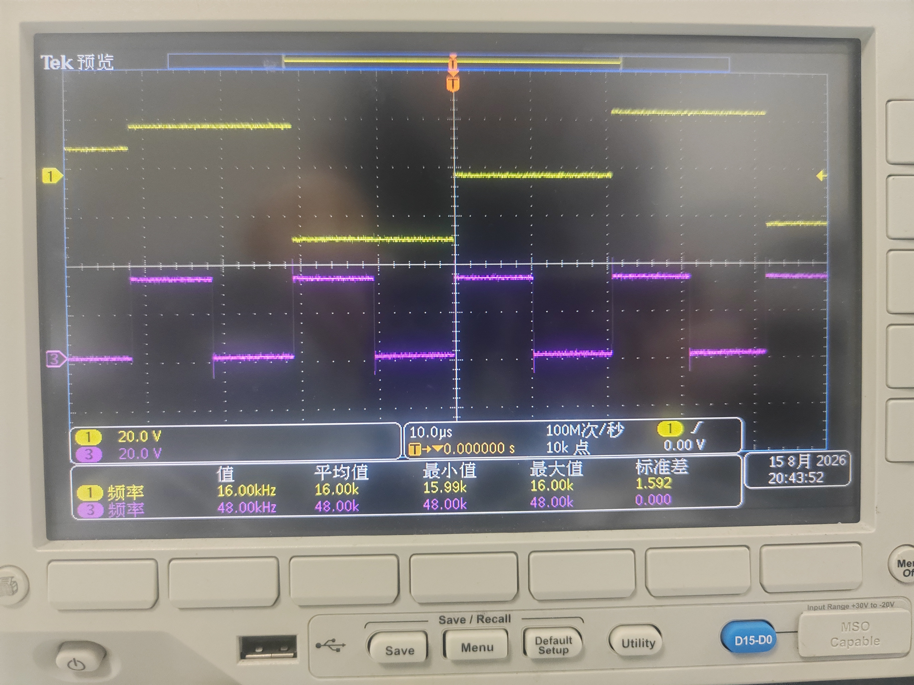 |

1×仅用于输入时钟和原始阶梯波形诊断，不计入全国赛 4×/8×/128×正式输出档位。

</details>

#### 🌊 插值倍率与 DAC 阶梯波形

| 1×诊断档 | 4×正式档 |
|---|---|
| 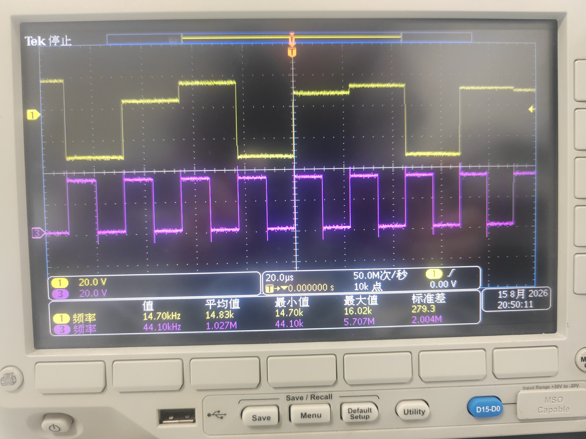 | 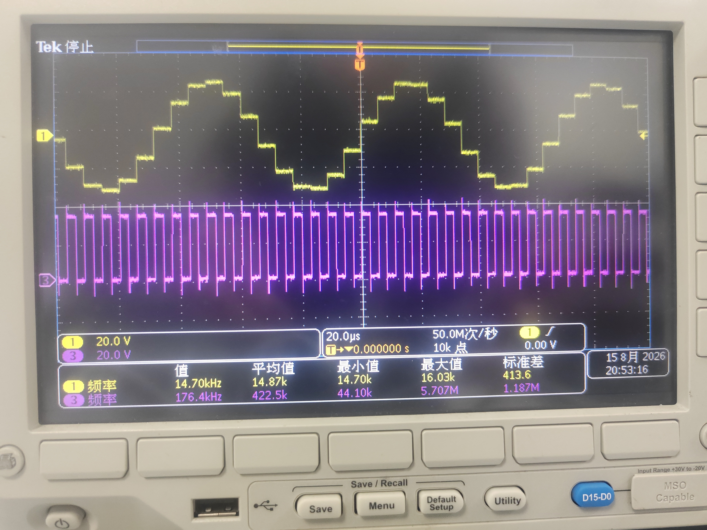 |

| 8×正式档 | 128×正式档 |
|---|---|
| 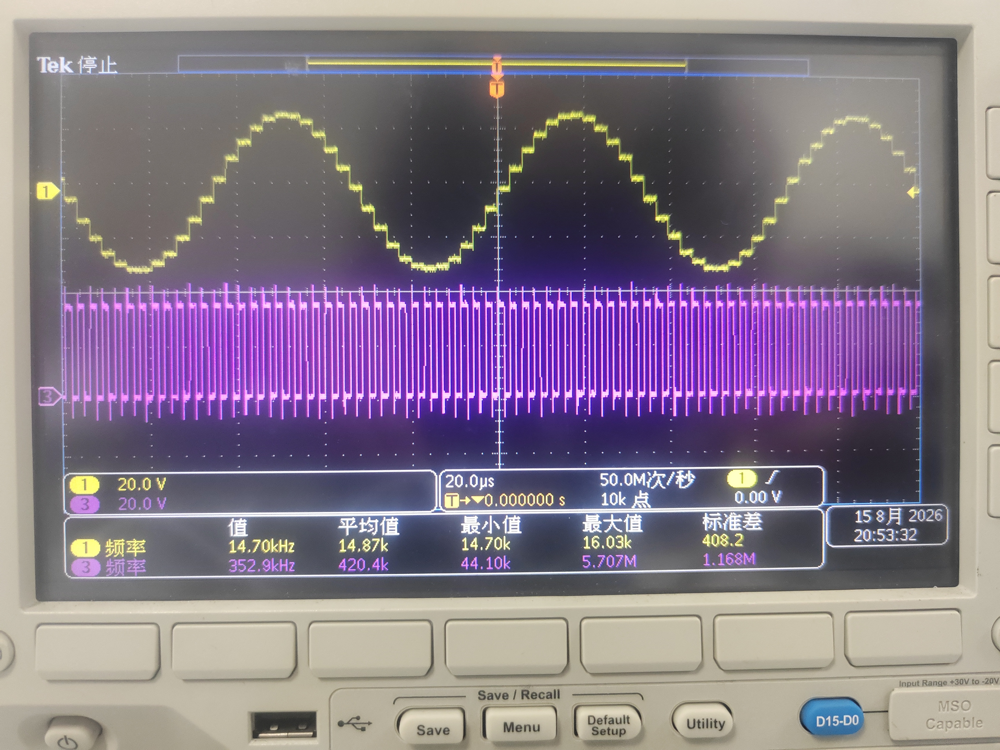 | 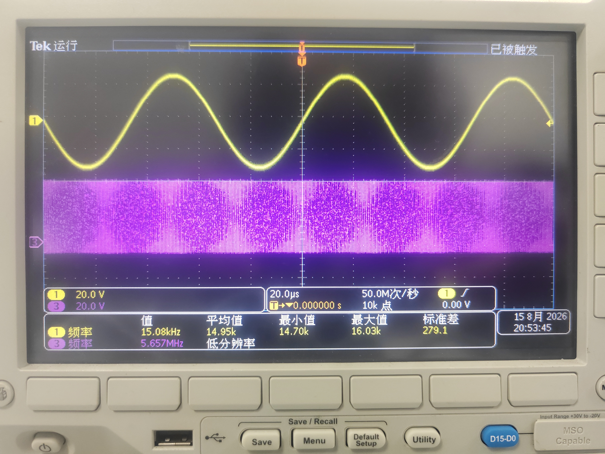 |

随着插值倍率提高，DAC 更新点显著增密；128×档在示波器观察下已呈现连续正弦轮廓。紫色通道为
`DA_CLK`，黄色通道为 DAC 输出观测波形。

## 🎛️ 3. 主要功能

- 支持 44.1 kHz 和 48 kHz 两套音频时钟族，分别得到准确的 128×连续音频时钟。
- 支持运行时选择 4×、8×和128×输出，切档采用跨时钟域请求/应答与静音窗口，避免半帧切换和状态撕裂。
- 4×和8×从 FIR 中间节点直接输出；128×在8×节点后通过16倍 CIC 扩展到最高采样率。
- 三级 FIR 全部采用对称线性相位系数，128×路径的 CIC 通带下垂补偿折叠进 Stage3 系数 bank。
- 内置双采样率测试音 ROM、矩阵键盘模式控制、复位与锁定保护、8 bit AD9708 DAC 接口。
- 对关键内部节点提供位真验证入口，覆盖冲激、随机、满量程和强音频激励。

## 🧩 4. 实现方法

### 🔗 4.1 总体结构

```text
24-bit PCM @ 44.1/48 kHz
        │
        ▼
Stage1：2× FIR，24 bit，单 RAMB18E1 历史 + 顺序 MAC
        │ 2×
        ▼
Stage2：2× FIR，20 bit ───────────────► 4×输出
        │
        ▼
Stage3：2× FIR，20 bit，平坦/补偿系数按任务选择 ─► 8×输出
        │
        ▼
CIC：Hold16 等效 N3 结构，21 bit 输入、20 bit 输出
        │
        └─────────────────────────────► 128×输出
```

三级 FIR 的正式有效字长为：

```text
Stage1：24 bit
Stage1→Stage2：右移4 bit并饱和到20 bit
Stage2：20 bit
Stage2→Stage3：20 bit同宽传输，SHIFT_N=0
Stage3：20 bit；补偿路径保留1 bit余量，以21 bit送入CIC
```

### 🧮 4.2 FIR 与系数实现

- Stage1 使用一个 64×24 bit RAMB18E1 保存52个有效历史样本，52个展开系数按顺序完成串行 MAC。
- Stage2/Stage3 共享一套 MAC 调度器、一颗 DSP48E1、历史 RAM 读口和系数 RAM 读口。
- Stage2/Stage3 系数放入统一 BRAM，通过 stage、phase 和平坦/补偿模式选择 bank。
- Q15 舍入、符号扩展检查和饱和尽量放入 DSP48E1 的空闲拍、PREG 和 `PATTERNDETECT` 路径，减少 Fabric 宽比较器和多路选择器。

### ⚙️ 4.3 CIC 与资源映射

- 8×到128×采用16倍插值 CIC，使用严格 Hold 等效重构删除一对 comb/integrator 算子。
- 当前3-DSP平衡版中，三级 FIR 使用2颗 DSP，CIC 使用1颗 DSP，其余加减与积分状态映射到 LUT/CARRY4。
- 同一24/20/20数值规格还保留4/3/2-DSP三档 Pareto 配置，改变的是 DSP/CARRY 映射，不改变滤波系数和输出采样率。

### ⏱️ 4.4 时钟、切档与板级输出

- 两颗 MMCM 分别生成44.1 kHz族和48 kHz族的128×音频时钟。
- 模式控制采用原子 CDC 握手；模式只在安全窗口提交，复位释放和 MMCM lock 参与输出保护。
- DAC 时钟由 ODDR 输出，DAC 数据寄存到 IOB，完整 XDC 对 Setup、Hold、CDC bus-skew 和异步时钟组进行约束。

## 📊 5. 优化结果

### 🥇 5.1 当前正式完整系统

| 资源/指标 | 使用量 | 器件可用量 | 利用率或结论 |
|---|---:|---:|---:|
| LUT | **239** | 20800 | 1.15% |
| FF | **388** | 41600 | 0.93% |
| DSP48E1 | **3** | 90 | 3.33% |
| RAMB18E1 | **4** | 100 | 4.00% |
| BRAM Tile | **2** | 50 | 4.00% |
| IO | **17** | 250 | 6.80% |
| MMCM | **2** | 5 | 40.00% |
| WNS / WHS | **+44.703 / +0.079 ns** | — | Setup/Hold PASS |
| 总/动态/静态功耗 | **0.271/0.199/0.072 W** | — | Vectorless，Medium confidence |

### 🔍 5.2 插值滤波器核心 OOC

| 统计边界 | LUT | FF | DSP | RAMB18E1 | 包含内容 |
|---|---:|---:|---:|---:|---|
| 正式完整板级 | 239 | 388 | 3 | 4 | 滤波器、测试音ROM、控制、时钟、DAC和IO包装 |
| 正式滤波核心 OOC | **212** | **302** | **3** | **3** | 三级2× FIR、量化桥、16× CIC和核心控制 |

OOC 数据来自把 `interp128_all2x_v7_folded_fir_cic_top_ce` 作为独立顶层的同版本实现。它适合在论文和答辩中报告“滤波器核心资源”；239 LUT 是可直接下载运行的“完整系统资源”。两者不能简单相减后把差值称为精确外围面积，因为综合层次、跨模块合并和常量传播边界不同。

### ⚖️ 5.3 资源 Pareto

| 目标 | LUT | FF | DSP | RAMB18E1 | WNS/WHS | 状态 |
|---|---:|---:|---:|---:|---:|---|
| LUT优先 | **218** | **365** | 4 | 4 | +45.279/+0.079 ns | RTL、实现、bitstream、物理板通过 |
| **当前平衡版** | **239** | **388** | **3** | 4 | +44.703/+0.079 ns | **RTL、实现、bitstream、物理板通过** |
| DSP优先 | **268** | **417** | 2 | 4 | +44.389/+0.078 ns | RTL、实现和bitstream通过；工具验证 |

3-DSP版相对4-DSP版以21 LUT和23 FF换取1个DSP；2-DSP版相对3-DSP版再以29 LUT和29 FF换取1个DSP。当前选择239/3-DSP作为主版本，是在LUT、FF、DSP和板测成熟度之间的平衡点。

## 💡 6. 三项核心创新

### ① 历史样本 RAM 循环读写与跨级合并

传统移位寄存器每来一个新样本都要搬移整段历史。本设计让数据写入后保持不动，只移动环形指针：

```text
addr(k) = (head - k) mod 2^A
```

Stage1 用单个 RAMB18E1 顺序读取52个历史样本；Stage2/Stage3 则通过最高地址位划分 bank，把两级历史放进同一 RAMB18E1。任务启动时锁存历史头指针，保证 MAC 期间窗口不被新输入撕裂。与分立历史结构相比，该方法把完整板级 BRAM 从3 Tile降到2 Tile，代价是少量调度逻辑。

### ② 基于确定性截止期的乘加资源共享

音频采样率远低于 FPGA 系统时钟，直接为每个抽头复制乘法器会让大量硬件长期空闲。本设计按最坏时隙而不是平均吞吐安排任务：

- Stage1 在相邻输出使能之间完成52拍顺序 MAC 和尾部舍入/饱和；
- Stage2/Stage3 在32拍超帧内共享一颗 DSP，并用任务快照固定 stage、phase、历史 head 和补偿模式；
- DSP 空闲拍继续承担Q15舍入、溢出判断和饱和提交；
- RTL deadline 断言保证下一任务到达前所有读返回和尾状态已经清空。

在当前完整系统中，三级 FIR 只使用2颗 DSP；这不是简单“用一颗DSP慢慢算”，而是具有最坏周期上界、RAM端口仲裁和动态切档原子性的确定性共享协议。

### ③ CIC 插值链的严格 Hold 等效重构

利用多速率恒等式，将一对：

```text
低速 comb → ↑16 → 高速 integrator
```

严格等效为16拍保持器 `Hold16`。因此N3 CIC可重构为：

```text
低速 comb² → Hold16 → 高速 integrator²
```

在保持前三级FIR、24/20/20字长、器件和约束不变的同口径OOC消融中，旧N3结构为188 LUT / 280 FF / 5 DSP / 3 RAMB18E1，Hold结构为190 LUT / 279 FF / 4 DSP / 3 RAMB18E1，即以2 LUT换掉1 DSP，并完成53,760个输出样点的data/valid逐拍0 LSB验证。需要准确表述：Hold恒等式本身属于已有多速率理论，本项目的贡献是其面向双采样率、多档输出、有限字长和可切换音频链的RTL化、资源映射与完整验证闭环。

## ⚠️ 7. 设计难点

1. **高倍率与中间输出并存**：4×、8×必须保持平坦响应，128×又需要补偿CIC通带下垂，不能简单把所有补偿放在公共前级。
2. **严格有限字长**：Stage2从22 bit收窄到20 bit后，历史RAM、DSP输入、饱和判据、桥接移位和MATLAB金标准必须同步修改，不能只截短一个端口。
3. **共享资源的最坏时序证明**：Stage2/Stage3共享DSP和RAM后，既要满足最高档吞吐，又要覆盖同步RAM一拍延迟、尾部舍入和动态切档。
4. **BRAM语义与板级一致性**：行为仿真通过不代表RAMB18 INIT和READ_FIRST语义一定正确；历史上曾出现Packed-ROM高位初始化未固化、实现资源更低但DAC无输出的失效版本，因此增加了原语级和路由后DAC活动门禁。
5. **双时钟族与CDC**：44.1/48 kHz族切换涉及MMCM锁定、异步请求、应答、静音和模式提交，必须避免组合时钟切换和多位模式撕裂。
6. **综合数字不等于可用设计**：部分候选虽然LUT更低，却存在标度错误、ROM地址锁死或吞吐冲突；只有通过位真、实现、bitstream和板测的版本才进入正式结论。


## 🗂️ 8. 版本与优化参数迭代

### 📌 8.1 结构演进关键节点


| 版本 | 工具/口径 | LUT | FF | DSP | BRAM Tile | 主要变化 | 状态 |
|---|---|---:|---:|---:|---:|---|---|
| 原始全并行七级2×链 | 2018.3核心消融 | 9376 | 4118 | 38 | 0 | 每级、每抽头并行展开 | MATLAB/RTL历史基线 |
| 优化全2×链 | 2018.3核心消融 | 1224 | 867 | 2 | 1 | 时分复用、halfband、共享MAC、BRAM历史、混合字长 | 工具验证 |
| 区域赛FIR-CIC最终版 | 2018.3单采样率板级 | 472 | 564 | 8 | 3 | 44.1 kHz、128×单族板级闭环 | **板测通过** |
| 全国赛功能基线 | 2018.3双采样率板级 | 602 | 616 | 8 | 3 | 增加48 kHz族及4×/8×/128×正式输出 | 工具验证 |
| 全国赛6-DSP CIC基线 | 2018.3双采样率板级 | 573 | 621 | 6 | 3 | CIC后级用LUT/CARRY替换部分DSP | 工具验证 |
| 全国赛全2×最低LUT | 2018.3双采样率板级 | 714 | 662 | 3 | 3 | 全部采用2×FIR，不使用CIC | 工具验证；面积高于FIR-CIC |
| 440-LUT锚点 | 2018.3双采样率板级 | 440 | 464 | 6 | 3 | 字长、共享和实现策略联合优化 | 工具验证 |
| Route 1 | 2018.3双采样率板级 | 424 | 471 | 6 | 3 | 统一双端口系数RAM | **存在8×/128×标度缺陷，撤销** |
| P1真Q15修复 | 2018.3双采样率板级 | 446 | 471 | 5 | 3 | 修复Stage3 Q14/Q15约−6.02 dB错误 | 工具验证 |
| P4-A Hold CIC | 2018.3双采样率板级 | 491 | 444 | 4 | 3 | CIC严格Hold等效，减少1 DSP | 工具验证 |
| P4-D发布闭环 | 2018.3双采样率板级 | 479 | 468 | 4 | 2 | 统一历史、固定CE精简、完整Release与CDC约束 | 工具验证 |
| P3-K Packed-ROM/指针旧版 | 2018.3双采样率板级 | 424/412 | 431/418 | 4 | 2 | 用BRAM高位保存ROM下一地址 | **RAM初始化未固化，DAC无输出，撤销** |
| P3-K DAC-ROM修复 | 2018.3双采样率板级 | 427 | 416 | 4 | 2 | 恢复显式ROM地址计数 | **板测通过** |
| P3-M Stage1 DSP寄存 | 2018.3双采样率板级 | 368 | 386 | 4 | 2 | 历史操作数进入DSP48 AREG | **板测通过** |
| P3-R DSP空闲拍量化 | 2018.3双采样率板级 | 348 | 386 | 4 | 2 | DSP接管Stage2/3舍入与饱和 | **板测通过** |
| P3-T Stage1 DSP尾处理 | 2018.3双采样率板级 | 341 | 381 | 4 | 2 | Stage1 DSP承担尾周期饱和并派生历史基址 | **板测通过** |
| P3-U控制精简 | 2018.3双采样率板级 | 333 | 382 | 4 | 2 | Johnson键盘消抖、CDC settle token | 工具验证 |
| Vivado 2025.2迁移基线 | 2025.2双采样率板级 | 292 | 376 | 4 | 2 | 同一正式RTL迁移及IP升级 | **板测通过** |

### 🚀 8.2 Vivado 2025.2 等价结构与字长优化

| 版本 | LUT | FF | DSP | BRAM Tile | 相对前一关键版本 | 主要方法 | 状态 |
|---|---:|---:|---:|---:|---|---|---|
| 迁移基线 | 292 | 376 | 4 | 2 | — | Vivado 2025.2正式工程 | **板测通过** |
| 策略检查点 | 285 | 376 | 4 | 2 | −7 LUT | 综合/实现策略小范围扫描 | 工具验证 |
| SHREG检查点 | 284 | 379 | 4 | 2 | −1 LUT，+3 FF | 调整短移位寄存器映射 | 工具验证 |
| DSP抽头门控 | 276 | 379 | 4 | 2 | −8 LUT | 以DSP PREG CE替代宽数据/零MUX | **板测通过** |
| Stage1顺序抽头 | 258 | 376 | 4 | 2 | −18 LUT，−3 FF | 系数展开到BRAM空闲区，52拍单地址MAC | **板测通过** |
| CIC DSP角色交换 | 249 | 377 | 4 | 2 | −9 LUT，+1 FF | comb进入DSP，第一级积分器转CARRY4 | **板测通过** |
| Stage1延迟CE | 239 | 377 | 4 | 2 | −10 LUT | 用中心抽头有效不变量以CE替代24-bit MUX | **板测通过** |
| 控制合并 | 234 | 369 | 4 | 2 | −5 LUT，−8 FF | 合并索引、共享phase、原子提交切档 | **板测通过** |
| Routed不变量复用 | 221 | 367 | 4 | 2 | −13 LUT，−2 FF | ACK兼任seen、复用pending、删除常量valid门控 | **板测通过** |
| 24/20/20有限字长 | **218** | **365** | 4 | 2 | −3 LUT，−2 FF | Stage2由22降到20 bit并重建金标准 | **板测通过，LUT优先点** |
| **当前3-DSP平衡版** | **239** | **388** | **3** | **2** | 相对218：+21 LUT/+23 FF/−1 DSP | CIC积分器DSP模式1 | **板测通过，当前主版本** |
| 2-DSP Pareto | 268 | 417 | 2 | 2 | 相对239：+29 LUT/+29 FF/−1 DSP | CIC积分器DSP模式0 | 工具验证 |

### 🧾 8.3 当前配置参数

| 参数 | 正式值 |
|---|---|
| FPGA | `xc7a35tfgg484-2` |
| Vivado | 2025.2 |
| 顶层 | `board_demo_competition_dac8_top` |
| Stage1/Stage2/Stage3 | `24/20/20 bit` |
| Stage1累加器 | 41 bit |
| Stage2/3累加器 | 38 bit |
| Stage3补偿输出 | 21 bit |
| CIC倍率/阶数 | 16× / N=3 Hold等效结构 |
| CIC输出 | 20 bit |
| Stage1历史 | 单RAMB18E1环形缓冲 |
| Stage2/3历史 | bank化统一RAMB18E1 |
| FIR DSP | Stage1一颗，Stage2/3共享一颗 |
| CIC DSP模式 | `USE_NATIONAL_FINALS_CIC_INTEGRATOR_DSP_MODE=1` |
| 系数与量化 | Q15，确定性舍入与饱和 |
| 正式输出 | 4× / 8× / 128× |
| 发布状态 | RTL、实现、bitstream和物理板通过 |

正式工程位于 [`XC7A35T_interp_opt_2025.2`](XC7A35T_interp_opt_2025.2)，MATLAB与验证脚本位于 [`matlab_fir/national_finals`](matlab_fir/national_finals)。

## 📁 9. 根目录与文件说明

### 🧭 9.1 根目录总览

| 目录 | 主要用途 |
|---|---|
| [`audio_data`](audio_data) | 测试音频、WAV预览、PCM/MEM转换和测试正弦生成 |
| [`images`](images) | 六档采样率、DAC 波形、数字频响、频谱和冲激响应验证图片 |
| [`matlab_fir`](matlab_fir) | MATLAB滤波器设计、全2×与FIR-CIC架构实验、有限字长、黄金向量、RTL回归和Vivado结果 |
| [`need`](need) | 板卡引脚对照表等现场需要的辅助资料 |
| [`XC7A35T_interp_DSP3_LUT239_2025.2`](XC7A35T_interp_DSP3_LUT239_2025.2) | 清理后的239 LUT / 388 FF / 3 DSP正式交付工程，包含板测bitstream和核心OOC入口 |
| [`XC7A35T_interp_LUTmin_df`](XC7A35T_interp_LUTmin_df) | 插值器加100BASE-TX、UDP上传/抓取和PySide6上位机的板级数字测量工程 |
| [`XC7A35T_interp_LUTmin218_DSP4_2025.2`](XC7A35T_interp_LUTmin218_DSP4_2025.2) | 218 LUT / 365 FF / 4 DSP最低LUT板测工程 |
| [`XC7A35T_interp_opt_2025.2`](XC7A35T_interp_opt_2025.2) | 当前239 LUT / 388 FF / 3 DSP主工作工程，保留完整构建、实验、报告和结果 |
| `.git` | Git版本库对象、分支、提交和标签 |

### 🎯 9.2 Vivado 2025.2 工程版本说明

| 使用场景 | 应打开的工程 | 关键配置/资源 |
|---|---|---|
| 最终答辩、提交和下载板测通过位流 | [`XC7A35T_interp_DSP3_LUT239_2025.2/XC7A35T_interp.xpr`](XC7A35T_interp_DSP3_LUT239_2025.2/XC7A35T_interp.xpr) | 24/20/20，239 LUT / 388 FF / 3 DSP / 2 BRAM Tile |
| 修改RTL、重新运行综合实现、复现OOC或继续实验 | [`XC7A35T_interp_opt_2025.2/XC7A35T_interp.xpr`](XC7A35T_interp_opt_2025.2/XC7A35T_interp.xpr) | 当前主工作工程，CIC DSP模式1 |
| 展示最低LUT结果 | [`XC7A35T_interp_LUTmin218_DSP4_2025.2/XC7A35T_interp.xpr`](XC7A35T_interp_LUTmin218_DSP4_2025.2/XC7A35T_interp.xpr) | 218 LUT / 365 FF / 4 DSP / 2 BRAM Tile |
| 通过以太网上传任意波形并抓取DAC前24-bit数字节点 | [`XC7A35T_interp_LUTmin_df/XC7A35T_interp.xpr`](XC7A35T_interp_LUTmin_df/XC7A35T_interp.xpr) | 插值器+网络测量系统；配合 `network_capture/host/gui_app.py` 图形化上位机 |

239/3-DSP交付工程和当前主工作工程的滤波配置相同。前者经过清理，适合提交；后者保留更多构建脚本、历史结果和结构实验，适合开发。218/4-DSP工程是另一资源Pareto点，不能仅根据两者都出现“LUTmin”而混用bitstream或报告。网络工程增加了MAC、ARP、UDP、上传RAM和抓取RAM，其资源不能和纯滤波工程直接比较。

### 🧱 9.3 Vivado 工程内部目录

四个工程的基础结构相似，下表说明目录和文件的通用作用：

| 路径/文件 | 作用 |
|---|---|
| `XC7A35T_interp.xpr` | Vivado工程入口，保存器件、顶层、源文件集、泛型、IP和Run策略 |
| `XC7A35T_interp.srcs/sources_1/new` | 手写综合RTL、MEM初始化文件和各代结构源码 |
| `XC7A35T_interp.srcs/constrs_1/new/*.xdc` | 引脚、电平标准、时钟、异步时钟组、DAC时序和CDC bus-skew约束 |
| `XC7A35T_interp.srcs/sim_1/new` | XSim测试平台、专项等价测试、全链位真和动态切档测试 |
| `tools/vivado_2025_2` | 工程准备、完整构建、低内存综合、GUI修复、结构扫描和结果归档脚本 |
| `tools/vivado_2025_2/core_ooc` | 把插值滤波器核心作为独立顶层综合/实现并统计核心资源 |
| `tools/vivado_2025_2/results` | 已签核bitstream、DCP、资源、时序、DRC、功耗和配置身份 |
| `CLEANUP_MANIFEST.md` | 工程定位、保留/移出内容、备份位置和正式构建身份 |
| `VERILOG_COMMENT_AUDIT.md` | RTL中文注释、自包含引用和Vivado编译审计结果 |
| `DEMO_RESULTS.md`、`optimization_exploration_report.md` | 演示结果和历史优化过程摘要 |
| `.Xil`、`*.cache`、`*.gen`、`*.runs`、`*.sim`、`*.hw`、`*.ip_user_files`、`xsim.dir` | Vivado/XSim自动生成的缓存、综合网表、实现结果和仿真快照，可由工程重新生成 |
| `vivado.log/.jou`、`xelab.*`、`xvlog.*`、`hs_err_pid*.log` | Vivado、XSim和Java崩溃/运行日志，不是设计输入 |

### 🧩 9.4 正式 RTL 关键文件

下列路径以当前主工作工程为例；239交付版和218回退版中存在对应文件，但工程泛型和CIC DSP映射不同。

| 文件 | 作用 |
|---|---|
| [`board_demo_competition_dac8_top.v`](XC7A35T_interp_opt_2025.2/XC7A35T_interp.srcs/sources_1/new/board_demo_competition_dac8_top.v) | FPGA板级顶层，连接20 MHz时钟、MMCM、按键、插值器和AD9708 DAC |
| [`demo_interp_dac8_audio_pcm_common.v`](XC7A35T_interp_opt_2025.2/XC7A35T_interp.srcs/sources_1/new/demo_interp_dac8_audio_pcm_common.v) | 板级公共封装，选择数据源、倍率、正式全国赛数据通路和DAC数据 |
| [`interp128_all2x_v7_folded_fir_cic_top_ce.v`](XC7A35T_interp_opt_2025.2/XC7A35T_interp.srcs/sources_1/new/all2x_v7/interp128_all2x_v7_folded_fir_cic_top_ce.v) | 三级2× FIR、4×/8×节点、CIC16和128×输出的滤波核心顶层 |
| [`interp2_stage1_single_bram_serial_ce.v`](XC7A35T_interp_opt_2025.2/XC7A35T_interp.srcs/sources_1/new/national_finals/interp2_stage1_single_bram_serial_ce.v) | Stage1单RAMB18环形历史和52拍顺序MAC |
| [`interp2_stage23_lutram_cic_dsp_ce.v`](XC7A35T_interp_opt_2025.2/XC7A35T_interp.srcs/sources_1/new/all2x_v7/interp2_stage23_lutram_cic_dsp_ce.v) | Stage2/3统一历史、共享DSP、系数bank、舍入和饱和调度 |
| [`nf_stage1_history_ramb18_sdp.v`](XC7A35T_interp_opt_2025.2/XC7A35T_interp.srcs/sources_1/new/national_finals/nf_stage1_history_ramb18_sdp.v) | Stage1历史RAMB18E1原语封装 |
| [`nf_stage23_history_ramb18_sdp.v`](XC7A35T_interp_opt_2025.2/XC7A35T_interp.srcs/sources_1/new/national_finals/nf_stage23_history_ramb18_sdp.v) | Stage2/3 bank化统一历史RAMB18E1 |
| [`nf_unified_fir_coeff_bram.v`](XC7A35T_interp_opt_2025.2/XC7A35T_interp.srcs/sources_1/new/national_finals/nf_unified_fir_coeff_bram.v) | Stage1/2/3及平坦/补偿系数统一存储 |
| [`cic_interp16_n3_hold2_dsp_ce.v`](XC7A35T_interp_opt_2025.2/XC7A35T_interp.srcs/sources_1/new/national_finals/cic_interp16_n3_hold2_dsp_ce.v) | 16倍N3 Hold等效CIC及4/3/2-DSP映射入口 |
| [`nf_mode_cdc_handshake.v`](XC7A35T_interp_opt_2025.2/XC7A35T_interp.srcs/sources_1/new/national_finals/nf_mode_cdc_handshake.v) | 模式请求/应答跨时钟域握手和原子提交 |
| [`dual_family_audio_clock.v`](XC7A35T_interp_opt_2025.2/XC7A35T_interp.srcs/sources_1/new/national_finals/dual_family_audio_clock.v) | 44.1/48 kHz两套MMCM时钟族选择与锁定保护 |
| [`dual_rate_test_tone_rom_source.v`](XC7A35T_interp_opt_2025.2/XC7A35T_interp.srcs/sources_1/new/national_finals/dual_rate_test_tone_rom_source.v) | 双采样率测试音ROM地址、回绕和样点输出 |
| `*.mem` | 测试音、系数或仿真输入的十六进制初始化数据 |

正式约束文件是 `XC7A35T_interp.srcs/constrs_1/new/board_demo_competition_dac8_top.xdc`。仿真目录中最重要的入口包括：

- `tb_phase7_full_chain_bittrue.v`：4×/8×/128×全链逐样本位真对拍；
- `tb_phase7_full_chain_reset_recovery.v`：各内部阶段复位与恢复；
- `tb_phase7_mode_switch_dynamic.v`：不停机动态倍率切换；
- `tb_cic_interp16_n3_hold_equiv.v`：旧CIC与Hold等效结构逐拍对比；
- `tb_stage1_single_bram_equiv.v`：Stage1行为RAM和RAMB18E1路径等价；
- `tb_nf_history_ramb18_primitive.v`：历史RAM原语读写、初始化和时序语义；
- `tb_nf_mode_cdc_handshake.v`：模式CDC请求、应答和原子提交；
- `tb_dual_family_audio_clock.v`：双MMCM锁定和时钟族切换。

`sources_1/new/all2x_v2`～`all2x_v6`以及`national_finals/experiments`主要用于历史架构或No-Go候选追溯；当前正式路径以`all2x_v7`和`national_finals`为主。修改工程时应先确认文件是否真的被当前`source set`和正式generate分支使用。

### 🧪 9.5 `matlab_fir` 内部文件作用

| 目录 | 作用 |
|---|---|
| [`acc_opt`](matlab_fir/acc_opt) | 早期4×前级155-tap稀疏FIR设计、系数、响应和资源结果 |
| [`opt`](matlab_fir/opt) | 早期公共2×FIR的字长/稀疏搜索及Verilog系数导出 |
| [`alt_all2x`](matlab_fir/alt_all2x) | 七级全2×基线设计、逐级系数、位真模型和RTL对拍 |
| [`alt_all2x_v2`](matlab_fir/alt_all2x_v2) | canonical halfband、Stage1严格半带、多相Stage2/3和Vivado资源实验 |
| [`alt_all2x_v4`](matlab_fir/alt_all2x_v4) | Stage2/3共享DSP调度分析与RTL对比 |
| [`alt_all2x_v5`](matlab_fir/alt_all2x_v5) | 紧凑Q15舍入器及Phase5资源实验 |
| [`alt_all2x_v6`](matlab_fir/alt_all2x_v6) | 混合字长搜索、黄金向量和资源比较 |
| [`alt_all2x_v7`](matlab_fir/alt_all2x_v7) | FIR-CIC正式架构、CIC阶数/剪枝/补偿、折叠Stage3和完整验证 |
| [`alt_all2x_v8`](matlab_fir/alt_all2x_v8) | CIC2、halfband尾级和Stage1余量等后续结构探索 |
| [`national_finals`](matlab_fir/national_finals) | 双采样率正式模型、24/20/20字长、Release向量、RTL回归、创新实验和Vivado结果 |
| [`figures`](matlab_fir/figures) | 44.1/48 kHz到128×输出的系统频响和群延迟图 |

`matlab_fir`根目录中的`all2x_*guide*.md`、`phase*_report.md`和`p3*/p4*.md`是各轮指导、执行计划和反馈；它们用于追溯优化决策，不是正式RTL输入。两份系统级检查脚本的作用是：

- [`check_interp8_total_chain.m`](matlab_fir/check_interp8_total_chain.m)：检查4×前级加一级2×的8×总链；
- [`check_interp128_chain_common.m`](matlab_fir/check_interp128_chain_common.m)：检查4×前级加后续2×级联的128×总链并输出图表。

常见文件后缀的含义：

| 后缀 | 作用 |
|---|---|
| `.m` | MATLAB设计、搜索、定点建模、向量生成和结果分析 |
| `.mat` | MATLAB保存的候选、系数和位真配置 |
| `.mem`、系数`.txt` | 提供给Verilog ROM/RAM或测试平台的定点数据 |
| `.csv` | 候选扫描、资源、频响和回归结果的机器可读表格 |
| `.png` | 频响、相位、资源对比和报告图 |
| `.md` | 设计说明、执行反馈、验证结论和复现步骤 |

### 🔬 9.6 `matlab_fir/national_finals` 重点内容

| 目录/文件 | 作用 |
|---|---|
| `nf_release_218_config.m`、`nf_release_v2_config.m` | 固定发布版系数、字长、缩放和验证参数 |
| `nf_build_bittrue_case.m` | 构造全国赛完整位真测试工况 |
| `nf_cic_n3_hold2_bittrue.m` | N3 Hold CIC的MATLAB位真参考模型 |
| `nf_01_search_shared_cic_equalizer.m` | 搜索FIR-CIC共享补偿参数 |
| `nf_02_generate_dual_rate_rom.m` | 生成44.1/48 kHz双族测试音ROM |
| `nf_03_generate_bittrue_vectors.m` | 生成RTL所需黄金输入/输出向量 |
| `nf_04_generate_release_vectors.m` | 生成冲激、随机、满量程和强音频Release向量 |
| [`sim`](matlab_fir/national_finals/sim) | XSim编译、展开和Smoke/Release 17项回归脚本 |
| [`vectors`](matlab_fir/national_finals/vectors) | 稳定RTL黄金向量及配置身份 |
| `rtl_outputs` | RTL运行后导出的4×/8×/128×样点，用于MATLAB对拍 |
| `wordlength_experiments` | 24/22/20与24/20/20有限字长搜索、模型和门禁 |
| `innovation_experiments` | 三项创新的消融和对照实验 |
| `report_experiments` | 技术报告图表、CSV、日志和环境/哈希清单 |
| [`results`](matlab_fir/national_finals/results) | 每轮优化执行反馈、资源矩阵、No-Go原因和签核摘要 |
| `vivado` | Vivado 2018.3时期的构建/实现脚本 |
| `vivado_results` | 各候选综合、实现、bitstream和资源结果归档 |
| `_work` | MATLAB/XSim运行产生的工作目录，可由脚本重新生成 |

默认RTL回归入口为：

```powershell
powershell -ExecutionPolicy Bypass -File .\matlab_fir\national_finals\sim\run_national_finals_rtl_regression.ps1 -RegressionScale Release
```

### 🌐 9.7 网络测量工程专用文件

[`XC7A35T_interp_LUTmin_df/network_capture`](XC7A35T_interp_LUTmin_df/network_capture) 在正式滤波器外增加百兆以太网数字测量链：

| 路径/文件 | 作用 |
|---|---|
| `rtl/rgmii100_rx.v`、`rtl/rgmii100_tx.v` | 固定100BASE-TX RGMII收发和TXC相移接口 |
| `rtl/arp_request_rx.v`、`rtl/arp_reply_tx.v` | ARP请求解析和FPGA固定IP应答 |
| `rtl/udp_ipv4_rx_parser.v` | 解析PC发来的IPv4/UDP上传控制包 |
| `rtl/dac24_upload_protocol_rx.v` | BEGIN/WAVE/COMMIT、CRC32、重传和ACK协议状态机 |
| `rtl/dac24_wave_upload_buffer.v` | 两组16384×24 bit上传RAM和原子切换 |
| `rtl/dac24_capture_pingpong.v` | DAC截位前24-bit节点的乒乓抓取缓存 |
| `rtl/udp_audio_frame_tx.v` | 将抓取样点封装为UDP数据帧回传PC |
| `rtl/dac24_udp_network_top.v` | 网络测量系统RTL顶层 |
| `host/gui_app.py` | PySide6现场测量图形界面 |
| `host/dac24_upload.py`、`dac24_capture.py` | PC端波形上传和数据抓取命令行入口 |
| `host/capture_analysis.py` | 冲激、频响和回传数据分析 |
| `host/test_*.py`、`host/tests` | 协议、GUI线程安全和测量参考算法测试 |
| `results/implementation/board_network.bit` | 已签核网络演示位流 |
| [`network_capture/README.md`](XC7A35T_interp_LUTmin_df/network_capture/README.md) | 网卡配置、GUI操作、协议、判据和故障排查 |

#### 🖥️ 9.7.1 图形化上位机启动与测量

网络测量版由 Vivado 工程和 Python 图形化上位机共同组成：

| 组成 | 入口 |
|---|---|
| Vivado 2025.2 工程 | [`XC7A35T_interp_LUTmin_df/XC7A35T_interp.xpr`](XC7A35T_interp_LUTmin_df/XC7A35T_interp.xpr) |
| 已签核网络位流 | `XC7A35T_interp_LUTmin_df/network_capture/results/implementation/board_network.bit` |
| PySide6 图形化上位机 | [`network_capture/host/gui_app.py`](XC7A35T_interp_LUTmin_df/network_capture/host/gui_app.py) |
| GUI 依赖 | [`network_capture/host/requirements-gui.txt`](XC7A35T_interp_LUTmin_df/network_capture/host/requirements-gui.txt) |

从仓库根目录进入网络工程，首次运行先安装依赖，之后直接启动 `gui_app.py`：

```powershell
cd .\XC7A35T_interp_LUTmin_df
python -m pip install -r .\network_capture\host\requirements-gui.txt
python .\network_capture\host\gui_app.py
```

也可以在 VS Code 的“运行和调试”中选择“DAC24 板级测量台（GUI）”。上位机提供 UDP 4001
波形上传、UDP 4000 回传、16/64包进度、事务编号核对、逐位比较、时域波形、Hann FFT、
0～50 kHz频谱、正式冲激频响以及 CSV/NPY/PNG/JSON 结果归档。

运行条件与基本流程如下：

1. 使用 Vivado 2025.2 下载 `board_network.bit`。
2. 电脑与板卡通过网线直连；电脑有线网卡设置为 `192.168.1.20/24`，不设置网关和 DNS，并确认协商速率为100 Mb/s。
3. Windows 防火墙允许 UDP 4000 入站；FPGA 固定地址为 `192.168.1.10`，上传端口为4001。
4. 启动 `gui_app.py`，点击“▶ 一键正式冲激测量”；程序自动完成监听、波形生成、BEGIN/WAVE/COMMIT上传、ACK确认、64包回传与绘图。
5. 正弦、3 kHz + 15 kHz双音、WAV/CSV等自定义测试从“波形源 / 上传”页面发起。

UDP回传的是AD9708截位前的24-bit数字节点，可验证RTL、上传事务和数字频响；它不能代替DAC、模拟重建滤波器或功放输出端的示波器/频谱仪测量。

---

<div align="center">

🌸 本项目由 **kafeizizi** 和 **zipengzhaojingzi** 共同完成，历时接近2个月，合作愉快~ 🌸

🐾 **2026-08-30** 🐾

</div>
