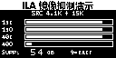

# ILA DAC、逐级采样率与插值镜像抑制演示

## 1. 演示结论

本版本保留原有全部实板功能：

- SW1～SW4：`1X / 4X / 8X / 128X`；
- SW5：输入频率 `+1kHz`；
- SW6：输入频率 `-1kHz`；
- SW7：恢复 `15kHz`；
- SW8：开启或关闭自动扫频；
- 原 DAC 输出、插值链和 180° 倒装液晶显示均保留。

新增 SW9 作为独立演示开关。按一次 SW9 进入 ILA 镜像抑制演示，再按
一次退出并回到进入前的正常模式和输入频率。进入演示后，系统把正常
NCO 暂时换成相干的 `4.1kHz + 15kHz` 双音源，并让数据经过原来的真实
插值链；没有旁路或替换 FIR。

本次又在原有 11 路镜像抑制探针之后增加 15 路系统展示探针，直接抓取
送往 AD9708 的 8bit DAC 码流、当前 DAC 模式、实际 DAC 时钟，以及
1x～128x 各级采样更新脉冲。新增的独立100MHz测频逻辑每100ms测量一次
`DAC_CLK`，ILA可直接显示频率Hz值。原有探针编号和功能保持不变。

选择 4.1kHz 的原因是输入采样率为 44.1kHz。第一级零插值后，4.1kHz
会产生精确的 `44.1kHz - 4.1kHz = 40kHz` 镜像，因此可在第一级 FIR
前后直接比较：

| 观察量 | 第一级 FIR 前 | 第一级 FIR 后 | 应看到的现象 |
|---|---:|---:|---|
| 15kHz 基带 | 高 | 高 | 有效信号基本保留 |
| 40kHz 镜像 | 高 | 接近 0 | 插值镜像被明显衰减 |

40kHz 不能作为 44.1kHz 基带输入直接生成，因为它已经超过 22.05kHz
奈奎斯特频率。当前方法展示的是零插值实际产生的 40kHz 镜像，物理意义
更准确。

## 2. 液晶显示

进入演示后，液晶切换到第五个动态页面：



四条柱分别是 `15I / 15O / 40I / 40O`，其中 `I` 表示第一级 FIR 输入，
`O` 表示第一级 FIR 输出。稳定后应看到：

- `15I` 与 `15O` 都较长；
- `40I` 较长；
- `40O` 很短或接近空；
- `SUPP` 约为 `54dB`；
- 右下角 `9=EXIT` 提示再次按 SW9 退出。

进入后先等待约 0.2 秒，让 10ms 相干检测窗口和液晶整帧更新完成。

## 3. 已生成的上板文件

必须成对使用下面两个同一次构建生成的文件：

```text
reports_ila_dac_rate_freqmeter100m/board_demo_competition_dac8_top_ila_dac_rate_freqmeter100m.bit
reports_ila_dac_rate_freqmeter100m/board_demo_competition_dac8_top_ila_dac_rate_freqmeter100m.ltx
```

最终构建 SHA256 见本文第7节。

## 4. Vivado Hardware Manager 操作

1. 给开发板上电并连接 JTAG。
2. 用 Vivado 2018.3 打开 `XC7A35T_interp.xpr`。
3. 点击 `Flow Navigator -> Open Hardware Manager -> Open Target -> Auto Connect`。
4. 右键 `xc7a35t_0 -> Program Device`。
5. `Bitstream file` 选择上述 `.bit`；`Debug probes file` 选择同名 `.ltx`。
6. 完成后在 Hardware 窗口双击 `u_ila_image_rejection`。

先不要进入演示。在 ILA 的 Trigger Setup 中设置：

```text
demo_audio_sync             == 1
ila_measurement_valid_w     == 1
```

两项关系使用 AND，Trigger Position 设为 `2048`。点击 `Run Trigger` 后再按
板上 SW9。检测结果有效后 ILA 会自动触发并抓取一帧。

如果只是想快速看数据，也可以删掉所有触发条件，进入演示并等待液晶柱状
图稳定后点击 `Run Trigger Immediate`。

## 5. ILA 探针含义和显示格式

ILA 时钟统一为 5.6448MHz，采样深度为 4096。建议在 Waveform 窗口把
三个 24bit 波形和 `ila_dac_signed_w` 设成 `Signed Decimal`，然后右键选择
`Waveform Style -> Analog`；DAC 原始码、幅值和 dB 探针使用
`Unsigned Decimal`。

| Probe | 信号名 | 位宽 | 含义 |
|---:|---|---:|---|
| 0 | `demo_audio_sync` | 1 | 演示模式已进入音频时钟域 |
| 1 | `ila_pre2_sample_w` | 24 | 第一级 FIR 前的 2× 零插值序列 |
| 2 | `ila_post2_sample_w` | 24 | 第一级 2× FIR 输出 |
| 3 | `ila_final128_sample_w` | 24 | 最终 128× 插值链输出 |
| 4 | `ila_ce2_tick_w` | 1 | 88.2kHz 第一级样本更新脉冲 |
| 5 | `ila_magnitude_15k_pre_w` | 16 | FIR 前 15kHz 相干幅值 |
| 6 | `ila_magnitude_15k_post_w` | 16 | FIR 后 15kHz 相干幅值 |
| 7 | `ila_magnitude_40k_pre_w` | 16 | FIR 前 40kHz 镜像幅值 |
| 8 | `ila_magnitude_40k_post_w` | 16 | FIR 后 40kHz 镜像幅值 |
| 9 | `ila_suppression_40k_db_w` | 8 | 40kHz 镜像抑制度，近似 dB |
| 10 | `ila_measurement_valid_w` | 1 | 四个幅值和抑制度已经有效 |
| 11 | `ila_dac_signed_w` | 9 | 实际 DAC 码减去 128 后的有符号波形 |
| 12 | `ila_dac_code_w` | 8 | 实际送往 AD9708 的 offset-binary 码 |
| 13 | `ila_dac_mode_w` | 2 | 实际提交的 DAC 模式：0/1/2/3=1x/4x/8x/128x |
| 14 | `ila_dac_clk_w` | 1 | 实际输出到 AD9708 的采样时钟 |
| 15 | `ila_rate_1x_tick_w` | 1 | 1x，44.1kHz 样本更新脉冲 |
| 16 | `ila_rate_2x_tick_w` | 1 | 2x，88.2kHz 样本更新脉冲 |
| 17 | `ila_rate_4x_tick_w` | 1 | 4x，176.4kHz 样本更新脉冲 |
| 18 | `ila_rate_8x_tick_w` | 1 | 8x，352.8kHz 样本更新脉冲 |
| 19 | `ila_rate_16x_tick_w` | 1 | 16x，705.6kHz 样本更新脉冲 |
| 20 | `ila_rate_32x_tick_w` | 1 | 32x，1.4112MHz 样本更新脉冲 |
| 21 | `ila_rate_64x_tick_w` | 1 | 64x，2.8224MHz 样本更新脉冲 |
| 22 | `ila_rate_128x_tick_w` | 1 | 128x，5.6448MHz，每个 ILA 点均更新 |
| 23 | `ila_dac_freq_hz_w` | 24 | 独立100MHz参考测得的DAC_CLK频率，单位Hz |
| 24 | `ila_dac_freq_edges_100ms_w` | 20 | 100ms闸门内累计的DAC_CLK上升沿数 |
| 25 | `ila_dac_freq_valid_w` | 1 | 新一次100ms测量结果更新脉冲 |

`ila_pre2_sample_w` 是零插值序列，所以在 88.2kHz 更新点上会出现“一个
原样本、一个零值”的交替；`ila_post2_sample_w` 不再交替归零，波形更
连续。由于 ILA 用 5.6448MHz 抓取而第一级只在 88.2kHz 更新，每个第一级
样本在屏幕上会保持约 64 个 ILA 时钟，这是正常现象。

逐级采样率探针是统一 5.6448MHz 时钟域内的 CE 更新脉冲，而不是在 FPGA
内部另行生成的门控时钟。全屏观察时，1x～128x 相邻更新点的 ILA 点数
依次为 `128 / 64 / 32 / 16 / 8 / 4 / 2 / 1`。128x 与 ILA 时基相同，
因此 `ila_rate_128x_tick_w` 显示为恒 1。`ila_dac_clk_w` 在 128x 模式下也
由同一个时钟采样，ILA 中会显示为恒高；在 1x/4x/8x 模式下可看到分频
后的高低电平。

`ila_dac_freq_hz_w`不是用5.6448MHz ILA时基推算，而是由独立100MHz
参考时钟直接计数。将它设为 `Unsigned Decimal`，切换四档并等待约
0.1秒，应依次看到约 `44100 / 176400 / 352800 / 5645160`。由于Clock
Wizard申请的标称值为5.6448MHz，而MMCM实际整数分频为
`20MHz × 35 ÷ 124 = 5.645161MHz`，128x实测值靠近5645160Hz是正确的。
100ms闸门分辨率为10Hz，窗口边界存在最多一个边沿的量化误差。

`ila_dac_freq_edges_100ms_w`是原始计数，理论上约为
`4410 / 17641 / 35282 / 564516`，乘以10就是Hz探针。它和Hz结果一起
展示，可以证明测频值来自真实边沿计数，而不是根据模式写入的固定常数。

`ila_dac_signed_w` 是实际 `dac_data[7:0]` 减去 offset-binary 中点 128
得到的数字波形。在 Hardware Manager 中将它设为 Analog 后，可以直观
比较 1x、4x、8x 和 128x 时 DAC 码流的阶梯粗糙度；它代表送入 AD9708
的数字结果，DAC 芯片之后的真实模拟电压仍需示波器观察。

## 6. 推荐的现场讲解顺序

1. 先用 SW1～SW8 演示原有倍率切换、1kHz 步进和 AUTO，说明旧功能保留。
2. 在 ILA 中点击 `Run Trigger`，再按 SW9。
3. 先看液晶：指出 `15I≈15O`，而 `40O` 相对 `40I` 几乎消失。
4. 查看 `ila_dac_signed_w`，切换 SW1～SW4 比较实际 DAC 码流的阶梯变化。
5. 将 `ila_dac_freq_hz_w` 设为十进制，切换四档并等待0.1秒，展示独立
   100MHz计数得到的实际DAC采样时钟。
6. 展开 1x～128x 更新脉冲，指出相邻脉冲间隔逐级减半。
7. 再看三条插值 Analog 波形和四个幅值，用抑制度给出定量结论。
8. 再按 SW9，液晶和信号源返回原来的正常功能。

XSim 定点仿真的一组结果为：

```text
15k_pre=6309  15k_post=6276
40k_pre=6318  40k_post=9
suppression=54 dB
```

硬件检测窗口为 882 个 88.2kHz 样本，幅值数值约为仿真的两倍，但比例
和约 54dB 抑制度保持一致。现场最重要的是比较相对大小，不要求最后一位
与仿真完全相同。

## 7. 验证与构建结果

三个专项仿真均通过：

- 双音源经过真实第一级 FIR 后，15kHz 保留且 40kHz 镜像明显衰减；
- LCD 正常四页和动态 ILA 页面切换、柱状图、dB 数字均正确；
- 精简矩阵键盘保持 SW1～SW8 行为，并可由 SW9 单次切换演示模式。

最终实现结果：

| 指标 | 结果 |
|---|---:|
| LUT | 6040 |
| FF | 5681 |
| RAMB36 / RAMB18 | 27 / 9 |
| DSP48E1 | 9 |
| WNS / WHS | +2.897ns / +0.009ns |
| TNS / THS | 0 / 0ns |

所有用户时序约束满足，bitstream 已成功生成。DRC 无 Error；已有的 DSP
输入/输出流水线、异步控制和 BRAM 异步控制类 Warning 不阻止生成。

独立测频专项仿真结果：

```text
DAC_FREQ_RESULT edges_100ms=564516 frequency_hz=5645160
PASS: independent 100MHz DAC clock frequency meter
```

最终构建 SHA256：

```text
BIT  C6C76FF3597E442E3A31CD77FA30FA385E5F52553519794554E2777EFEFDB4C7
LTX  1A2EA72FF8BE68788EC86BFB23DC3C3A9674A6AD2DC849794990443DCC0375F6
```

修正版不再让Vivado自动选择Debug Hub时钟：现有音频MMCM增加一个独立
100MHz输出，`dbg_hub`固定连接该100MHz网络并显式设置
`C_CLK_INPUT_FREQ_HZ=100000000`；ILA波形采样时钟仍保持5.6448MHz。
实板自动检查应稳定识别到1个ILA、26个Probe和4096采样深度。

重新完整构建时，在 PowerShell 中运行：

```powershell
powershell.exe -NoProfile -ExecutionPolicy Bypass `
  -File .\build_ila_image_rejection_short_path.ps1
```

脚本会临时映射 `Q:` 运行 Vivado，从而规避 Vivado 2018.3 调试核目录的
Windows 路径长度限制，结束后自动解除映射。只有综合结果仍然有效且仅需
重新实现时，才使用：

```powershell
powershell.exe -NoProfile -ExecutionPolicy Bypass `
  -File .\build_ila_image_rejection_short_path.ps1 -ImplementationOnly
```

## 8. 24-bit y128 实板数据与 MATLAB 黄金结果逐点验证

在上述时域波形、逐级采样率和镜像抑制展示之外，本工程补充了一项成本
较低但判定更严格的板级闭环验证：从 ILA 导出
`ila_final128_sample_w[23:0]` 的连续 24-bit 数据，与 Phase 7 正式整数
位真 MATLAB 模型逐点比较，并绘制误差直方图。

验证仍使用 SW9 的 `4.1kHz + 15kHz` 相干双音 ROM，不修改插值链，也不
需要重新生成 bitstream。MATLAB 使用与板级 RTL 相同的三级 2x FIR、
`CIC16 N=3`、字长、系数和 `FINAL_PRUNE_LSB=0`。由于 ILA 触发位置和
上电相位不固定，脚本先在 56448 点稳态黄金周期内自动寻找固定相位，
再对全部 4096 个捕获样点严格比较。

验收标准为：

```text
mismatch count = 0
maximum error  = 0 LSB
```

完整 Vivado 导出步骤、MATLAB 命令、FAIL 排查顺序和答辩表述见：

[`ila_y128_validation/README.md`](ila_y128_validation/README.md)

核心 MATLAB 入口为：

```matlab
cd('D:/FpgaProject/XilinxProject/XC7A35T/fir_interpolation/XC7A35T_interp_opt_df/ila_y128_validation');
result = ila_y128_compare('captures/ila_y128_capture.csv');
```

脚本自动输出逐点比较 CSV、结果 MAT、文字总结，以及包含“时域波形重合、
逐点误差、误差直方图、频谱重合”的四联图。工具链自检和 FPGA 实际 ILA
抓取均已完成。真实抓取包含 4096 个连续 y128 样点，自动对齐偏移为
29799/56448，结果为 `mismatch=0`、最大误差 `0 LSB`、RMS 误差
`0 LSB`，最终判定 `PASS`。这证明实板中运行的完整 24-bit 128× 输出与
MATLAB 正式整数位真模型逐点完全一致。

本次实板验证的独立报告见：

[`ila_y128_validation/ILA_Y128_BOARD_VALIDATION_REPORT.md`](ila_y128_validation/ILA_Y128_BOARD_VALIDATION_REPORT.md)
