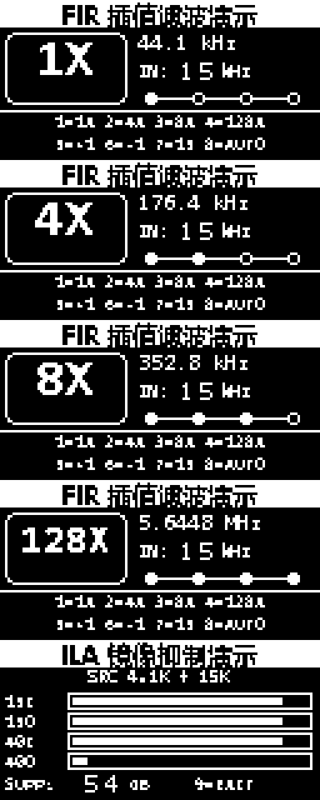

# Phase 7 12864T 图形液晶显示版

## 1. 功能范围

本工程在原 `472 LUT / 8 DSP` Phase 7 实板通过版基础上增加 12864T
图形液晶界面和 1kHz～20kHz 可调正弦 NCO。FIR/CIC 系数、定点字长、
四档 DAC 数据路径和 44.1kHz 音频采样率均未改变；原固定 15kHz PCM
ROM 输入改为 256 点、24bit、0.50FS 正弦 NCO。

液晶界面持续显示：

- 当前输出倍率：`1X / 4X / 8X / 128X`；
- 当前输出采样率：`44.1 kHz / 176.4 kHz / 352.8 kHz / 5.6448 MHz`；
- 当前输入频率：`IN:01 kHz`～`IN:20 kHz`；
- 自动扫频开启时显示 `A` 标记；
- 当前处理路径和四节点进度指示；
- 八个矩阵按键的完整映射：
  `SW1=1X`、`SW2=4X`、`SW3=8X`、`SW4=128X`、
  `SW5=+1kHz`、`SW6=-1kHz`、`SW7=15kHz`、`SW8=AUTO`。
- SW9 独立进入或退出 ILA 镜像抑制演示；演示页动态显示第一级 FIR
  前后 15kHz/40kHz 幅值柱以及 40kHz 镜像抑制度。

上电默认输入频率为 15kHz。SW5/SW6 在 1kHz～20kHz 范围内循环步进，
SW7 恢复 15kHz，SW8 开关每秒增加 1kHz 的自动扫频。SW5～SW7 的手动
操作会退出自动扫频；SW1～SW4 只改变插值倍率，不改变输入频率。

液晶控制器在 20MHz 控制域运行，直接读取已经消抖锁存的
`key_mode_sel` 和频率控制状态。模式、输入频率和 AUTO 标记只在液晶
整帧边界一起提交，避免刷新过程中出现混页或数字撕裂。输入频率通过
“两级同步 + 连续两拍一致”后才提交到 5.6448MHz 音频域，避免多位控制
总线的中间码进入 NCO。

场景功能板上的12864液晶为180°倒装。界面生成器保持设计源图正向，
仅在写入 `lcd12864_ui.mem` 前把四个页面整体旋转180°，因此安装后的
实际观看方向为正向。旋转只改变ROM内容，不增加RTL逻辑资源。



## 2. 硬件接口

以 `ABC平台IO引脚分配表-V1.20.xlsx` 为准：

| 12864T 信号 | XC7A35T 管脚 | 方向 |
|---|---|---|
| LCD_D0 | P16 | 输出 |
| LCD_D1 | R16 | 输出 |
| LCD_D2 | P15 | 输出 |
| LCD_D3 | R14 | 输出 |
| LCD_D4 | P14 | 输出 |
| LCD_D5 | V7 | 输出 |
| LCD_D6 | W7 | 输出 |
| LCD_D7 | Y8 | 输出 |
| LCD_RS | V8 | 输出 |
| LCD_R/W | T5 | 输出，当前固定写模式 |
| LCD_E | U7 | 输出 |

底板已经把 `PSB` 拉到 3.3V，液晶工作于8位并口模式；液晶 `RST` 接
板级 `SYS_RST`。按底板原理图，安装液晶前应确认 `LCD_EN` 跳帽接通，
用于启用液晶数据通路和背光。

底板资料只给出了模块型号 `12864T`，没有提供内部控制器数据手册。
当前RTL采用与该20针、PSB并口定义匹配的 ST7920 兼容指令集。若固定
测试界面完全不显示，应首先核对模块是否为 ST7920 指令兼容型号，而
不是修改 FIR/CIC 或 DAC 逻辑。

## 3. 主要文件

| 文件 | 作用 |
|---|---|
| `XC7A35T_interp.srcs/sources_1/new/lcd12864_st7920_ui.v` | 8bit并口写时序、初始化、GDRAM寻址和连续刷新 |
| `XC7A35T_interp.srcs/sources_1/new/lcd12864_ui.mem` | 四个正常页面和一个ILA动态页面，共5120字节 |
| `XC7A35T_interp.srcs/sources_1/new/audio_nco_sine_source.v` | 1kHz～20kHz相位连续正弦NCO |
| `XC7A35T_interp.srcs/sources_1/new/nco_sine_0p50fs_256.mem` | 256点、24bit、0.50FS正弦查找表 |
| `XC7A35T_interp.srcs/sources_1/new/tone_frequency_control.v` | SW5～SW8步进、复位和自动扫频控制 |
| `lcd_ui/generate_lcd12864_ui.py` | 重新生成界面ROM与PNG预览 |
| `lcd_ui/generate_nco_sine_lut.py` | 重新生成NCO正弦查找表 |
| `XC7A35T_interp.srcs/sim_1/new/tb_lcd12864_st7920_ui.v` | 初始化、正常页面和ILA动态页面自动化验证 |
| `XC7A35T_interp.srcs/sim_1/new/tb_audio_nco_sine_source.v` | NCO查表、相位步进和相位连续切换验证 |
| `XC7A35T_interp.srcs/sim_1/new/tb_tone_frequency_control.v` | SW5～SW8和自动扫频验证 |
| `build_lcd12864_display.tcl` | 完整综合、实现、报告和bitstream构建 |

修改界面后，先运行：

```powershell
& 'C:\Users\Lenovo\.cache\codex-runtimes\codex-primary-runtime\dependencies\python\python.exe' `
  '.\lcd_ui\generate_lcd12864_ui.py'
```

随后重新运行 `build_lcd12864_display.tcl`，确保MEM的新内容进入BRAM和
bitstream。

生成器中的 `ROTATE_180_FOR_PANEL = True` 为当前倒装板配置。文件
`lcd12864_all_modes_4x.png` 是安装后的正向观看预览，
`lcd12864_all_modes_rom_180_4x.png` 是实际写入ROM的180°页面预览。

## 4. 自动化验证结果

专用 XSim 测试检查了：

- 八条 ST7920 初始化指令；
- 64行上下半屏GDRAM地址映射；
- 两个完整1024字节页面、ROM数据顺序和动态5x7数字像素；
- 刷新中途同时改变模式、频率和AUTO后，三项状态从下一帧一起生效；
- SW1～SW8消抖后的单次键码脉冲，长按不重复触发；
- 1kHz步进、1/20kHz边界回绕、15kHz复位和自动扫频；
- 15kHz切换20kHz时的NCO相位连续性及查表数据逐点一致。
- SW9 进入/退出时不改变原倍率、频率和AUTO状态；
- ILA页面四条动态幅值柱、抑制度数字和整帧同步更新。

测试结果：`PASS`。

2026-07-18 完整实现结果：

| 指标 | 原472 LUT版 | 12864 + 可调NCO版 |
|---|---:|---:|
| LUT | 472 | 821 |
| FF | 564 | 727 |
| DSP48E1 | 8 | 8 |
| BRAM Tile | 3 | 4 |
| WNS / WHS | +46.446 / +0.093 ns | +44.274 / +0.110 ns |
| TNS / THS | 0 / 0 ns | 0 / 0 ns |

液晶层级为 `193 LUT / 103 FF / 1 RAMB36 / 0 DSP`，NCO层级为
`111 LUT / 41 FF / 1 RAMB18 / 0 DSP`，频率控制层级为
`42 LUT / 31 FF / 0 DSP`。所有用户时序约束满足，LCD端口没有
`UCIO/NSTD`，DRC中没有LCD或NCO相关告警。报告中的20条REQP-1840仍
全部来自既有Stage2/3系数BRAM路径，没有因本次功能新增而增加。

最终bitstream：

```text
reports_lcd12864/board_demo_competition_dac8_top_lcd12864.bit
SHA256: D9BE6DE09F36ADBC2AD24EF081981D7253150B9BA243CA149A34FC72F4A21447
```

## 5. 首次上板检查顺序

1. 断电安装12864T模块，确认方向和20针插座没有错位。
2. 确认模块为3.3V接口，并接通底板 `LCD_EN` 跳帽。
3. 下载本目录 `reports_lcd12864` 中的bitstream。
4. 上电后默认应显示 `128X / 5.6448 MHz / IN:15 kHz` 页面。
5. 依次按 SW1、SW2、SW3、SW4，核对页面和DA_CLK档位同步变化。
6. 按 SW5，核对输入变为16kHz且液晶同步显示 `IN:16 kHz`；
   按SW6应回到15kHz，按SW7应直接恢复15kHz。
7. 按SW8开启自动扫频，核对液晶出现 `A` 且频率每秒增加1kHz；
   再按SW8关闭，或按SW5～SW7执行手动操作退出扫频。
8. 有背光但无图像时先检查对比度和模块指令兼容性；有图像但内容错位
   时记录整屏照片，用于判断GDRAM上下半屏映射差异。

包含 SW9、第五个液晶页面和 ILA 调试核的最终上板文件及详细操作见
`ILA_IMAGE_REJECTION_README.md`；本节中的 `reports_lcd12864` bitstream
保留为不含 ILA 的较小资源版本。
