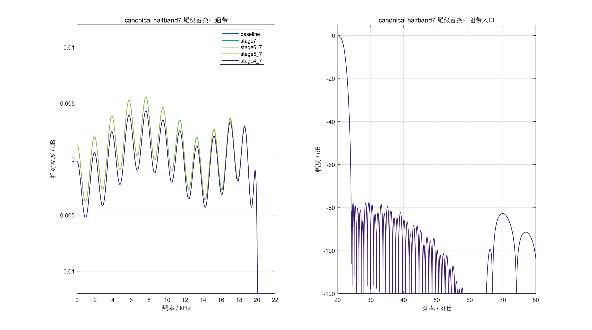

# 全 2x 优化指导 2.0 执行反馈

## 1. 结论

`all2x_optimization_guide_v2.md` 对当前工程具有明确指导意义。指导中对主要瓶颈的判断是正确的：当前资源冗余主要来自显式插零、完整零插入延时线和通用常系数乘加结构，而不是系数字长还不够短。

本次已完成指导中的 Phase 0 和 Phase 1。最终推荐候选为：

```text
Stage 1～3：保持当前稳定实现
Stage 4～7：统一使用精确 7 tap canonical halfband7
半带系数：[-1, 0, 9, 16, 9, 0, -1] / 16
RTL 结构：true-polyphase + shift-add，奇相纯延时
```

该候选的独立插值链综合结果为：

```text
4302 LUT / 3678 FF / 1 DSP
WNS = +165.930 ns
```

相对稳定基线节省：

```text
LUT：5912 -> 4302，减少 1610，下降 27.23%
FF ：4218 -> 3678，减少  540，下降 12.80%
DSP：1 -> 1，保持不变
```

频响、常规 bit-true、随机 PCM RTL 对拍和冲激响应 RTL 对拍全部通过。

## 2. 基线冻结

已按指导建立稳定基线标签：

```text
Git commit：8418c7f
Git tag   ：regional-final-all2x-baseline
```

稳定版 `matlab_fir/alt_all2x` 和原有全 2x RTL 文件均未覆盖。所有实验文件分别放入：

```text
matlab_fir/alt_all2x_v2/
sources_1/new/all2x_v2/
sim_1/new/all2x_v2/
```

Vivado/XSim 的工作文件继续放在系统临时目录：

```text
%TEMP%/codex_vivado_fir_interpolation/all2x_v2_sim/
```

工程根目录没有新增 `.Xil`、`xsim.dir`、`.jou`、`.log` 或 `.wdb` 临时文件。

## 3. MATLAB 频响验证



逐级替换结果如下：

| 版本 | 首个 canonical 级 | 通带最大绝对误差 / dB | 通带中心化纹波 / dB | 阻带衰减 / dB | 直流增益 | 通过 |
|---|---:|---:|---:|---:|---:|---:|
| baseline | 8 | 0.00729793 | 0.00793139 | 77.67936345 | 128.01854603 | 是 |
| stage7 | 7 | 0.00729793 | 0.00793139 | 77.67936345 | 128.01854603 | 是 |
| stage6_7 | 6 | 0.00728953 | 0.00792580 | 77.67934521 | 128.01854603 | 是 |
| stage5_7 | 5 | 0.00720560 | 0.00786988 | 77.67916297 | 128.01854603 | 是 |
| stage4_7 | 4 | 0.00715181 | 0.00686375 | 77.67735619 | 127.99706215 | 是 |

验收门槛采用指导中的更严格实验标准：

```text
通带最大绝对误差 <= 0.01 dB
阻带衰减 >= 75 dB
```

最终 S4～S7 候选并没有以明显频响损失换资源。阻带只下降约 `0.00201 dB`，通带最大绝对误差还下降约 `0.000146 dB`。

指导文档中预估 S4～S7 替换后的通带误差为 `0.00755141 dB`；本次使用当前仓库系数和统一检查函数实际重算得到 `0.00715181 dB`。报告以可重复执行脚本的实际结果为准。

## 4. bit-true 与 RTL 验证

### 4.1 常规 bit-true

五组候选均完成以下输入测试：

```text
脉冲
直流
1 kHz / -1 dBFS
19 kHz / -6 dBFS
20 kHz / -6 dBFS
固定随机种子 PCM
```

所有候选均满足：

```text
累加器溢出次数 = 0
输出饱和次数   = 0
```

### 4.2 RTL 逐点对拍

| 输入 | 候选 | 固定延迟 / 最终样点 | 最大误差 / LSB | 不一致点数 | 通过 |
|---|---|---:|---:|---:|---:|
| 随机 PCM | stage7 | 327 | 0 | 0 | 是 |
| 随机 PCM | stage6_7 | 325 | 0 | 0 | 是 |
| 随机 PCM | stage5_7 | 321 | 0 | 0 | 是 |
| 随机 PCM | stage4_7 | 321 | 0 | 0 | 是 |
| 冲激响应 | stage7 | 327 | 0 | 0 | 是 |
| 冲激响应 | stage6_7 | 325 | 0 | 0 | 是 |
| 冲激响应 | stage5_7 | 321 | 0 | 0 | 是 |
| 冲激响应 | stage4_7 | 321 | 0 | 0 | 是 |

不同候选的固定延迟不同，是因为通用 FIR 与专用 polyphase 核的寄存器层次不同；对齐后的整段输出均为严格 `0 LSB`，不属于功能误差。

## 5. Vivado 逐级资源结果

| 版本 | LUT | FF | DSP | WNS / ns | LUT 减少 | FF 减少 |
|---|---:|---:|---:|---:|---:|---:|
| baseline | 5912 | 4218 | 1 | +165.930 | 0 | 0 |
| 仅 S7 | 5851 | 4090 | 1 | +165.930 | 61 | 128 |
| S6～S7 | 5513 | 3954 | 1 | +165.930 | 399 | 264 |
| S5～S7 | 4999 | 3817 | 1 | +165.930 | 913 | 401 |
| S4～S7 | 4302 | 3678 | 1 | +165.930 | 1610 | 540 |

资源收益随替换级数单调增加。S4～S7 的结果达到并略优于指导中 `4500～5200 LUT` 的探索目标，FF 也位于指导目标 `3400～4000` 内。

## 6. 按指导执行的部分

1. 冻结稳定 tag，并保留稳定版 MATLAB、RTL 和 bitstream。
2. 新建完全隔离的 `alt_all2x_v2` 和 `all2x_v2` RTL 目录。
3. 按 S7、S6、S5、S4 的顺序逐级替换，而不是一次替换后只看最终值。
4. 使用精确 Q4 canonical 系数，奇相为纯延时，偶相使用 `9a=8a+a`。
5. 复用现有负数舍入和 24bit 饱和规则，避免简单 `>>>4` 造成位级差异。
6. 每个候选均进行总频响、bit-true、冲激 0 LSB、随机 0 LSB 和独立综合。
7. 保持 DSP 为 1，并记录每一级的资源增量和 WNS。

## 7. 根据工程实际做的变通

### 7.1 MATLAB 入口文件名增加 `v2_` 前缀

指导示例使用 `01_extract...m`。MATLAB 可执行文件名必须以字母开头，因此实际采用：

```text
v2_01_extract_current_baseline.m
v2_02_test_canonical_halfband7.m
v2_03_validate_canonical_bittrue.m
v2_04_compare_canonical_rtl.m
```

### 7.2 使用参数化实验顶层，而不是复制四套 RTL

`interp128_all2x_v2_top_ce.v` 使用：

```verilog
FIRST_CANONICAL_STAGE
```

选择首个 canonical 级。四种候选共享同一份数据通路代码，降低版本漂移风险。

### 7.3 一个测试平台并行实例化四个候选

四个 DUT 共用输入和 CE，同时输出四份 CSV。这样四个候选接收到完全相同的时序和输入，比较口径更一致。

### 7.4 本阶段保持固定 CE 接口

指导提出完整 `ready/valid` 接口，但当前板级系统是固定采样率 CE。Phase 1 为控制改动范围，保留现有固定 CE 接口，并在 canonical 核中增加相位 0 缺少输入的仿真告警。完整握手适合在 Phase 2 删除 bridge 时统一设计。

### 7.5 没有直接在当前工作分支再切实验分支

当前工作区已有用户文件和未提交指导文档。为避免切分支干扰这些内容，本次使用稳定 tag 加独立目录完成隔离。功能上达到指导所要求的“稳定版不覆盖、实验可单独回退”。

## 8. 本阶段没有执行的内容及原因

以下内容属于指导的 Phase 2 以后，不应与已通过的 Phase 1 混成一次不可分割改动：

```text
Stage 2～3 真正 polyphase
删除对应 bridge 和 interp2_ctrl_ce
Stage 1 严格半带重设计
DSP 1/2/3 Pareto
Stage 3 CSD/整数邻域搜索
SAIF、THD、SINAD、SFDR
板级 V2 接入与 bitstream
```

Phase 1 已经获得 27.23% LUT 降幅，应该先将它作为新的可回归基准。Phase 2 会改动 S2～S3 的历史状态、两相计算和跨级控制；如果与 Phase 1 同时推进，出现偏差时不利于定位。

## 9. 下一步建议

下一阶段进入 `Stage 2～7 真正 polyphase`，但实际需要新增的只有 S2～S3，因为 S4～S7 已在本阶段完成 true-polyphase。

推荐顺序：

```text
1. 导出 S2、S3 的 phase0/phase1 整数系数和 manifest
2. 只将 S3 改为通用 true-polyphase，完成 0 LSB 与综合
3. 再将 S2 改为 true-polyphase，完成 0 LSB 与综合
4. 确认数据不会覆盖后，删除 S2～S7 的多余 bridge/ctrl
5. 将 Phase 2 最优结构与本报告的 4302/3678/1 基准比较
```

只有 Phase 2 继续产生明确资源收益，才进入 Stage 1 严格半带设计。
