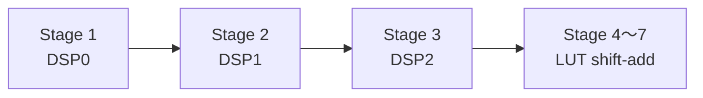

# 全 2x 插值滤波器 Phase 6 执行报告

## 1. 最终结论

`phase6_next_optimization_guidance_display_revised.md` 对当前工程具有明确参考价值，但其中各建议的收益与风险并不相同。本阶段按“先测量、再进入板级”的原则完成了 3-DSP Pareto、DSP48 映射复核、级间数据字长搜索、RTL 位精确验证、独立综合、四档功能仿真以及完整板级实现。

最终选择的 Phase 6 结构为：

```text
输入：44.1 kHz / 24 bit signed PCM

Stage 1：24 bit，strict-halfband，BRAM + DSP
Stage 2：22 bit，true-polyphase
Stage 3：20 bit，true-polyphase
Stage 4～7：18 bit，canonical halfband

Stage 2/3：共享 1 个 DSP48E1
完整链：2 DSP48E1 + 1 BRAM Tile
输出：恢复为 24 bit PCM 标度
展示：1x / 4x / 8x / 128x，15 kHz 正弦，单 DAC
```

板级实现结果：

| 指标 | Phase 5 | Phase 6 | 差值 |
|---|---:|---:|---:|
| Slice LUT | 1536 | **1395** | **-141（-9.18%）** |
| Slice Register | 1181 | **1040** | **-141（-11.94%）** |
| DSP48E1 | 2 | **2** | 0 |
| BRAM Tile | 1 | **1** | 0 |
| WNS | +44.892 ns | **+45.145 ns** | +0.253 ns |

Phase 6 已完成综合、实现、bitstream 和四档实板回归，当前版本的 MATLAB、RTL 与板级验证闭环全部通过。


---

## 2. 指导文件采纳情况

| 指导项 | 处理 | 结论 |
|---|---|---|
| Phase6-A：最新链路进入比赛顶层 | 采纳并变通 | 沿用稳定的板级顶层名称，不新建重复 wrapper；综合层次已证明调用 Phase6 核 |
| Phase6-B：2 DSP / 3 DSP Pareto | 完整执行 | 3-DSP 候选资源更高，No-Go |
| Phase6-C：Stage3 Q14 改 Q15 | 沿用 Phase5 成果 | 位精确输出保持不变 |
| Phase6-D：DSP48 深度映射 | 复核 | Stage1 使用预加器；共享 Stage2/3 仍为 `C+A*B`，未强行重构稳定调度器 |
| Phase6-E：数据字长优化 | 完整执行 | 选择 `24/22/20/18/18/18/18bit` |
| Phase6-F：展示系统稳定 | 完成 | 保留 15 kHz、四档、矩阵按键和单 DAC；四档实板展示通过，不增加未提供的 OLED/串口硬件 |
| Stage4～7 共享引擎 | 暂不执行 | CE、phase 和延迟重构风险高，比赛主线收益不确定 |
| CIC 尾级、1 DSP 全链共享 | 不执行 | 会重新引入补偿滤波与复杂调度，不适合作为当前决赛主线 |

指导中建议新建 `board_demo_phase6_top`。本工程没有照搬该文件名，而是保持 XDC 已绑定的 `board_demo_competition_dac8_top`，只在其公共音频模块中替换插值核。这样既能证明最终板级工程使用新链路，也避免重新绑定引脚和引入第二套板级顶层。

---

## 3. 2 DSP 与 3 DSP Pareto

### 3.1 候选结构



3-DSP 方案为 Stage2 和 Stage3 各自建立独立历史、状态机和串行 MAC，删除共享任务选择器。功能回归将 Phase5 与 3-DSP 候选并行输入，比较 Stage2、Stage3 和链尾。

### 3.2 位精确结果

| 节点 | 有效样点 | 最大误差 | 判定 |
|---|---:|---:|---|
| Stage2 | 3808 | 0 LSB | PASS |
| Stage3 | 7616 | 0 LSB | PASS |
| 完整 128x | 121855 | 0 LSB | PASS |

### 3.3 综合结果

| 独立链版本 | LUT | FF | DSP | BRAM | WNS |
|---|---:|---:|---:|---:|---:|
| Phase5 2-DSP sharing | 1379 | 1015 | 2 | 1 | +165.332 ns |
| Phase6 3-DSP independent | 1431 | 1052 | 3 | 1 | +165.937 ns |

3-DSP 相对 Phase5 增加 52 LUT、37 FF 和 1 个 DSP。独立状态机节省的共享选择逻辑不足以抵消重复控制和历史通路，因此该方案判定为 **No-Go**，没有进入板级工程。

---

## 4. DSP48 深度映射复核

综合后共识别 2 个 DSP48E1：

| DSP | 综合模式 | USE_DPORT | 说明 |
|---|---|---:|---|
| Stage1 | `C+(D+A)*B` | 1 | 对称预加、乘法和累加进入 DSP |
| Stage2/3 shared | `C+A*B` | 0 | 乘法和累加进入 DSP，异构历史选择后的预加仍在 LUT |

Stage2/3 要同时支持 22 bit 与 20 bit 数据、两级历史和共享任务调度。强行改成 DSP pre-adder 需要重新组织样本选择和流水延迟，会扩大位真与调度验证范围。当前 WNS 裕量很大，3-DSP 实验又没有降低 LUT，因此本阶段只记录该映射边界，不对已经稳定的共享调度器进行高风险重写。

---

## 5. 混合数据字长原理

### 5.1 Q 格式转换

Phase5 的每一级都保存 24 bit 数据。Phase6 在级间缩位，同时保持同一物理满量程：

```text
24 bit --右移2并舍入饱和--> 22 bit
22 bit --右移2并舍入饱和--> 20 bit
20 bit --右移2并舍入饱和--> 18 bit
```

若输入整数为 `x`，右移 `s` 位后的整数结果为：

$$
q=\operatorname{sat}_{W_o}\left(
\operatorname{round}_{\text{half-away}}\left(\frac{x}{2^s}\right)
\right)
$$

最终输出再按累计缩位数左移恢复 24 bit PCM 标度。这个过程不会修改 FIR 系数和理想线性系统频率响应，只会引入受控的定点舍入噪声。

### 5.2 搜索门槛

测试输入包括 1 kHz / -1 dBFS、15 kHz / -6 dBFS、20 kHz / -6 dBFS 和随机 PCM。每个候选必须满足：

| 指标 | 门槛 |
|---|---:|
| 相对全 24 bit 增益误差 | 不超过 0.01 dB |
| 字长量化增量 SNR | 不低于 90 dB |
| SINAD 退化 | 不超过 0.5 dB |
| 累加器溢出 | 0 |
| 级间饱和 | 0 |

指导文件给出的“绝对 SNR > 90 dB”不适合直接套用，因为当前 24 bit 基线在本测试方法下的最低 SINAD约为 76.70 dB。这里改为检查候选相对全 24 bit 基线新增的误差功率，即 `delta SNR >= 90 dB`，同时限制 SINAD 退化。

### 5.3 推荐候选

| 项目 | `24/22/20/18/18/18/18` 结果 |
|---|---:|
| 历史位成本代理 | 606，基线为 744 |
| 最大增益误差 | 0.00008347 dB |
| 最差增量 SNR | 91.531 dB |
| 最低 SINAD | 76.676 dB |
| 最大 SINAD 退化 | 0.10921 dB |
| 最差 THD | -114.71 dB |
| 溢出 / 饱和 | 0 / 0 |

七级系数本身的实时复核结果为：

| 指标 | 结果 |
|---|---:|
| 通带最大绝对误差 | 0.00523192 dB |
| 阻带衰减 | 78.61965812 dB |
| 群延迟峰峰波动 | `9.09e-12` sample |

---

## 6. RTL 实现与验证

### 6.1 新增模块

| 文件 | 作用 |
|---|---|
| `round_sat_shift_compact.v` | 紧凑有符号右移、远离零舍入和饱和 |
| `bridge_valid_quantized_to_interp2_ce.v` | valid-only 级间桥与 Q 格式缩位 |
| `interp128_all2x_v6_mixed_width_top_ce.v` | Phase6 七级混合字长顶层 |
| `tb_round_sat_shift_compact.v` | 10 万组随机和边界舍入对拍 |
| `tb_phase6_mixed_width_bittrue.v` | 冲激/随机 Stage2、Stage3、链尾 MATLAB 对拍 |

`interp2_stage23_shared_dsp_ce.v` 增加了 `STAGE2_DATA_W` 和 `STAGE3_DATA_W` 参数。默认值仍等于原 `DATA_W`，因此 Phase5 同位宽行为保持不变；混合字长实例分别设置为 22 bit 和 20 bit。

### 6.2 固定启动延迟

每经过一级 2x RTL 会引入 1 个本级输出样点的启动延迟。折算到各比较节点：

$$
d_n=2^n-1
$$

因此 Stage2、Stage3 和完整链固定 shift 分别为 `3`、`7`、`127`。测试平台只接受这些预定值，不自动搜索最佳延迟，避免用自由平移掩盖漏样或相位错误。

### 6.3 MATLAB/RTL 对拍

| 节点 | 冲激点数 | 随机点数 | 固定 shift | 最大误差 |
|---|---:|---:|---:|---:|
| Stage2 | 1245 | 733 | 3 | 0 LSB |
| Stage3 | 2499 | 1475 | 7 | 0 LSB |
| 完整 128x | 40059 | 23675 | 127 | 0 LSB |

紧凑舍入器的 24→22、22→20、20→18 三种配置也通过 100000 组随机向量和边界值验证，均为 0 LSB。

---

## 7. 资源与板级实现

### 7.1 独立链

| 版本 | LUT | FF | DSP | BRAM | WNS |
|---|---:|---:|---:|---:|---:|
| Phase5 | 1379 | 1015 | 2 | 1 | +165.332 ns |
| Phase6 3-DSP | 1431 | 1052 | 3 | 1 | +165.937 ns |
| **Phase6 mixed-width** | **1224** | **867** | **2** | **1** | **+165.427 ns** |

混合字长相对 Phase5 独立链减少 155 LUT 和 148 FF，DSP、BRAM 不变。

### 7.2 完整板级

| 版本 | LUT | FF | DSP | BRAM | IOB | MMCM | WNS |
|---|---:|---:|---:|---:|---:|---:|---:|
| Phase5 | 1536 | 1181 | 2 | 1 | 19 | 1 | +44.892 ns |
| **Phase6** | **1395** | **1040** | **2** | **1** | **19** | **1** | **+45.145 ns** |

完整板级层次报告明确包含：

```text
u_demo_interp_dac8_audio_pcm_common/
  u_interp128_all2x_v6_mixed_width_top_ce
```

这证明实现结果来自 Phase6 RTL，而不是旧综合网表。

### 7.3 功耗和 DRC

| 项目 | 结果 |
|---|---:|
| Total On-Chip Power | 0.168 W |
| Dynamic | 0.096 W |
| Device Static | 0.072 W |
| Junction Temperature | 25.5 °C |
| 功耗置信度 | Low |
| DRC | 0 Error / 30 Warning |

功耗未加载实测 SAIF/VCD，只能作为结构估计。DRC warning 由 DSP 未启用内部流水和已有 BRAM 异步控制检查组成，未造成 setup/hold 失败；本阶段不为消除建议型 warning 改动已通过位真的数据路径。

---

## 8. 四档展示回归

固定 4096 个 5.6448 MHz 基准时钟窗口内：

| 模式 | DA_CLK 边沿 | 预期 | DAC 数据变化 | 判定 |
|---|---:|---:|---:|---|
| 1x | 32 | 32 | 32 | PASS |
| 4x | 128 | 128 | 127 | PASS |
| 8x | 256 | 256 | 251 | PASS |
| 128x | 4096 | 4096 | 3306 | PASS |

15 kHz 正弦、矩阵按键、四档编码和单 DAC 结构均保持不变。指导中的 OLED/串口资源显示未实现，因为当前硬件和赛题没有要求，贸然增加外设会扩大引脚与现场调试风险；资源演进改为通过 README、执行报告和 PNG 图展示。

实板下载 Phase6 bitstream 后，4x、8x、128x 的 `DA_CLK` 分别测得 `176.37 kHz`、`352.86 kHz` 和 `5.64 MHz`。矩阵按键切换正常，四档 AD9708 输出均稳定，示波器上可以清楚看到波形从 1x 到 128x 逐级变得光滑。

---

## 9. 输出物

板级 bitstream：

```text
matlab_fir/alt_all2x_v6/vivado_results/board_mixed_width/
  board_demo_competition_dac8_top_phase6_mixed_width.bit
```

文件信息：

```text
size   = 2,192,139 bytes
SHA256 = E122FC402FB10E43954BDC5E9E134BD2789F1645F138D6FFAAD83C52581612C3
```

临时 XSim 文件位于：

```text
%TEMP%/codex_fir_interpolation/phase6_mixed_width_sim/
%TEMP%/codex_fir_interpolation/phase6_four_mode_sim/
```

Vivado 独立实验工程位于已忽略目录：

```text
matlab_fir/alt_all2x_v6/vivado_work/
```

---

## 10. 板级验证结果

| 档位 | 理论 DA_CLK | 实测 DA_CLK | 示波器观察 |
|---|---:|---:|---|
| 1x | 44.1 kHz | 未单独记录 | 原始 PCM 阶梯最明显 |
| 4x | 176.4 kHz | 176.37 kHz | 相比 1x 更平滑 |
| 8x | 352.8 kHz | 352.86 kHz | 阶梯进一步减小 |
| 128x | 5.6448 MHz | 5.64 MHz | 四档中最平滑 |

四档 AD9708 模拟输出、矩阵按键切换和采样时钟均正常，完成 Phase6 的板级验收。V4、Phase5 和 V3 旧版本仍保留为可回退基线；Phase6 没有删除旧 RTL 文件。
