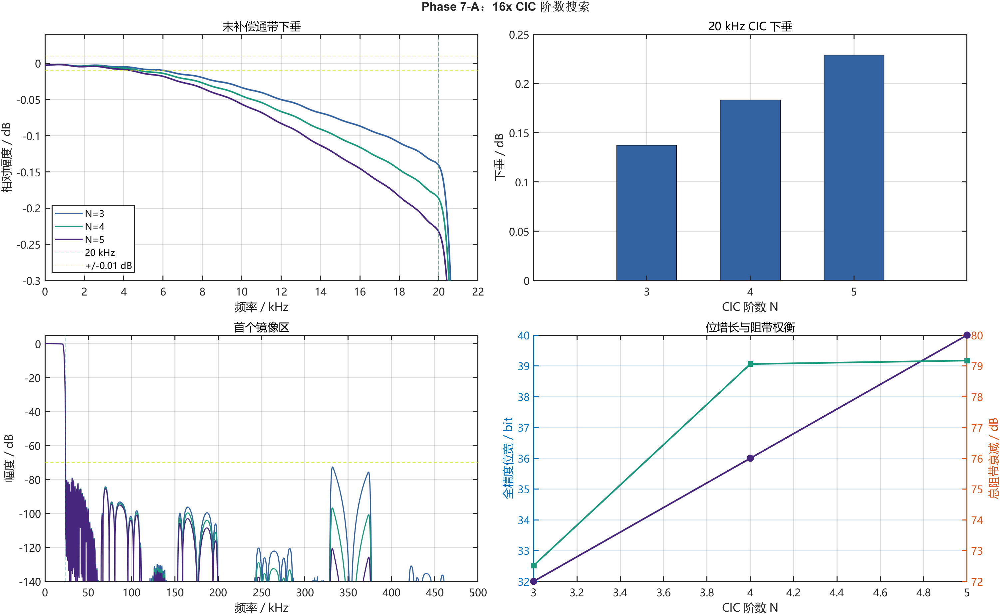
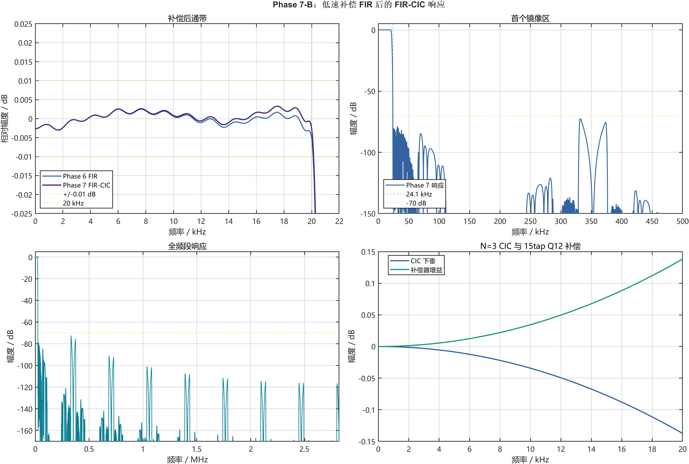

# Phase 7 折叠补偿 FIR-CIC 优化执行报告

## 1. 结论

本阶段依据修正版 `phase7_fir_cic_hybrid_corrected_guidance.md`，完成了 CIC 数学搜索、低速补偿 FIR、定点位宽、Hogenauer 风格剪枝、RTL、MATLAB/RTL 0 LSB、独立综合、板级实现和 bitstream 生成。

最终选择：

```text
44.1 kHz
  -> Stage1 2x strict halfband
  -> Stage2 2x shared-DSP FIR
  -> Stage3 2x folded-compensation FIR
  -> CIC16, N=3, M=1
  -> 5.6448 MHz
```

最终候选同时满足：

- 通带最大绝对误差 `0.00303062 dB < 0.01 dB`；
- 总阻带衰减 `72.349 dB > 70 dB`；
- 线性相位 FIR 前端，群延迟平坦；
- 随机 PCM Delta-SNR `96.403 dB`；
- MATLAB 与 RTL 冲激、随机 PCM 均 `0 LSB`；
- 独立链 LUT 从 1222 降至 957，下降 `21.69%`；
- DSP/BRAM 保持 `2/1`；
- 安全切档修正版板级实现 LUT 从 1395 降至 1128，下降 `19.14%`；
- 综合、实现、bitstream 均成功，setup/hold 均无失败端点。

因此 Phase 7 折叠补偿 N=3 判定为 **Go**。N=4 和独立补偿 FIR 方案判定为 **No-Go**。


## 2. 对修正版指导的评估

| 指导建议 | 采纳情况 | 执行说明 |
|---|---|---|
| 插值 CIC 使用低速 comb、插零、高速 integrator | 完全采纳 | MATLAB 与 RTL 使用相同顺序 |
| `R=16, M=1, N=3/4/5` 搜索 | 完全采纳 | 三阶数均完成浮点频响分析 |
| 补偿 FIR 位于 CIC 前低速端 | 完全采纳 | 工作采样率为 352.8 kHz |
| 搜索 15/21/31/41 tap 和多种 Q 格式 | 完全采纳 | 独立补偿方案完成 Pareto 搜索 |
| 位宽增长按 `Bin + N*log2(RM)` | 完全采纳 | N3/N4/N5 上界为 32/36/40 bit |
| Hogenauer 风格逐级剪枝 | 完全采纳 | 独立方案与折叠方案分别搜索 |
| MATLAB/RTL 0 LSB | 完全采纳 | 前三级与 CIC 尾链分段严格对拍 |
| LUT 至少下降 15% 或 DSP 减 1 | 完全采纳 | 仅最终 N3 达到 21.69% LUT 降幅 |
| 展示接口保持不变 | 完全采纳 | 15 kHz、1x/4x/8x/128x、单 DAC、矩阵按键 |

指导主线本身有参考性。但必须结合当前工程变通：Phase 6 的后四级已经是无 DSP 的 canonical halfband，因此“CIC 无乘法”不会自动减少 DSP；独立补偿 FIR 反而增加一个 DSP。为满足资源门槛，本阶段在主方案 No-Go 后才进入 Stage3 折叠补偿，而不是一开始绕过指导主方案。

## 3. 正确 CIC 插值结构

标准 CIC 插值器为：


其传递函数为：

$$
H_{CIC}(z)=\left(\frac{1-z^{-RM}}{1-z^{-1}}\right)^N
$$

在本项目中 `R=16, M=1`。归一化幅频响应为：

$$
|H_{norm}(f)|=
\left|
\frac{\sin(\pi fM/F_{in})}
{RM\sin(\pi f/(RF_{in}))}
\right|^N
$$

CIC 的加减器结构适合 FPGA，但存在随频率升高而增大的通带下垂，因此必须补偿。

## 4. Phase 7-A：CIC 阶数搜索

未补偿结果：

| CIC 阶数 | 20 kHz 下垂 | 通带最大绝对误差 | 阻带衰减 | 全精度内部宽度 |
|---:|---:|---:|---:|---:|
| N=3 | -0.137356 dB | 0.140844 dB | 72.516 dB | 32 bit |
| N=4 | -0.183142 dB | 0.186625 dB | 79.061 dB | 36 bit |
| N=5 | -0.228927 dB | 0.232406 dB | 79.174 dB | 40 bit |

三者阻带均有候选价值，但都不满足 `<0.01 dB` 通带门槛。N=5 相比 N=4 几乎没有阻带收益，却增加一组 comb/integrator 和 4 bit 增长，因此后续 RTL Pareto 聚焦 N=3/N=4。



## 5. Phase 7-B：独立低速补偿 FIR

指导主方案为：

```text
Stage1 -> Stage2 -> Stage3 -> compensation FIR -> CIC16
```

补偿目标近似为 CIC 通带响应的倒数：

$$
H_{comp}(e^{j\omega})\approx\frac{1}{H_{CIC,norm}(e^{j\omega})}
$$

搜索得到的最小数学候选：

| 候选 | 补偿 FIR | 通带最大误差 | 阻带衰减 | 定点结果 |
|---|---:|---:|---:|---|
| aggressive N3 | 15tap Q12 | 约 0.00331 dB | 72.36 dB | 通过 |
| robust N4 | 15tap Q12 | 约 0.00446 dB | 78.74 dB | 通过 |

独立方案的 CIC 剪枝搜索结果：

| 候选 | 剪枝 profile | 节省 stage bits | Delta-SNR | 结果 |
|---|---|---:|---:|---|
| N3 | `0-0-0-0-0-3` | 3 | 94.578 dB | 通过 |
| N4 | `0-0-0-0-0-0-0-6` | 6 | 96.173 dB | 通过 |

独立 RTL 的冲激和随机 PCM 已对 N3/N4 完成 0 LSB 对拍。但综合结果为：

| 独立链 | LUT | FF | DSP | BRAM | 相对 Phase 6 |
|---|---:|---:|---:|---:|---|
| Phase 6 | 1222 | 868 | 2 | 1 | 基线 |
| 独立补偿 N3 | 1199 | 1154 | 3 | 1 | LUT 仅 -1.88%，FF/DSP 增加 |
| 独立补偿 N4 | 1366 | 1243 | 3 | 1 | LUT/FF/DSP 均增加 |

结论：数学和 RTL 正确，但资源 Stop/Go 为 **No-Go**。



## 6. Phase 7-C：Stage3 折叠补偿

为了复用现有 Stage2/3 共享 DSP，把原 Stage3 的 2x 镜像抑制目标和 CIC 通带逆下垂目标合并为一套 11tap 线性相位 FIR：


最终 N=3 Q15 系数：

```text
561, 137, -4234, -1555, 20057, 35604,
20057, -1555, -4234, 137, 561
```

N=4 也找到通过候选，但后续资源收益不足。

| 折叠候选 | taps / 格式 | 通带最大误差 | 阻带衰减 |
|---|---|---:|---:|
| N=3 | 11tap Q15/17bit | 0.00301944 dB | 72.3661 dB |
| N=4 | 11tap Q15/17bit | 0.00295999 dB | 78.5995 dB |


### 6.1 折叠方案定点与剪枝

折叠结构重新搜索剪枝，未直接套用独立补偿 FIR 的 profile：

| 候选 | 最终剪枝 | 通带误差 | 阻带 | Delta-SNR | 15 kHz SINAD | 20 kHz SINAD | 判定 |
|---|---|---:|---:|---:|---:|---:|---|
| N=3 | 全精度，0 LSB | 0.00303062 dB | 72.349 dB | 96.403 dB | 78.550 dB | 70.912 dB | 通过 |
| N=4 | 末级丢 7 LSB | 0.00294246 dB | 78.784 dB | 94.740 dB | 89.596 dB | 82.193 dB | 通过 |

两者累加器溢出和输出饱和计数均为 0。


## 7. RTL 设计

### 7.1 Stage2/3 共享 DSP

`interp2_stage23_folded_cic_dsp_ce.v` 保持 Phase 6 调度不变：

- Stage2 phase0/phase1 为 5/4 次 MAC；
- Stage3 phase0/phase1 为 3/3 次 MAC；
- Stage3 job 优先；
- Stage2/3 共用一个 DSP48E1 和 Q15 紧凑舍入器；
- Stage3 历史深度仍为 6 个低速输入样点。

Q15 中心系数 `35604` 超过 signed 16bit。直接使用 17bit 系数时，独立链只有 12.1% LUT 降幅。RTL 将其严格等价改写为：

$$
35604x=(-29932)x+2^{16}x
$$

`-29932` 进入 16bit 乘法器，`2^16 x` 在 phase1 job 启动时预装进已有累加器。该重写不增加 MAC 次数，并使共享模块 LUT 从 498 降至 381。

### 7.2 CIC 核

`cic_interp16_core_ce.v` 实现：

1. 低速 N 级 comb；
2. 一个有效样点加 15 个零的 16 倍输出 burst；
3. 高速 N 级 integrator；
4. 可参数化末级 LSB 剪枝；
5. CIC 增益归一化、对称舍入与饱和。

N=3 最终使用 0 位剪枝，RTL 专门生成直通分支，避免实例化不支持 `SHIFT_N=0` 的通用舍入器。

## 8. MATLAB/RTL 0 LSB 证据

为缩短定位路径，RTL 验证拆为两段：

| 测试平台 | 范围 | 激励 | 结果 |
|---|---|---|---|
| `tb_phase7_folded_front3_bittrue.v` | 原始 24bit 输入到折叠 Stage3 | N3/N4 × 冲激/随机 | 四条流 0 LSB |
| `tb_cic_interp16_folded_core.v` | Stage3 20bit 输入到 CIC16 输出 | N3/N4 × 冲激/随机 | 两组用例 0 LSB |
| `tb_demo_interp_dac8_four_mode.v` | 完整板级公共模块到 DAC 接口 | 15 kHz ROM、四档固定观察窗 | 四档时钟倍率与数据活动均通过 |

验证覆盖了 Stage1、级间 24/22/20bit 舍入、Stage2/3 共享调度、中心系数拆分、comb、插零、integrator、剪枝和最终归一化。

完整板级公共模块还进行了 Phase 7 四档 XSim 回归。在每档相同的 4096 个 5.6448 MHz 基准周期内，结果为：

| 模式 | 理论 DA_CLK 边沿 | XSim 边沿 | DAC 数据变化次数 | 判定 |
|---|---:|---:|---:|---|
| 1x | 32 | 32 | 32 | PASS |
| 4x | 128 | 128 | 127 | PASS |
| 8x | 256 | 256 | 253 | PASS |
| 128x | 4096 | 4096 | 3306 | PASS |

这项回归同时覆盖 Phase 7 generate 选择、1x 旁路、4x/8x 中间节点、128x CIC 输出、DAC 时钟选择和 8bit 数据映射。仿真产物统一放在 `.codex_xvlog_check/phase7/four_mode_sim/`，没有向仓库根目录写入 Vivado 临时文件。

## 9. 独立综合 Pareto

统一器件 `xc7a35tfgg484-2`，统一 48 MHz 约束：

| 版本 | LUT | FF | DSP | BRAM | WNS | WHS | Vectorless power | 决策 |
|---|---:|---:|---:|---:|---:|---:|---:|---|
| Phase 6 | 1222 | 868 | 2 | 1 | +9.107 ns | +0.127 ns | 0.131 W | 基线 |
| 独立补偿 N3 | 1199 | 1154 | 3 | 1 | +7.889 ns | +0.070 ns | 0.102 W | No-Go |
| 独立补偿 N4 | 1366 | 1243 | 3 | 1 | +6.876 ns | +0.063 ns | 0.103 W | No-Go |
| **折叠 N3** | **957** | **791** | **2** | **1** | **+9.107 ns** | **+0.063 ns** | **0.097 W** | **Go** |
| 折叠 N4 | 1116 | 876 | 2 | 1 | +7.625 ns | +0.063 ns | 0.098 W | No-Go：LUT 仅 -8.67% |

相对 Phase 6，最终 N=3：

```text
LUT：1222 -> 957，减少 265，下降 21.69%
FF ： 868 -> 791，减少  77，下降  8.87%
DSP：   2 ->   2，不变
BRAM：  1 ->   1，不变
```

功耗未使用 SAIF/VCD，只作为 vectorless 结构估算，不作为精确实测结论。

## 10. 板级实现

Vivado 工程现已登记三个 Phase 7 综合源和两个测试平台，不需要手动 Add Sources。`demo_interp_dac8_audio_pcm_common.v` 默认参数 `USE_PHASE7_FOLDED=1`，并在另一个 generate 分支保留 Phase 6 回退实例。

完整板级结果：

| 项目 | Phase 6 | Phase 7 N3 | 变化 |
|---|---:|---:|---:|
| LUT | 1395 | 1128 | -267，-19.14% |
| FF | 1040 | 964 | -76，-7.31% |
| DSP | 2 | 2 | 不变 |
| BRAM Tile | 1 | 1 | 不变 |
| IO | 19 | 19 | 不变 |
| MMCM | 1 | 1 | 不变 |
| WNS | +45.145 ns | +45.113 ns | 均通过 |
| WHS | +0.121 ns | +0.142 ns | 均通过 |
| Vectorless power | 0.168 W | 0.168 W | 仅估算 |
| DRC Error | 0 | 0 | 通过 |

Phase 7 有 31 个 DRC Warning，类别为 DSP 未使用内部流水和 Stage1 BRAM 异步控制检查，与当前低速时序余量不冲突；无 DRC Error。后续若改变 DSP 流水，必须重新调整共享调度并重跑 0 LSB。

时钟交互报告确认 `clk_20M` 和 `clk_audio_128x_44k1` 域内路径均为 `Clean / Timed`；5 条控制域跨音频域路径按 XDC 归入异步时钟组。实现网表只包含 2 个 `DSP48E1`，分别位于 `DSP48_X1Y0` 和 `DSP48_X1Y1`，对应 Stage1 与共享 Stage2/3。

Bitstream：

```text
matlab_fir/alt_all2x_v7/vivado_results/board_folded_n3/
board_demo_competition_dac8_top_phase7_folded_n3.bit
```

```text
SHA256: 91C3108B7EDB8CD35F5E31C3881FC045CB70FB3A4B88AE6B2187808584962CD5
Size  : 2192139 bytes
```

## 11. 展示与回退

板级交互保持不变：

| 模式 | 输出节点 | 理论 DA_CLK |
|---|---|---:|
| 1x | 原始 PCM 旁路 | 44.1 kHz |
| 4x | Stage2 输出 | 176.4 kHz |
| 8x | 折叠 Stage3 输出 | 352.8 kHz |
| 128x | CIC16 输出 | 5.6448 MHz |

上一版 Phase 7 已完成静态板测，4x/8x/128x 分别实测 `176.37 kHz / 352.86 kHz / 5.64 MHz`，DA 波形正常且能够观察到从 1x 到 128x 逐级变光滑。本轮安全切档修复没有改变滤波数据通路和分频值，但仍需下载当前 SHA256 对应的 bitstream，补做一次运行中动态切档复测。若出现任何板级异常，可把 `USE_PHASE7_FOLDED` 设为 0 回退 Phase 6，或直接使用已验证的 Phase 6 bitstream。

## 12. 关键文件

### MATLAB

| 文件 | 作用 |
|---|---|
| `alt_all2x_v7/design_cic16_interpolator.m` | CIC16 浮点冲激响应 |
| `alt_all2x_v7/search_cic_order.m` | N=3/4/5 搜索 |
| `alt_all2x_v7/search_cic_compensation.m` | 独立低速补偿 FIR 搜索 |
| `alt_all2x_v7/phase7_03_validate_bittrue.m` | 独立方案定点验证 |
| `alt_all2x_v7/phase7_04_search_hogenauer_pruning.m` | 独立方案剪枝 |
| `alt_all2x_v7/phase7_05_search_folded_stage3.m` | Stage3 折叠补偿搜索 |
| `alt_all2x_v7/phase7_06_validate_folded_bittrue.m` | 折叠方案定点与剪枝 |
| `alt_all2x_v7/phase7_07_plot_resource_comparison.m` | 资源对比图 |
| `alt_all2x_v7/verification/phase7_generate_verification_vectors.m` | 正式顶层 daily/nightly golden |
| `alt_all2x_v7/verification/phase7_analyze_full_rtl_impulse.m` | 正式 RTL 频率与线性相位验收 |

### RTL 与 Vivado

| 文件 | 作用 |
|---|---|
| `all2x_v7/interp2_stage23_folded_cic_dsp_ce.v` | Stage2/3 共享 DSP 与折叠补偿 |
| `all2x_v7/cic_interp16_core_ce.v` | CIC16 核心 |
| `all2x_v7/interp128_all2x_v7_folded_fir_cic_top_ce.v` | 128x 实验顶层 |
| `sim_1/new/all2x_v7/tb_phase7_folded_front3_bittrue.v` | 前三级 0 LSB |
| `sim_1/new/all2x_v7/tb_cic_interp16_folded_core.v` | CIC 核 0 LSB |
| `sim_1/new/all2x_v7/verification/` | 正式顶层、CIC、复位、模回绕和动态切档补全测试 |
| `alt_all2x_v7/vivado/synth_phase7_folded_fir_cic.tcl` | N3/N4 独立综合 |
| `alt_all2x_v7/vivado/register_phase7_board_sources.tcl` | 工程源文件登记 |
| `alt_all2x_v7/vivado/build_board_phase7_folded_n3.tcl` | 板级完整重建 |

## 13. 最终建议

Phase 7 已完成从数学到 bitstream 的工程闭环，创新点也比单纯继续压缩 FIR 字长更清晰：

> 前三级 FIR 负责严格音频频谱重构，后级 CIC 负责高倍率无乘法采样扩展；CIC 通带补偿被折叠进现有 Stage3，并通过中心系数代数拆分继续复用 16 位共享 DSP，从而在保持 0 LSB 和滤波指标的同时降低 LUT。

当前自动化验证已经完成，详细结果见 `alt_all2x_v7/verification/reports/phase7_verification_final_summary.md`。下一步应以本报告 SHA256 对应的 Phase 7 N=3 bitstream 进行动态切档实板复测。该项通过后，可把当前安全切档修正版标记为新的比赛展示稳定版；在此之前，Phase 6 仍是稳定回退版本。
