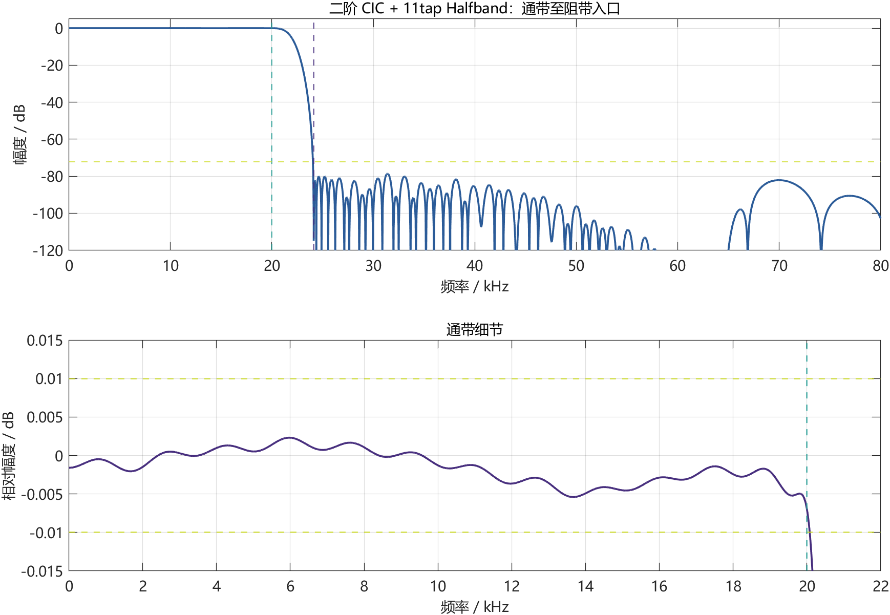
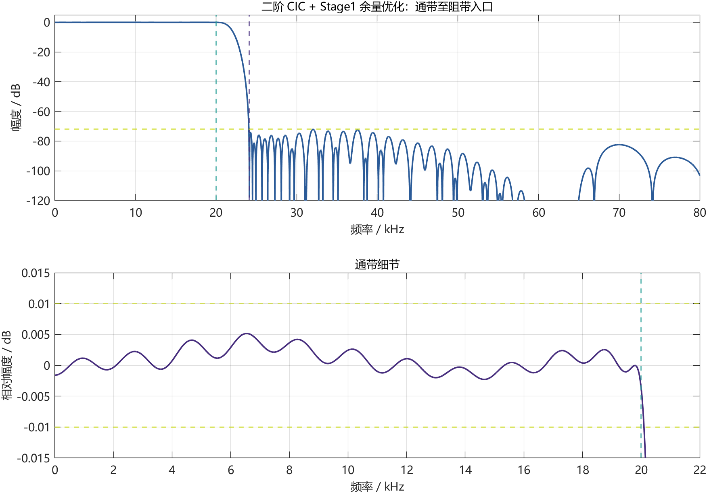

# Phase 8 优化指导评估与执行报告

## 1. 当前基线与指导文件校正

`phase8_next_optimization_guidance.md` 的总体方向有参考价值，尤其是“冻结可回退版本、每次只改变一个主变量、统一验证门槛、用实现结果建立 Pareto 前沿”四项原则。但文档写作时的最低资源点仍是 `478 LUT / 9 DSP`，且尚未完成实板闭环；当前工程已经推进到以下已验证基线：

| 项目 | 当前板测基线 |
|---|---:|
| 架构 | `2x × 2x × 2x × CIC16(N=3)` |
| LUT / FF | 472 / 564 |
| DSP48E1 | 8 |
| BRAM Tile | 3 |
| WNS / WHS | +46.446 / +0.093 ns |
| 通带最大绝对误差 | 0.00303062 dB |
| 阻带衰减 | 72.349 dB |
| 板测时钟 | 44.09 kHz、176.43 kHz、352.86 kHz、5.64 MHz |
| 板测波形 | 四档均为正常正弦波 |

因此，指导中的 Phase 8A 已由当前提交完成；后续实验必须在该基线上独立进行，不能覆盖稳定 bitstream。

## 2. 指导内容的采纳情况

| 指导方向 | 处理 | 原因 |
|---|---|---|
| 实板闭环与回退版本 | 已完成 | 472 LUT / 8 DSP 已完成四档板测并提交 Git |
| 真实活动率功耗 Pareto | 保留后续 | 当前 `0.169 W` 为 vectorless 估计，SAIF 对比有意义，但不直接减少 LUT/DSP |
| CIC 倍率、阶数与 Halfband 联合搜索 | 已执行 | 这是判断能否从 8 DSP 降到 7 DSP 的关键数学筛选 |
| Stage2/3 RAM 打包 | 已执行 | 改动局部、可参数关闭，适合先做低风险实现 A/B |
| 更激进的全局 DSP 调度 | 暂缓 | 会同时改变多级状态机、valid 时序与复位边界，风险高于本轮收益 |
| 继续缩短字长 | 暂缓 | 当前阻带工程余量约 2.35 dB，不在缺少定点噪声证据时激进截位 |

## 3. Stage2/3 交叉打包 BRAM 实验

### 3.1 设计方法

Stage2 和 Stage3 不会同时执行 MAC。实验版利用这一时序互斥关系建立两块打包 RAM：Stage2 计算时从 A RAM 读取历史、从 B RAM 读取 Stage2 系数；Stage3 计算时交换两块 RAM 的职责。这样把原来的两个历史 RAM 与两个系数 RAM 由 4 个 `RAMB18E1` 收敛为 2 个 `RAMB18E1`。

该实现由 `USE_PACKED_BRAM_STAGE23` 参数控制，默认值为 0；已板测基线的数据路径和系数不变。

### 3.2 验证覆盖

| 验证项目 | 覆盖 | 结果 |
|---|---|---|
| Stage2/3 单元对拍 | Stage2 336 点、Stage3 671 点，含冲激、随机和中途复位 | 0 LSB |
| 正式顶层 daily | 冲激 + 4 个随机种子 | 4x/8x/128x 全部 0 LSB |
| 正式顶层 nightly | 冲激 + 10 个随机种子，每组 4096 输入点 | 5,355,552 个 128x 输出点及中间节点全部 0 LSB |
| 复位恢复 | 8 个内部状态场景 | 全部通过 |
| 动态切档 | 10 次无复位切换 | 无窄脉冲、X 或计数错误 |
| 综合、实现与 bitstream | 正式板级顶层 | 全部完成，无 DRC Error |

### 3.3 实现结果

| 指标 | 472 LUT 板测基线 | 打包 BRAM 候选 | 变化 |
|---|---:|---:|---:|
| LUT | 472 | 484 | +12 |
| FF | 564 | 564 | 0 |
| DSP48E1 | 8 | 8 | 0 |
| BRAM Tile | 3.0 | 2.5 | -0.5 |
| WNS / WHS | +46.446 / +0.093 ns | +46.156 / +0.113 ns | 均通过 |
| 功耗估计 | 0.169 W | 0.169 W | 0 |

该候选通过了“BRAM 至少下降 0.5 Tile、LUT 增量不超过 20、时序与逐点对拍通过”的 Go 条件，是一个有效的存储优先 Pareto 点；但它不优于 472 LUT 基线的最低 LUT，因此不作为默认板级版本。

候选 bitstream：

```text
matlab_fir/alt_all2x_v7/vivado_results/board_folded_n3_stage23_bram_coeff_compact_keypad_sharedscan_areaopt_dsp8_packedbram/phase8_packed_bram_dsp8_amp050.bit
SHA256: 842EE7BE734BF7AAE5EDC2F1DF23EAC19E11C5EB135AC7C3E05C476CD788DA57
```

## 4. CIC/Halfband 尾级联合搜索

### 4.1 搜索范围与门槛

保持前两级 FIR、总倍率 128 和最终采样率 5.6448 MHz 不变，对以下尾级倍率分配进行比较：

```text
CIC16
2x Halfband + CIC8
CIC8 + 2x Halfband
2x Halfband + 2x Halfband + CIC4
2x Halfband + CIC4 + 2x Halfband
CIC4 + 2x Halfband + 2x Halfband
```

每种结构均重新设计 11/15/19 tap Stage3 折叠补偿 FIR，并搜索 CIC 阶数、系数字长和阻带权重。统一门槛为通带最大绝对误差不超过 0.01 dB、阻带至少 72 dB、冲激响应对称。

### 4.2 满足 72 dB 门槛的候选

| 尾级结构 | CIC 阶数 | DSP 共享估算 | DSP 独立估算 | 通带误差 | 阻带衰减 |
|---|---:|---:|---:|---:|---:|
| CIC16 | 3 | 8 | 8 | 0.00318129 dB | 72.3663 dB |
| 2x Halfband + CIC8 | 3 | 9 | 9 | 0.00292962 dB | 78.5921 dB |
| 2x Halfband + 2x Halfband + CIC4 | 3 | 9 | 10 | 0.00305852 dB | 78.5912 dB |
| 2x Halfband + CIC4 + 2x Halfband | 3 | 9 | 10 | 0.00315603 dB | 78.5926 dB |


所有通过 72 dB 门槛的结构都仍需 3 阶 CIC。拆分倍率虽将阻带提高约 6.2 dB，但至少增加一颗 Halfband 串行 MAC；它们不能减少 DSP，也会增加控制、状态和存储，因此当前 `CIC16(N=3)` 仍是最低资源的稳健结构。

### 4.3 二阶 CIC 的 7 DSP 研究候选

初筛中最接近门槛的二阶候选为：

| 结构 | DSP 共享估算 | 通带误差 | 阻带衰减 | 距 72 dB |
|---|---:|---:|---:|---:|
| 2x Halfband + 2x Halfband + CIC4(N=2) | 7 | 0.00296014 dB | 71.5468 dB | -0.4532 dB |

该方案满足赛题 `70 dB` 下限，但没有达到本阶段 72 dB 保守门槛。为了判断约 `0.45 dB` 的差距能否通过系数优化消除，本轮又依次进行了四组定点搜索。所有结果均使用 `2^20` 点频率网格精确复算，而不是只采用低分辨率预筛值。

| 搜索步骤 | 主要改变 | 通带最大绝对误差 / dB | 阻带衰减 / dB | 72 dB 判定 |
|---|---|---:|---:|---|
| 初始二阶 CIC 候选 | 7 tap Halfband + 原 Stage3 | 0.00296014 | 71.54678770 | 未通过 |
| Halfband 与 Stage3 联合优化 | 两级 7 tap Q8 Halfband、11/15 tap Stage3、Q14/Q15 | 0.00319857 | 71.54703673 | 未通过 |
| 加长 Halfband | 两级 11 tap Q8/Q10/Q12 Halfband | 0.00689974 | 71.55077836 | 未通过 |
| 既有 Stage1 库复筛 | 41～125 tap、Q14～Q16 | 0.00515985 | **71.58790137** | 未通过 |
| 二阶 CIC 专用 Stage1 重设计 | 97～129 tap、20.0～21.4 kHz 原型边缘、Q15/Q16 | 0.00425055 | 71.58681595 | 未通过 |







两级 Halfband 加长后阻带只改善约 `0.004 dB`，说明最终阻带峰值并不由尾部 Halfband 的镜像抑制主导。在 24.1 kHz 阻带入口附近，这两级 Halfband 仍处于各自的低频通带；限制项主要来自前级半带响应和二阶 CIC 下垂/镜像的乘积。Stage1 库复筛把阻带提高到本轮最佳 `71.58790137 dB`，仍比工程门槛少 `0.41209863 dB`。在 32 个对称 MAC 对、129 tap 和现有定点格式范围内，继续移动 Stage1 原型边缘没有形成通过项。

7 DSP 还依赖两个 Halfband 共用一颗串行 DSP 的调度假设。由于数学模型已经未通过 72 dB 准入，按预设 Stop/Go 流程没有创建该架构的 RTL、仿真向量、实现结果或 bitstream。因此不能把“7 DSP”表述为已经综合得到的资源数据，也不存在可报告的 LUT 实现值。

## 5. 结论

`472 LUT / 8 DSP` 不是器件层面的绝对最小值，但已是当前 `3×2x FIR + CIC16(N=3)`、20 MHz 板载输入时钟与 5.6448 MHz 音频处理时钟架构、0 LSB 验证及 72 dB 工程门槛共同约束下的局部最优点：

1. LUT 再降需要重写共享调度或改变存储映射，收益可能只有个位数到十余个 LUT，验证成本显著上升。
2. DSP 理论上可降至 7；经过 Halfband、Stage3 和 Stage1 的联合搜索后，本轮最佳数学候选为 71.58790137 dB，仍低于 72 dB，且共享调度尚未进入 RTL。
3. BRAM 可以由 3 降到 2.5 Tile，但实现结果会把 LUT 从 472 增到 484。
4. 因此当前正式板级版本继续保持 472 LUT / 8 DSP；484 LUT / 8 DSP / 2.5 BRAM 作为存储优先 Pareto 候选；7 DSP 路线因数学门槛失败止步于 MATLAB，不覆盖稳定基线，也不写入 Vivado 工程。
