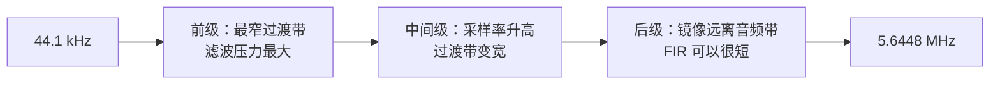
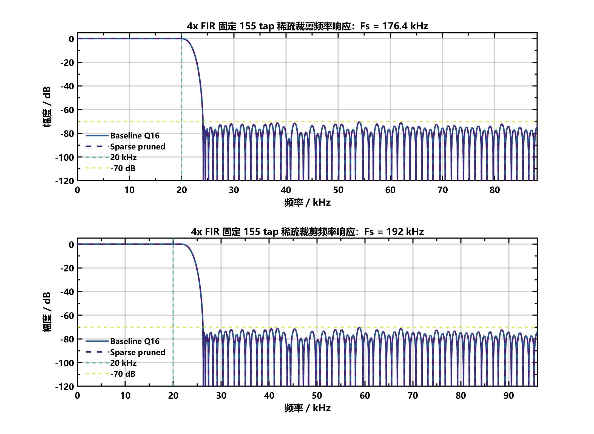
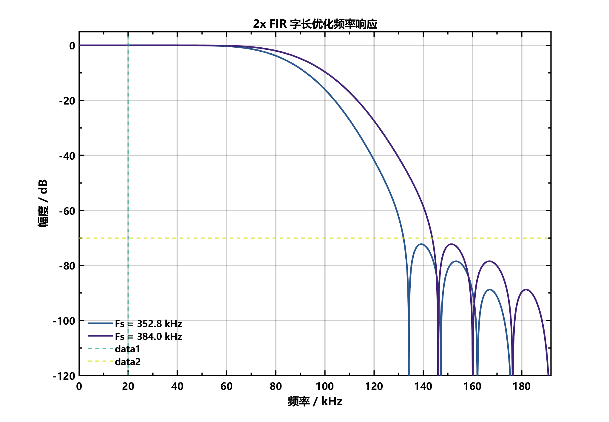
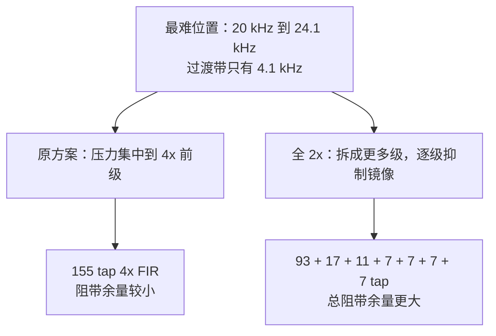

# 128 倍插值 FIR 滤波器方案分析对比报告

## 1. 设计目标

本工程面向高保真音频重构，需要把低采样率 PCM 音频信号插值到高速 DAC 输出采样率。当前展示版本不再要求兼容 48 kHz，只需要完成：

```text
输入采样率：44.1 kHz
输出采样率：5.6448 MHz
插值倍数：128 倍
```

赛题核心指标如下：

| 指标 | 要求 |
|---|---:|
| 通带范围 | 10 Hz ~ 20 kHz |
| 通带纹波 | <= ±0.05 dB |
| 阻带衰减 | >= 70 dB |
| 相位响应 | 严格线性相位 |

当前重点对比两种 128 倍插值结构：

| 方案 | 结构 | 定位 |
|---|---|---|
| 原方案 | `4x + 2x + 2x + 2x + 2x + 2x` | 通用稳定方案，兼容 44.1 kHz / 48 kHz |
| 新方案 | `2x + 2x + 2x + 2x + 2x + 2x + 2x` | 44.1 kHz 专用优化方案 |

## 2. 为什么插值后需要 FIR 低通滤波器

数字插值不是简单“把采样率变高”。插值通常分两步：

1. 插零上采样：在原始采样点之间插入零值。
2. 低通滤波：滤除插零产生的频谱镜像。

设原始序列为 `x[n]`，插值倍数为 `L`，插零后的序列为：

```math
x_u[n] =
\begin{cases}
x[n/L], & n = 0, \pm L, \pm 2L, \cdots \\
0,      & \text{otherwise}
\end{cases}
```

插零后，频谱会被压缩并在新的采样率范围内重复出现镜像。为了得到真实的高采样率音频，需要保留 0 ~ 20 kHz 的音频通带，同时抑制 20 kHz 以上的镜像。

### 2.1 插值处理流程图


### 2.2 频谱镜像示意

```text
插值前：

幅度
 ^
 |      有效音频
 |      |------|
 +------+------|----------------------> f
        0     20k

插零后：

幅度
 ^
 |      有效音频      镜像        镜像        镜像
 |      |------|      |--|        |--|        |--|
 +------+------|------|--|--------|--|--------|--|----> f
        0     20k    Fs-20k       ...

低通 FIR 后：

幅度
 ^
 |      有效音频
 |      |------|_______________________________
 +------+------|-------------------------------> f
        0     20k   阻带镜像被抑制
```

滤波过程为：

```math
y[n] = \sum_{k=0}^{N-1} h[k] x_u[n-k]
```

其中 `h[k]` 为 FIR 滤波器系数。

## 3. 为什么选择 FIR 而不是 IIR

### 3.1 FIR 可以实现严格线性相位

音频系统不仅关注幅频响应，也关注相位响应。若不同频率成分延迟不同，瞬态波形可能出现失真。FIR 只要系数左右对称：

```math
h[k] = h[N-1-k]
```

就可以得到线性相位：

```math
H(e^{j\omega}) = e^{-j\omega (N-1)/2} A(\omega)
```

对应群延迟为常数：

```math
\tau_g = \frac{N-1}{2}
```

这意味着通带内各频率成分延迟一致，波形形状不会被相位扭曲。

### 3.2 FIR 天然稳定

FIR 没有反馈路径，输出只由有限个输入样本加权求和得到。只要系数有限，系统一定稳定。相比 IIR，FIR 在 FPGA 定点实现中更容易验证稳定性。

### 3.3 FIR 适合 FPGA 结构优化

FIR 是典型乘加结构：

```math
y[n] = h[0]x[n] + h[1]x[n-1] + \cdots + h[N-1]x[n-N+1]
```

若系数对称，可以把两个对称采样点先相加，再乘同一个系数：

```math
h[k]x[n-k] + h[N-1-k]x[n-(N-1-k)]
= h[k]\{x[n-k] + x[n-(N-1-k)]\}
```

因此乘法器数量接近减半，适合在 FPGA 中用 DSP、LUT 或时分复用 MAC 实现。

## 4. 为什么使用等波纹法设计 FIR

本工程 FIR 设计本质上是 Parks-McClellan / Remez 等波纹设计。它求解的是最小最大误差问题：

```math
\min_h \max_{\omega \in \Omega}
W(\omega) \left| H_d(\omega) - H(\omega) \right|
```

其中：

| 符号 | 含义 |
|---|---|
| `H_d(ω)` | 理想频率响应 |
| `H(ω)` | 实际 FIR 频率响应 |
| `W(ω)` | 权重函数 |
| `Ω` | 通带和阻带频率集合 |

低通插值滤波器的理想响应为：

```math
H_d(\omega) =
\begin{cases}
1, & \omega \in \text{通带} \\
0, & \omega \in \text{阻带}
\end{cases}
```

等波纹法让加权后的最坏误差最小，所以设计结果中通带和阻带误差会呈现较均匀的起伏。

### 4.1 等波纹法与窗函数法对比

| 方法 | 优点 | 缺点 | 本工程适配性 |
|---|---|---|---|
| 海明窗 / 汉宁窗 / 布莱克曼窗 | 设计简单，参数少 | 通带纹波、阻带衰减、过渡带宽度不易同时精确控制 | 适合快速估计，不适合作为最终资源优化 |
| 等波纹法 | 可直接约束通带纹波和阻带衰减，阶数通常更低 | 设计过程更复杂，需要设置权重和边界 | 适合 FPGA 资源敏感的高指标设计 |

### 4.2 阻带衰减的数学含义

若要求阻带衰减不小于 `A_s dB`，则阻带幅度应满足：

```math
|H(e^{j\omega})| \le \delta_s
```

其中：

```math
\delta_s = 10^{-A_s/20}
```

例如 `70 dB` 阻带衰减对应：

```math
\delta_s = 10^{-70/20} \approx 3.16 \times 10^{-4}
```

所以阻带是否合格，要看最高阻带峰值是否低于 `-70 dB`。图上阻带线条看起来起伏很大，是因为 dB 坐标把极小线性幅度差异放大显示了。

## 5. 为什么采用多级插值

如果直接设计一个 128 倍插值 FIR，滤波任务全部集中到一个滤波器中，阶数会非常高，不适合 FPGA 实现。

多级插值把大倍率分解成若干小倍率：

```math
128 = 4 \times 2^5
```

或：

```math
128 = 2^7
```

每一级只处理一部分镜像抑制任务。随着采样率升高，后级的过渡带相对变宽，所需 tap 数会迅速下降。



## 6. 原方案：4x + 5 级 2x

原方案结构如下：

```mermaid
flowchart LR
    A["44.1 kHz 输入"] --> B["4x FIR<br/>155 tap, Q16"]
    B --> C["176.4 kHz"]
    C --> D["2x FIR<br/>29 tap, Q12"]
    D --> E["352.8 kHz"]
    E --> F["2x FIR<br/>29 tap, Q12"]
    F --> G["705.6 kHz"]
    G --> H["2x FIR<br/>29 tap, Q12"]
    H --> I["1.4112 MHz"]
    I --> J["2x FIR<br/>29 tap, Q12"]
    J --> K["2.8224 MHz"]
    K --> L["2x FIR<br/>29 tap, Q12"]
    L --> M["5.6448 MHz 输出"]
```



特点：

1. 前级使用 155 tap 的 4x FIR。
2. 后级 5 个 2x FIR 复用同一套 29 tap 公共系数。
3. 兼容 44.1 kHz 和 48 kHz 两种输入采样率。
4. RTL 已经实现，板级风险低。

### 6.1 原方案总链路 MATLAB 结果

由 `check_interp128_chain_common.m` 重新运行得到 44.1 kHz 模式总链路指标：

| 项目 | 数值 |
|---|---:|
| 结构 | `4x + 5 级 2x` |
| 输入采样率 | 44.1 kHz |
| 输出采样率 | 5.6448 MHz |
| 等效总冲激响应长度 | 5797 tap |
| 通带峰峰纹波 | 0.033543 dB |
| 通带 ±纹波 | 0.017265 dB |
| 阻带起始频率 | 24.1 kHz |
| 阻带衰减 | 70.339176 dB |
| 平均群延迟 | 2898 个最终采样点 |
| 群延迟波动 | 0.000000000007 个最终采样点 |
| 指标判定 | 通过 |

### 6.2 原方案总链路频响图


从图中可以看到：

1. 通带响应保持在 ±0.05 dB 范围内。
2. 阻带最高峰略低于 -70 dB，满足赛题要求。
3. 群延迟在通带内几乎为水平直线，说明线性相位成立。
4. 该方案的阻带余量较小，最差点距离 -70 dB 只有约 `0.339 dB`。

### 6.3 原方案单级图

4x 前级频响如下：



公共 2x 后级频响如下：



原方案的关键单级数据：

| 模块 | taps | 系数字长 | 小数位 | 非零半系数 | 代表性指标 |
|---|---:|---:|---:|---:|---|
| 4x 前级 | 155 | 18 bit | Q16 | 78 | 176.4 kHz 模式阻带 70.236 dB |
| 公共 2x 后级 | 29 | 14 bit | Q12 | 12 | 352.8 kHz 模式阻带 80.427 dB |

资源复杂度可按非零半系数估算：

```text
4x 前级：78
5 个 2x 后级：5 × 12 = 60
合计：138 个非零半系数
```

注意：这个 `138` 是算法乘加复杂度估算，不等于最终 FPGA DSP 数量。当前 4x RTL 已经采用 polyphase + 2-lane MAC 时分复用，因此实际 DSP 数量会低于完全并行实现。

## 7. 新方案：全 2x 七级级联

新方案结构如下：

```mermaid
flowchart LR
    A["44.1 kHz 输入"] --> S1["Stage1 2x<br/>93 tap, Q16"]
    S1 --> B["88.2 kHz"]
    B --> S2["Stage2 2x<br/>17 tap, Q15"]
    S2 --> C["176.4 kHz"]
    C --> S3["Stage3 2x<br/>11 tap, Q14"]
    S3 --> D["352.8 kHz"]
    D --> S4["Stage4 2x<br/>7 tap, Q15"]
    S4 --> E["705.6 kHz"]
    E --> S5["Stage5 2x<br/>7 tap, Q13"]
    S5 --> F["1.4112 MHz"]
    F --> S6["Stage6 2x<br/>7 tap, Q12"]
    S6 --> G["2.8224 MHz"]
    G --> S7["Stage7 2x<br/>7 tap, Q12"]
    S7 --> H["5.6448 MHz 输出"]
```



设计策略：

1. 每一级都按当前采样率单独设计，不再强行复用同一套 2x 系数。
2. 每一级都使用等波纹 FIR。
3. 每一级进行 `COEFF_W / FRAC_W` 搜索。
4. 每一级尝试小系数裁剪。
5. 最终构造 128x 总链路，统一检查通带增益、通带纹波、阻带衰减和线性相位。

### 7.1 全 2x 总链路 MATLAB 结果

由 `alt_all2x/design_all2x_interp128_compare.m` 得到：

| 项目 | 数值 |
|---|---:|
| 结构 | `7 级 2x` |
| 输入采样率 | 44.1 kHz |
| 输出采样率 | 5.6448 MHz |
| 等效总冲激响应长度 | 6651 tap |
| 总非零半系数 | 77 |
| 通带峰峰纹波 | 0.01284192 dB |
| 通带 ±纹波 | 0.00793139 dB |
| 通带最大绝对误差 | 0.00729793 dB |
| 通带平均增益 | 0.00063346 dB |
| 阻带起始频率 | 24.1 kHz |
| 阻带衰减 | 77.67936345 dB |
| 平均群延迟 | 3325 个最终采样点 |
| 群延迟波动 | 0.000000000007 个最终采样点 |
| 指标判定 | 通过 |

### 7.2 全 2x 总链路频响图


从图中可以看到：

1. 通带波动明显小于 ±0.05 dB 指标线。
2. 阻带最高峰约为 -77.68 dB，比 -70 dB 要求多出约 7.68 dB 余量。
3. 群延迟平坦，线性相位成立。
4. 相比原方案，阻带余量明显更大，频响展示效果更好。

### 7.3 全 2x 每级结果

| 级数 | 采样率变化 | taps | 系数字长 | 小数位 | 非零半系数 | 单级通带 ±纹波 | 单级阻带衰减 |
|---:|---|---:|---:|---:|---:|---:|---:|
| Stage 1 | 44.1 kHz -> 88.2 kHz | 93 | 18 bit | Q16 | 47 | 0.00299058 dB | 76.80774808 dB |
| Stage 2 | 88.2 kHz -> 176.4 kHz | 17 | 17 bit | Q15 | 9 | 0.00202951 dB | 80.08972545 dB |
| Stage 3 | 176.4 kHz -> 352.8 kHz | 11 | 16 bit | Q14 | 6 | 0.00094842 dB | 86.14152444 dB |
| Stage 4 | 352.8 kHz -> 705.6 kHz | 7 | 17 bit | Q15 | 4 | 0.00156668 dB | 85.59695318 dB |
| Stage 5 | 705.6 kHz -> 1.4112 MHz | 7 | 15 bit | Q13 | 4 | 0.00009304 dB | 103.85416020 dB |
| Stage 6 | 1.4112 MHz -> 2.8224 MHz | 7 | 14 bit | Q12 | 4 | 0.00000739 dB | 129.95819486 dB |
| Stage 7 | 2.8224 MHz -> 5.6448 MHz | 7 | 14 bit | Q12 | 3 | 0.00000020 dB | 140.26445465 dB |

全 2x 的主要特点是：Stage 1 承担最窄过渡带，所以 tap 数较多；后级镜像远离音频通带，FIR 迅速变短。

```text
全 2x 每级 taps：
Stage1   93 | ██████████████████████████████████████████████
Stage2   17 | ████████
Stage3   11 | █████
Stage4    7 | ███
Stage5    7 | ███
Stage6    7 | ███
Stage7    7 | ███
```

## 8. 图片结果并排对比

### 8.1 总链路频响对比

| 原方案：4x + 5 级 2x | 新方案：全 2x 七级 |
|---|---|
|  |  |

观察结论：

1. 原方案已经满足赛题指标，但阻带最高峰接近 -70 dB 指标线。
2. 全 2x 方案阻带峰值更低，约为 -77.68 dB。
3. 全 2x 方案通带曲线更贴近 0 dB，通带纹波更小。
4. 两种方案群延迟都非常平坦，都满足严格线性相位。

### 8.2 指标条形对比

数值越小越好的指标：

```text
通带 ±纹波
原方案  0.017265 dB | █████████████████
全2x    0.007931 dB | ████████
```

数值越大越好的指标：

```text
阻带衰减
原方案  70.339 dB | ███████████████████████████████████
全2x    77.679 dB | ████████████████████████████████████████
```

资源复杂度估算，数值越小越好：

```text
非零半系数数量
原方案  138 | ████████████████████████████
全2x     77 | ███████████████
```

延迟，数值越小越好：

```text
平均群延迟
原方案  2898 点 | █████████████████████████████
全2x    3325 点 | █████████████████████████████████
```

## 9. 核心指标对比分析

| 对比项 | 原方案 `4x + 5级2x` | 新方案 `全2x七级` | 结论 |
|---|---:|---:|---|
| 是否兼容 48 kHz | 支持 | 当前不支持 | 原方案兼容性更好 |
| 是否针对 44.1 kHz 单独优化 | 否 | 是 | 全 2x 更适合当前展示版本 |
| 等效总冲激响应长度 | 5797 tap | 6651 tap | 全 2x 等效长度更长，但不等于硬件 tap 数 |
| 通带峰峰纹波 | 0.033543 dB | 0.01284192 dB | 全 2x 更平坦 |
| 通带 ±纹波 | 0.017265 dB | 0.00793139 dB | 全 2x 约降低 54.1% |
| 通带最大绝对误差 | 未单独统计 | 0.00729793 dB | 全 2x 远小于 ±0.05 dB |
| 阻带衰减 | 70.339176 dB | 77.679363 dB | 全 2x 多约 7.34 dB |
| 阻带余量 | 0.339176 dB | 7.679363 dB | 全 2x 余量更充足 |
| 平均群延迟 | 2898 点 | 3325 点 | 原方案延迟更小 |
| 延迟时间 | 约 0.513 ms | 约 0.589 ms | 全 2x 增加约 0.076 ms |
| 非零半系数估算 | 138 | 77 | 全 2x 约减少 44.2% |
| RTL 成熟度 | 已实现 | 已完成位真、仿真对拍和独立综合 | 均已具备板级接入条件 |

### 9.1 通带性能

原方案总通带 ±纹波为：

```text
0.017265 dB
```

全 2x 总通带 ±纹波为：

```text
0.00793139 dB
```

降低比例为：

```math
\frac{0.017265 - 0.00793139}{0.017265} \approx 54.1\%
```

因此，全 2x 的音频通带更平坦，幅度保真度更好。

### 9.2 阻带性能

原方案阻带衰减为：

```text
70.339176 dB
```

全 2x 阻带衰减为：

```text
77.679363 dB
```

全 2x 提高了：

```text
77.679363 - 70.339176 = 7.340187 dB
```

这意味着全 2x 对插值镜像的抑制更强。原方案只是刚刚越过 70 dB 指标线，全 2x 则有明显余量。

### 9.3 资源复杂度

按对称 FIR 的非零半系数数量估算：

```text
原方案：78 + 5 × 12 = 138
全 2x：47 + 9 + 6 + 4 + 4 + 4 + 3 = 77
```

减少比例为：

```math
\frac{138 - 77}{138} \approx 44.2\%
```

所以，从算法乘加复杂度看，全 2x 更节省。

但必须注意：

1. 原方案的 4x 前级 RTL 已经采用 polyphase + 2-lane MAC 时分复用。
2. 全 2x 若直接并行展开 Stage 1 的 93 tap，不一定比原方案省。
3. 全 2x 若也使用对称结构和时分复用 MAC，才更容易把“非零系数减少”转化为真实 FPGA 资源减少。

因此，严格表述应为：

```text
全 2x 在算法复杂度上更优，理论乘加资源更少；
最终 LUT/DSP/寄存器资源是否更少，需要对应 RTL 综合结果确认。
```

### 9.4 延迟

原方案平均群延迟：

```text
2898 / 5.6448 MHz ≈ 0.513 ms
```

全 2x 平均群延迟：

```text
3325 / 5.6448 MHz ≈ 0.589 ms
```

全 2x 多约：

```text
0.076 ms
```

该延迟差异对音频展示基本没有影响，但从纯低延迟角度看，原方案更优。

## 10. 为什么全 2x 当前表现更好

原 4x 前级一次完成 4 倍插值，第一镜像入口为：

```text
44.1 kHz - 20 kHz = 24.1 kHz
```

通带到 20 kHz，阻带从 24.1 kHz 开始，因此过渡带只有：

```text
24.1 kHz - 20 kHz = 4.1 kHz
```

这是整个系统最难的滤波位置。原方案把较大压力集中在 4x 前级中，导致 4x 前级需要 155 tap，而且阻带余量不多。

全 2x 虽然 Stage 1 也面对相同的 4.1 kHz 过渡带，但它只做 2x 插值，并且后续每一级都针对当前采样率重新设计。后级采样率越高，镜像越远离音频通带，过渡带越宽，滤波器就越短。



## 11. 两种方案的工程取舍

### 11.1 原方案适合什么情况

原 `4x + 5级2x` 方案适合：

1. 需要同时支持 44.1 kHz 和 48 kHz。
2. 更看重板级稳定性。
3. 不希望临近比赛大改 RTL。
4. 希望保留现有 `4x / 8x / 128x` 调试输出结构。

该方案已经满足指标，属于“稳妥可交付方案”。

### 11.2 全 2x 方案适合什么情况

全 `2x × 7` 方案适合：

1. 当前只要求 44.1 kHz 展示。
2. 希望通带纹波和阻带衰减更漂亮。
3. 希望在报告中体现结构优化、字长优化和分级设计思想。
4. 愿意为更优指标承担一定 RTL 改动成本。

该方案更适合作为“性能优化方案”和“创新性展示方案”。

## 12. 全 2x RTL、位真与综合结果

全 2x 方案已经从 MATLAB 频响模型推进到可综合 RTL。新增文件均已写入 Vivado 工程文件，不需要手动 Add Sources。

### 12.1 RTL 结构

| 文件 | 作用 |
|---|---|
| `fir_core_symm_interp2_stage1_mac.v` | Stage 1 的 47 次乘加单 DSP 时分复用核 |
| `fir_core_symm_interp2_all2x.v` | Stage 2~7 的短 FIR 常系数 LUT 核 |
| `interp2_top_symm_ce_all2x.v` | 根据 `STAGE_ID` 选择 Stage 1 MAC 或后级并行核 |
| `interp128_all2x_top_ce.v` | 七级 2x 串联的 128 倍插值顶层 |
| `tb_interp128_all2x_top_ce.v` | 冲激响应仿真 |
| `tb_interp128_all2x_random_ce.v` | 随机 24 bit PCM 仿真 |

Stage 1 每个输入样本之间有 128 个最终时钟周期，每个 2x 输出相位约有 64 个周期可用；对称结构只需 47 次乘加，因此在当前 `5.6448 MHz` 时钟下可由一个 DSP 完成，不依赖指南中假设的 100 MHz 系统时钟。

### 12.2 位真验证

逐级 24 bit 舍入、饱和和累加器位宽均已建模。正常幅度测试结果如下：

| 测试 | 幅度误差 | SNR | 累加器溢出 | 输出饱和 |
|---|---:|---:|---:|---:|
| 1 kHz, -1 dBFS | -0.003740 dB | 83.409 dB | 0 | 0 |
| 19 kHz, -6 dBFS | -0.000487 dB | 80.699 dB | 0 | 0 |
| 20 kHz, -6 dBFS | -0.007778 dB | 77.059 dB | 0 | 0 |
| 1 kHz, -110 dBFS | +0.013108 dB | 30.439 dB | 0 | 0 |
| 随机 21 bit PCM | 不适用 | 不适用 | 0 | 0 |

正满幅、负满幅和满幅交替测试允许触发 24 bit 边界饱和，用于确认饱和逻辑工作；正常音频测试没有饱和。

### 12.3 MATLAB 与 RTL 逐点对拍

| 向量 | 比较样点数 | 最大误差 | 不一致样点 |
|---|---:|---:|---:|
| 冲激响应 | 6651 | 0 LSB | 0 |
| 随机 PCM | 22907 | 0 LSB | 0 |

这说明 RTL 的系数顺序、polyphase 相位、舍入、饱和和流水延迟均与 MATLAB 位真模型一致。

### 12.4 同口径综合对比

综合条件统一为 Vivado 2018.3、`xc7a35tfgg484-2`、`5.6448 MHz`，统计范围均为独立 128 倍插值链路，不包含 MMCM、DAC 接口和板级控制逻辑。

| 方案 | LUT | FF | DSP | BRAM | WNS |
|---|---:|---:|---:|---:|---:|
| 原 `4x + 5级2x` | 9002 | 4497 | 2 | 0 | +165.584 ns |
| 全 2x 直接并行基线 | 9376 | 4118 | 38 | 0 | +134.988 ns |
| 全 2x：Stage 1 单 DSP，后级 LUT | 5912 | 4218 | 1 | 0 | +165.930 ns |

最终全 2x RTL 相对原方案：

```text
LUT：9002 -> 5912，减少 34.3%
FF ：4497 -> 4218，减少 6.2%
DSP：2 -> 1，减少 50.0%
BRAM：均为 0
时序：两者均满足 5.6448 MHz，且余量充足
```

直接并行全 2x 会占用 38 个 DSP，并不合理。采用“Stage 1 单 DSP 时分复用 + Stage 2~7 LUT 常系数乘法”后，算法层面的系数优势才真正转化为 FPGA 资源优势。完整数据见 `alt_all2x/all2x_final_comparison.csv`。

### 12.5 板级接入与实现结果

全 2x 链路已经接入 `board_demo_competition_dac8_top`。当前板级版本只实例化 `clk_wiz_audio_44k1`，上电默认进入 128x 模式；按键可切换 4x、8x 和 128x 输出。`mode_sel` 使用两级同步器跨入音频时钟域，20 MHz 控制域与 5.6448 MHz 音频域按异步时钟组约束。

布局布线后的完整板级结果如下：

| 项目 | 结果 |
|---|---:|
| LUT | 6426 / 20800，30.89% |
| FF | 4416 / 41600，10.62% |
| DSP | 1 / 90，1.11% |
| BRAM | 0 |
| WNS / TNS | +44.635 ns / 0 ns |
| WHS / THS | +0.093 ns / 0 ns |
| 音频域 WNS | +77.167 ns |
| 估算总功耗 | 0.168 W，Low confidence |

bitstream 已生成：

```text
XC7A35T_interp_audio_pcm_wordlen_opt/reports_all2x_board/
board_demo_competition_dac8_top_all2x.bit
```

预下载 DRC 为 0 Error、4 Warning。四条 Warning 均为 Stage 1 单 DSP MAC 未启用 DSP 内部流水寄存器的性能建议；当前时序余量充足，不影响本版本通过。

### 12.6 当前剩余工作

```text
MATLAB 浮点频响：已完成
逐级 bit-true：已完成
RTL coding：已完成
冲激/随机 RTL 对拍：已完成，0 LSB
独立插值链综合：已完成
板级顶层接入：已完成
布局布线与时序：已完成，全部约束通过
功耗初步估算：已完成，需上板活动数据提高置信度
bitstream：已生成
上板 DAC 验证：待执行
```

## 13. 推荐答辩表述

可以这样组织答辩逻辑：

```text
首先，我们完成了通用 4x + 5级2x 的 128 倍插值链路。
该方案可以兼容 44.1 kHz 和 48 kHz，已经满足通带纹波、阻带衰减和线性相位指标。

进一步地，针对本次分赛区展示只要求 44.1 kHz 的条件，
我们提出 44.1 kHz 专用的全 2x 七级插值结构。
该结构不再复用同一套 2x 系数，而是对每一级按采样率单独等波纹设计，
并进行字长搜索和小系数裁剪。

MATLAB 验证结果表明，全 2x 方案将总通带 ±纹波从 0.017265 dB 降低到 0.007931 dB，
阻带衰减从 70.339 dB 提高到 77.679 dB，
非零半系数估算数量从 138 降低到 77。

进一步采用 Stage 1 单 DSP 时分复用和后级 LUT 常系数结构后，
同口径综合结果将 LUT 从 9002 降低到 5912，DSP 从 2 降低到 1，
并且冲激响应和随机 PCM 均与 MATLAB 位真模型达到 0 LSB 一致。
因此，在当前只展示 44.1 kHz 的条件下，全 2x 是频响更优且实际资源更少的优化方案。
```

## 14. 对后续优化指南的采纳与修正

`all2x_matlab_next_steps_guide.md` 的总体路线具有参考价值，已经采纳并完成以下内容：

1. 每级补偿 2 倍插值增益，检查 `dc_gain ≈ 2`、两相增益均约为 1。
2. 使用通带最大绝对误差作为最终判定，避免平均增益与相对纹波分开通过时漏判。
3. 自动计算系数最小位宽和累加器推荐位宽。
4. 建立逐级 24 bit bit-true 模型并覆盖冲激、直流、正弦、小信号、满幅和随机 PCM。
5. 导出 RTL 参数、随机输入和 golden 输出。
6. Stage 1 使用单 DSP 时分复用，后六级使用 LUT 常系数结构。
7. 完成 MATLAB 与 RTL 的 0 LSB 对拍以及同口径综合对比。

指南中“所有级统一使用 `Fs_in_stage - 20 kHz` 作为阻带起点”的建议不适用于本工程最终等效滤波器的验收。实际试跑后，总阻带在约 66 kHz 处只剩约 66.15 dB，无法保证从 24.1 kHz 起全频段均低于 -70 dB。最终保留较保守的定义：

```text
Stage 1：24.1 kHz
Stage 2~7：Fs_in_stage - 24.1 kHz
```

原因是后级还需要继续抑制前级 20~24.1 kHz 过渡带经上采样形成的镜像。该修正恢复了 77.679 dB 的总阻带衰减。

## 15. 最终结论

1. FIR 滤波器适合本题，因为它稳定、可实现严格线性相位，并且适合 FPGA 乘加结构。
2. 等波纹法适合本题，因为它能在给定通带纹波和阻带衰减约束下实现最小最大误差优化，通常比窗函数法更节省 tap。
3. 原 `4x + 5级2x` 方案已经满足赛题指标，且 RTL 成熟、兼容性好、板级风险低。
4. 全 `2x × 7` 方案面向 44.1 kHz 单独优化，通带更平、阻带更强、非零半系数更少。
5. 当前展示版本不需要兼容 48 kHz，因此全 2x 更适合作为性能展示和报告重点。
6. 全 2x RTL 已采用对称 FIR、分级定制和时分复用 MAC，冲激与随机 PCM 对拍均为 0 LSB。
7. 同口径综合证明全 2x 最终结构比原方案减少 34.3% LUT、6.2% FF 和 50% DSP。
8. 全 2x 已完成板级接入、布局布线和 bitstream 生成，post-route WNS 为 +44.635 ns；下一步只剩下载到 FPGA 后测量 DA_CLK 与 DAC 输出波形。

