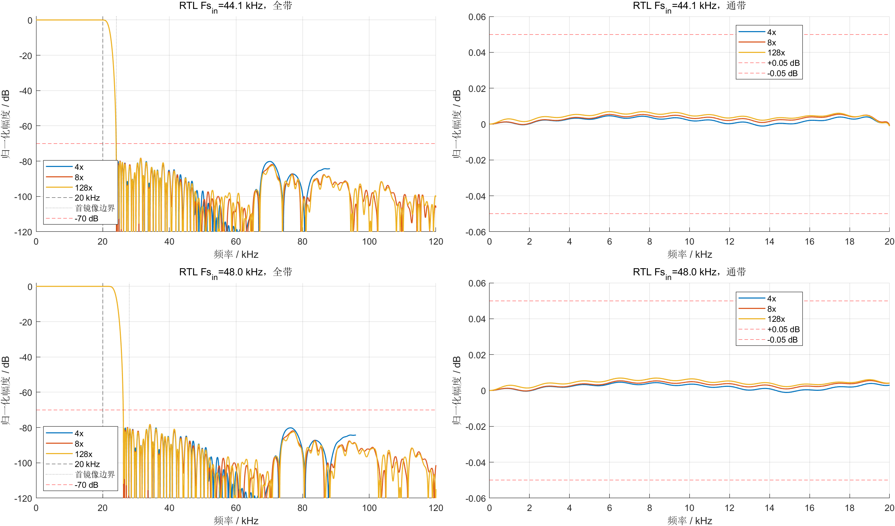

# 全国总决赛：双采样率可配置插值滤波器

## Vivado 2025.2 当前最低 LUT 正式实板版：24/20/20 字长版（218 LUT / 4 DSP）

在已板测 221-LUT 安全基线上，Stage1/Stage2/Stage3 有效数据宽度优化为
`24/20/20 bit`。六模式 MATLAB 频响全部通过，最差 128x 阻带衰减为 72.355 dB；
Smoke/Release 均为 17/17 PASS，14 组全链向 24/20/20 金标准逐样本 0 LSB。

正式 Vivado 2025.2 实现为 **218 LUT / 365 FF / 4 DSP / 4 RAMB18E1（2 Tile）/
2 MMCM**，WNS/WHS=`+45.279/+0.079 ns`，DRC Error=0。2026-08-11 用户明确确认
218-LUT 版本物理板测成功，因此升级为 **board-verified**；正式标签为
`nf-vivado2025.2-218lut-365ff-4dsp-2bram-24-20-20-board-pass`，221-LUT board-pass 保留为
前一安全回退。详见 [218-LUT 执行反馈](results/vivado2025_2_stage123_24_20_20_218lut_execution_feedback.md)。

## Vivado 2025.2 前一最低 LUT 正式实板版：routed 不变量复用版（221 LUT / 4 DSP）

本轮从已板测 234-LUT 版本继续审计 routed 网表，删除三组功能重复状态/门控：模式 CDC 复用
`ack_toggle` 作为本地已接收 token；Stage2/3 直接使用在 Stage3 任务期间稳定的 pending 补偿
模式；全国赛同步复位零路径把输入 valid 固定为 1，删除 Stage1 RAM 前 24-bit 输入/零门控，
而区域赛兼容路径仍保留原 valid 行为。滤波系数、位宽、舍入/饱和、4x/8x/128x 接口、
双采样率时钟、4 DSP 与 2 BRAM Tile 均不变。

正式 Vivado 2025.2 实现为 **221 LUT / 367 FF / 4 DSP / 4 RAMB18E1（2 Tile）/
2 MMCM**，综合为 285 LUT / 375 FF，WNS/WHS=`+44.556/+0.079 ns`，DRC Error=0，
功耗 0.271 W。独立插值核心 OOC 为 **193 LUT / 281 FF / 4 DSP / 3 RAMB18E1（1.5 Tile）**，
内部 WNS/WHS=`+151.232/+0.166 ns`。

Smoke/Release 均为 **17/17 PASS**；正式 bitstream 已生成，默认 routed DAC 活性与 44.1/48 kHz
六模式 routed 回归全部通过。2026-08-10 用户完成物理板验证，确认 44.1/48 kHz 两个输入
采样率族下各倍率档位输出采样率均正确，DAC 波形均正常，因此当前升级为 **board-verified**；
221-LUT board-pass 为正式发布，234-LUT board-pass 降为前一安全回退。详见
[221-LUT 执行反馈](results/vivado2025_2_post234_221lut_execution_feedback.md)。

## Vivado 2025.2 当前最低 LUT 工具签核候选：Stage1 顺序抽头版（258 LUT / 4 DSP）

从已板测 276-LUT 基线建立独立分支后，Stage1 改为单地址顺序抽头微引擎：把 26 个对称系数
展开成 52 个顺序系数，复用现有统一系数 RAMB18E1 的空闲地址，每拍直接执行一个乘加，并在
同一轮扫描中获取中心延迟样本。该结构删除左右抽头控制、第二地址公式和独立预取状态，资源为
**258 LUT / 376 FF / 4 DSP / 4 RAMB18E1（2 Tile）/ 2 MMCM**，相对板测基线减少 18 LUT 和
3 FF，DSP/BRAM 不变。WNS/WHS 为 **+45.222/+0.077 ns**，DRC Error=0，功耗 0.271 W。

Smoke/Release 各 17/17、14 组全链三节点 0 LSB、标准 GUI 完整构建和 bitstream、routed-DCP
六档 DAC/采样率检查均通过。系数和定点路径不变，频响严格继承正式正确标度路径。该版本目前是
**tool-verified，尚待物理板复测**；276 LUT / 379 FF / 4 DSP / 2 BRAM Tile 仍是正式板测安全
回退。详见 [258-LUT 执行反馈](results/vivado2025_2_stage1_sequential_258lut_execution_feedback.md)。

## 前一 2018.3 最低 LUT 工具签核候选：P3-U 控制路径深度优化版（333 LUT / 4 DSP）

P3-U 在已实板通过的 P3-T 上保持滤波系数、定点数据通路、4 DSP、2 BRAM Tile 和板级
接口不变，完成两项精确控制路径优化：正式 `DEBOUNCE_SCANS=5` 的键盘消抖由二进制
加一器改为六状态 Johnson 序列；模式 CDC 的 pending flag 加倒计数器改为周期完全一致的
one-hot settle token。综合为 **365 LUT / 384 FF**，正式实现为
**333 LUT / 382 FF / 152 Slice / 4 DSP / 4 RAMB18E1（2 Tile）/ 2 MMCM**，相对 P3-T
减少 8 LUT 和 11 Slice，仅增加 1 FF。WNS/WHS 为 **+45.704/+0.079 ns**，AD9708
setup/hold 为 **+76.116/+78.117 ns**，总/动态/静态功耗仍为
**0.271/0.199/0.072 W**。

Smoke/Release 均为 **17/17 PASS**；Release 的冲激、10 seed、正负满量程和强 −1 dBFS
共 14 组输入在 4x/8x/128x 所有节点均为 0 LSB，并覆盖 8 类复位、1200 次 CDC、
100 次切族和 10 次动态切档。正式 routed DCP 的默认 DAC 测试为 11290 个边沿、7462 次
数据变化；六档为 44.1 kHz `177/353/5645 edges/ms`、48 kHz
`192/384/6144 edges/ms`，六档数据均持续变化。普通 GUI 工程从零综合、实现和 Generate
Bitstream 也复现 **333/382/152/4-DSP/4-RAMB18**。实现策略已统一为
`AreaOptimized_high/full/on + ExploreWithRemap + Explore`，避免手动 GUI 继续使用旧
`ExtraTimingOpt` 而得到 340 LUT。

**P3-U 当前为 tool-verified，尚未物理板测，不能标为 boardverified。P3-T 341-LUT 版仍是
正式实板安全回退。**完整记录见
[P3-U 执行反馈](results/p3u_333lut_control_optimization_execution_feedback.md)与
[`p3u_333lut_382ff_4dsp_2bram_signedoff`](vivado_results/p3u_333lut_382ff_4dsp_2bram_signedoff)。

## 当前正式实板通过安全回退：P3-T Stage1 DSP尾周期版（341 LUT / 4 DSP）

P3-T从已板测P3-S继续优化，让Stage1已有DSP48E1在MAC后的空闲周期完成精确Q15舍入、
Pattern符号扩展检查和PREG直接饱和钳位，并由稳定写指针派生历史基址，删除独立6-bit
基址寄存器。综合为 **367 LUT / 383 FF**，最终实现为
**341 LUT / 381 FF / 163 Slice / 4 DSP / 4 RAMB18E1（2 Tile）/ 2 MMCM**；相对P3-S少
2 LUT、5 FF，但多12 Slice。WNS/WHS为 **+45.270/+0.107 ns**，功耗仍为0.271 W。

Smoke/Release均为 **17/17 PASS**，Stage1行为/真实RAMB18各1400输出0 LSB，全链14组
三节点0 LSB，复位、CDC、时钟切族和动态切档全部通过。正式routed DCP通过默认DAC活动
及44.1/48 kHz六档测试，GUI重实现也复现341/381并生成bitstream。**用户已完成物理板
复测：44.1/48 kHz两族的4x/8x/128x六档采样率均正确，DAC输出波形正常；P3-T现为正式
实板发布，P3-S保留为前一实板安全回退。**详见
[P3-T执行反馈](results/p3t_stage1_dsp_tail_saturation_341lut_execution_feedback.md)与
[`p3t_341lut_381ff_4dsp_2bram_signedoff`](vivado_results/p3t_341lut_381ff_4dsp_2bram_signedoff)。

## 前一正式实板通过回退：P3-S ExtraTimingOpt 版（343 LUT / 4 DSP）

P3-S完全保留P3-R板测RTL和数学路径，只把完整板级`place_design`从默认指令改为
`ExtraTimingOpt`。同一份374-LUT/388-FF综合网表最终实现为
**343 LUT / 386 FF / 151 Slice / 4 DSP / 4 RAMB18E1（2 Tile）/ 2 MMCM**，相对P3-R少
5 LUT、3 Slice，FF/DSP/BRAM/MMCM与0.271 W功耗不增加。WNS/WHS为
**+45.025/+0.116 ns**，AD9708 setup/hold为 **+76.116/+78.117 ns**。

Smoke/Release均为 **17/17 PASS**，14组全链三节点0 LSB，8类复位、1200次CDC、100次
切族和10次动态切档均通过。正式routed DCP得到默认档11290个DAC边沿/7462次数据变化，
六档为44.1 kHz `177/353/5645 edges/ms`、48 kHz `192/384/6144 edges/ms`，数据持续变化；
普通GUI工程从零复现343/386/4-DSP/4-RAMB18并成功生成bit。2026-08-06用户完成物理板
验证，确认44.1/48 kHz两个家族下4x/8x/128x各档采样率均正确且DAC输出波形正常；
P3-S曾据此升级为正式实板发布，现由P3-T取代并保留为前一安全回退。详见
[P3-S执行反馈](results/p3s_extratimingopt_343lut_execution_feedback.md)与
[`p3s_343lut_386ff_4dsp_2bram_signedoff`](vivado_results/p3s_343lut_386ff_4dsp_2bram_signedoff)。

手动GUI若得到348 LUT，先检查`XC7A35T_interp.runs/impl_1/runme.log`：P3-S必须包含
`Command: place_design -directive ExtraTimingOpt`；无参数`place_design`就是P3-R默认布局。
不要在Vivado仍打开时切换Git分支或改`.xpr`，否则旧的内存工程会在保存时覆盖策略。关闭
全部Vivado窗口后，用`vivado/open_national_finals_gui_clean.ps1`重新打开；入口会校验并
恢复P3-S profile，策略发生漂移时自动Reset陈旧run。2026-08-06按此流程重新从零构建，
再次复现343 LUT/386 FF/151 Slice和`+45.025/+0.116 ns`。

## 前一正式实板通过回退：P3-R DSP空闲拍舍入饱和版（348 LUT / 4 DSP）

P3-R保持4 DSP、2 BRAM Tile和全部滤波系数/定点语义不变，复用Stage2/3共享DSP48E1
在MAC后的空闲拍依次完成精确Q15舍入、`PATTERNDETECT/PATTERNBDETECT`符号扩展检查
和PREG直接饱和钳位，从而同时删除Fabric宽比较器与宽饱和mux。正式实现为
**348 LUT / 386 FF / 154 Slice / 4 DSP / 4 RAMB18E1（2 Tile）/ 2 MMCM**；相对
P3-O少13 LUT，相对已实板通过的P3-M少20 LUT，其他资源和0.271 W功耗不增加。
WNS/WHS为 **+45.200/+0.121 ns**，AD9708 setup/hold为 **+76.116/+78.117 ns**。

Smoke/Release均为 **17/17 PASS**，14组完整链输入的4x/8x/128x全部0 LSB；真实RAMB18、
正负饱和、8类复位、1200次CDC、100次时钟家族切换和10次动态倍率切换均通过。正式
routed DCP通过默认DAC活动和六模式公开按键测试，普通GUI工程也从零完成综合、实现和
bitstream并复现348/386/4-DSP/4-RAMB18。**2026-08-06用户完成物理板验证，确认44.1/48 kHz
两个家族的4x/8x/128x各档输出采样率均正确且DAC输出波形正常；P3-R正式升级为当前
实板发布，P3-M降为前一实板安全回退。**详见 [P3-R执行反馈](results/p3r_4dsp_dsp_sequential_saturation_execution_feedback.md)。

## P3-Q DSP48 Pattern饱和优化（2026-08-05，No-Go，保留P3-O）

在4 DSP/2 BRAM Tile约束下，Stage1和Stage2/3的符号扩展饱和判定被试验性迁入已有
DSP48E1的`PATTERNDETECT/PATTERNBDETECT`。RTL Smoke **17/17 PASS**，Stage1行为与
RAMB18原语各1400输出、Stage2 336输出、Stage3 671输出及全链4x/8x/128x均为0 LSB。
但同策略四组综合为395/396/414/415 LUT，FF均388、DSP均4、BRAM均2 Tile，所有候选
均不优于基线。故本轮按停止线不做实现、Timing、功耗或bitstream，失败RTL已撤销，
该阶段正式工程恢复P3-O 361/386/158/4-DSP/2-BRAM工具候选和P3-M 368-LUT实板回退。
详见 [P3-Q执行反馈](results/p3q_4dsp_pattern_saturation_execution_feedback.md)。

## P3-P 近期论文驱动优化审计（2026-08-05，No-Go，保留 P3-O）

本轮检索并筛选了2022～2026年的BLMAC、有限字长最优FIR、MCM/ILP、乘累加联合优化、
adder-mux联合优化以及2025年的时分复用常数乘工作；随后用rebuilt层次综合定位
Stage2/3、Stage1、CIC和测试音ROM热点。完成BRAM输出直连、级联饱和及四策略扫描、
DSP PREG直出、窄valid屏蔽宽复位、显式RAMB18测试音ROM五类试验。

五类候选的最佳实现LUT依次为367、369、综合416后停止、370和368，均不低于P3-O的
361 LUT；DSP仍为4、BRAM仍为2 Tile，所有进入实现的候选均通过Timing/DRC/CDC和功耗
报告。显式RAMB18还完成了SDP 36-bit原语、INIT位序、UNISIM GSR和双采样率回绕测试。
因此该轮正式RTL恢复为P3-O，当时的推荐候选和实板回退不变。论文链接、适用性判断、热点表、
每项资源/Timing/Power和失败原因见 [P3-P论文驱动优化执行反馈](results/p3p_recent_paper_driven_optimization_execution_feedback.md)。

## 前一工具签核候选：P3-O ExploreWithRemap 版（361 LUT / 4 DSP）

P3-O 从已实板通过的 P3-M 逐文件核对源码后建立，**不修改任何滤波 RTL、系数、字长、舍入、饱和、valid 时序、时钟或 DAC 接口**，只把完整板级实现的 `opt_design` 从 `Default` 改为 `ExploreWithRemap`。同一份 395-LUT/388-FF 综合网表由 `368 LUT / 386 FF` 收敛到 **361 LUT / 386 FF / 158 Slice / 4 DSP / 4 RAMB18E1（2 Tile）/ 2 MMCM**，达到本轮 355～362 LUT 目标；WNS/WHS 为 **+44.989/+0.103 ns**，AD9708 setup/hold 为 **+76.116/+78.117 ns**，功耗仍为 **0.271/0.199/0.072 W**。

本轮 Release RTL 为 **17/17 PASS**：冲激、10 个固定seed、正/负满量程和 −1 dBFS 强信号的4x/8x/128x全部0 LSB；8类复位恢复、1200次CDC、100次时钟族切换和10次动态倍率切换均通过。361-LUT routed DCP默认启动6 ms得到11290个DAC边沿和7461次数据变化；公开按键级六模式网表仿真得到44.1 kHz的`177/353/5645 edges/ms`和48 kHz的`192/384/6144 edges/ms`，六档DAC数据均持续变化。包装脚本与普通GUI工程已固定 `ExploreWithRemap`，GUI门槛收紧为`LUT<=362 / FF<=400 / DSP=4 / RAMB18E1=4 / MMCM=2`；普通GUI工程从零重建约127秒，再次复现361/386/4-DSP/4-RAMB18并成功生成bitstream。详细依据、超时重跑记录、哈希和复现步骤见 [P3-O执行反馈](results/p3o_explorewithremap_361lut_execution_feedback.md)。

P3-O 是前一**工具完整签核、待用户板测**候选，现已由P3-R取代；P3-M仍是物理板安全回退。分支为`national-finals-p3o-355to362-target`，工具标签为`nf-p3o-toolverified-361lut-386ff-158slice-4dsp-2bram`，名称均不含`codex`。

## 前一正式实板通过回退：P3-M Stage1 DSP-register 版（368 LUT / 4 DSP）

当前分支 `national-finals-p3m-stage1-dspreg-385target` 的完整板级实现为 **368 LUT / 386 FF / 156 Slice / 4 DSP / 4 RAMB18E1（2 Tile）/ 2 MMCM**，WNS/WHS **+44.836/+0.117 ns**，AD9708 setup/hold **+76.116/+78.117 ns**，vectorless 功耗 **0.271 W**。相对已板测的 P3-L 减少29 LUT、23 FF和5 Slice，DSP/BRAM/MMCM不变。

P3-M 把Stage1左操作数从24-bit Fabric寄存器迁移到DSP48E1 `AREG`，把历史有效性宽掩码迁移到动态 `INMODE`，并将读调度改为 `L0,R0,...,L25,R25`。行为RAM和真实UNISIM RAMB18E1均完成1400输出0-LSB对比；最终同源码 Smoke/Release 均为 **17/17 PASS**，复位、动态切换、GUI从零综合/实现/Bitstream、默认和六模式routed-DCP DAC均通过。六档为44.1 kHz `177/353/5645 edges/ms`、48 kHz `192/384/6144 edges/ms`，DAC数据持续变化。**2026-08-05 用户完成物理板复测，确认各档位采样率均正确且 DAC 输出波形正常；P3-M 现为正式实板通过版，P3-L 降为前一实板安全回退。**详见 [P3-M 执行反馈](results/p3m_stage1_dspreg_368lut_execution_feedback.md) 与 [`p3m_stage1_dspreg_synth_r1`](vivado_results/p3m_stage1_dspreg_synth_r1)。

## P3-N CIC one-hot burst 后续实验（No-Go）

结构审计确认 P3-M 的两级低速 comb 已经串行共享一个LUT/CARRY减法数据通路。本轮把4-bit递减burst计数器改为15-bit thermometer移位状态，并保留任意 `ce_out` 停顿语义。CIC单元连续/随机停顿/突发中复位等价通过；板级参数链加入“候选必须启用”断言后，Smoke/Release均为 **17/17 PASS**，14组Release全链输入在4x/8x/128x均为 **0 LSB**。

第一次395/388综合因板级参数仍为0被网表审计作废；修正后日志确认两级参数均绑定为1，有效综合为 **403 LUT / 399 FF / 4 DSP / 4 RAMB18E1（2 Tile）/ 2 MMCM**，比P3-M综合基线多 **8 LUT/11 FF**。因此没有继续实现、Timing、功耗或bitstream，正式版仍为P3-M 368/386/156。六工况频响完全继承P3-M；详见 [P3-N执行反馈](results/p3n_cic_onehot_burst_nogo_execution_feedback.md)。实验分支为 `national-finals-p3n-cic-onehot-burst`，名称不含 `codex`。

## 前一正式实板通过回退：P3-L 共享保护时基版（397 LUT / 4 DSP）

当前分支 `national-finals-p3l-safe-packedrom-395target` 的完整板级结果为 **397 LUT / 409 FF / 161 Slice / 4 DSP / 4 RAMB18E1（2 Tile）/ 2 MMCM**，WNS/WHS **+44.408/+0.121 ns**，AD9708 setup/hold **+76.116/+78.117 ns**，vectorless 功耗 **0.271 W**。bitstream SHA-256 为 `AC8735BAD24450FA038C79B104072DA70CEFA6FEF7B599C52CE16ECA5F091440`。

本版用 MATLAB 离线生成单个 32-bit Packed-ROM 镜像，RTL 只执行一次 `$readmemh`，消除旧版二次 procedural 初始化未进入 RAMB18 INIT 的风险；同时复用持续运行的键盘/上电计数器低10位作为家族切换保护时基，以3-bit状态机替代独立宽计数器。Smoke/Release 均为 **16/16 PASS**。默认 44.1 kHz/128x 路由网表在2 ms内得到11290个 DAC 边沿和7461次数据变化；只通过 `key_kr/key_kc` 公开引脚驱动的六模式路由后测试得到 44.1 kHz 的 `177/353/5645 edges/ms` 与48 kHz的 `192/384/6144 edges/ms`，六档 DAC 数据均持续变化、无 X。

完整优化、No-Go、RTL、RAMB INIT、Timing/DRC/CDC 和板测记录见 [P3-L 执行反馈](results/p3l_395lut_target_optimization_execution_feedback.md)，正式证据目录为 [`p3l_safe_packedrom_sharedguard`](vivado_results/p3l_safe_packedrom_sharedguard)。**2026-08-04 用户已完成物理板复测，确认 DAC 输出正常，44.1/48 kHz 两个家族下各倍率档位的采样频率均正确；P3-L 现为正式实板通过版，P3-K 427-LUT 版本为安全历史回退。**

## 当前实板通过回退：P3-K DAC-ROM 安全版（427 LUT / 4 DSP）

实物板反馈显示，旧 412-LUT bitstream 的 DAC 时钟正常但数据固定为 128。对原 routed DCP 的完整板级功能仿真复现为 `edges=11290 / data_changes=0`，并定位到 Packed-ROM 二次 procedural 初始化没有被 Vivado 2018.3 可靠写入 RAMB18 INIT，导致测试音地址 0 自循环。当前分支 `national-finals-p3k-4dsp-dac-rom-fix` 已恢复显式地址计数，修复版 post-route 为 **427 LUT / 416 FF / 177 Slice / 4 DSP / 4 RAMB18E1（2 Tile）/ 2 MMCM**，WNS/WHS **+44.983/+0.105 ns**，AD9708 setup/hold **+76.116/+78.117 ns**，总/动态/静态功耗 **0.271/0.199/0.072 W**，bitstream SHA-256 为 `0FFEC2DC929AE3A16E2CB08B32F5B056F378902416E1E191B9D7D08CC6B0EA7D`。

同一 post-route 板级测试在修复后得到 `edges=11290 / data_changes=7461 / sample_updates=88`，Stage1/Stage2/CIC 全部有活动。发布流程现已新增公开引脚级 routed-DCP DAC 活动门禁。旧 `nf-p3k-final-412lut-418ff-168slice-4dsp-2bram-pointerfill` 与 `nf-p3j-final-424lut-431ff-169slice-4dsp-2bram-packedrom` 标签保留用于审计，但均标记为**不允许上板使用**；安全历史回退应使用 Packed-ROM 之前的 430-LUT P3-J 版本。详细记录见 [DAC-ROM 修复执行反馈](results/p3k_dac_rom_hardware_fix_execution_feedback.md)，正式 bit、DCP、报告与日志见 [`p3k_final_427lut_416ff_177slice_4dsp_2bram_dacromfix`](vivado_results/p3k_final_427lut_416ff_177slice_4dsp_2bram_dacromfix)。**2026-08-03 用户已完成修复 bitstream 实板复测，确认 DAC 输出正常、采样率正常。**

427 LUT 相对失效的 412-LUT 版本增加 15 LUT，来源是恢复了真实的 8-bit 地址递增、44.1/48 kHz 范围比较、回绕和家族选择逻辑；旧版的 BRAM 高位在综合后成为常量 0，使这部分逻辑连同播放功能一起被常量传播/合并。综合结果只增加 7 LUT（449→456），post-route 因跨层合并与映射变化增加 15 LUT（412→427）；DSP、BRAM、MMCM、滤波器频响和功耗均未增加。因此 412 LUT 不是完整可用功能下的有效资源基准。

## 已撤销默认：P3-K 环形指针推导历史状态 412-LUT 版

当前默认分支为 `national-finals-p3k-4dsp-pointer-fill`，完整板级结果为 **412 LUT / 418 FF / 168 Slice / 4 DSP / 4 RAMB18E1（2 Tile）/ 2 MMCM**，WNS/WHS **+45.083/+0.056 ns**，AD9708 setup/hold **+76.116/+78.117 ns**，总/动态/静态功耗 **0.271/0.199/0.072 W**。bitstream SHA-256 为 `E7512D603231276CDCED13C5FEA3A7284558B941CF4102FA1E3339CD5F5EF1CF`。

本版不改变滤波数学路径，而是用现有 Stage1 `wr_ptr` 和 Stage2/3 `job_history_head` 推导启动填充深度，把原 24 bit fill 状态压缩为 4 bit 粘滞满状态。Release RTL 15/15、14 组全链 4x/8x/128x 逐样本 0 LSB、8 组短复位恢复、10 次动态切换、post-route、DRC/CDC、功耗和 bitstream 全部通过。相对 424-LUT 版减少 12 LUT、13 FF、1 Slice，DSP/BRAM/MMCM/功耗不变；当前仍需实物板下载和测量。

历史执行反馈见 [P3-K 指针推导执行反馈](results/p3k_pointer_derived_fill_execution_feedback.md)，旧证据目录为 [`p3k_final_412lut_418ff_168slice_4dsp_2bram_pointerfill`](vivado_results/p3k_final_412lut_418ff_168slice_4dsp_2bram_pointerfill)。该目录和标签只保留用于审计，已撤销上板资格；424-LUT Packed-ROM 标签受相同缺陷影响，也不是稳定回退。

## 前一默认：P3-J Packed-ROM / Ultra-Keypad 424-LUT 版

该轮默认分支为 `national-finals-p3j-4dsp-bram-microengine`。从干净提交 `785eb61c67e3d1005b7f2e59f65f7097b026109a` 重建的完整板级结果为 **424 LUT / 431 FF / 169 Slice / 4 DSP / 4 RAMB18E1（2 Tile）/ 2 MMCM**，WNS/WHS **+45.042/+0.080 ns**，AD9708 setup/hold **+76.116/+78.117 ns**，总/动态/静态功耗 **0.271/0.199/0.072 W**。bitstream SHA-256 为 `2BA97CCE337638D57268EE04CCE0D09D2FDF6637B1A4A25D35E57BCB49C3ED4B`。

相对前一 P3-J 430-LUT 基线，本版把 ROM 空闲高位用于保存下一采样地址，并进一步压缩矩阵键盘扫描候选状态，减少 6 LUT/7 Slice，FF/DSP/BRAM/MMCM 不变。MATLAB 六工况、Release RTL 15/15、post-route、DRC/CDC、功耗、bitstream 和普通 GUI project rebuild 均通过；14 组全链输入的 4x/8x/128x 全部逐样本 0 LSB。当前没有物理开发板，因此仍须现场下载和测量。

“增加 BRAM 进入 280～299 LUT”的假设未获实测支持：Stage2/3 历史拆分为 478 LUT/5 RAMB18，Stage1 双 BRAM 为 477 LUT/5 RAMB18；共享 CIC 又比原实现多 11 LUT。详细 Stop/Go 表、频响、时序和复现步骤见 [本轮执行反馈](results/p3j_4dsp_bram_microengine_execution_feedback.md)，正式证据见 [`p3j_final_424lut_431ff_169slice_4dsp_2bram_packedrom`](vivado_results/p3j_final_424lut_431ff_169slice_4dsp_2bram_packedrom)。

Packed-ROM 之前的 P3-J 430-LUT 基线已从干净提交完成 MATLAB、Release 15/15、Vivado 综合/布局布线/时序/DRC/CDC/功耗评估和 bitstream 闭环，是当前修复版之外的安全历史回退。其资源为 **430 LUT / 431 FF / 176 Slice / 4 DSP / 2 BRAM Tile / 2 MMCM**，WNS/WHS **+45.636/+0.119 ns**，bitstream SHA-256 为 `C4DBB066030B92D387D799688D4010AB98F22B13BDA1623367EBCC8BE8BC0490`。

当前最低 LUT 工具签核候选为 P3-U `333 LUT / 382 FF / 4 DSP / 2 BRAM`，已通过完整 RTL、GUI 从零重建、bitstream 和 routed-DCP 六档门禁，但尚待物理板测。当前正式实板安全回退为 P3-T `341 LUT / 381 FF / 4 DSP / 2 BRAM`；用户已确认 44.1/48 kHz 两族的 4x/8x/128x 六档采样率均正确且 DAC 波形正常。P3-S `343 LUT / 386 FF / 4 DSP / 2 BRAM`降为前一实板安全回退，P3-R `348 LUT / 386 FF / 4 DSP / 2 BRAM`为更早实板安全回退。P3-M `368/386/4-DSP/2-BRAM`为更早实板回退，P3-O `361/386/4-DSP/2-BRAM`是前一工具候选，P3-L `397 LUT / 409 FF / 4 DSP / 2 BRAM` 和 P3-K `427 LUT / 416 FF / 4 DSP / 2 BRAM` 为更早实板安全回退。Packed-ROM 之前的430-LUT P3-J和P4-D `479/468/4-DSP/2-BRAM`可作历史回退；旧Route 1 `424 LUT / 6 DSP`与低DSP `436 LUT / 5 DSP`另有8x/128x约−6.02 dB标度缺陷，只保留为资源演进历史。

## P3-J 后续优化指导执行结果（2026-08-03）

指导中的强信号、DSP、BRAM、交叉 Pareto 和有限字长路线已按停止线执行；MMCM/SAIF/实物板部分因没有硬件和仪器未虚构结论。完整逐项反馈见 [P3-J 后续优化指导执行反馈](results/p3j_next_optimization_execution_guide_execution_feedback.md)。

| 候选 | LUT | FF | Slice | DSP | RAMB18 / Tile | WNS/WHS | 结论 |
|---|---:|---:|---:|---:|---:|---:|---|
| **P3-U Johnson + CDC token** | **333** | **382** | **152** | **4** | **4 / 2.0** | **+45.704/+0.079 ns** | **工具 Smoke/Release 17/17、全链0-LSB、GUI从零重建、routed-DCP DAC/六档与bitstream通过；待物理板测** |
| **P3-T Stage1 DSP尾周期** | **341** | **381** | **163** | **4** | **4 / 2.0** | **+45.270/+0.107 ns** | **工具17/17、0-LSB、GUI、routed-DCP DAC/六档、bitstream及用户实板DAC/六档采样率通过** |
| **P3-S ExtraTimingOpt** | **343** | **386** | **151** | **4** | **4 / 2.0** | **+45.025/+0.116 ns** | **工具17/17、0-LSB、GUI、routed-DCP DAC/六档、bitstream及用户实板DAC/各档采样率通过** |
| **P3-R DSP空闲拍舍入饱和** | **348** | **386** | **154** | **4** | **4 / 2.0** | **+45.200/+0.121 ns** | **工具17/17、0-LSB、GUI、routed-DCP DAC/六档、bitstream及用户实板DAC/各档采样率通过** |
| **P3-O ExploreWithRemap** | **361** | **386** | **158** | **4** | **4 / 2.0** | **+44.989/+0.103 ns** | **前一工具候选；17/17与routed-DCP门禁通过** |
| P3-P论文驱动审计（保留P3-O） | 361 | 386 | 158 | 4 | 4 / 2.0 | +44.989/+0.103 ns | 五类候选均No-Go；正式RTL仍为P3-O |
| P3-Q Pattern饱和审计（保留P3-O） | 361 | 386 | 158 | 4 | 4 / 2.0 | +44.989/+0.103 ns | 四组综合395/396/414/415 LUT；Smoke 17/17后No-Go，正式RTL恢复P3-O |
| **P3-M Stage1 DSP-register** | **368** | **386** | **156** | **4** | **4 / 2.0** | **+44.836/+0.117 ns** | **正式实板通过：DAC 与各档采样率正确** |
| **P3-L shared guard** | **397** | **409** | **161** | **4** | **4 / 2.0** | **+44.408/+0.121 ns** | **正式实板通过：DAC 与六档采样频率正确** |
| **P3-K DAC-ROM 修复版** | **427** | **416** | **177** | **4** | **4 / 2.0** | **+44.983/+0.105 ns** | **安全实板回退** |
| P3-K 指针推导旧版 | 412 | 418 | 168 | 4 | 4 / 2.0 | +45.083/+0.056 ns | ROM 地址锁死，禁止上板 |
| P3-J Packed-ROM 旧版 | 424 | 431 | 169 | 4 | 4 / 2.0 | +45.042/+0.080 ns | ROM 地址锁死，禁止上板 |
| P3-J Packed-ROM 前基线 | 430 | 431 | 176 | 4 | 4 / 2.0 | +45.636/+0.119 ns | 安全历史回退 |
| P3-J 3-DSP | 466 | 457 | 188 | 3 | 4 / 2.0 | +45.785/+0.121 ns | 低 DSP Pareto |
| P3-J 2-DSP | 488 | 486 | 191 | 2 | 4 / 2.0 | +45.736/+0.060 ns | 最低 DSP Pareto |
| P3-J 1.5-BRAM | 456 | 450 | 181 | 4 | 3 / 1.5 | +46.033/+0.116 ns | 低 BRAM Pareto |
| P3-J 3-DSP+1.5-BRAM | 478 | 476 | 191 | 3 | 3 / 1.5 | +45.610/+0.115 ns | 交叉 Pareto |
| P3-J 1-BRAM | 495 | 480 | 186 | 4 | 2 / 1.0 | +45.807/+0.108 ns | 超过 490 LUT，No-Go |
| P3-J 9-tap | 441 | 431 | 177 | 4 | 4 / 2.0 | +46.190/+0.121 ns | 比默认多 11 LUT，No-Go |

最终默认 Release 为 **15/15 PASS**。全链包括冲激、10 个固定 seed×4096、正/负满量程和 997 Hz/−1 dBFS 强信号共 14 组，4x/8x/128x 全部 0 LSB；复位恢复 8/8、动态切换 10/10。六工况最差绝对通带偏差 0.007730 dB、最差峰峰纹波 0.006192 dB、最差阻带 72.371 dB，严格线性相位。

前一轮还解决了“历史报告 430 LUT，手动重跑却是 436 LUT”的原因：430 实际使用 `AreaOptimized_high/full/on`，批处理旧默认却是 `rebuilt`，并且只实现步骤可能静默复用旧 DCP。现在批处理和 GUI 都固定 `full`，综合生成配置指纹，实现前校验，`-jobs` 固定为 4。前一证据目录为 [`p3j_final_430lut_431ff_176slice_4dsp_2bram_reproducible`](vivado_results/p3j_final_430lut_431ff_176slice_4dsp_2bram_reproducible)，当前正式目录见本文顶部。

## 历史 P4-D Release V2 与指导执行结果

P4-D Release V2 已从 clean source 完成 21-bit golden、15/15 Release、频响、CDC、综合、布局布线和 bitstream 闭环。正式资源为 **479 LUT / 468 FF / 198 Slice / 4 DSP / 4 RAMB18E1（2 Tile）/ 2 MMCM**，WNS/WHS `+45.734/+0.121 ns`，DAC setup/hold `+76.116/+78.117 ns`，vectorless 功耗 `0.271 W`。bit SHA-256 为 `8630210663629357237AAA3F076348FBE65610EAAB61ADA4706E81F75AAF02A6`；标签为 `nf-p4d-r2-479lut-468ff-4dsp-2bram-2mmcm-clean`。

当时后续指导的三个候选均采用独立分支，以下为 P3-J RTL 完成前的历史记录：

| 候选 | LUT | FF | DSP | RAMB18 / Tile | 验证与结论 |
|---|---:|---:|---:|---:|---|
| P1 TWO24 | 518 | 498 | 3 | 4 / 2.0 | Release 17/17；成功少 1 DSP，但被既有 504/494 3-DSP 点压制 |
| P2-A distributed ROM | 513 | 496 | 4 | 2 / 1.0 | Release 17/17；当前推荐的 1-Tile Pareto |
| P3 Stage3/均衡器联合设计 | 约450* | 约437* | 4* | 4 / 2.0* | 当时仅 MATLAB 预测；现已由上文 P3-J 实测替代 |

P1 TWO24 的核心创新是用 `DSP48E1/TWO24/PREG=1` 保存两级积分器低 24 位，以小型 CARRY4 补齐 2/5-bit 高位；完整板级以 `+39 LUT/+30 FF` 换 `-1 DSP`。P2-A 把 P4-E 的只读系数 RAMB18 拆成两组地址寄存 distributed ROM，相对 P4-D 以 `+34 LUT/+28 FF` 换 `-1 BRAM Tile`。P3 用 128x 专用 11-tap Q15/18-bit Stage3 bank 吸收原三抽头均衡器，预计净省约 29 LUT/31 FF，但必须经 RTL 和布局布线复核。

P4-D/P1/P2 六工况绝对通带误差/阻带衰减为：44.1 kHz 的 4x `0.003011/78.670 dB`、8x `0.003470/78.565 dB`、128x `0.005146/72.335 dB`；48 kHz 分别为 `0.003011/78.670 dB`、`0.003033/78.565 dB`、`0.003477/72.335 dB`。详细逐项反馈、失败原因、时序、功耗、bit SHA 和回退路线见 [P4-D 导出审计与下一阶段优化指导 V2 执行反馈](results/p4d_export_audit_and_next_optimization_guide_v2_execution_feedback.md)。

## 0. P1：Stage 3 真 Q15 与绝对增益闭环

P1 将 11-tap Stage 3 统一为真 Q15 系数 `[404,-148,-3272,522,19250,32016,19250,522,-3272,-148,404]`，同步修正 MATLAB 位真模型、统一 RAMB18E1 初始化、后备系数 ROM 和原语测试，并删除只对旧半幅系数成立的 35-bit 直通捷径。Stage 3 现在保留完整 38-bit MAC 视图和 signed 20-bit 饱和检查。

新增绝对增益门禁先对旧 RTL 输出执行负向验证并正确失败：4x/8x/128x 分别为 `-0.001599/-6.023392/-6.024933 dB`。修复后为 `-0.001599/-0.002709/-0.003480 dB`，最大模式间差 `0.001881 dB`，均满足 `0.01 dB` 门槛。XSim 10/10、完整链冲激/随机三节点 0 LSB、六工况频响与严格线性相位全部通过。

post-route 结果为 **446 LUT / 471 FF / 5 DSP / 3 BRAM Tile / 2 MMCM / 17 IO**，WNS/WHS 为 **+45.104/+0.121 ns**，功耗仍为 0.271 W，bitstream SHA-256 为 `F57419974501552FE670DD711354B244908EA05EC8DE95511719C467D1D74749`。相对旧 436-LUT 故障基线多 10 LUT，原因是恢复可达的 38-bit 饱和逻辑；其余主要资源不增加。

## P3：CDC、同步复位与 AD9708 接口闭环

P3 不改变 P1 的滤波系数、定点舍入和样点值。两位模式总线改为 request/ack 原子握手，FIR/CIC/bridge/键盘状态采用同步复位，MMCM `locked` 和音频复位释放经过同步器；切换期间 DAC 强制中点静音。8 位 `dac_data` 进入 IOB 寄存器，`dac_clk` 由 ODDR 转发，并按 AD9708 setup/hold 加板级裕量建立两个互斥 forwarded clock 约束。

从零 XSim 回归为 **11/11 PASS**：包含 1200 次模式 CDC 全方向压力测试、100 次双 MMCM 家族切换、8 个内部复位恢复场景、10 次动态倍率切换、串行 CIC 对拍、完整链冲激/随机 0 LSB 和统一 RAMB18E1 全地址检查。post-route 为 **462 LUT / 447 FF / 180 Slice / 5 DSP / 3 BRAM Tile / 2 MMCM / 17 IO**，WNS/WHS 为 **+46.140/+0.050 ns**，AD9708 最差输出 setup/hold 为 **+76.116/+78.117 ns**，功耗仍为 **0.271 W**。bitstream SHA-256 为 `A38C6D4F4B3C023DBD22897505B85864990CFC7C5D974A84FA38C5F0ADE21033`。

CDC 报告中专用 `BUFGMUX_CTRL` 选择入口和 bundled-data shadow bus 分别保留书面 waiver；它们没有用 false path 隐藏，详细逐规则说明和板级待办见 [P3 工程闭环签核](results/p3_engineering_closure_summary.md)。

## P4-A：严格等价 N3 Hold，5 DSP 降至 4 DSP

利用插值 CIC 的多速率恒等式，把 `C³ → ↑16 → I³` 严格改写为 `C² → Hold16 → I²`。新实现保留 33-bit 模运算宽度、右移 8 bit 归一化、舍入饱和及输出有效周期；两级低速 comb 使用 LUT/CARRY4，两级高速 integrator 各使用一颗 DSP48E1。因此全机 DSP 分配由 `1 + 1 + 3 = 5` 变成 `1 + 1 + 2 = 4`。

独立等价测试覆盖连续 320 组、随机停顿 480 组、复位中断与 7680 个输出样本；完整 RTL 回归扩展为 **12/12 PASS**，Stage1/2/3/128x 全链路仍为 0 LSB。post-route 为 **491 LUT / 444 FF / 197 Slice / 4 DSP / 3 BRAM Tile / 2 MMCM / 17 IO**，WNS/WHS 为 **+45.738/+0.052 ns**，AD9708 最差输出 setup/hold 仍为 **+76.116/+78.117 ns**，功耗 **0.271 W**。bitstream SHA-256 为 `D262BA94186D992016FE9FACD157E34FDB29EDF0F9A3433A38833A65B101C334`。

这是 DSP 优先 Pareto 点：相对 P3 少 1 DSP、少 3 FF，但增加 29 LUT 和 17 Slice，不能表述为所有资源同时下降。详细验证和 waiver 见 [P4-A N3 Hold 签核](results/p4a_n3_hold_4dsp_summary.md)。

## P4-B：Stage 1/2/3 历史 RAM 时分复用，3 降至 2 BRAM Tile

P4-B 保持 P4-A 的 4-DSP N3 Hold 数值路径，只优化历史存储。Stage 1 把当前输入旁路为第 0 对左样本，单 RAMB18E1 按 `R0,L1,R1,...,L25,R25` 连续读取其余对称样本，约 53 拍完成 26 次 MAC，满足 64 拍截止期。Stage 2/3 用 bank 地址共享一个 32×22-bit RAMB18E1，同拍双写冲突由一项 Stage 3 写队列吸收。两处均使用显式 SDP RAMB18E1，防止 Vivado 回退为 LUTRAM。

完整回归为 **14/14 PASS**：Stage 1 新旧核 1400 输出 0 LSB、Stage 2/3 分别 336/671 输出 0 LSB、N3 Hold 7680 输出 0 LSB，并通过全链随机/冲激、8 种内部状态复位、1200 次原子 CDC、100 次家族切换和 10 次不停机倍率切换。post-route 为 **504 LUT / 493 FF / 202 Slice / 4 DSP / 2 BRAM Tile / 2 MMCM / 17 IO**，WNS/WHS **+45.637/+0.119 ns**，功耗 **0.271 W**，bitstream SHA-256 为 `DA0665E43A8DA5230AB93FC786AB0EED47BD83FE393C9B1416BA3360B8DE5E85`。

相对 P4-A，P4-B 多 13 LUT、49 FF 和 5 Slice，少 1 BRAM Tile；因此 P4-A 与 P4-B 分别作为低 LUT/FF 与低 BRAM 的 4-DSP 回退点保留。详细证据见 [P4-B 单 BRAM 签核](results/p4b_single_bram_4dsp_summary.md)。

## P4-C：固定 CE 精简、DSP48 预加器与 26/29-bit CIC

P4-C 不改变 FIR/CIC 传递函数、系数、舍入、饱和或输出 valid 序列，完成三项严格等价优化。第一，证明全国赛连续 2 的幂 CE 下 Stage2 与 Stage3 的 phase0 历史写集合不相交，仅在板级签核配置删除不可达的 25-bit 待写队列；通用模块默认仍保留队列。第二，在当前 Stage1 单 BRAM 串行核上重新 A/B，DSP48E1 `D+A` 预加器比 LUT 对称加法再减少 7 个综合 LUT。第三，把 N3 Hold CIC 的两个保守 33-bit 状态按解析界收紧为 26/29 bit，并提供全机 4/3/2-DSP 三档。

同时修复了 48 kHz 家族切换后首个 ROM 地址可能错误的问题、`SETTLE_CYCLES>3` 的 CDC 计数器截断问题，并把 GUI `sim_1` 的顶层和宏锁定到签核结构。历史 RAMB18 新增 primitive-vs-behavioral 独立对拍；最终 XSim 为 **15/15 PASS**。

| P4-C 档位 | LUT | FF | Slice | DSP | BRAM Tile | MMCM | WNS/WHS | 功耗估计 |
|---|---:|---:|---:|---:|---:|---:|---:|---:|
| 默认低 LUT/FF | **479** | **468** | **198** | **4** | 2 | 2 | +45.734/+0.121 ns | 0.271 W |
| 低 DSP-A | 504 | 494 | 198 | 3 | 2 | 2 | +45.853/+0.121 ns | 0.271 W |
| 低 DSP-B | 523 | 523 | 197 | 2 | 2 | 2 | +45.802/+0.121 ns | 0.270 W |

相对 P4-B，默认档减少 **25 LUT、25 FF、4 Slice**，DSP/BRAM/MMCM 不变；3-DSP 档以 `+25 LUT/+26 FF` 换 1 DSP，2-DSP 档以 `+44 LUT/+55 FF` 换 2 DSP。功耗是无 SAIF 的 vectorless 估算，0.001 W 差异不能当作实物省电结论。默认 bitstream SHA-256 为 `814465320512830C98D0EDA5352D36797BF5C442CD27E3520B5B89601F1C52D3`。

本轮 MATLAB 直接分析当前 RTL 发布的 impulse CSV，六工况通带、阻带、绝对增益和严格线性相位全部 PASS；详细证明、策略扫描、三档 SHA 和未执行项见 [P4-C 指导执行反馈](results/p4b_rtl_next_optimization_guide_execution.md)。

## P4-D：发布配置与验证闭环

P4-D 用固定参数 wrapper 取代全链 testbench 的十个 topology 宏，Smoke/Release 只控制样本规模；GUI 工程显式包含 8 个日常向量并完成真实行为仿真。Release 门槛为冲激加 10 个固定 seed×4096，三节点全部逐样本 0 LSB，完整回归 **15/15 PASS**。同时为两位 bundled-data 模式总线增加 50 ns bus-skew 约束，布线后实测 1.816 ns、裕量 48.184 ns。

资源、时序和功耗保持 **479 LUT / 468 FF / 198 Slice / 4 DSP / 2 BRAM Tile / 2 MMCM、+45.734/+0.121 ns、0.271 W**。普通 Vivado `impl_1` 与独立低内存脚本均生成 bitstream，新 SHA-256 为 `44879C48B2A15481A2B7DE598EAA83DE02CD1DABBD9C9BD5D26F0E8399E3E378`。TIMING-18、CDC-13/15 的逐项证据和限制见 [P4-D 发布闭环签核](results/p4d_release_closure_summary.md)。

## P4-E/P4-F：低 BRAM 研究分支

P4-E 把板级 PCM ROM 与 Stage1 历史放入同一个 RAMB18E1，得到 **491 LUT / 487 FF / 202 Slice / 4 DSP / 1.5 BRAM Tile / 2 MMCM**，WNS/WHS **+46.132/+0.105 ns**。P4-F 再把 Stage2/3 历史改成 8 个 RAM32M，得到 **531 LUT / 487 FF / 204 Slice / 4 DSP / 1 BRAM Tile / 2 MMCM**，WNS/WHS **+45.898/+0.105 ns**。两版 Smoke/Release 均为 **16/16 PASS**，普通 GUI 行为仿真、实现和 bitstream 全部通过；P4-F 未达到指导预估的 500～510 LUT，因此定位为最低 BRAM Pareto，不替代 P4-D。

| 分支 | 资源定位 | bitstream SHA-256 |
|---|---|---|
| `codex/national-finals-p4d-release-closure` | 默认：479 LUT / 468 FF / 4 DSP / 2 BRAM | `44879C48B2A15481A2B7DE598EAA83DE02CD1DABBD9C9BD5D26F0E8399E3E378` |
| `codex/national-finals-p4e-bram15` | 491 LUT / 487 FF / 4 DSP / 1.5 BRAM | `8B873CBE619E3179A426C5A971C0D1F03329D18B2A58298BE6E5F1D172DD53DD` |
| `codex/national-finals-p4f-bram1` | 531 LUT / 487 FF / 4 DSP / 1 BRAM | `32CBB432B53B84D6DE71E7751DFAD0A6F9B3668BBBEB6B8C39A3BE78A8AE3A22` |

三版的滤波系数和定点数据路径相同，P4-E/F 的 Release 三节点又与 P4-D golden 逐样本 0 LSB，所以本文第 3 节六工况的通带纹波、阻带衰减、绝对增益和线性相位结论全部继承。指导逐项执行情况、失败修复、未执行项及原因见 [P4-C 深度审计指导执行反馈](results/p4c_rtl_deep_audit_and_next_optimization_guide_execution.md)。

## X3：20 MHz 统一三级 FIR（已验证，资源 No-Go）

指导中的创新路线已经在 `codex/national-finals-x3-20m-unified-fir` 独立实现：输入经 4-deep Gray FIFO 进入 20 MHz 域，Stage1/2/3 在 160-clock 帧内共用一颗 DSP48E1，y2/y4/y8 通过双 bank commit 返回音频域，后接原补偿器和 N3 Hold CIC。Release 覆盖冲激与 10 个固定 seed×4096，**11/11 PASS**，三节点逐样本 **0 LSB**，没有 FIFO overflow、bank overrun 或未知输出，所以继承本文第 3 节的全部六工况频响。

| 滤波核心口径 | LUT | FF | Slice | DSP | RAMB18 / BRAM Tile |
|---|---:|---:|---:|---:|---:|
| P4-D 已布线滤波层级 | 377 | 361 | — | 4 | 3 / 1.5 |
| X3 OOC post-route | 910 | 692 | 307 | 3 | 5 / 2.5 |
| X3 相对增量 | **+533** | **+331** | — | **-1** | **+2 / +1.0** |

20 MHz 与 6.144 MHz 域的 WNS/WHS 分别为 `+34.839/+0.072 ns` 和 `+149.833/+0.081 ns`；OOC vectorless 总/动态/静态功耗为 `0.076/0.005/0.070 W`，由于实现范围不含板级 MMCM 和外设，不能与 P4-D 板级 0.271 W 直接相减。该结构用大量调度、CDC 和帧存储换来 1 DSP，资源明显劣化，因此停在核心 OOC，没有生成 X3 板级 bitstream，默认版本仍是 P4-D。完整记录见 [X3 20 MHz 统一 FIR 执行报告](results/x3_20m_unified_fir_nogo.md)。

## 0.1 Route 1：统一双端口系数 RAM（历史资源点）

Route 1保留Stage1和Stage2/3两颗FIR DSP。原因是48 kHz最紧工况下，一个128拍输入超周期内三段FIR最坏需要`27+42+60=129`拍，单DSP没有可靠调度余量。实际优化是把Stage1的26路`case`常量系数网络，与Stage2/3同步系数BRAM合并到一个显式true-dual-port `RAMB18E1`：

- A口地址64～89供Stage1读取26个signed 16-bit对称系数；
- B口地址0～63供Stage2/3读取两相系数；
- 两颗DSP可以同拍读取，不降低吞吐；
- 利用原RAMB18的空闲地址，BRAM Tile仍为3；
- 所有历史存储、MAC、舍入、饱和、均衡器、CIC16和六工况频响不变。

该改动删除了Stage1的常量译码/宽选择网络，综合从452 LUT降到436 LUT，Stage1层级从136 LUT降到120 LUT；布局布线从434 LUT / 469 FF / 190 Slice降到 **424 LUT / 471 FF / 188 Slice**。DSP/BRAM/MMCM/IO和0.271 W功耗不变。

验证包括：统一RAMB18E1的96个地址逐点检查、全国赛回归10/10 PASS、4x/8x/128x冲激和固定随机0 LSB、8个复位恢复场景、10次动态倍率切换、六工况频响、完整布局布线、时序和DRC。WNS/WHS为 **+45.356/+0.117 ns**，TNS/THS为0，bitstream SHA-256为`77D67B9E53FF43A0774A2F0093B5A89F22F27371C8CD9FD59DB018834C757BF4`。

正式提交为`aaac3be`，标签为`national-finals-route1-424LUT-471FF-6DSP-3BRAM-2MMCM`。更完整的Stop/Go过程见 [Route 1 优化记录](results/route1_unified_engine_progress.md)。

### 0.1 第八轮：CIC 串行 comb 从 DSP48 迁移到 LUT CARRY4

Route 1 的 6 个 DSP 分配为：Stage1 1 个、Stage2/3 共享 1 个、CIC 三级串行 comb 1 个、CIC 三级高速 integrator 3 个。本轮保持两个 FIR DSP 和三个每拍更新的积分器 DSP 不变，只把低采样率 comb 的一条 23-bit 减法器迁移到 LUT 进位链。comb 每个 8x 输入有 16 个 128x 主时钟周期可用，原本已经在三个周期内依次完成三级有限差分，因此该映射不增加延迟、不改变 burst 协议，也不改变任何加减法位宽或模运算结果。

为避免 GUI 与脚本再次出现参数不一致，映射选择从板级顶层贯通到 CIC 内核，并在 XPR 中显式固定：

```text
USE_NATIONAL_FINALS_SERIAL_CIC_COMB = 1
USE_NATIONAL_FINALS_CIC_COMB_DSP   = 0
```

综合后为 `448 LUT / 469 FF / 5 DSP / 3 BRAM Tile`；完整布局布线后为 **436 LUT / 471 FF / 181 Slice / 5 DSP / 3 BRAM Tile / 2 MMCM**。与 Route 1 比较：LUT `424 -> 436`（+12），FF 保持 471，Slice `188 -> 181`（-7），DSP `6 -> 5`（-1），BRAM/MMCM 保持 `3/2`，vectorless 功耗仍为 0.271 W。DSP 原语清单严格为两颗 FIR DSP 和三颗 CIC integrator DSP，已确认 comb 不再占 DSP。

验证结果：全国赛 XSim 回归 10/10 PASS；CIC 连续、停顿和 burst 中复位共 3840 点等价；4x/8x/128x impulse 与固定随机逐点 0 LSB；8 个内部状态复位场景与 10 次动态倍率切换通过；六工况 MATLAB 频响和严格线性相位全部 PASS。最终 WNS/TNS 为 **+45.662/0 ns**，WHS/THS 为 **+0.116/0 ns**，setup/hold 失败端点均为 0；1329/1329 个可布线网络全部完成，routing error=0，DRC Error/Critical Warning=0。bitstream SHA-256 为 `B344EB816AF39F0F0C14DCFCEAF9F0735E94EEDF509116BC68569BB0938C8F17`。

本轮之前还实际实现了“Stage1/2/3 三段 FIR 共用一颗 DSP”的原型。总超周期估算曾给出 117/128 拍，但 XSim 和局部截止期复核表明 Stage1 必须在相邻 2x 相位之间的 64 拍内完成；同一窗口最低需要 `Stage1 27 + Stage2 19 + Stage3 26 = 72` 拍，确定超出 8 拍。该路线已作为 No-Go 保留在提交 `354b890`，不能作为板级候选；详情见 [共享 FIR MAC No-Go 记录](results/shared_fir_mac_v1_nogo.md)。

## 1. 完成状态

- [x] 44.1 kHz / 48 kHz、signed 24 bit 输入数据通路
- [x] 4x / 8x / 128x 三档正式输出
- [x] 10 Hz～20 kHz、±0.05 dB、阻带不低于 70 dB、严格线性相位
- [x] MATLAB 浮点搜索和六工况验证
- [x] MATLAB/RTL bit-true 向量生成
- [x] RTL 单元、时钟、键盘、板级集成和全链路仿真
- [x] Vivado 2018.3 综合、布局布线、时序、DRC、功耗与 bitstream
- [ ] 实物 FPGA 下载、DA_CLK 示波器测量和 DAC 频谱验收

## 2. 低资源共享架构

```text
24 bit PCM
   |
   +-> 105 tap 严格半带 2x -> 17 tap 2x -> 11 tap 平坦 2x
                                |              |
                                +-- 4x 输出    +-- 8x 输出
                                               |
                                               +-> [-1,10,-1]/8 移位加减均衡
                                                   -> C² -> Hold16 -> I² -> 128x 输出
```

44.1 kHz 与 48 kHz 共用同一 FIR/CIC 数据通路、DSP 和数据 BRAM，只增加两路 MMCM 与一个 `BUFGMUX_CTRL`。128x 支路的三抽头对称均衡器为

```text
y[n] = x[n-1] + (2*x[n-1] - x[n] - x[n-2]) / 8
```

它仅用加减和算术右移，不增加乘法器；4x/8x 输出保持平坦 FIR 响应。双采样率板级测试正弦也打包在同一个 256×24 bit ROM 中。

第七轮434-LUT基线布局布线后为 **434 LUT / 469 FF / 190 Slice / 6 DSP / 3 BRAM / 2 MMCM**。相对最初指定的573 LUT / 621 FF / 255 Slice / 6 DSP CIC基线，减少139 LUT、152 FF和65 Slice；Route 1和第八轮是后续历史资源点。完成 P1 标度修复和 P3 工程闭环后，P4-A 以 N3 Hold 降至4 DSP，P4-B 再把历史存储从3降至2 BRAM Tile；P4-C 删除板级不可达队列、启用当前结构有效的 DSP48 预加器并收紧 CIC 状态，当时默认 post-route 为 **479 LUT / 468 FF / 198 Slice / 4 DSP / 2 BRAM Tile / 2 MMCM**，现已由上文 P3-J 430-LUT 版替代。

### 2.1 第七轮434-LUT基线优化方法

```text
24-bit PCM，44.1/48 kHz
  -> 105-tap 严格半带 FIR 2x
  -> 17-tap FIR 2x
  -> 11-tap 平坦 FIR 2x
  -> [-1,10,-1]/8 移位加减均衡
  -> CIC16，N=3
  -> 4x / 8x / 128x
```

资源压缩方法归纳如下：

1. Stage1 利用严格半带零系数和线性相位对称性，以一颗 DSP 串行完成有效抽头；Stage2/3 再时分复用一颗 DSP。
2. Route 1及此前版本让CIC三级comb在三个空闲周期内复用一颗DSP，三级integrator使用三颗DSP，总量为`1 + 1 + 1 + 3 = 6`；第八轮保持调度不变，仅把comb减法迁入LUT/CARRY4，总量改为`1 + 1 + 0 + 3 = 5`。
3. Stage1 与 Stage2/3 直接使用 DSP48E1 PREG 保存 `M+P` 累加状态，取消外部宽位累加器和结果寄存器。
4. Stage1 的 41-bit 累加宽度由系数绝对值和的最坏界证明；Stage2/3 保持 38-bit 通用累加宽度。
5. 第五轮 Q15 舍入将 DSP C 输入固定为 16383，仅在非负结果时通过 `CARRYIN` 再加 1，精确等价于原来的非负 `+16384`、负数 `+16383`，同时删除宽常数选择器。
6. 平坦 Stage3 的系数绝对值和为 22926，20-bit 输入下 MAC 绝对值满足 `22926 × 2^19 < 2^34`；因此 signed 35-bit 视图足够，Q15 输出必然落在 signed 20-bit 内，可删除不可能触发的饱和比较/选择器。
7. 三级 comb 历史统一为 22 bit 并轮转，让 DSP 输入始终读取固定历史寄存器，删除 23-bit 三选一宽复用器。
8. P4-B 中 Stage1 历史使用单 RAMB18E1 串行双读，Stage2/3 历史按 bank 合并为另一个 RAMB18E1；加上统一系数和测试 ROM，全机使用 4 个 RAMB18E1，即 2 个 BRAM Tile。
9. CIC 前的 `[-1,10,-1]/8` 均衡器只使用加减和算术右移，不增加 DSP；当前版无损保留 21-bit 自然峰值余量，并把 20-bit 饱和统一后移到 CIC 最终输出量化器，避免中间重复削顶逻辑。
10. 正式综合/实现配置为 `AreaOptimized_high + rebuilt + ResourceSharing=on + opt_design Default`，并由 GUI 原生工程和独立脚本两条流程交叉复现。
11. 均衡器单元测试同时实例化 20-bit 兼容输出与 21-bit 余量输出，对 2009 组含正负满量程样本分别检查饱和结果和未削顶精确结果。

Stage1 DSP48 预加器经过 A/B 综合后明确淘汰：开启时为 491 个综合 LUT，关闭并使用织构对称预加时为 469 个综合 LUT。因此当前结构是“织构预加 + DSP 乘法/PREG MAC”，不能再描述为已启用 DSP48 预加器。

### 2.2 第六轮：最终积分状态吸收到 DSP48 内部寄存器

第五轮已经让前两个 CIC 积分状态采用同步复位，但最终积分状态仍和输出/控制一起使用异步复位，因此占用 32 个 Slice FF。第六轮只把这个**内部、不可见**的最终积分状态移入同步复位进程；`y_out`、`y_out_valid`、burst/comb 控制仍保持原异步复位。板级复位会持续多个音频时钟，三组积分状态都能在释放前可靠清零。

Vivado routed checkpoint 的 DSP48 属性核查表明，新增状态实际进入最终积分器 DSP48E1 的 A/B 输入寄存器（`AREG=1, BREG=1`），不是 PREG。综合由 `459 LUT / 464 FF` 变为 `459 LUT / 432 FF`；布局布线后是 `442 LUT / 432 FF / 194 Slice`，相对第五轮 440-LUT 版少 32 FF、多 2 LUT 和 3 Slice；相对第七轮434-LUT版少37 FF、多8 LUT和4 Slice，故将其作为低FF Pareto版本保留。

| 实现策略 | LUT | FF | Slice | DSP | WNS / WHS | 结论 |
|---|---:|---:|---:|---:|---:|---|
| Default | **442** | **432** | 194 | 6 | +45.617 / +0.106 ns | 本分支默认 |
| AddRemap | **442** | **432** | 194 | 6 | +45.617 / +0.106 ns | 与 Default 无面积收益 |
| ExploreArea | 460 | **432** | **180** | 6 | +46.038 / +0.135 ns | 仅 Slice 优先时有意义 |

本轮其余 Stop/Go 候选均未混入正式 RTL：

- 均衡器复用串行 comb DSP：9/9 RTL 通过，但综合为 490 LUT / 453 FF，回退。
- 两处级间算术截位：综合为 454 LUT / 426 FF，但旧 golden 冲激有 1412 点不一致，回退。
- BRAM 上电 scrub：9/9 RTL 通过，但历史存储不再推断为 BRAM，综合恶化为 615 LUT / 517 FF / 1 BRAM Tile，回退。
- 把最终状态拆成独立同步进程：仍为 459 LUT / 432 FF，与合并进程无差别，不继续实现。

因此第六轮没有宣称“全面优于”440-LUT 版；在第七轮完成后，比赛若按 LUT 为第一目标使用 434/469，若总寄存器或 FF 权重更高可使用 442/432。各正式 bitstream 均保留为明确回退点。

### 2.3 第七轮：21-bit 均衡余量后移

对任意 signed 20-bit 的 `x[n]、x[n-1]、x[n-2]`，均衡器
`x[n-1] + (2*x[n-1]-x[n]-x[n-2])/8` 的精确范围可由 signed 21 bit 完整表示。当前版将均衡输出和 CIC 输入加宽为 21 bit，不再在两者之间先做一次 20-bit 饱和；CIC 最终输出仍按原规则舍入、饱和为 20 bit。均衡器由 60 LUT 降到 41 LUT，整机综合为 452 LUT / 469 FF，布局布线为 **434 LUT / 469 FF / 190 Slice**。

本轮 9/9 RTL 回归、六工况 MATLAB 频响、完整实现、时序、DRC 与 bitstream 均通过。`ExploreArea` 可降到 177 Slice，但会增加到 468 LUT，因此最低 LUT 正式流程继续使用 `Default`。

## 3. 正式 RTL 冲激指标

以下数据直接来自 XSim 导出的最终 RTL 冲激响应，不是只分析浮点系数。

| 输入采样率 | 输出 | 通带最大绝对偏差 | 通带峰峰值 | 阻带衰减 | 冲激对称误差 | 判定 |
|---:|---:|---:|---:|---:|---:|---|
| 44.1 kHz | 4x / 176.4 kHz | 0.004610 dB | 0.005703 dB | 78.669 dB | 0 LSB | PASS |
| 44.1 kHz | 8x / 352.8 kHz | 0.005395 dB | 0.006174 dB | 78.562 dB | 0 LSB | PASS |
| 44.1 kHz | 128x / 5.6448 MHz | 0.006116 dB | 0.008056 dB | 72.331 dB | 0 LSB | PASS |
| 48 kHz | 4x / 192 kHz | 0.004610 dB | 0.005703 dB | 78.669 dB | 0 LSB | PASS |
| 48 kHz | 8x / 384 kHz | 0.005395 dB | 0.005719 dB | 78.562 dB | 0 LSB | PASS |
| 48 kHz | 128x / 6.144 MHz | 0.006116 dB | 0.006116 dB | 72.331 dB | 0 LSB | PASS |

所有六工况均满足 ±0.05 dB 和 70 dB 门槛，冲激响应逐点严格对称，拟合相位残差最大约 `1.42e-13 rad`。



详细数值见 [nf_rtl_impulse_summary.txt](results/nf_rtl_impulse_summary.txt)。

## 4. RTL 回归结果

| 测试 | 覆盖内容 | 结果 |
|---|---|---|
| ROM | 双采样率数据、回卷、同步复位 | PASS |
| 统一系数 RAMB18E1 原语 | A/B 双端口共 96 个地址逐点核对 | PASS |
| Stage 1 单 BRAM 等价 | 新旧核 1400 个输出、valid 和数据逐拍比较 | PASS，0 LSB |
| Stage 2/3 统一历史 | Stage 2/3 分别比较 336/671 个输出 | PASS，0 LSB |
| 移位加减均衡器 | 2009 个定向样本 | PASS |
| 串行 comb CIC 等价性 | 连续、停顿、burst 中复位和 3840 个输出 | PASS |
| N3 Hold CIC 等价性 | 连续320、停顿480、复位中断，共7680输出 | PASS，0 LSB |
| MMCM/BUFGMUX | 双频率、往返切换、无 runt 高脉冲 | PASS |
| 模式 CDC 握手 | 1200 次全方向事务，原子提交和逐次 ACK | PASS |
| 矩阵键盘 | SW1～SW8 家族/倍率映射 | PASS |
| 板级顶层 | 上电复位、共享扫描、SW2、SW6、保护切换 | PASS |
| 全链路 bit-true | impulse + 固定种子随机 PCM；4x/8x/128x | PASS，0 LSB |
| 全链路复位恢复 | 8 个内部状态场景，每场景比较 4096 个 128x 输出 | PASS，8/8 |
| 动态倍率切换 | 不复位连续切换 10 次；检查 runt、X、锁死和冻结 | PASS，10/10 |

P4-B 最终发布回归目录为 `_work/rtl_regression/20260801_022831`。十四项测试全部通过；所有逐点比较节点无 X、无丢样、无数值失配。P4-B 详细证据见 [单 BRAM 签核](results/p4b_single_bram_4dsp_summary.md)，历史证据摘要见 [nf_rtl_regression_summary.txt](results/nf_rtl_regression_summary.txt)。

一键重跑：

```powershell
powershell.exe -NoProfile -ExecutionPolicy Bypass -File `
  .\matlab_fir\national_finals\sim\run_national_finals_rtl_regression.ps1 `
  -PublishImpulseOutputs
```

脚本每次使用新的 `matlab_fir/national_finals/_work/rtl_regression/<时间戳>` 空编译目录，任一 PASS 标志缺失或工具退出码非零都会终止。Vivado/XSim 的 `.Xil`、`xsim.dir`、journal 和 log 均留在 `_work` 内，不会写入项目根目录。

## 5. Vivado 实现签核

器件：`XC7A35T-FGG484-2`，顶层：`board_demo_competition_dac8_top`。

| 项目 | 结果 |
|---|---:|
| Slice | 202 / 8150（2.48%） |
| Slice LUT | 504 / 20800（2.42%） |
| Slice register | 493 / 41600（1.19%） |
| BRAM tile | 2 / 50（4.00%，4 RAMB18E1） |
| DSP48E1 | 4 / 90（4.44%） |
| BUFGCTRL / MMCM | 2 / 2 |
| WNS / TNS | +45.637 ns / 0 ns |
| WHS / THS | +0.119 ns / 0 ns |
| setup / hold 失败端点 | 0 / 0（总端点各 1715） |
| 路由错误 | 0，1285 个可布线网络，Fully Routed |
| DRC Error | 0 |
| Vectorless 功耗 | 0.271 W（动态 0.199 W，静态 0.072 W，Medium confidence） |

Vivado DRC 报告共有 7 条 Warning 和 1 条 Advisory，均为面积优先 DSP 未加输入/输出流水的性能建议；Error 为 0。当前时序余量很大、路由完整且 bitstream 已成功生成；这些警告不是“已物理验证”的替代品，首次上板仍要重点检查复位和采样率切换。

本轮签核摘要见 [p4b_single_bram_4dsp_summary.md](results/p4b_single_bram_4dsp_summary.md)，完整原始报告见 [board_dual_rate_p4b2_bram2_v1](vivado_results/board_dual_rate_p4b2_bram2_v1)。

bitstream：

```text
matlab_fir/national_finals/vivado_results/board_dual_rate_p4b2_bram2_v1/
national_finals_dual_rate_4x8x128x_areaopt.bit
```

SHA-256：`DA0665E43A8DA5230AB93FC786AB0EED47BD83FE393C9B1416BA3360B8DE5E85`

### 5.1 P4-B 单 BRAM / 4-DSP Pareto 版签核

综合阶段为 `525 LUT / 499 FF / 4 DSP / 4 RAMB18E1`；布局布线后收敛为 `504 LUT / 493 FF / 202 Slice`。4 个 RAMB18E1 的原语层级严格对应测试 ROM、Stage 1 历史、Stage 2/3 统一历史和统一 FIR 系数，证明 BRAM Tile 的下降不是统计或 GUI 参数差异。相对 P4-A，LUT/FF/Slice 分别增加 13/49/5，BRAM Tile 减少 1，WNS/WHS 仍为正，功耗报告精度下不变。

该结构已经通过 Stage 1、Stage 2/3 和 CIC 三层独立等价测试，再通过完整链、复位和动态模式回归；不是仅凭频响近似接受。P4-A 与 P4-B 的详细对照和现场待办见 [P4-B 签核](results/p4b_single_bram_4dsp_summary.md)。

### 5.2 第八轮 5-DSP comb-LUT Pareto 版签核（历史标度缺陷版本）

Route 1 的 6 个 DSP 为 `Stage1 1 + Stage2/3 共享 1 + CIC comb 1 + CIC integrator 3`。本轮把每个 8x 输入仅执行三次、并且相邻事务之间有 16 个主时钟余量的 23-bit comb 减法放回 LUT/CARRY4；三个在 128x 输出阶段每拍更新的宽积分器仍放在 DSP48E1，形成 `1 + 1 + 0 + 3 = 5 DSP`。

与 Route 1 的最终实现相比，新版为 **436 LUT / 471 FF / 181 Slice / 5 DSP**：增加 12 LUT、FF 不变、减少 7 Slice和1 DSP；BRAM/MMCM/IO与0.271 W功耗不变。该版本保持全部滤波系数和数值路径，故六工况频响与 Route 1 完全相同。完整 Stop/Go、RTL、Timing、DRC 和 bitstream 证据见 [5-DSP 优化签核](results/cic5_comb_lut_optimization_summary.md)。

### 5.3 五轮 6-DSP CIC 优化结果

第一轮固定同一个综合 DCP 对五个 `opt_design` 指令进行了完整实现扫描；第二轮继续压缩宽位复用器、字长和调度状态；第三轮消除 Stage2/3 DSP C 输入前的零/累加器宽复用器；第四轮让 Stage1 和 Stage2/3 的 DSP48E1 PREG 直接保存累加结果，并利用空闲提交周期完成精确 Q15 舍入。每个最终候选均完成布局布线、时序和 DRC，选中的 Default 版本另外生成并校验 bitstream：

| 候选 | LUT | FF | Slice | DSP | WNS / WHS | 结论 |
|---|---:|---:|---:|---:|---:|---|
| 原 6-DSP 基线，ExploreArea | 573 | 621 | 255 | 6 | +46.339 / +0.072 ns | 对照 |
| 基线 RTL，Default | **556** | 621 | 229 | 6 | +45.294 / +0.092 ns | 策略最低 LUT |
| DSP PREG，Default | **556** | 557 | 231 | 6 | +45.936 / +0.106 ns | 最低 LUT 候选 |
| DSP PREG + 组合交接，Default | 557 | 536 | 228 | 6 | +45.614 / +0.105 ns | 上一轮正式版 |
| 第二轮 RTL，Explore | **528** | **532** | **229** | **6** | **+45.075 / +0.078 ns** | 与 Default 同资源 |
| 第二轮 RTL，AddRemap | **528** | **532** | **229** | **6** | **+45.075 / +0.078 ns** | 与 Default 同资源 |
| 第二轮 RTL，Default | 528 | 532 | 229 | 6 | +45.075 / +0.078 ns | 上一正式版本 |
| 第三轮 RTL，Explore | **487** | **532** | **205** | **6** | **+46.420 / +0.105 ns** | 与 Default 同资源 |
| 第三轮 RTL，AddRemap | **487** | **532** | **205** | **6** | **+46.420 / +0.105 ns** | 与 Default 同资源 |
| 第三轮 RTL，Default | **487** | **532** | **205** | **6** | **+46.420 / +0.105 ns** | 上一正式版本 |
| 第四轮 RTL，ExploreArea | 472 | **464** | **194** | **6** | **+46.367 / +0.152 ns** | Slice 最低 |
| 第四轮 RTL，AddRemap | **461** | **464** | 199 | **6** | **+45.405 / +0.114 ns** | 与 Default 同资源 |
| 第四轮 RTL，Default | **461** | **464** | **199** | **6** | **+45.405 / +0.114 ns** | 上一正式版本 |
| 第五轮 `CARRYIN`，Default | 451 | 464 | - | 6 | +45.647 / +0.140 ns | 中间候选 |
| 第五轮 `CARRYIN`，AddRemap | 451 | 464 | - | 6 | +45.647 / +0.140 ns | 与 Default 同 LUT |
| 第五轮 `CARRYIN`，ExploreArea | 475 | 464 | - | 6 | +46.154 / +0.099 ns | No-Go |
| 第五轮 Stage3 证明字长，Default | 440 | 464 | 191 | 6 | +46.046 / +0.127 ns | 440-LUT 锚点 |
| **第七轮 21-bit 余量，Default** | **434** | **469** | **190** | **6** | **+45.539 / +0.108 ns** | **Route 1之前的最低LUT回退版本** |
| 第七轮 21-bit 余量，ExploreArea | 468 | 469 | **177** | 6 | +46.357 / +0.095 ns | Slice 更低但 LUT 增加，不采用 |

第七轮版本综合后为452 LUT / 469 FF，`opt_design`后布局布线结果进一步收敛到434 LUT / 469 FF。第五轮的`CARRYIN`中间候选上，Default与AddRemap均为451 LUT，ExploreArea为475 LUT；第七轮同一DCP的ExploreArea为468 LUT，因此当时选择LUT最低且流程最简单的`Default`。累计保留的结构优化是：

1. 两个隐藏 CIC 积分状态采用 DSP48E1 PREG 原生同步复位；所有外部可见控制、最终状态、valid 和输出仍保持异步复位，并已通过 8 个复位恢复场景。
2. 仅在串行 CIC 模式下取消均衡器冗余输出寄存器，由 CIC 输入事务直接捕获组合结果；均衡器默认的寄存输出兼容接口没有改变。
3. 串行 CIC 的三级 comb 历史统一为 22 bit，并在三个 comb 周期中轮转，使 DSP 输入固定读取第 0 级历史，消除了原 23 bit 三选一宽位复用器。该模块由 44 LUT / 136 FF 降到 18 LUT / 138 FF；增加 2 个 FF，换得 26 个 LUT。
4. CIC 的 16 拍 burst 剩余计数由 5 bit 收窄为 4 bit，`burst_pending` 继续单独表示首拍，因此 16 个输出的协议没有改变。
5. Stage1 累加器由 42 bit 收窄到 41 bit。26 个非零系数绝对值之和为 44756，最坏界 `2^24 × 44756 = 750881079296`，小于 signed 41 bit 正上限 `2^40-1 = 1099511627775`，因此不会溢出；默认兼容配置仍保留 42 bit。
6. Stage2/3 调度状态由 2 bit 的级号压成 1 bit `job_stage3`，固定 MAC 次数改为由级号和相位组合生成，不再保存 4 bit `job_mac_count`。
7. 每个 Stage2/3 MAC 任务开始时调度器已经清零 `acc_reg`，所以首抽头无需再以 `job_mac_index==0` 选择常数 0。DSP48E1 C 输入恒接累加器、OPMODE 恒为 M+C，消除了 ACC_W 级零/累加器复用器；独立 Stage2/3 等价测试分别比较 336/671 个输出，误差均为 0 LSB。
8. Stage1 和共享 Stage2/3 取消外部宽位累加器与结果寄存器，直接用 DSP48E1 PREG 通过 `M+P` 保存串行 MAC 状态。正式最低 LUT 配置由织构完成对称样本预加；显式 DSP48 预加器候选综合为 491 LUT，劣于关闭时的 469 LUT，因此不采用。
9. MAC 结束后的空闲提交周期在 DSP 内加入精确 Q15 舍入偏置：C 端恒为 16383，非负结果再通过 `CARRYIN` 加 1。移位、饱和和输出协议不变，同时删除符号驱动的宽常数选择器。
10. 新时延会与下一次 Stage3 写入重叠，因此任务启动时锁存环形历史 `head/fill`；完整链回归曾真实捕获这一问题。修正后进一步把 Stage2/3 两组读头选择器合并为共享 `history_read_head`，9/9 回归恢复 0 LSB。
11. 全国赛平坦 Stage3 的最大系数绝对值和为 22926；20-bit 输入下 MAC 绝对值小于 `22926 × 2^19 = 12019810304 < 2^34`，带符号 35-bit 视图足够，Q15 舍入结果必然落在 signed 20-bit 范围内。由此删除不可能触发的 Stage3 饱和比较/选择器，最终再减少 11 LUT。
12. 均衡器将 21-bit 精确结果直接交给 21-bit CIC 输入，删除中间 20-bit 饱和选择器；CIC 最终 `OUTPUT_W=20` 量化器仍保留原舍入和饱和语义。该变化由 2009 组宽/窄双输出单元测试、整链 0 LSB 回归和六工况频响共同验证。

淘汰项也进行了真实综合或仿真：均衡运算融合进串行 comb DSP 为 581 LUT / 622 FF；改为共享 Stage2/3 DSP 的版本在修正 signed 系数扩展后虽 0 LSB 通过，但综合为 592 LUT / 558 FF；早期只替换 Stage1 预加器、未让 PREG 保存累加状态的方案为 586 LUT / 578 FF；本轮在现有 PREG 结构上再次开启 DSP48 预加器，综合仍由 469 增至 491 LUT；把 pending 合并进 burst 计数则在第 16 个样点破坏等价性。其余 Stage2/3 BRAM 微码、Stage1 直接舍入、24 bit 结果寄存器和均衡器位宽收窄也均按 Stop/Go 淘汰。完整策略数据见 [cic6_implementation_strategy_scan.csv](results/cic6_implementation_strategy_scan.csv)，优化记录见 [cic6_further_optimization_summary.txt](results/cic6_further_optimization_summary.txt)。

### 5.4 第六轮低 FF Pareto 版签核

以下数据来自 `board_dual_rate_cic6_round6_preg_opt` 的最终 routed 报告，不是综合估算：

| 项目 | 第五轮最低 LUT 版 | 第六轮低 FF 版 | 变化 |
|---|---:|---:|---:|
| Slice LUT | 440 | **442** | +2 |
| Slice register | 464 | **432** | **-32** |
| Slice | 191 | **194** | +3 |
| DSP48E1 | 6 | **6** | 0 |
| BRAM tile | 3 | **3** | 0 |
| MMCM | 2 | **2** | 0 |
| WNS / WHS | +46.046 / +0.127 ns | **+45.617 / +0.106 ns** | 均无违例 |
| TNS / THS | 0 / 0 ns | **0 / 0 ns** | 0 |
| Vectorless 功耗 | 0.271 W | **0.271 W** | 报告精度下不变 |

最终实现 1300/1300 个网络全部完成，routing error 为 0；DRC 为 34 条 Warning、1 条 Advisory、**0 Error**。这些提示仍是面积优先 DSP 未加输入/输出流水、动态 OPMODE 以及 BRAM 异步控制检查，不影响 bitstream 生成，但首次上板仍须执行本文的复位和家族切换检查。

bitstream：

```text
matlab_fir/national_finals/vivado_results/board_dual_rate_cic6_round6_preg_opt/
national_finals_dual_rate_4x8x128x_areaopt.bit
```

SHA-256：`49DF03B71C6D73A73EE282A5D1EEE0D9F5EB91ADDB96879ACBA381F0D999D47C`

本版本已通过最终 9/9 XSim、六组 MATLAB RTL 冲激验收、从头综合、布局布线、时序、DRC、功耗报告和 bitstream 生成；**尚未在实物板下载复测**。

详细记录见 [cic6_round6_ff_optimization_summary.txt](results/cic6_round6_ff_optimization_summary.txt) 和 [cic6_round6_strategy_scan.csv](results/cic6_round6_strategy_scan.csv)。

### 5.5 GUI 资源不一致问题与修复

此前 GUI 显示 **482 LUT / 542 FF / 8 DSP**，不是 461-LUT 报告测错，而是 `.xpr` 只启用了 `USE_NATIONAL_FINALS_DATAPATH=1`，没有启用串行 comb CIC、全国赛 Stage2/3 窄系数和综合资源共享；GUI 因而综合了旧的 8-DSP 并行 CIC。工程文件现已显式登记串行 CIC 源文件并固定以下配置：

- `USE_NATIONAL_FINALS_SERIAL_CIC_COMB=1`
- `USE_NATIONAL_FINALS_N3_HOLD_EQUIV=1`
- `USE_NATIONAL_FINALS_CIC_COMB_DSP=0`
- `USE_NATIONAL_FINALS_NARROW_STAGE23=1`
- `USE_NATIONAL_FINALS_SINGLE_BRAM_STAGE1=1`
- `USE_PHASE7_UNIFIED_BRAM_STAGE23_HISTORY=1`
- `USE_NATIONAL_FINALS_STAGE1_DSP48_PREADDER=1`
- `USE_NATIONAL_FINALS_P3_JOINT_STAGE3=1`
- `CIC_INTEGRATOR_DSP_MODE=2`
- `SYNTH_DESIGN.FLATTEN_HIERARCHY=full`
- `ResourceSharing=on`
- `opt_design Directive=Default`

第五轮用普通工程 `synth_1/impl_1` 从头重建得到 440 LUT / 464 FF；第七轮在同一工程配置和更新后的 RTL 上从头重建为 **434 LUT / 469 FF / 6 DSP / 3 BRAM Tile / 2 MMCM**。随后 comb-LUT 历史版为 **436 LUT / 471 FF / 5 DSP / 3 BRAM Tile / 2 MMCM**。当前 XPR 已进一步固定 N3 Hold、Stage 1 单 RAM、Stage 2/3 统一历史、Stage1 DSP48 预加器、P3-J 联合 Stage3、CIC 4-DSP、Packed-ROM 与 Ultra-Keypad；P3-K 再由环形指针推导填充深度，正式签核为 **412 LUT / 418 FF / 4 DSP / 2 BRAM Tile / 2 MMCM**。可用以下命令检查配置并重建：

```powershell
vivado.bat -mode batch -source `
  .\matlab_fir\national_finals\vivado\verify_national_finals_gui_project.tcl `
  -tclargs rebuild
```

## 6. MATLAB 与 Vivado 复现

MATLAB：

```matlab
cd('D:/FpgaProject/XilinxProject/XC7A35T/fir_interpolation/matlab_fir/national_finals');
run('nf_01_search_shared_cic_equalizer.m');
run('nf_02_generate_dual_rate_rom.m');
run('nf_03_generate_bittrue_vectors.m');
% 先运行 RTL 回归并发布 impulse CSV，再执行：
run('nf_04_analyze_rtl_impulse.m');
```

Vivado 2018.3 一键综合、实现和 bitstream：

```powershell
powershell.exe -NoProfile -ExecutionPolicy Bypass -File `
  .\matlab_fir\national_finals\vivado\run_national_finals_vivado_build.ps1 `
  -Step all
```

包装脚本先执行 `AreaOptimized_high/full/on` 综合，再以低内存单进程完成布局布线、报告和 bitstream，默认实现指令为 `Default`。综合 DCP 旁保存配置指纹，实施阶段拒绝复用参数不一致的旧 DCP。最终目录为 `vivado_results/p3j_final_430lut_431ff_176slice_4dsp_2bram_reproducible`，P4-D、P4-C、P4-B、P4-A、P3、Route 1及此前回退结果仍保留。日志与 `.Xil` 均写入 `matlab_fir/national_finals/_work/<tool>/<时间戳>`，不会污染项目根目录。

需要使用 Vivado GUI 时，不要从仓库根目录直接运行 `vivado.bat`，也不要依赖双击 `.xpr` 的当前工作目录。使用以下入口可把 GUI 的 `.Xil`、journal 和 log 隔离到 `national_finals/_work/vivado_gui/<时间戳>`：

```powershell
powershell.exe -NoProfile -ExecutionPolicy Bypass -File `
  .\matlab_fir\national_finals\vivado\open_national_finals_gui_clean.ps1
```

## 7. SW1～SW8 与预期 DA_CLK

板载 15 kHz、0.5FS、signed 24 bit 测试音用于直观验收。1x 是保留的诊断档，正式赛题输出为 4x/8x/128x。

| 按键 | 家族 | 模式 | 理论/实现 DA_CLK |
|---|---:|---:|---:|
| SW1 | 44.1 kHz | 1x 诊断 | 44,099.972 Hz |
| SW2 | 44.1 kHz | 4x | 176,399.887 Hz |
| SW3 | 44.1 kHz | 8x | 352,799.774 Hz |
| SW4 | 44.1 kHz | 128x | 5,644,796.380 Hz |
| SW5 | 48 kHz | 1x 诊断 | 48,000.530 Hz |
| SW6 | 48 kHz | 4x | 192,002.119 Hz |
| SW7 | 48 kHz | 8x | 384,004.237 Hz |
| SW8 | 48 kHz | 128x | 6,144,067.797 Hz |

## 8. 实板验收清单

1. 用 Vivado Hardware Manager 下载上述 `.bit`，记录器件 ID、下载时间和 DONE 状态。
2. 上电默认应为 44.1 kHz / 128x；确认 DAC 静态中点正常，无持续满量程。
3. 依次按 SW2、SW3、SW4、SW6、SW7、SW8，用频率计或示波器测 `DA_CLK`，与上表比较；建议允许 ±0.02%。
4. 在 44.1↔48 kHz 家族切换时同时观察 `DA_CLK` 和 DAC 输出。允许受控静音/复位窗口，不允许持续毛刺时钟、锁死或满量程直流。
5. 用示波器确认 `dac_data` 在 `DA_CLK` 上升沿前稳定；当前 RTL 在音频主时钟下降沿更新 DAC 数据。
6. 用频谱仪检查六个正式档均有约 15 kHz 主音；记录主音幅度、首镜像频带和噪声底。重点验证 128x 首镜像抑制不低于 70 dB。
7. 每档至少切换 20 次并进行 10 分钟连续运行，检查无失锁、无异常啸叫、无输出冻结。
8. 如需 ILA，优先观察 `family_active`、`rst_audio_n`、`mode_state`、`selected_valid`、`dac_clk`；ILA 会改变资源与布局，最终提交仍应使用无 ILA bitstream。
9. 将六档 DA_CLK 实测值、频谱截图、板卡照片和供电电流回填到本文；全部满足后再把“实物 FPGA 验证”复选框改为 `[x]`。
