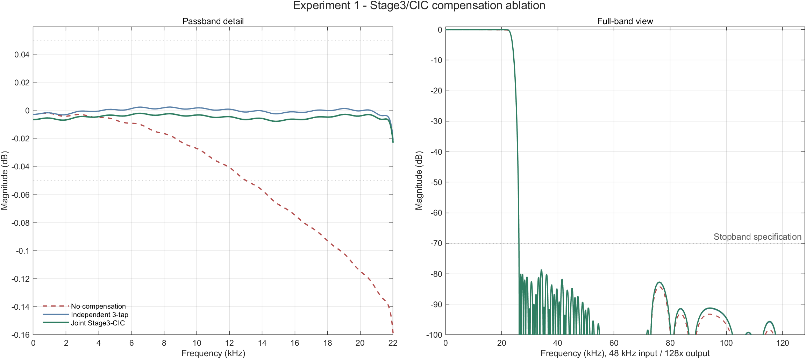
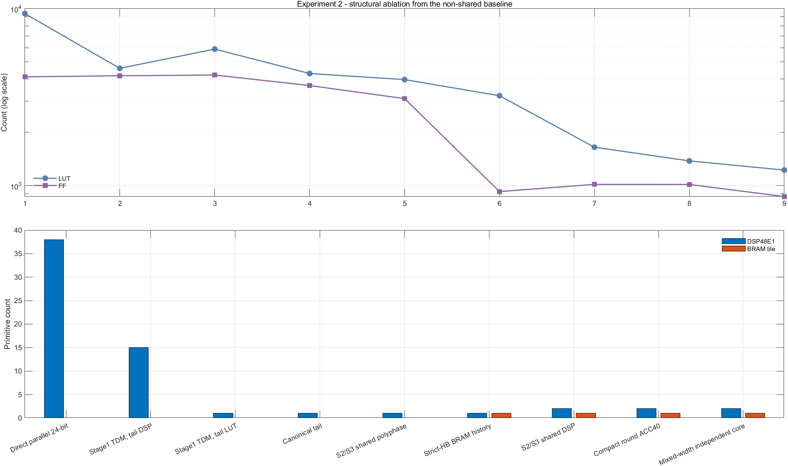
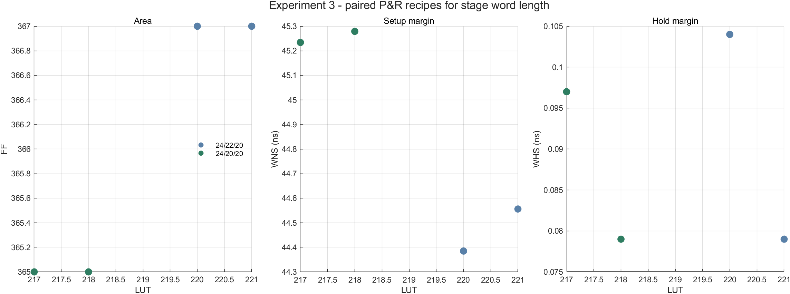
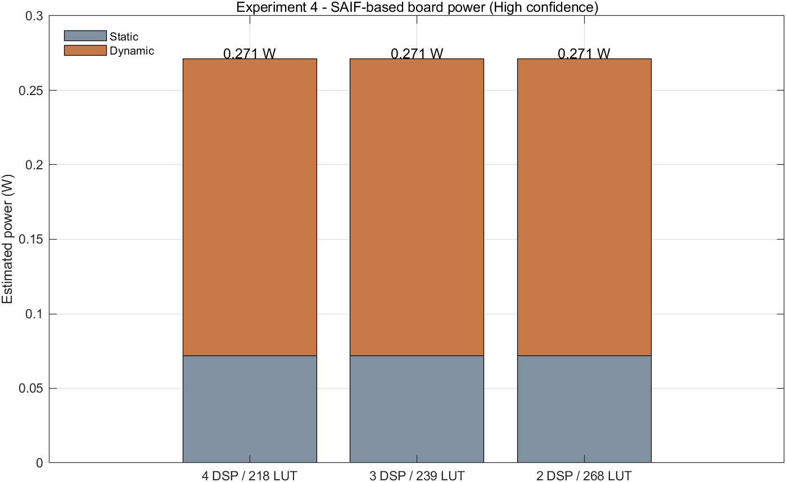
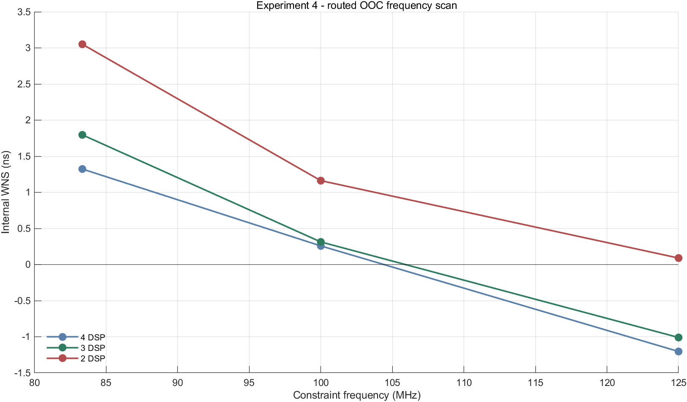
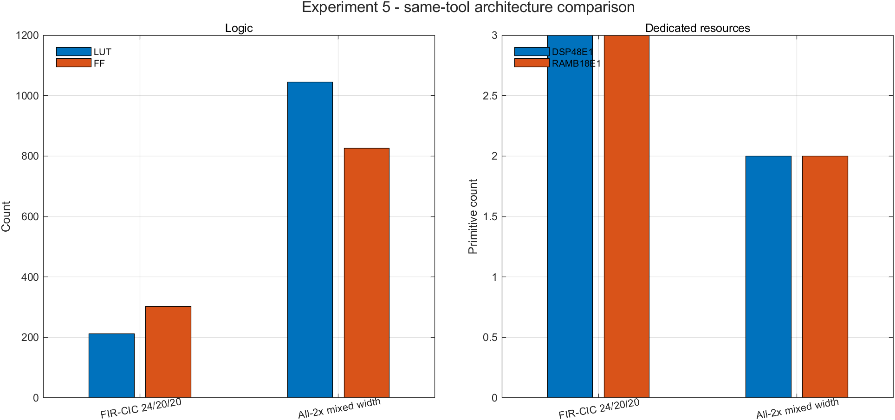
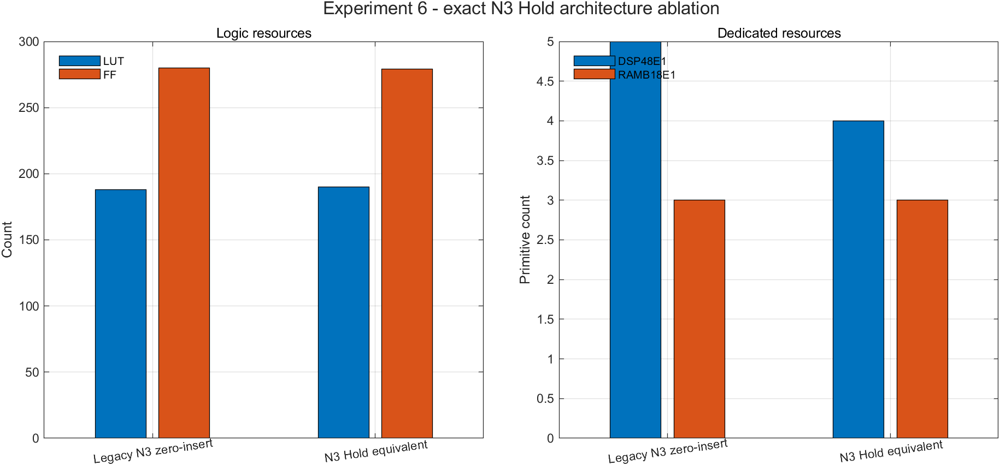

# 🧪 高阶数字插值滤波器创新验证与消融实验

| 项目 | 内容 |
|---|---|
| 系统规格 | 44.1/48 kHz、24 bit PCM，4×/8×/128×可切换插值滤波器 |
| 正式实板基线 | Vivado 2025.2，239 LUT / 388 FF / 3 DSP48E1 / 4 RAMB18E1（2 BRAM Tile）/ 2 MMCM |
| 证据口径 | 数学模型、RTL、实现、网表活动功耗和物理板结论分层记录，互不替代 |
| 报告日期 | 2026-08-15 |

## ✅ 1. 实验结论

本报告完成六组实验。最重要的方法修正是：**主消融不再拿“上一次已经优化过的版本”作零优化基线**。结构消融回到保存完好的全并行原始实现：

    7级全2×直接并行FIR
    级间数据统一24 bit
    没有Stage1时分复用
    没有Stage2/3运算资源共享
    没有BRAM历史共享

该点的真实 Vivado 2018.3 综合结果为 **9376 LUT / 4118 FF / 38 DSP / 0 BRAM Tile**。在同一代全2×RTL、同一器件和同一工具口径下逐项加入优化，最终混合字长独立链为 **1224 LUT / 867 FF / 2 DSP / 1 BRAM Tile**：相对原始全并行点减少 **8152 LUT（86.94%）**、**3251 FF（78.95%）** 和 **36 DSP**，增加 1 BRAM Tile。

随后，现代 FIR–CIC 路线在 Vivado 2025.2 同工具、同器件、同 OOC 时钟下进一步验证为 **212 LUT / 302 FF / 3 DSP / 3 RAMB18E1**；全2×混合字长核心为 **1045 LUT / 826 FF / 2 DSP / 2 RAMB18E1**。因此，本项目的低 LUT 不是单纯由新版 Vivado 或相邻版本微调造成，而是来自时分复用、专用资源协同映射、联合补偿和混合字长等结构性改进。

| 实验 | 核心问题 | 结果 |
|---|---|---|
| 1. Stage3–CIC补偿消融 | 联合补偿是否必要且有效 | 无补偿不满足±0.05 dB；独立3-tap和联合补偿均通过，联合方案纹波更小且历史实现少47 LUT/37 FF |
| 2. 时分复用与共享消融 | 资源下降是否来自真正结构创新 | 从9376-LUT全并行基线逐项下降至1224-LUT混合字长独立链 |
| 3. 字长Pareto与配对实现 | 24/20/20是否牺牲指标或时序 | 6/6频响、9/9定向数值通过；相对24/22/20减少3～4 LUT和2 FF，时序不退化 |
| 4. 功耗与Fmax | DSP数量变化是否影响功耗/速度 | 三点SAIF功耗均为0.271 W（1 mW报告分辨率内不可区分）；100 MHz三点均通过 |
| 5. FIR–CIC与全2× | 当前结构是否优于强全2×对照 | FIR–CIC核心少833 LUT、524 FF，代价为多1 DSP和1 RAMB18E1；两者均满足频响要求 |
| 6. CIC等效Hold | 删除一级高速积分器是否保持严格等价 | 53,760个完成输出样点逐拍0 LSB；同口径OOC以+2 LUT、−1 FF换取−1 DSP |

## ⚖️ 2. 消融实验基准与统计口径

### 2.1 主消融基准的选择依据

近期的221、218、239和268 LUT版本已经共同包含Stage1串行对称MAC、Stage2/3共享调度、Stage3–CIC联合补偿、CIC串行comb、BRAM历史/系数映射、混合字长和多轮控制逻辑优化。所以“239对218”只能回答少一个DSP的局部成本，不能说明时分复用、资源共享或字长优化各自的贡献。本报告把近期版本放到局部Pareto和功耗实验，把早期全并行版本作为结构消融起点。

### 2.2 “未做字长优化”的定义

“未做字长优化”并非无限精度模型，而是满足以下条件的有限位宽可综合 RTL：

- 级间采样数据始终为24 bit；
- 没有当前的24→22→20→18或24→20→20分级缩位；
- 使用设计阶段原始系数位宽和累加器保护位。

早期系数已经经过定点量化，这是实现滤波器所必需，不能声称完全没有定点化。报告只把“混合级间数据字长”作为可单独归因的字长优化。

### 2.3 两组对照数据

| 数据线 | 用途 | 工具 |
|---|---|---|
| 早期全2×结构消融 | 从无时分复用/无共享起逐项解释结构收益 | Vivado 2018.3，同器件、同代RTL |
| 当前FIR–CIC定向实验 | 频响、24/20/20、DSP Pareto、功耗、Fmax和架构公平对照 | Vivado 2025.2 |

跨工具结果不做逐LUT单变量归因；同一表内的相邻差分均保持同工具口径。

## 🧰 3. 实验环境与判定门槛

| 项目 | 配置 |
|---|---|
| FPGA | XC7A35T-FGG484-2 |
| 当前实现工具 | Vivado 2025.2 |
| 早期结构消融工具 | Vivado 2018.3 |
| MATLAB | R2023a |
| 输入 | 44.1/48 kHz，24 bit signed PCM |
| 输出节点 | 4×、8×、128× |
| 通带/门槛 | 10 Hz～20 kHz；最大绝对偏差≤0.05 dB |
| 阻带门槛 | 衰减≥70 dB |
| RTL门槛 | 定向、随机、满幅、复位、CDC、动态切档和全链逐样本对拍 |
| 实现门槛 | WNS/WHS≥0、DRC Error=0；正式工程还需bitstream |
| 板级门槛 | 六档采样率正确，DAC输出持续且波形正确 |

近年FPGA数字滤波实现通常同时给出算法指标、LUT/FF/DSP/BRAM、最高频率和功耗，而不是只给一种资源；本报告按这一口径组织证据，可参见[Ilies等，2026](https://www.mdpi.com/2079-9268/16/1/5)、[Arivalagan等，2024](https://www.mdpi.com/2079-9292/13/21/4211)和[Ghosh等，2023](https://trepo.tuni.fi/handle/10024/207331)。资源复用和有限字长必须与精度共同评价的思路也与近期专用滤波硬件研究一致，参见[Yang等，ISCAS 2025](https://research.chalmers.se/en/publication/547551)。

## 📈 4. 实验一：Stage3–CIC 联合补偿消融

保持Stage1/2、CIC阶数、插值倍率、输入采样率和验收频带不变，仅改变128×路径补偿方式：无补偿、独立3-tap补偿器、联合Stage3–CIC补偿。

| 方案 | 输入采样率 | 通带最大绝对偏差/dB | 通带纹波p-p/dB | 阻带/dB | 判定 |
|---|---:|---:|---:|---:|---|
| 无补偿 | 44.1 kHz | 0.140626 | 0.138902 | 72.516 | **No-Go** |
| 无补偿 | 48 kHz | 0.114513 | 0.112790 | 72.516 | **No-Go** |
| 独立3-tap | 44.1 kHz | 0.005471 | 0.008030 | 72.370 | PASS |
| 独立3-tap | 48 kHz | 0.003004 | 0.005563 | 72.370 | PASS |
| 联合Stage3–CIC | 44.1 kHz | 0.007730 | 0.005848 | 72.371 | PASS |
| 联合Stage3–CIC | 48 kHz | 0.007606 | 0.005724 | 72.371 | PASS |

无补偿通带下垂超过门槛约2.3～2.8倍，证明补偿不是可有可无。联合方案最大绝对偏差略高于独立3-tap，但纹波更小，仍有42倍以上通带门槛余量。

- 联合系数为[561, 137, -4232, -1554, 20046, 35584, 20046, -1554, -4232, 137, 561]；
- MATLAB位真定向用例10/10 PASS；
- 正式3-DSP RTL Release 17/17 PASS；
- 4×/8×/128×全链定向和随机对拍0 LSB；
- 历史同工具实现对：独立补偿479 LUT / 468 FF，联合折叠432 LUT / 431 FF，DSP和RAMB18不变，净减少47 LUT、37 FF。

## 🧱 5. 实验二：时分复用与资源共享结构消融

| 步骤 | 新加入的主要机制 | LUT | FF | DSP | BRAM Tile | 相对上一步 |
|---|---|---:|---:|---:|---:|---|
| A0 | 全并行对称FIR、24-bit级间、无共享 | 9376 | 4118 | 38 | 0 | 真正零结构优化基线 |
| A1 | Stage1单MAC时分复用，后级仍用DSP | 4604 | 4178 | 15 | 0 | −4772 LUT，−23 DSP，+60 FF |
| A2 | 后级乘法由DSP转为LUT | 5912 | 4218 | 1 | 0 | +1308 LUT，−14 DSP，+40 FF |
| A3 | Stage4～7 canonical halfband | 4302 | 3678 | 1 | 0 | −1610 LUT，−540 FF |
| A4 | Stage2/3 true-polyphase共享数据通路 | 3975 | 3103 | 1 | 0 | −327 LUT，−575 FF |
| A5 | Stage1 strict-halfband + BRAM历史 | 3222 | 925 | 1 | 1 | −753 LUT，−2178 FF，+1 BRAM |
| A6 | Stage2/3共享一个串行DSP | 1648 | 1016 | 2 | 1 | −1574 LUT，+91 FF，+1 DSP |
| A7 | 共享Q15紧凑舍入、ACC40 | 1379 | 1015 | 2 | 1 | −269 LUT，−1 FF |
| A8 | 24/22/20/18/18/18/18混合字长 | 1224 | 867 | 2 | 1 | −155 LUT，−148 FF |

A1→A2的LUT增加但DSP从15降到1，是明确的资源交换，不是优化失败。A5→A6增加1 DSP和91 FF，却减少1574 LUT，说明共享DSP的价值在于用少量专用乘加资源替代宽常数乘法网络和组合加法树。

A0、A1、A2来自保留的原始层次综合报告；A3～A8均有独立RTL顶层、0-LSB对拍和同工具资源报告。A0→A8总降幅只能归因于整套结构组合，不能把86.94%全部写成某一个单点创新。

## 🔢 6. 实验三：字长 Pareto 与配对布局布线

当前正式路线比较24/22/20与24/20/20，不把早期全并行点与现代核心直接相减。

| 字长 | 最差通带绝对偏差/dB | 最差纹波/dB | 最差阻带/dB | 数值验证 |
|---|---:|---:|---:|---|
| 24/22/20 | 0.007730 | 0.005848 | 72.371 | 自身golden 0 LSB |
| 24/20/20 | 0.007605 | 0.005733 | 72.355 | 6/6频响、9/9定向、0溢出 |

24/20/20严格相位残差不超过5.6843e-14，随机和强信号相对基线误差SNR约96～118 dB。

| 字长 | 实现配方 | LUT | FF | DSP | RAMB18 | WNS/WHS/ns |
|---|---|---:|---:|---:|---:|---:|
| 24/22/20 | Explore | 221 | 367 | 4 | 4 | +44.556/+0.079 |
| 24/22/20 | Default | 221 | 367 | 4 | 4 | +44.556/+0.079 |
| 24/22/20 | ExtraTimingOpt | 220 | 367 | 4 | 4 | +44.385/+0.104 |
| 24/20/20 | Explore | 218 | 365 | 4 | 4 | +45.279/+0.079 |
| 24/20/20 | Default | 218 | 365 | 4 | 4 | +45.279/+0.079 |
| 24/20/20 | ExtraTimingOpt | 217 | 365 | 4 | 4 | +45.234/+0.097 |

三个配方均得到24/20/20少3～4 LUT、2 FF，排除了单颗随机LUT波动的解释。Vivado 2025.2公开命令没有可设置的传统place seed，因此这里使用三种独立布局配方，不虚构seed编号。

## ⚡ 7. 实验四：SAIF 活动功耗与核心 Fmax

三种版本使用同一6 ms post-route功能仿真激励；DAC均得到11290个时钟边沿、7462次数据变化并PASS。SAIF覆盖率72%～74%，功耗置信度High。

| 版本 | 总功耗/W | 动态/W | 静态/W |
|---|---:|---:|---:|
| 218 LUT / 4 DSP | 0.271 | 0.199 | 0.072 |
| 239 LUT / 3 DSP | 0.271 | 0.199 | 0.072 |
| 268 LUT / 2 DSP | 0.271 | 0.199 | 0.072 |

三点相同只表示低于1 mW报告分辨率。2个MMCM约占0.197 W动态功耗，掩盖小型数据通路的细微差异。若要声称微瓦级优劣，需要板上电流测量或更长、更高覆盖率门级活动。

| DSP模式 | 83.33 MHz WNS | 100 MHz WNS | 125 MHz WNS | 最高已通过点 |
|---|---:|---:|---:|---:|
| 4 DSP | +1.323 ns | +0.258 ns | −1.204 ns | 100 MHz |
| 3 DSP | +1.796 ns | +0.313 ns | −1.010 ns | 100 MHz |
| 2 DSP | +3.051 ns | +1.162 ns | +0.090 ns | 125 MHz |

三个点在100 MHz均有正setup/hold裕量，远高于约6.144 MHz正式音频核心工作需求。2-DSP点在本次布局中通过125 MHz，不应解释为DSP越少必然越快。

## 🔍 8. 实验五：FIR–CIC 与全 2× 同工具对照

两种架构均使用Vivado 2025.2、XC7A35T-FGG484-2、162.760 ns OOC时钟、AreaOptimized_high、resource_sharing on、ExploreArea/Explore，并完成post-route与0 DRC Error。

| 架构 | LUT | FF | DSP | RAMB18 | WNS/WHS/ns | 板级状态 |
|---|---:|---:|---:|---:|---:|---|
| 当前FIR–CIC 24/20/20，3-DSP | 212 | 302 | 3 | 3 | +150.852/+0.117 | 对应239-LUT整板已板测 |
| 全2×混合字长，2-DSP | 1045 | 826 | 2 | 2 | +146.128/+0.071 | 工具闭环，未作本轮物理板测 |

相对全2×，FIR–CIC核心减少 **833 LUT（79.71%）**、**524 FF（63.44%）**，代价是多1 DSP和1 RAMB18。

| 架构 | 最差通带绝对偏差/dB | 最差纹波/dB | 最差阻带/dB |
|---|---:|---:|---:|
| FIR–CIC联合补偿 | 0.007730 | 0.005848 | 72.371 |
| 全2×混合字长 | 0.005444 | 0.007823 | 78.447 |

全2×阻带余量更大，FIR–CIC则在仍满足≥70 dB的前提下获得显著逻辑资源优势。合理结论是两者构成不同资源/频响Pareto点，而不是FIR–CIC在所有指标上绝对更好。

## 🔁 9. 实验六：CIC 严格 Hold 等效消融

普通N=3、R=16插值CIC可写成：

    C³ → ↑16（插15个零）→ I³

利用单对 `C → ↑R → I` 的冲激响应恰好是长度R的全1序列，可严格改写为：

    C² → Hold16（每个低速差分结果保持16个输出使能）→ I²

这不是近似零阶保持，也没有改变CIC阶数对应的总传递函数；它删除一对低速comb/高速integrator，并由Hold16实现该对的精确矩形响应。前提是保持补码模运算、增益归一化、舍入饱和、启动/排空长度和valid相位一致。

| 结构 | LUT | FF | DSP | RAMB18 | WNS/WHS/ns | DRC Error |
|---|---:|---:|---:|---:|---:|---:|
| 无Hold：C³→↑16→I³ | 188 | 280 | 5 | 3 | +150.563/+0.082 | 0 |
| 等效Hold：C²→Hold16→I² | 190 | 279 | 4 | 3 | +150.943/+0.069 | 0 |

该Vivado 2025.2 OOC对照保持前三级FIR、联合补偿、24/20/20字长、器件、6.144 MHz约束和实现策略不变，只切换Hold恒等结构。结果为 **+2 LUT、−1 FF、−1 DSP**，因此它是DSP优先Pareto创新，不应宣传成所有资源同时下降。早期Vivado 2018.3整板P3→P4-A也独立得到5→4 DSP、−3 FF，代价为+29 LUT，方向一致。

当前Release测试同时实例化旧N3串行comb和Hold的4/3/2-DSP映射，覆盖连续320帧、随机停顿480帧、10×256随机帧和burst中途复位；共 **53,760个完成输出样点** 的data/valid逐拍比较为0 LSB。状态从旧33 bit保守实现收紧为解析证明的26/29 bit，并保持最终右移8 bit。

Hogenauer CIC、Noble 恒等式和 Hold 实现思想属于已有多速率理论。本项目的创新边界是在双采样率、多倍率音频链中把恒等式落实为可切换 RTL，完成定点模运算与状态位宽证明、DSP/LUT 映射、逐拍等价、时序/DRC 和板级闭环。[Hogenauer原始CIC论文](https://doi.org/10.1109/TASSP.1981.1163535)和[MathWorks CIC插值说明](https://www.mathworks.com/help/dsp/ref/cicinterpolation.html)均表明 CIC 及通过 Noble 恒等式移动速率变换属于既有基础理论。

本次Fresh无Hold OOC已完成；同参数Hold复跑在route阶段因主机内存耗尽中止，因此Hold列复用了2026-08-11已经完成、DRC=0的Vivado 2025.2 OOC签核摘要。参数、器件和约束相同；没有把失败的route当成通过结果。

## 🧾 10. 完整验证矩阵

| 层级 | 内容 | 结果 |
|---|---|---|
| MATLAB | 补偿三路、44.1/48 kHz、4×/8×/128× | 规格通过；无补偿负对照按预期失败 |
| 字长数值 | 6模式频响、9组定向、强信号/随机、溢出 | 6/6、9/9、0溢出 |
| RTL Smoke/Release | 模块、全链、ROM/RAMB、CDC、复位、动态切档 | 17/17 PASS |
| 全链位真 | 4×/8×/128×定向、随机和24组全链 | 逐样本0 LSB |
| post-route DAC | 默认与44.1/48 kHz六模式 | 时钟边沿和DAC数据持续变化 |
| 时序/DRC | 正式工程与OOC | 正setup/hold；DRC Error=0 |
| bitstream | 239-LUT正式工程 | 生成成功 |
| 物理板 | 六档采样率和 DAC 波形实测 | **通过** |

板测结论仅对应已实测的 239-LUT 版本；全 2×和 268-LUT 等工具候选不继承该结论。

## 💡 11. 创新点与证据

1. **联合Stage3–CIC补偿**：负对照证明不补偿无法满足通带；联合补偿两种采样率通过，并以更小纹波及历史实现少47 LUT/37 FF取代独立补偿器。
2. **多速率时分复用与专用资源协同**：从无时分复用和无共享的9376-LUT/38-DSP点开始，逐项展示时分复用、polyphase、BRAM和DSP共享收益。
3. **精度约束下的混合字长**：现代24/20/20相对24/22/20的收益虽小但三配方可复现；早期全2×同结构混合字长减少155 LUT/148 FF。
4. **CIC严格等效Hold与专用资源映射**：已知多速率恒等式被落实为26/29-bit定点RTL，以+2 LUT、−1 FF换取−1 DSP，并与旧N3实现53,760输出样点0 LSB。
5. **双采样率、动态倍率和板级闭环**：44.1/48 kHz双时钟家族、4×/8×/128×切档、复位/CDC/ROM/DAC均进入17/17 RTL、路由后六模式和物理板验证。

## 🧭 12. 验证边界与未覆盖项目

1. 早期结构消融使用Vivado 2018.3，当前架构比较使用2025.2；报告没有跨工具直接归因单颗LUT。
2. SAIF受1 mW分辨率和MMCM主导限制，尚未包含板级电流仪测量结果。
3. Fmax每种结构只有三档约束和有限布局配方，尚未包含5～10组独立实现配方的均值与标准差。
4. 全2×对照未完成本轮物理板测，只能标为工具闭环。
5. 音频质量证据尚未覆盖THD+N、SINAD、SFDR和真实音频文件对照，频响结果不等同于完整音质评价。
6. 本次Hold新复跑受16 GB主机内存限制在route阶段终止；报告采用同参数历史签核点，未纳入成对Fresh run的重复统计。

## 📂 13. 复现入口与原始证据

最终图表CSV：

    submit/finally/reports/assets/innovation_validation_20260815/

被Git忽略的原始实验输出：

    matlab_fir/national_finals/_work/innovation_validation_20260815/

主要入口：

    matlab_fir/national_finals/innovation_experiments/run_experiment1_ablation.m
    matlab_fir/national_finals/innovation_experiments/run_wordlength_recipe_matrix.ps1
    matlab_fir/national_finals/innovation_experiments/run_saif_power_2025_2.ps1
    matlab_fir/national_finals/innovation_experiments/run_core_fmax_matrix.ps1
    matlab_fir/national_finals/innovation_experiments/run_architecture_ooc_compare.ps1
    matlab_fir/national_finals/innovation_experiments/run_cic_hold_ablation.ps1
    matlab_fir/national_finals/innovation_experiments/generate_experiment_report_assets.m

本报告与[三项核心结构创新详细说明报告](项目三项核心结构创新详细说明报告.md)形成配套证据：本文件记录实验方法及验证结果，创新说明报告阐释结构机制与技术边界。
