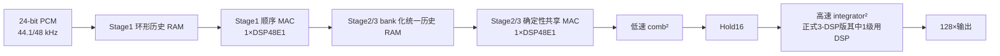

# 🧠 高阶数字插值滤波器三项核心结构创新

| 项目 | 内容 |
|---|---|
| 系统规格 | 44.1/48 kHz、24 bit PCM、4×/8×/128×可切换高阶数字插值滤波器 |
| FPGA | Xilinx Artix-7 XC7A35T-FGG484-2 |
| 正式实现基准 | Vivado 2025.2，239 LUT / 388 FF / 3 DSP48E1 / 4 RAMB18E1（2 BRAM Tile）/ 2 MMCM |
| 插值核心 OOC | 212 LUT / 302 FF / 3 DSP48E1 / 3 RAMB18E1 |
| 板测标签 | `nf-vivado2025.2-239lut-388ff-3dsp-2bram-24-20-20-board-pass` |
| 验证状态 | RTL、综合、实现、bitstream、六档采样率和 DAC 波形板测通过 |
| 报告日期 | 2026-08-16 |

---

## ✨ 1. 三项核心创新概览

结合当前正式 RTL、资源演进记录和消融实验，本项目最清晰、边界最互不重叠的三项核心结构创新是：

1. **基于环形地址的历史样本 RAM 循环读写与跨级存储合并**；
2. **基于确定性截止期调度的乘加资源共享**；
3. **CIC 插值链的严格 Hold 等效重构**。

三项创新分别压缩了三个不同维度的硬件冗余：

| 创新 | 主要消除的冗余 | 核心思想 | 主要收益 |
|---|---|---|---|
| 历史 RAM 循环读写 | 样本逐级搬移、重复历史存储、双读 RAM 复制 | 数据不移动，只移动环形指针；Stage2/3 用 bank 合并历史空间 | 历史存储由 3 BRAM Tile 降至 2 BRAM Tile |
| 资源共享 | 每个抽头、每个滤波级各自复制乘法器和累加器 | 利用音频多速率链的空闲系统时钟，按最坏截止期复用 DSP48E1 | 当前三级 FIR 只使用 2 个 DSP，完整系统为 3 DSP |
| CIC Hold 等效 | 一对低速 comb 与高速 integrator | 用严格多速率恒等式把一对 `comb→↑16→integrator` 变成 `Hold16` | 同口径 OOC 减少 1 DSP，完成 53,760 样点 0 LSB 等价验证 |

这三项不是同一优化的三种说法：第一项解决“历史样本放在哪里、怎样寻址”，第二项解决“乘加运算由谁、在第几拍执行”，第三项直接改变等价运算图，删除一对 CIC 算子。



联合补偿、混合字长、DSP/CARRY 映射、CDC 和验证闭环属于重要支撑技术，与上述三项核心结构创新分层呈现。

### 1.1 RTL仿真的字长口径

本报告的**最终正式结论使用Stage1/Stage2/Stage3 = 24/20/20 bit**，对应239-LUT/3-DSP板测标签。字长在RTL中的实际含义是：

```text
Stage1输入/输出：24 bit
Stage1→Stage2：右移4 bit并饱和至20 bit
Stage2输入、历史RAM、DSP数据口和输出：20 bit
Stage2→Stage3：20 bit同宽传输，SHIFT_N=0
Stage3平坦输出：20 bit
Stage3补偿输出：有符号21 bit，送入CIC
CIC状态：23-bit comb、26/29-bit积分状态，最终输出20 bit
```

不同证据的字长口径如下：

| 证据 | 是否为24/20/20 | 说明 |
|---|---|---|
| 当前正式239-LUT/3-DSP Smoke与Release | **是** | 默认回归固定`STAGE2_DATA_W=20`，使用24/20/20 MATLAB金标准 |
| 4/3/2-DSP CIC模式回归 | **是** | 三档只改变DSP/CARRY映射，不改变24/20/20数值规格 |
| CIC Hold 53,760样点等价测试及OOC消融 | **是** | 前三级固定24/20/20；CIC接口因补偿通路为21 bit |
| P4-B历史RAM模块336/671输出对拍 | 否，属于历史24/22/20阶段 | 用来证明最初的单RAM/bank化机制；最终结构后来在24/20/20完整回归中重新验证 |
| A0～A8早期全2×结构消融 | 否，不是单一最终字长 | 用于解释时分复用/共享的结构收益，不能替代正式24/20/20回归 |

24/20/20相对24/22/20改变了量化点，因此不能要求两种字长彼此逐样本0 LSB。正式判定方法是：先为24/20/20重新生成MATLAB位真金标准，再要求RTL的4×/8×/128×节点对该金标准逐样本0 LSB。该回归已完成Smoke 17/17、Release 17/17、14组全链激励、8类复位恢复和10次动态切档。

---

## 🗃️ 2. 创新一：历史样本 RAM 的循环读写与跨级存储合并

### 2.1 原始问题：移位历史会重复搬运数据

长度为 `L` 的 FIR 每接收一个新样本，都要访问：

```text
x[n], x[n-1], x[n-2], ..., x[n-L+1]
```

最直接的 RTL 是 `L-1` 级移位寄存器。每来一个样本，所有旧样本整体移动一格。这种写法虽然直观，但在 FPGA 上存在三个问题：

1. 24 bit 宽历史会消耗大量 FF；
2. 移位、抽头选择和复位会产生大量 LUT；
3. 若线性相位 FIR 每拍同时读左右对称样本，单端口或简单双口 RAM 可能被迫复制。

本项目将问题改写为：**历史数据写入后保持不动，只更新“哪个地址代表最新样本”的逻辑指针。**

### 2.2 环形地址原理

设物理 RAM 深度为 `D=2^A`，写指针为 `p`。采用二进制自然回绕后，第 `k` 个历史样本地址可以写成：

```text
addr(k) = (p - k) mod D
```

或在反向增长指针的 Stage2/3 中写成：

```text
new_head = (head - 1) mod D
addr(k)  = (new_head + k) mod D
```

由于 `D` 是 2 的幂，模运算由地址位自然截断完成，不需要除法器或显式取模器。每次输入只写一个 RAM 地址，旧样本无需搬移。

### 2.3 Stage1：64×24 bit 单 RAMB18E1 环形历史

Stage1 的有效历史长度为 52 个 24 bit 样本，物理上使用一个 64×24 bit 的 SDP RAMB18E1：

- `wr_ptr` 指向本次写入位置；
- phase-zero 接收输入时，将当前 24 bit 样本写入 `wr_ptr`；
- 随后读地址从最新位置开始逐拍递减，自然完成 `52` 个历史样本扫描；
- 读端为同步读，地址、有效掩码和系数索引通过一拍返回流水对齐；
- `history_full` 和启动期有效性只控制 DSP 的 `CEP`，不在 24 bit 数据前放置“历史值/零”宽 MUX；
- 扫描结束后写指针自增并自然回绕。

当前 239-LUT 正式结构还把 26 个对称系数展开为 52 个顺序系数：

```text
C0, C1, ..., C25, C25, ..., C1, C0
```

因此历史 RAM 只需每拍提供一个样本，不需要复制 RAM 来同拍读取 `Lk/Rk`。在同一个 48 bit 累加域内：

```text
(Lk + Rk) × Ck  =  Lk × Ck + Rk × Ck
```

左右两项之间没有中间截位，所以该顺序展开保持二进制补码结果等价。

Stage1 的循环读写时序可概括为：

| 时段 | RAM/控制动作 | 结果 |
|---|---|---|
| 输入到达 | 当前样本写入 `wr_ptr` | 只写一个地址，不移动旧历史 |
| 扫描启动 | 读地址指向最新历史 | 同步 RAM 开始返回抽头数据 |
| MAC 扫描 | 地址每拍减 1，系数索引每拍加 1 | 一颗 DSP 完成 52 次顺序 MAC |
| 尾处理 | DSP 内加入 Q15 舍入偏置并执行饱和 | 输出数值和 valid 与金标准一致 |
| 下一输入 | `wr_ptr` 加 1 并回绕 | 开始下一轮历史窗口 |

### 2.4 Stage2/3：bank 化统一环形历史

Stage2 和 Stage3 的历史深度较浅，且两级已经共享同一乘加调度器；因此共享 MAC 任一时刻只会读取其中一个 stage 的历史。本项目将两级逻辑历史合入一个 RAMB18E1：

```text
物理地址 = {stage_bank, history_index}

stage_bank = 0：Stage2 历史
stage_bank = 1：Stage3 历史
```

当前 24/20/20 正式字长下，RAM 有效载荷按 20 bit 数据通路配置；早期 P4-B 的同一结构为 22 bit。物理 RAM 提供 32 个逻辑位置，最高地址位选择 Stage2/Stage3 bank。

每个 stage 维护自己的 `head`、`phase` 和 `history_full`，任务启动时把 `head` 快照到 `job_history_head`。这样，即使新输入继续到达，正在执行的 MAC 仍读取同一个确定历史窗口，不会出现半个任务使用旧 head、半个任务使用新 head 的“历史撕裂”。

Stage2/3 统一历史的关键设计不是简单拼接两个数组，而是同时解决了：

1. **读端仲裁**：共享 MAC 每拍只读一个 bank，读地址由当前 `job_stage3` 决定；
2. **写端仲裁**：通用 RTL 保留一项 Stage3 写队列处理同拍双写；
3. **正式配置精简**：全国赛 CE 均为对齐的 2 的幂分频，证明同一拍的 Stage2/3 不会同时处在历史写相，因此签核配置用 `ASSUME_ALIGNED_POW2_CE=1` 删除不可达的 25 bit 写队列；
4. **原语锁定**：显式例化 RAMB18E1，避免综合器因浅深度把存储回退成 LUTRAM；
5. **行为/原语一致性**：行为 RAM 和真实 RAMB18E1 分别参加 RTL 对拍，覆盖同步读和 READ_FIRST 语义。

### 2.5 这项创新带来的可量化收益

P4-A 到 P4-B 是只改变历史存储与读取调度的干净 A/B：

| 指标 | P4-A：分立历史 | P4-B：循环单RAM/统一历史 | 变化 |
|---|---:|---:|---:|
| LUT | 491 | 504 | +13 |
| FF | 444 | 493 | +49 |
| DSP48E1 | 4 | 4 | 0 |
| BRAM Tile / RAMB18E1 | 3 / 6 | **2 / 4** | **−1 Tile / −2 RAMB18E1** |
| WNS / WHS | +45.738/+0.052 ns | +45.637/+0.119 ns | 均通过 |
| 功耗估计 | 0.271 W | 0.271 W | 报告精度内不变 |

因此这项创新的准确结论是：**用 13 LUT 和 49 FF 的调度代价，换掉一个完整 BRAM Tile，同时保持 DSP、传递函数、样点值和功耗报告不变。** 它是 BRAM 优先 Pareto 点，不应被写成所有资源同时下降。

后续又通过固定 CE 不相交证明、DSP CE 门控和顺序抽头重构把额外控制开销继续压低，最终正式 239-LUT 版本仍只使用 2 BRAM Tile：板级 4 个 RAMB18E1 中，1 个是测试音 ROM，滤波器核心只占 3 个 RAMB18E1，分别用于 Stage1 历史、Stage2/3 统一历史和统一系数。

### 2.6 验证证据

- Stage1 行为 RAM 与 RAMB18E1 原语路径各比较 1400 个输出，数据和 valid 均为 0 LSB；
- 历史P4-B的24/22/20阶段中，Stage2/3统一历史分别比较336/671个输出，0 LSB；
- 最终24/20/20配置随后重新完成Smoke/Release 17/17，历史RAMB18原语、Stage2/3共享核和4×/8×/128×全链均按新的24/20/20金标准验证；
- 当前 Release 回归 17/17 PASS；
- 冲激、10 个随机种子、正/负满量程、−1 dBFS 强信号的 4×/8×/128×节点全部逐样本 0 LSB；
- 8 类内部状态复位、动态切档、CDC 和双时钟族用例通过；
- 当前 239-LUT 标签已通过物理板六档采样率和 DAC 波形验证。

### 2.7 创新边界

环形缓冲区本身是已有数字信号处理方法，本项目不应声称发明了 circular buffer。可以主张的是：

面向三级多速率插值 FIR 的不同时隙和 RAM 端口约束，设计了 Stage1 单 RAM 顺序历史微引擎和 Stage2/3 bank 化统一历史；并利用对齐 CE 的可达性证明删除写冲突队列，在保持位真等价和动态模式安全的条件下把历史存储压缩到两个核心历史 RAMB18E1。

---

## ⏱️ 3. 创新二：基于确定性截止期调度的乘加资源共享

### 3.1 原始问题：直接展开会复制大量乘加硬件

若每个 FIR 抽头都使用独立乘法器和加法树，七级全 2×早期直接并行实现曾达到：

```text
9376 LUT / 4118 FF / 38 DSP / 0 BRAM Tile
```

音频输入采样率远低于 FPGA 系统时钟，直接并行意味着大量乘法器在绝大多数时钟周期空闲。本项目将“空间并行”改写为“时间复用”，但不是只看平均运算量，而是为每个任务建立最坏截止期。

### 3.2 Stage1：一颗 DSP 顺序执行整级 FIR

Stage1 的输出使能之间有 64 个系统时钟。当前结构在这个窗口内完成：

1. 52 个历史样本和展开系数的顺序读取；
2. 52 次 DSP48E1 乘累加；
3. Q15 舍入偏置加入；
4. 符号扩展检查与饱和提交。

RTL 中保留了 deadline 断言：下一次 phase-zero 输入到来时，`issue_active`、RAM 返回流水、舍入和饱和尾状态必须全部清空；否则直接 `$fatal`。因此“来得及”是由周期级门禁证明的，不是平均吞吐估计。

Stage1 从旧对称预加结构改为顺序抽头后，完整板级由 276 LUT / 379 FF 降至 258 LUT / 376 FF，DSP 和 BRAM 不变，净减少 18 LUT、3 FF。这一变化来自删除双环形地址、左右有效掩码、预加控制和独立中心抽头预取状态。

### 3.3 Stage2/3：两级共享同一颗 DSP48E1

Stage2 与 Stage3 共同使用一颗 DSP48E1。共享单元不仅复用乘法器，还复用：

- DSP P 寄存器累加；
- Q15 正负舍入偏置；
- PATTERNDETECT 符号扩展判断；
- 饱和值装载和结果提交通路；
- 系数 RAM 读口和历史 RAM 读口。

调度器只允许一个 `job_active`。CE 到来时不直接改变执行中的任务，而是形成 `pending`；真正启动时锁存：

```text
job_stage3
job_phase
job_history_head
job_history_full
stage3_compensated_mode
```

这些快照在整个 MAC job 中不变，从而保证动态切档、历史 head 更新和系数 bank 选择不会撕裂当前输出。

### 3.4 32周期超帧的最坏调度证明

在 128×系统时钟域中：

- Stage2 每 32 拍产生一次任务；
- Stage3 每 16 拍产生一次任务；
- 所以一个 32 拍超帧内有 1 个 Stage2 任务和 2 个 Stage3 任务。

两相 MAC 数分别为：

| 任务 | 两相 MAC 拍数 | 接受拍 | 尾处理 | 说明 |
|---|---:|---:|---:|---|
| Stage2 | 9 / 8 | 1 拍 | 3 拍 | DSP清零/任务接受，随后舍入、饱和和原子提交 |
| Stage3 | 6 / 5 | 1 拍 | 3 拍 | 同上 |

一个最坏 32 拍超帧的占用为：

```text
Stage2最大9 MAC + Stage3两相(6+5) MAC
+ 3个任务×(1接受拍+3尾拍)
= 9 + 11 + 12
= 32 拍
```

这是一条**恰好填满32拍的确定性日历**，并没有可继续塞入第四类任务的平均空闲量。其可行性依赖同步RAM预取、Stage2优先级、两相MAC数交替和对齐CE，不能随意增加流水气泡。RTL设置了 `pending overwrite`、history collision 和 deadline 断言，任何任务覆盖、历史冲突或超时都会使仿真失败。

### 3.5 当前正式版本的 DSP 分工

239-LUT / 3-DSP 完整系统的 DSP 分配是：

| DSP | 功能 | 共享层次 |
|---|---|---|
| DSP0 | Stage1 52抽头顺序 MAC | 级内跨抽头时分复用 |
| DSP1 | Stage2/Stage3 共享 MAC | 跨滤波级、跨相位复用 |
| DSP2 | CIC 最终宽积分器 | CIC 高速累加；其余加减使用 CARRY/Fabric |

其中三级 FIR 只使用 2 颗 DSP。CIC 的第 3 颗 DSP 属于下一节的 Hold 等效链与器件映射，不应算作 FIR 跨级共享的成果。

### 3.6 从“无共享”开始的结构消融

早期全 2×同工具、同器件消融能说明资源下降确实来自结构重写：

| 步骤 | 新加入的主要机制 | LUT | FF | DSP | BRAM Tile | 相对上一步 |
|---|---|---:|---:|---:|---:|---|
| A0 | 全并行对称 FIR、无时分复用、无跨级共享 | 9376 | 4118 | 38 | 0 | 起点 |
| A1 | Stage1 单 MAC 时分复用 | 4604 | 4178 | 15 | 0 | −4772 LUT，−23 DSP，+60 FF |
| A2 | 后级乘法由DSP转为LUT | 5912 | 4218 | 1 | 0 | +1308 LUT，−14 DSP，+40 FF |
| A3 | 后端 canonical halfband | 4302 | 3678 | 1 | 0 | −1610 LUT，−540 FF |
| A4 | Stage2/3 true-polyphase 共享数据通路 | 3975 | 3103 | 1 | 0 | −327 LUT，−575 FF |
| A5 | Stage1 strict-halfband + BRAM 历史 | 3222 | 925 | 1 | 1 | −753 LUT，−2178 FF，+1 BRAM |
| A6 | Stage2/3 共享一个串行 DSP | 1648 | 1016 | 2 | 1 | −1574 LUT，+91 FF，+1 DSP |

A1→A2 把后级乘法从DSP转入LUT，虽然DSP由15降至1，但LUT增加1308，属于明确的资源交换。A5→A6 增加 1 DSP 和 91 FF，却减少 1574 LUT，说明共享 DSP 的价值并不是“DSP 数字必然减少”，而是用一颗适合乘加的专用资源替换大规模 LUT 常数乘法网络和组合加法树。A0→A1 则直接证明级内时分复用显著减少并行 DSP。

这些消融属于早期全 2×架构，不能与当前 2025.2 版本跨工具直接逐 LUT 相减；但相邻点保持同工具和同代 RTL，足以说明每类共享机制的方向和量级。

### 3.7 为什么没有把三级 FIR 全部压到一颗 DSP

项目还实现并验证过“Stage1/2/3 全局单 DSP”实验：64,000 周期逐拍比较和所有 deadline 断言均通过，说明调度在功能上可行；但保存 Stage1 累加上下文、Stage2/3 抢占/恢复、宽数据 MUX、所有权状态和不同字长量化选择，使 FIR 前端从 187 LUT 增至 316 LUT。该候选虽少 1 DSP，却多 129 LUT，最终 No-Go。

这项反例很重要：本项目的创新不是“共享越多越好”，而是**以总资源和截止期为约束选择共享边界**。当前 Stage1 独立、Stage2/3 共享，是验证空间内更合理的局部 Pareto。

### 3.8 验证证据

- Stage1 新旧结构行为 RAM/原语路径各 1400 输出 0 LSB；
- Stage2/3共享调度在历史结构阶段完成模块级定向比较；最终24/20/20配置又通过全链逐样本0 LSB回归；
- 结构实验覆盖 64,000 周期，`y2/y4/y8=500/1000/2000`，valid 与数据逐拍一致；
- `pending overwrite`、history collision 和 deadline 断言未触发；
- 正式 3-DSP 模式 Smoke/Release 17/17 PASS；
- 当前板测确认 44.1/48 kHz 两个时钟族的 4×/8×/128×采样率与 DAC 波形正常。

### 3.9 创新边界

时分复用和资源共享是已有数字硬件技术。项目可以主张的创新是：

针对 128×主时钟域下三级滤波器不等长任务，建立了 64拍 Stage1 截止期和恰好32/32拍的 Stage2/3最坏超帧日历；结合历史/系数 RAM 端口、任务快照和原子提交，在动态倍率切换下实现可证明不覆盖的两级共享 DSP 微架构，并通过逐拍位真和板级验证确定合理共享边界。

---

## 🔁 4. 创新三：CIC 的严格 Hold 等效重构

### 4.1 原始三级 CIC 插值链

对插值倍率 `R=16`、阶数 `N=3` 的 CIC，传统结构为：

```text
低速 comb³ → ↑16插零 → 高速 integrator³
```

其高采样率传递函数为：

```text
H(z) = [(1 - z^-16) / (1 - z^-1)]³
     = [1 + z^-1 + ... + z^-15]³
```

传统实现需要 3 级低速差分和 3 级高速积分。其中高速积分器每个输出使能都要更新，是 CIC 中最持续占用宽加法资源的部分。

### 4.2 单对 comb/integrator 为什么等价于 Hold16

低速 comb 的传递函数为：

```text
C(z) = 1 - z^-1
```

移到 16 倍高采样率域后对应 `1-z^-16`。再串联一级高速积分器：

```text
I(z) = 1 / (1 - z^-1)
```

两者乘积为：

```text
(1 - z^-16) / (1 - z^-1)
= 1 + z^-1 + z^-2 + ... + z^-15
```

这正是长度为 16、系数全为 1 的矩形脉冲响应。时域实现就是：**每得到一个低速差分结果，就在接下来的 16 个高速输出使能上保持该值。**

因此：

```text
C³ → ↑16 → I³
        ≡
C² → Hold16 → I²
```

这里的 Hold 不是在 DAC 后随意添加的零阶保持近似，而是 CIC 传递函数中一对 `comb→插零→integrator` 的精确有限冲激响应。

### 4.3 RTL 如何实现严格等价

正式模块 `cic_interp16_n3_hold2_dsp_ce` 的执行过程为：

1. 新低速输入有效时，启动两级串行 comb；
2. 两个差分完成后，将结果置为下一次 `burst_pending`；
3. 第一个 `ce_out` 使用新 comb 结果，并将其锁存到 `hold_sample`；
4. `burst_remaining` 置为 15；
5. 后续 15 个 `ce_out` 重复使用 `hold_sample`；
6. 每个高速输出拍依次更新两级积分器；
7. 最终按原增益右移 8 bit，执行相同的 signed 舍入和饱和；
8. 保持与旧串行 comb CIC 相同的固定 valid 延迟，便于逐周期比较。

为防止吞吐破坏，RTL 在新输入覆盖 comb 或尚未提交的 Hold burst 时直接触发 `N3 Hold CIC input overwrite` 断言。

### 4.4 状态字长不是经验裁剪

旧实现按 `DATA_W + N·log2(R)` 给全部状态保守配置 33 bit。重构后可按各节点解析上界分别证明：

| 状态 | 当前表达式 | DATA_W=21时 | 依据 |
|---|---:|---:|---|
| comb 结果 | `DATA_W+2` | 23 bit | 两级差分增长 |
| comb 历史 | `DATA_W+1` | 22 bit | 延迟状态的实际范围 |
| 第一级积分器 | `DATA_W+5` | 26 bit | 最大幅度界为约 `32·max(abs(x))` |
| 最终积分器 | `DATA_W+8` | 29 bit | 两级矩形/三角核总 DC 增益为 `16²` |
| 输出归一化 | 右移 `(N-1)log2R` | 8 bit | Hold 已吸收一对 comb/integrator |

因此状态从保守 33 bit 收紧到 26/29 bit，不会触碰旧 CIC 在输出右移 8 bit 后可观测的有效结果。代码仍保持补码模运算语义，不能把普通有符号饱和错误地插入 CIC 内部状态。

### 4.5 当前 3-DSP 正式版本中的资源映射

Hold 等效先在算法层删除一对 comb/integrator；剩余运算再根据 XC7A35T 的资源成本映射：

- 两级低速 comb：Fabric/CARRY；
- 第一级 26 bit 高速积分器：Fabric/CARRY；
- 最终 29 bit 高速积分器：1 个 DSP48E1；
- 16拍 Hold 计数与样本锁存：少量 LUT/FF。

所以当前完整系统 3 颗 DSP 中，CIC 只使用 1 颗。另两个分别属于 Stage1 和 Stage2/3 共享 FIR。

4-DSP LUT优先配置会把一颗 DSP 重新分配给串行 comb，利用 DSP 的 P 寄存器保存 `comb_operand` 并在 ALU 中执行两次差分；2-DSP 配置则把剩余积分器也移入 CARRY。三种配置改变的是器件映射，不改变 Hold 等效的数学结构。

### 4.6 干净消融结果

Vivado 2025.2 OOC 对照保持前三级 FIR、联合补偿、24/20/20 字长、器件、6.144 MHz 约束和实现策略不变，只切换 Hold 恒等结构：

| 结构 | LUT | FF | DSP | RAMB18E1 | WNS/WHS | DRC Error |
|---|---:|---:|---:|---:|---:|---:|
| 无 Hold：`C³→↑16→I³` | 188 | 280 | 5 | 3 | +150.563/+0.082 ns | 0 |
| 等效 Hold：`C²→Hold16→I²` | 190 | 279 | 4 | 3 | +150.943/+0.069 ns | 0 |
| 变化 | +2 | −1 | **−1** | 0 | 均通过 | 0 |

因此该创新的准确资源结论是：**用 2 LUT 换掉 1 个 DSP，同时少 1 FF；BRAM 和时序签核不变。** 它是明确的 DSP 优先 Pareto，而不是 LUT 优化。

早期 Vivado 2018.3 整板 P3→P4-A 也独立得到相同方向：DSP 由 5 降至 4，FF 减少 3，代价为增加 29 LUT。不同工具和版本不能逐 LUT 合并统计，但两次独立实现都证明 Hold 重构稳定消除一颗 DSP。

### 4.7 逐拍等价验证

Release 测试同时实例化旧 N3 CIC 和 Hold 版本，并覆盖：

| 场景 | 覆盖 |
|---|---:|
| 连续输入 | 320 帧 |
| 随机停顿 | 480 帧 |
| 随机数据 | 10×256 帧 |
| burst 中途复位 | 覆盖旧状态、comb状态、Hold状态和积分器状态 |
| DSP映射 | 4/3/2-DSP 对应模式均进入回归 |

合计 **53,760 个已完成输出样点**，data 和 valid 逐拍比较均为 **0 LSB**。此外，全链 Stage1/Stage2/Stage3/128×节点、复位恢复、动态切档、路由后 DAC 活动和当前 239-LUT 物理板均通过。

### 4.8 创新边界

CIC、Noble 恒等式以及矩形 Hold 响应属于已有多速率理论，不能声称本项目发明了公式。合理的项目创新表述是：

在双采样率、128倍音频插值的定点 RTL 中，把已知多速率恒等式落实为 `C²→Hold16→I²` 微架构；完成补码模运算、26/29 bit 状态界、固定 valid、DSP/CARRY 映射和连续/停顿/复位逐拍等价验证，使该恒等变换成为可综合、可回退并通过板级验证的低资源实现。

理论背景可参见 Hogenauer 的 CIC 原始论文：[An Economical Class of Digital Filters for Decimation and Interpolation](https://doi.org/10.1109/TASSP.1981.1163535)，以及 [MathWorks CIC Interpolation](https://www.mathworks.com/help/dsp/ref/cicinterpolation.html)。

---

## 🧩 5. 三项创新的协同关系

```text
历史 RAM 循环读写：减少“存多少份、每次搬多少数据”
资源共享：          减少“同时放多少套乘加硬件”
CIC Hold 等效：     减少“数学运算图中实际需要多少级算子”
```

三项协同后，当前插值核心的物理资源为：

| 统计边界 | LUT | FF | DSP | RAMB18E1 | BRAM Tile折算 | MMCM |
|---|---:|---:|---:|---:|---:|---:|
| 插值滤波器核心 OOC | **212** | **302** | **3** | **3** | 1.5 | 0 |
| 完整板级系统 | **239** | **388** | **3** | **4** | 2 | 2 |

核心的 3 个 RAMB18E1 分别是 Stage1 历史、Stage2/3 统一历史和统一 FIR 系数；完整板级多出的 1 个 RAMB18E1 是 PCM/测试音 ROM。OOC 与整板是两个独立优化边界，不能用 `239−212` 反推一个所谓精确外围 LUT 数。

当前架构与同工具、同器件、同 OOC 时钟下的强全 2×混合字长对照相比：

| 架构 | LUT | FF | DSP | RAMB18E1 |
|---|---:|---:|---:|---:|
| 当前 FIR–CIC 24/20/20 | 212 | 302 | 3 | 3 |
| 全 2×混合字长 | 1045 | 826 | 2 | 2 |
| 当前结构变化 | **−833** | **−524** | +1 | +1 |

这组对照说明当前方案以 1 个 DSP 和 1 个 RAMB18E1 为代价，显著减少 LUT/FF；三项核心创新共同构成这一资源组织方式，但不能把全部 833 LUT 下降单独归因于其中任意一项。

---

## 🎙️ 6. 创新成果摘要

### 6.1 精简摘要

三个核心创新分别针对存储、运算和 CIC 尾链。三级 FIR 通过环形地址循环读写代替移位寄存器搬运历史，Stage1 采用单 RAM 扫描历史，Stage2/3 通过 bank 合并到一块 RAM；乘加运算按照最坏截止期调度，Stage1 由一颗 DSP 完成整级运算，Stage2/3 采用恰好 32 拍的确定性超帧共享一颗 DSP；三级 CIC 则依据严格多速率恒等式由 `C³→↑16→I³` 重构为 `C²→Hold16→I²`，同口径减少一颗 DSP，并完成 53,760 个输出样点逐拍 0 LSB 验证。最终板级资源为 239 LUT、388 FF、3 DSP 和 2 BRAM Tile，六档采样率与 DAC 波形均已通过实测。

### 6.2 详细摘要

1. **历史 RAM 创新**：数据写入后不再移动，通过环形 head 定义时间顺序；Stage2/3 再用 bank 地址合并物理 RAM，并用固定 CE 可达性证明删除写冲突队列；
2. **资源共享创新**：每个共享任务都有输入、phase、history head 和模式快照；最坏超帧的20个MAC拍、3个接受拍和9个尾处理拍恰好占满32拍，deadline 和 pending overwrite 由 RTL 断言检查；
3. **CIC Hold 创新**：不是近似滤波，而是把一对 comb/integrator 的矩形冲激响应直接实现为 Hold16；保持模运算、右移 8 bit、舍入、饱和和 valid 拍序，旧新链逐拍完全一致。

### 6.3 创新边界对照

| 宽泛表述 | 本项目的事实边界 |
|---|---|
| “发明了环形缓冲区” | “针对三级多速率 FIR 设计了单 RAM/跨级 bank 化循环历史微架构” |
| “所有BRAM都时分复用” | “Stage1历史独占一块，Stage2/3历史按bank合并，系数另用统一RAM” |
| “共享DSP一定减少DSP” | “共享边界由总LUT/FF/DSP和截止期共同决定；过度全局共享已通过实验判定No-Go” |
| “Hold是近似零阶保持” | “Hold16是被删除的一对comb/integrator的精确矩形响应” |
| “Hold让所有资源都下降” | “同口径以+2 LUT、−1 FF换取−1 DSP” |
| “239 LUT就是滤波器核心” | “239 LUT是完整板级；核心独立OOC为212 LUT” |
| “已经证明全局最优” | “在已覆盖结构和策略空间内形成并板测通过的局部Pareto” |

---

## 🔬 7. 创新与证据对应表

| 创新 | RTL证据 | 资源/实验报告 | 最关键验证 |
|---|---|---|---|
| 历史 RAM 循环读写 | `interp2_stage1_single_bram_serial_ce.v`、`nf_stage1_history_ramb18_sdp.v`、`nf_stage23_history_ramb18_sdp.v` | P4-B 单BRAM签核、Stage1顺序抽头258-LUT反馈 | RAM行为/原语对拍、Stage1 1400输出、Stage2/3 336/671输出0 LSB |
| 确定性资源共享 | `interp2_stage23_lutram_cic_dsp_ce.v`、统一系数RAM和顶层参数 | 结构消融、post221结构重设计反馈 | 32/32拍最坏日历、64k周期逐拍等价、deadline/pending断言 |
| CIC Hold 等效 | `cic_interp16_n3_hold2_dsp_ce.v` | P4-A签核、CIC Hold消融实验 | 53,760完成输出样点data/valid 0 LSB、−1 DSP |

---

## ✅ 8. 结论

本项目最准确的创新主线不是“用了FIR、CIC和字长优化”，而是围绕 FPGA 中三种不同冗余进行针对性重构：

1. **用环形地址替代历史样本搬移，并把可互斥访问的Stage2/3历史合并到同一物理RAM；**
2. **用有最坏截止期证明的时分调度替代乘加硬件复制，并通过任务快照保证动态切档原子性；**
3. **用严格Hold恒等响应替代一对CIC comb/integrator，从数学运算图层面减少一级高速状态。**

这三项分别在 RTL 结构、资源报告和逐拍验证中有独立证据，并最终汇聚到已板测的 239 LUT / 388 FF / 3 DSP / 2 BRAM Tile 正式版本。这样的表述既突出项目的真实工作，也避免把通用基础理论夸大为学术首创。

---

## 📚 9. 证据索引

- [创新点验证实验报告](创新点验证实验报告.md)
- [239/218板测版本同口径核心OOC资源复核](../../../matlab_fir/national_finals/results/vivado2025_2_218_239_module_resource_comparison_execution_feedback.md)
- [P4-B单BRAM历史调度签核](../../../matlab_fir/national_finals/results/p4b_single_bram_4dsp_summary.md)
- [Stage1顺序抽头258-LUT执行反馈](../../../matlab_fir/national_finals/results/vivado2025_2_stage1_sequential_258lut_execution_feedback.md)
- [P4-A N3 Hold签核](../../../matlab_fir/national_finals/results/p4a_n3_hold_4dsp_summary.md)
- [218基线CIC 4/3/2-DSP Pareto反馈](../../../matlab_fir/national_finals/results/vivado2025_2_218_cic_dsp_pareto_execution_feedback.md)
- [post221结构重设计与过度共享No-Go反馈](../../../matlab_fir/national_finals/results/vivado2025_2_post221_structure_redesign_execution_feedback.md)
- [239-LUT板测版执行反馈](../../../matlab_fir/national_finals/results/vivado2025_2_stage1_delay_enable_239lut_execution_feedback.md)
- [Stage1循环历史与顺序MAC RTL](../../../XC7A35T_interp_opt_2025.2/XC7A35T_interp.srcs/sources_1/new/national_finals/interp2_stage1_single_bram_serial_ce.v)
- [Stage1 RAMB18E1封装](../../../XC7A35T_interp_opt_2025.2/XC7A35T_interp.srcs/sources_1/new/national_finals/nf_stage1_history_ramb18_sdp.v)
- [Stage2/3统一历史RAMB18E1封装](../../../XC7A35T_interp_opt_2025.2/XC7A35T_interp.srcs/sources_1/new/national_finals/nf_stage23_history_ramb18_sdp.v)
- [Stage2/3共享MAC RTL](../../../XC7A35T_interp_opt_2025.2/XC7A35T_interp.srcs/sources_1/new/all2x_v7/interp2_stage23_lutram_cic_dsp_ce.v)
- [CIC N3 Hold等效RTL](../../../XC7A35T_interp_opt_2025.2/XC7A35T_interp.srcs/sources_1/new/national_finals/cic_interp16_n3_hold2_dsp_ce.v)
