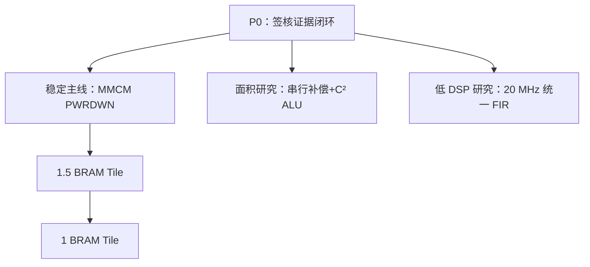
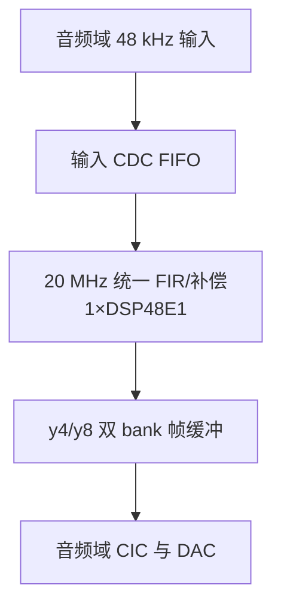

# P4-C RTL 优化工程深度审计与下一阶段优化指导

日期：2026-08-01  
器件：XC7A35T-FGG484-2  
工具基线：Vivado/XSim 2018.3  
审计输入：`p4b_rtl_next_optimization_guide_execution.md` 与 `XC7A35T_interp_audio_pcm_wordlen_opt(2).zip`

> 说明：本次没有收到 MATLAB 工程，因此本文可以独立复核 RTL、XPR、综合/实现报告和压缩包内仿真证据，但不能独立重跑反馈文档中的 MATLAB 系数设计与六工况频响流程。文中把“附件可直接证明”“反馈中报告但附件不能复现”“下一阶段推导/研究目标”严格分开。

## 1. 结论先行

本轮 RTL 优化本身是有效的。上传工程内的当前 4-DSP 实现报告能够确认：

```text
479 LUT / 468 FF / 198 Slice / 4 DSP48E1
4 RAMB18E1 = 2 BRAM Tile / 2 MMCM
WNS = +45.734 ns / WHS = +0.121 ns
Total/Dynamic = 0.271/0.199 W（vectorless，Medium confidence）
```

相对上一版 P4-B 的 `504 LUT / 493 FF / 202 Slice`，实际减少了：

```text
-25 LUT / -25 FF / -4 Slice
```

首样点修复、Stage2/3 固定 CE 死队列删除、Stage1 DSP48 预加器、CIC 26/29-bit 解析收窄，都在源码中真实存在。当前 4-DSP 版本不是“纸面优化”。

但当前 ZIP **还不能定义为可独立复现的签核发布包**。主要原因是：

1. GUI 默认全链仿真缺少输入和 golden MEM，压缩包内保存的 `simulate.log` 实际以 `43776` 个 mismatch 失败；
2. 包内 `rtl_impulse_y128.csv` 是 7 月 19 日的 7374 点旧资产，而当前全国赛 TB 明确要求 7406 点；
3. 反馈中所述 15/15 回归脚本、GUI 配置脚本、3/2-DSP 报告与 bitstream、当前 golden 和结果目录均未装入 ZIP；
4. 包内 4-DSP bitstream 的 SHA-256 与反馈记录不一致，且 bitstream 时间早于最终综合/实现报告，无法证明二者属于同一构建；
5. RTL 顶层默认参数不是签核配置，签核结果依赖 XPR Generic 覆盖；
6. 路由 methodology 报告仍有 8 条 `TIMING-18`，CDC 也缺少可审计的 `report_cdc` 和 bundled-data 物理约束证据。

因此，最准确的状态描述是：

> **479/468/4-DSP 的实现结果成立；反馈所述完整回归和频响结果可能已经在原工作目录完成，但当前上传包没有把这些证据绑定到同一份源码、报告和 bitstream。**

下一阶段推荐分成一条稳定主线和两条研究支线：



推荐默认发布档仍是 **479 LUT / 468 FF / 4 DSP / 2 BRAM Tile**。XC7A35T 有 90 个 DSP，当前只用 4 个，即 4.44%；2-DSP 档以 `+44 LUT/+55 FF` 换两颗 DSP，并没有减少 Slice。只有评分明确重罚 DSP 时，2-DSP 档才更有价值。

---

## 2. 证据分级

| 结论 | 本次状态 | 说明 |
|---|---|---|
| 4-DSP post-route 为 479 LUT/468 FF/198 Slice | 已独立核实 | 来自上传 ZIP 内 placed/routed 报告 |
| 4 DSP、4 RAMB18、2 MMCM | 已独立核实 | 综合与实现报告一致 |
| WNS/WHS 为 +45.734/+0.121 ns | 已独立核实 | routed timing summary |
| 功耗 0.271/0.199 W | 已独立核实为“报告值” | vectorless、Medium confidence，不等于板测 |
| 首样点 RTL 修复存在 | 已独立核实 | family 同步器不再由数据通路复位清零 |
| 死队列、预加器、26/29-bit CIC 存在 | 已独立核实 | 源码与 XPR 参数均启用 |
| CIC 单元级 4/3/2 映射 0 LSB 测试 | 代码层面可信 | TB 覆盖连续、停顿、复位、10 seed；未在本环境重跑 XSim |
| 全链 15/15 PASS | 附件不能复现 | 对应脚本、work 目录和 golden 未上传 |
| 3-DSP 为 504/494、2-DSP 为 523/523 | 反馈报告值 | ZIP 内没有对应实现报告和 bitstream |
| 六工况频响表 | 附件不能独立复核 | 当前 impulse CSV 不是本轮 7406 点版本，MATLAB 未上传 |
| 板级六组合与 100 次切换 | 尚未完成 | 反馈也明确列为现场门禁 |

这个分级不是否定执行反馈，而是为了保证下一版不会再出现“结果是真的，但交付包无法证明”的情况。

---

## 3. 已完成优化的技术评价

### 3.1 48 kHz 首样点修复：方向正确

当前 `board_demo_competition_dac8_top.v` 中：

```verilog
always @(posedge clk_audio_128x) begin
    family_audio_meta <= family_active;
    family_audio_sync <= family_audio_meta;
end
```

同步器在音频数据通路复位期间仍追踪家族选择，避免复位释放时 48 kHz ROM 首地址仍被当成 44.1 kHz 地址 0。这个修复不改变稳态滤波响应，也不增加主要资源。

仍需补的最后一层验证是：当前板级 TB 主要检查 `family_audio_sync`，没有从真实切换动作一直观察到 ROM 首次地址 147。正式签核测试应使用两个不同的非零哨兵值，随机切换相位，并直接断言首个地址/首个样点。

### 3.2 Stage2/3 死写队列删除：收益成立，前提保留正确

使用 `ASSUME_ALIGNED_POW2_CE` 只在固定板级 CE 下删除约 25-bit 写队列，而通用可停顿 IP 继续保留队列，这个边界是正确的。相对 P4-B，FF 的 25 点下降与此完全吻合。

建议继续保留以下断言，且不要用 `SYNTHESIS` 宏把它从所有验证构建中移除：

```verilog
assert (!(stage2_history_write_event && stage3_history_write_event));
```

### 3.3 Stage1 DSP48 预加器：当前结构下值得保留

当前单 BRAM 串行 Stage1 可以把两个 24-bit 历史样本送入 DSP48E1 的 25-bit `D+A` 预加器，避免 fabric 25-bit 对称加法器。源码保持 25-bit 和，不发生预加截位。AMD 的 [UG479 DSP48E1 指南](https://docs.amd.com/v/u/en-US/ug479_7Series_DSP48E1) 也明确描述了 DSP48E1 的预加器、乘法和后加器数据通路。

该优化在本结构综合降低 7 LUT，应该保留；但不能推广为“所有 FIR 打开预加器都必然降低 LUT”。存储端口、输入寄存器和调度结构决定了最终映射。

### 3.4 CIC 26/29-bit：是解析优化，不是经验删位

当前结构：

```text
C² → Hold16 → I²
```

在 `DATA_W=21, R=16, N=3` 下：

- 第一积分器严格范围需要 `21+5=26 bit`；
- 第二积分器的非负多相核系数和为 `16²=256`，需要 `21+8=29 bit`。

这是删除永远只会是符号扩展的高位，不是删除反馈 LSB。Hogenauer 原始 CIC 论文给出了 CIC 结构和定点剪枝的理论基础：[An Economical Class of Digital Filters for Decimation and Interpolation](https://ieeexplore.ieee.org/document/1163535/)。

当前 26/29-bit 结论依赖现有输入宽度、R、N、初态和完整中间精度；将来 N4 或 LSB pruning 时必须重新推导。

### 3.5 4/3/2-DSP 档：是 Pareto，不是单调优化

| 档位 | LUT | FF | Slice | DSP | 评价 |
|---|---:|---:|---:|---:|---|
| 当前默认 | 479 | 468 | 198 | 4 | 最低 LUT/FF，推荐发布 |
| 3 DSP | 504 | 494 | 198 | 3 | 用 25 LUT/26 FF 换 1 DSP |
| 2 DSP | 523 | 523 | 197 | 2 | 用 44 LUT/55 FF 换 2 DSP |

后两行目前是执行反馈值，上传包未包含相应报告。即使数值完全正确，也应在发布目录中分别保留独立 checkpoint、报告和 bitstream。

功耗差 0.001 W 低于当前 vectorless 报告的可信分辨率。AMD 建议使用代表真实活动的 SAIF，并指出 post-route 活动能得到更准确的实现前功耗估计：[UG907 Vector SAIF Based Power Analysis](https://docs.amd.com/r/en-US/ug907-vivado-power-analysis-optimization/Vector-SAIF-Based-Power-Analysis)。

---

## 4. P0：必须先关闭的发布与签核问题

### 4.1 默认 GUI 仿真实际失败

压缩包内 `XC7A35T_interp.sim/sim_1/behav/xsim/simulate.log` 明确显示：

```text
impulse_input_24bit.mem cannot be opened
impulse_y4/y8/y128_golden_24bit.mem cannot be opened
Fatal: PHASE7 FULL CHAIN case=1 FAIL mismatch=43776
```

修复要求：

1. 所有 TB 在 `$readmemh` 前用 `$fopen` 做资产预检，打不开立即 `$fatal`；
2. 回归脚本从 manifest 解析绝对路径或把资产复制进本次独立 work 目录；
3. 不允许“读文件 warning 后继续跑几亿 ps”；
4. 增加负测试：故意改一个 Stage3 系数，完整回归必须失败。

### 4.2 当前 impulse CSV 是旧版本

上传包中：

```text
rtl_impulse_y4.csv   = 225 行
rtl_impulse_y8.csv   = 459 行
rtl_impulse_y128.csv = 7374 行
时间戳               = 2026-07-19
```

而当前 `tb_phase7_full_chain_bittrue.v` 的全国赛配置要求：

```text
IR_LEN_4X   = 225
IR_LEN_8X   = 459
IR_LEN_128X = 7406
```

因此这三份 CSV 不能作为本轮 479-LUT 版本的频响证据。应删除旧 CSV，重新由当前签核 wrapper 生成，并将行数、配置 ID、源码哈希写入 CSV 头或旁路 manifest。

### 4.3 bitstream 与报告没有绑定

上传包内 bitstream 的 SHA-256 为：

```text
5e7b8238747becea4da715b041210d1ef08a55e8cf1665ca1fa8ca287d4aab2c
```

执行反馈记录的 4-DSP SHA-256 为：

```text
814465320512830c98d0eda5352d36797bf5c442cd27e3520b5b89601f1c52d3
```

bitstream 时间也早于最终综合/实现报告。Vivado bitstream 可能因时间戳或重新构建而变化，但这里的关键不是“两个 hash 为什么不同”，而是当前包没有提供能把某一个 bitstream 与某一组报告唯一绑定的 manifest。

建议每次发布生成：

```text
release_manifest.json
├── config_id
├── Vivado version/build
├── part
├── top/wrapper
├── all generics/defines
├── source file SHA-256
├── golden/MEM/CSV SHA-256
├── DCP/report/bit SHA-256
└── git commit或源码快照ID
```

### 4.4 顶层默认参数仍不是签核配置

`board_demo_competition_dac8_top` 的默认值含：

```text
USE_PHASE7_LUTRAM_STAGE23 = 0
USE_PHASE7_BRAM_STAGE23_COEFF = 0
USE_NATIONAL_FINALS_DATAPATH = 1
```

而 XPR 实际覆盖为：

```text
USE_PHASE7_LUTRAM_STAGE23 = 1
USE_PHASE7_BRAM_STAGE23_COEFF = 1
USE_NATIONAL_FINALS_DATAPATH = 1
```

下游又规定 `STAGE3_FLAT=1` 必须配合 Stage2/3 的相应实现，但这个合法性检查位于 ``ifndef SYNTHESIS`` 内。脱离 XPR 直接综合顶层时，错误组合可能不会 `$fatal`，而会静默生成不同传递函数。

推荐新增两个零自由度 wrapper：

```text
nf_signedoff_board_top
nf_signedoff_filter_core
```

wrapper 内显式写死所有正式参数；板级综合和主位真 TB 都只实例化它。实验分支用独立 wrapper，不再依赖十几个 XPR Generic 与 TB 宏保持人工同步。

### 4.5 全国赛 nightly 宏不能真正得到全国赛 10-seed 规模

当前 TB 是：

```verilog
`ifdef NATIONAL_FINALS
    // 1 seed / 1024
`elsif PHASE7_NIGHTLY
    // 10 seed / 4096
`endif
```

同时定义两个宏时，永远进入较小的 `NATIONAL_FINALS` 分支；只定义 `PHASE7_NIGHTLY` 又会失去全国赛算法配置。应把“算法配置”和“回归规模”拆开：

```text
NF_SIGNEDOFF_CONFIG
REGRESSION_SMOKE / REGRESSION_NIGHTLY / REGRESSION_RELEASE
```

正式发布门禁建议至少包含：冲激 + 10 seed × 4096 输入的全链 4x/8x/128x 固定延迟 0 LSB。

### 4.6 物理时序还存在一个未关闭的 warning 集合

XDC 已经为两家族建立 DAC generated clock，并施加 `+2.5/-2.0 ns` 输出延迟；timing summary 也显示 setup/hold 通过。但 routed methodology 报告仍对 8 位 `dac_data` 各报一条 `TIMING-18`。

这可能是 Vivado 2018.3 对同一输出端口上的多 generated clock 识别问题，也可能是部分分析场景没有正确关联 output delay。在结论明确前，不能简单从反馈中省略。

签核脚本应对两个家族分别导出：

```text
report_timing -to dac_data[*] -delay_type max
report_timing -to dac_data[*] -delay_type min
report_exceptions -coverage
check_timing
```

只有当两家族的 min/max 路径都明确包含外部 output delay、无 unconstrained endpoint，才允许把 8 条 warning 作为 Vivado 2018.3 的已解释 waiver，并在 manifest 中记录 waiver 文本和证据。

### 4.7 CDC 功能测试较好，但物理证据不足

当前 XDC 用 `set_clock_groups -asynchronous` 切断 20 MHz 与音频域分析。这对双触发器 toggle 同步器合理，但 `mode_shadow[1:0]` 是 bundled-data 总线；上传的 `report_bus_skew` 明确写着 `No bus skew constraints`。

建议增加：

- `report_cdc -details`；
- 对 shadow bus 的 `set_max_delay -datapath_only` 或 `set_bus_skew`；
- 源端在 request 到 ack 期间保持稳定的 SVA；
- 目的端只能在 request 同步并等待 `SETTLE_CYCLES` 后原子采样的 SVA；
- 约束覆盖检查，确认 bundled-data 端点没有被宽泛时钟组静默掩盖。

### 4.8 现有 packed-BRAM 实验开关不能直接复用

`interp2_stage23_lutram_cic_dsp_ce.v` 的 packed-BRAM 分支在 `initial for` 中把一个数组的内容赋给另一个数组。Vivado 2018.3 综合日志多次报告：

```text
[Synth 8-311] ignoring non-constant assignment in initial block
```

当前正式配置关闭 `USE_PHASE8_PACKED_BRAM_STAGE23`，所以不影响 479-LUT 版本；但后续 BRAM 打包不能直接打开这个开关。必须改用：

- 单一 `.mem` 文件直接初始化目标 RAM；或
- RAMB18E1/RAMB36E1 的显式 `INIT_xx`；或
- 对每个有效地址写字面常量。

然后做 behavioral、UNISIM primitive、post-synth 三层等价测试。

---

## 5. 下一步稳定主线一：未选 MMCM 掉电

### 5.1 为什么它优先级最高

当前 power hierarchy 显示：

```text
u_dual_family_audio_clock ≈ 0.197 W
全机 Dynamic              = 0.199 W
全机 Total                = 0.271 W
```

两颗 MMCM 的估计功耗远高于 DSP、BRAM 和 LUT 分项。因此继续省 10 个 LUT 对总功耗影响很小，而让未使用 MMCM 进入 `PWRDWN` 有机会得到数量级更大的收益。

`MMCME2_ADV` 的 `PWRDWN`、`LOCKED` 和复位语义应按 AMD 原语文档处理：[MMCME2_ADV](https://docs.amd.com/r/en-US/ug953-vivado-7series-libraries/MMCME2_ADV)。

### 5.2 不能直接把 PWRDWN 接到 family_sel

错误做法：

```verilog
pwrdwn_44 = family_sel;
pwrdwn_48 = ~family_sel;
```

这样会在目标 MMCM 尚未振荡/锁定时切换 BUFGMUX，甚至可能在旧时钟已停而目标时钟未启动时卡住切换。

推荐系统域 FSM：

```text
IDLE
→ MUTE_AND_RESET
→ WAKE_TARGET
→ WAIT_LOCK_STABLE
→ SWITCH_BUFGMUX
→ WAIT_NEW_CLOCK_HEARTBEAT
→ SYNC_FAMILY_AND_PRELOAD
→ POWER_DOWN_OLD
→ WARMUP
→ RELEASE_MUTE
```

关键点：

1. 目标 MMCM 唤醒期间旧 MMCM 必须继续运行；
2. `LOCKED` 先同步到 20 MHz 域，并要求连续若干拍为 1；
3. 切换后用音频域 toggle heartbeat 返回 20 MHz 域，确认新时钟真实在跑；
4. heartbeat 成功后才能关闭旧 MMCM；
5. 任一步超时都保持 DAC 中点静音并回到安全家族；
6. family 同步、ROM 首地址和滤波器复位释放顺序必须保留本轮首样点修复。

### 5.3 Go/No-Go

Go 条件：

- UNISIM 两方向随机相位切换各至少 100 次；
- 目标 MMCM 不锁定的故障注入能超时并保持静音；
- 无窄脉冲、无重复/丢失 sample strobe；
- 切换全过程 `dac_data=8'h80`；
- post-route SAIF 和实板电源轨测量均显示明显超过测量噪声的下降，建议目标为动态功耗至少下降 30%；
- 六个家族/倍率组合重新通过。

No-Go 条件：任何一次切换需要人工复位、出现 runt pulse、静音提前解除，或功耗下降不足以抵消时钟状态机风险。

### 5.4 单 MMCM + DRP 是第二阶段，不是第一步

当前两组实际参数为：

| 家族 | DIVCLK | CLKFBOUT_MULT_F | CLKOUT0_DIVIDE_F |
|---|---:|---:|---:|
| 44.1 kHz | 2 | 62.375 | 110.500 |
| 48 kHz | 1 | 36.250 | 118.000 |

它们可以成为单 MMCM 的两个 DRP 状态。AMD [XAPP888](https://docs.amd.com/v/u/en-US/xapp888_7Series_DynamicRecon) 给出了通过 DRP 动态改变 MMCM 频率、相位和占空比的方法。

DRP 版能把硬资源从 2 MMCM 降到 1 MMCM，但重配置期间音频时钟必然中断，还必须正确写入 divider、fractional、lock 和 filter 相关寄存器。建议先完成双 MMCM PWRDWN，再复制同一切换门禁研究 DRP。

---

## 6. 下一步稳定主线二：2 → 1.5 → 1 BRAM Tile

### 6.1 先做 PCM ROM + Stage1 history 合并

当前 PCM ROM 与 Stage1 history 都是 24-bit，容量远小于一颗 RAMB18E1 的 `512×36` simple-dual-port 模式。AMD 官方原语说明 RAMB18E1 的同步双口能力：[RAMB18E1](https://docs.amd.com/r/en-US/ug953-vivado-7series-libraries/RAMB18E1)。

推荐地址图：

```text
0..63    Stage1 history，可写
64..210  44.1 kHz PCM，共147点
211..226 48 kHz PCM，共16点
其余      0/保留
```

端口安排：

```text
Port A：Stage1 history 写
Port B：Stage1 history 读 / PCM 预取仲裁
```

PCM 每个 48 kHz 输入帧只需一次读取；Stage1 单读调度尾部约有 10 拍空窗。使用“Stage1 读优先、PCM 请求保持到 idle、同步读 owner tag 对齐”的仲裁即可。

预期：

```text
4 RAMB18 → 3 RAMB18
2 Tile   → 1.5 Tile（按RAMB18等效）
```

门槛：

- 全链逐样点 0 LSB；
- 44.1/48 kHz 首地址哨兵测试；
- PCM 请求 deadline 永不丢失；
- 全地址 behavioral/primitive 随机对拍；
- LUT 增量不超过 15，FF 增量不超过 30。

### 6.2 再把 Stage2/3 history 变为一块 packed LUTRAM

Stage2/3 逻辑容量约为：

```text
16×22 + 16×20 = 672 bit
```

若统一按 22-bit 存储则是 `32×22=704 bit`。一块 32 深度、22-bit 宽的分布式 RAM 理论上约需要 22 个 LUT，再加少量银行与地址逻辑。

在完成 1.5 Tile 版本后，把 Stage2/3 history 从 RAMB18 改为单一 packed LUTRAM，可得到：

```text
PCM+Stage1 history：1 RAMB18
系数 ROM          ：1 RAMB18
Stage2/3 history  ：LUTRAM
总计              ：2 RAMB18 = 1 Tile
```

合理目标：

```text
约 500～510 LUT
≤480 FF
4 DSP
1 BRAM Tile
```

如果 LUT 增量超过 35、出现分布式 RAM 读写语义差异或全链不能 0 LSB，则保留 1.5 Tile 版本，不强求 1 Tile。

### 6.3 不要用现有 packed-BRAM 分支做起点

如 P0 所述，现有 packed 分支的跨数组 initial 初始化被 Vivado 忽略。新的 BRAM 优化应从当前已签核的显式 history/coeff wrapper 开始，重新建立单一 `.mem`/INIT 和 primitive 对拍。

---

## 7. 新的低 LUT 候选：补偿器与 CIC C² 共用一个 23-bit 串行 ALU

这是一条从当前结构推导出的严格数值等价候选，尚未实现，但比“继续每处减一位”更有结构收益。

当前三抽头补偿器执行：

\[
q[n]=x[n-1]+\operatorname{ASR}_3\!\left(2x[n-1]-x[n]-x[n-2]\right)
\]

随后 CIC 前端执行两级 comb：

\[
d_0[n]=q[n]-q[n-1]
\]

\[
d_1[n]=d_0[n]-d_0[n-1]
\]

当前补偿器含多条并行宽加法链，CIC comb 已经用一个 23-bit subtractor 串行两拍。8x 输入长期平均间隔为 16 个 128x 时钟，但受当前 Stage2/3 调度影响，真实 `y8_valid` 墙钟间隔约呈 9/24 拍交替；最短 9 拍仍足以容纳 1 拍捕获和 5 拍运算。可以把五个操作统一到一个 23-bit add/sub ALU：

```text
S0: t  = (x1 << 1) - x0
S1: t  = t - x2
S2: e  = x1 + (t >>> 3)
    q  = e[20:0]              // 保留原21-bit补偿器接口
S3: d0 = sext23(q) - sext23(q_z1)
S4: d1 = d0 - d0_z1
```

五拍小于最短 9 拍输入间隔。`>>>3` 必须保持 Verilog signed 算术右移，`t` 保持 23-bit，`q` 必须经过当前 21-bit 补偿器接口后再符号扩展到 comb；不能用 `/8` 代替负数算术右移，不能把移位改到求和之前，也不能让 comb 直接看到未截取的 23-bit `e`。

这条路线可能把“补偿器的三条宽加法链 + CIC comb 加法器”减少为一条共享 CARRY 链。实际净收益取决于输入 mux、状态机和 Vivado 资源共享，不能先写死资源数字。

验证方式：

1. 保留当前 `cic3_compensator_shiftadd_ce + cic_interp16_n3_hold2...` 作为参考；
2. 新模块接受同一 y8 输入；
3. 覆盖正/负满幅、±1 LSB、交替满幅、连续、随机 CE 停顿和复位；
4. 预期相对参考固定延后 2 个高率时钟；比较器必须写死这个偏移，不允许自动搜索延迟；
5. 数值序列逐有效样点 0 LSB；
6. ALU 像当前 comb 一样每个 `clk` 推进一步，不依赖 `ce_out`；断言下一 y8 到达时不得仍忙；
7. op5 同拍置 pending，下一拍启动 Hold burst，不再增加单独 commit 状态。

Go 条件建议为：post-route `LUT≤459`（相对 479 至少减少 20）、DSP/BRAM 不增、FF 增量不超过 8、WNS 保持大于 40 ns或相对基线下降不超过 5 ns。若需要第六个提交运算态、净省不足 15 LUT，或不能证明固定 +2 拍，则回退当前并行补偿器。

---

## 8. Stage2/3 DSP 共享补偿器：必须先消除调度气泡

另一个思路是把补偿器也塞进当前 Stage2/3 共享 DSP。数学上：

\[
x_1+\operatorname{ASR}_3\!\left(2x_1-x_0-x_2\right)
=\operatorname{ASR}_3\!\left(-x_0+10x_1-x_2\right)
\]

因为对任意整数 \(x_1\)，`floor((8*x1+c)/8)=x1+floor(c/8)`，在足够位宽的二补码算术下严格等价。DSP 预加器可先形成 `x0+x2`，每个补偿输出理论上使用 2 个 DSP 算术拍和 1 个提交拍。

但是，不能直接使用“Stage2/3 只占 45/64，所以再加 12 拍等于 57/64”的估算。逐拍审计当前调度器后：

```text
Stage2 算术拍 = 19，墙钟占用 = 23
Stage3 算术拍 = 26，墙钟占用 = 34
当前总墙钟占用            = 57/64
```

额外 12 拍来自六个 job 的 accept/output 气泡。直接加入补偿任务会超过本地 64 拍 deadline。

正确顺序：

1. 先做零气泡 Stage2/3 调度器；
2. 在前一 job 期间预取下一 job 首样本/系数；
3. job 接受与首 MAC 同拍；
4. 旧结果锁存与下一 job 首 MAC 同拍；
5. 先要求 Stage2/3 墙钟占用 `≤49/64` 且全链 0 LSB；
6. 再加入补偿，要求总占用 `≤57/64`、最小余量 `≥7`。

这条路线与第 7 章的串行 23-bit ALU 是替代方案，不要同时重构。优先试隔离性更强的串行 ALU；若其 mux/control 抵消了 LUT 收益，再研究零气泡 DSP 调度。

---

## 9. 最有潜力的低 DSP 研究：把三级 FIR 统一到 20 MHz 域

### 9.1 为什么它绕开 72 > 64 的局部瓶颈

当前三级 FIR 若继续运行在 5.6448/6.144 MHz 音频域并直接共用一颗 DSP：

```text
Stage1 27 + Stage2 19 + Stage3 26 = 72 > 64
```

所以当前单读结构在最忙 64 拍窗口内不可能完成。即使把 Stage2/3 改成双读对称折叠，理论下界为 `27+11+16=54/64`，也只剩 10 拍处理 BRAM 首读、上下文、提交和写端口，风险很高。

但板上同时有 20 MHz 系统时钟。按一个 48 kHz 输入帧重新计算统一 FIR 调度：

| 级 | 每输入帧 DSP slot | 48 kHz 负载 |
|---|---:|---:|
| Stage1 | 26 MAC + 1 round = 27 | 1.296 Mslot/s |
| Stage2 | 34 MAC + 4 round = 38 | 1.824 Mslot/s |
| Stage3 | 44 MAC + 8 round = 52 | 2.496 Mslot/s |
| 合计 | 117 | 5.616 Mslot/s |

只占 20 MHz 的：

\[
5.616/20=28.08\%
\]

若连三抽头补偿器也按保守的 `8输出×3 slot=24` 加入：

\[
117+24=141\text{ slot/frame}
\]

\[
141\times48\text{k}=6.768\text{ Mslot/s}=33.84\%
\]

一个最坏 48 kHz 帧有：

\[
20\text{ MHz}/48\text{ kHz}=416.67
\]

个系统时钟。即使把单口 Stage1 读、三级任务和补偿保守串行化到约 180 拍，仍有超过 230 拍余量。这里真正的风险不再是算力，而是跨域协议、帧 deadline 和固定延迟。

通过更高频域复用 DSP 的思想与 FPGA multipumping/resource-sharing 研究一致：

- Canis、Anderson、Brown，[Multi-pumping for resource reduction in FPGA high-level synthesis](https://ieeexplore.ieee.org/document/6513499/)
- Ronak、Fahmy，[Multipumping Flexible DSP Blocks for Resource Reduction on Xilinx FPGAs](https://ieeexplore.ieee.org/document/7745879/)

### 9.2 推荐结构



推荐先使用确定性双 bank frame buffer：

```text
y4：2 bank × 4 sample × 22 bit
y8：2 bank × 8 sample × 20 bit
输入 FIFO：深度4
```

生产者填满一帧后翻转 ready toggle；音频域只读取已经完整提交的另一 bank。启动时至少预填完整一帧 y8，再解除静音。每个 bank 在收到消费者 ack 前禁止覆盖。

若优先验证正确性，也可以先用 AMD 的 [XPM_FIFO_ASYNC](https://docs.amd.com/r/en-US/ug953-vivado-7series-libraries/XPM_FIFO_ASYNC)，明确指定 distributed memory，验证后再比较双 bank 资源。

### 9.3 可以得到什么

当前 FIR 使用两颗 DSP：Stage1 一颗、Stage2/3 一颗。20 MHz 统一后 FIR 只需一颗：

| CIC 映射 | 当前全机 DSP | 20 MHz 统一 FIR 后 |
|---|---:|---:|
| 两积分器仍用 DSP | 4 | 3 |
| 两积分器均用 CARRY | 2 | **1** |

它不改变 FIR 系数或数学传递函数；在固定帧延迟对齐后仍应要求 0 LSB。但 1-DSP 档很可能比 4-DSP 档使用更多 LUT/FF，因为它还包含 CARRY CIC、调度器和 CDC。因此它是“低 DSP 创新版本”，不是默认面积版本。

### 9.4 必须证明的内容

- 48 kHz 最坏帧内 `wall_time ≤180/416`，并给出逐拍表；
- 每帧 y4 恰好 4 点、y8 恰好 8 点，顺序固定；
- 无 FIFO full write、empty read、bank overwrite；
- 家族/倍率切换和任意时刻复位会同时 flush 两域协议；
- 固定延迟由设计常数给出，TB 不自动找平移；
- 20 MHz DSP 只在有效 slot 更新状态；
- post-route SAIF 比较功耗，因为“一颗 DSP 运行在 20 MHz”不保证比“两颗 DSP 运行在约 6 MHz”更省电。

---

## 10. CIC PREG：低 FF 的独立 Pareto 版本

当前 CIC DSP 的积累状态仍落在 Slice FF。显式使用 DSP48E1 PREG/反馈路径，有机会把约 55 个状态位吸收到两颗 DSP 内部。

代价是第二积分器使用前一拍的第一级结果，输出序列整体增加一个高率有效事件延迟；有限 burst 结束还要 flush 最后一拍。幅频响应和数值序列可以不变，但 valid、固定延迟、复位与尾部协议必须同步修改。

建议门槛：

```text
FF 至少减少 45
LUT 增量 ≤10
DSP 仍为4，BRAM不增加
连续/停顿/复位/有限尾部均为固定延迟0 LSB
```

PREG 与 CARRY CIC 是两条替代路线：前者追求低 Slice FF，后者追求低 DSP，不必合并。

---

## 11. MATLAB 下一轮真正应该搜索什么

### 11.1 从“最小位宽”改为“最小硬件 job 数”

当前 14-bit 与 16-bit 系数通常仍占同一颗 DSP；少 1-bit 也不一定少 1 LUT。因此优化目标应直接包含：

```text
每级非零对称系数对数
每个48 kHz输入帧的真实DSP slot数
最忙64音频拍窗口的deadline job数
历史存储bit数
量化后绝对增益/纹波/阻带
累加峰值与饱和次数
post-route LUT/FF/DSP/BRAM/SAIF
```

Crochiere 与 Rabiner 的经典多级插值器工作强调了多级结构中计算量的全局分配：[Optimum FIR digital filter implementations for decimation, interpolation, and narrow-band filtering](https://doi.org/10.1109/TASSP.1975.1162719)。

### 11.2 联合稀疏 half-band-like 搜索

当前最大通带偏差约 0.0061 dB，而门槛是 ±0.05 dB，通带有较多余量；128x 阻带只有约 2.33 dB 余量，阻带不能放松。可以把一部分通带余量换成更少的非零系数。

建议目标函数：

\[
\min\;w_1J_1+w_2J_2+w_3J_3+\lambda B_{hist}
\]

其中 \(J_i\) 是量化后实际需要执行的对称 MAC job，而不是滤波器阶数。约束同时覆盖：

- 44.1/48 kHz；
- 4x、8x、128x 三个观察节点；
- DC/绝对增益和通带峰峰纹波；
- 128x 阻带 ≥70 dB；
- 量化系数严格对称；
- 定点累加、舍入和饱和；
- 每个局部 deadline 的 job 数。

稀疏 half-band-like FIR 的直接参考包括：[On the Design of Sparse Half-Band Like FIR Filters](https://doi.org/10.1109/ACSSC.2007.4487392) 与 [Digital Filters with Sparse Coefficients](https://doi.org/10.1109/ISCAS.2010.5538018)。

### 11.3 IFIR/FRM 只筛 Stage1，不先改 RTL

105-tap Stage1 是唯一可能从 IFIR/FRM 明显受益的级。IFIR/FRM 通过稀疏模型滤波器和 masking filter 实现窄过渡带：

- Neuvo、Dong、Mitra，[Interpolated Finite Impulse Response Filters](https://doi.org/10.1109/TASSP.1984.1164348)
- Lim，[Frequency-response masking approach for the synthesis of sharp linear phase digital filters](https://doi.org/10.1109/TCS.1986.1085930)

但当前 Stage1 已利用 half-band 零系数、对称折叠和串行 DSP。新增 masking filter、延迟和控制可能抵消理论 tap 减少。只建议先扫 `L=2,3,4`，比较：

```text
非零对称MAC数 + 历史存储 + 量化后全链频响 + 实际deadline
```

若不能至少减少 8 个最忙窗口 job 或显著降低 20 MHz 统一调度的翻转率，就不进入 RTL。

### 11.4 Hogenauer LSB pruning：只能作为新 golden 分支

当前 26/29-bit 删除的是无用高位；Hogenauer pruning 是在误差预算下分布式删除 LSB，二者完全不同。

它可能继续减少 CARRY CIC 的少量 LUT/FF，但会改变输出 golden，并可能造成 DC 偏置、小信号丢失和 idle pattern。128x 阻带余量只有 2.33 dB，不能只看均方噪声。

建议在 1-DSP/CARRY 架构稳定后再做，约束至少包括：

```text
DC、±1 LSB、满幅常量、满幅交替、20 kHz、多音
内部24-bit误差
最终8-bit DAC码差异
阻带最坏点
饱和次数
```

严禁凭经验直接在递归反馈状态中截 LSB。

### 11.5 N4 只作为性能分支

N4 加三抽头 `[-11,86,-11]/64` 的预筛选结果约可把 128x 阻带从 72.33 dB 提高到约 78.6 dB，但会增加一个积分器并改变传递函数。解析状态宽度可进一步研究约 `27/30/33 bit`，不必机械使用 37 bit；不过必须重新给出范围证明和新 golden。

若比赛更看重 70 dB 门槛上的鲁棒余量，N4 有展示价值；若目标是最低资源，继续保留 N3。

---

## 12. 不建议优先投入的方向

### 12.1 继续全局减 1 bit

当前已进入结构资源主导区。系数或数据少 1 bit 往往不改变 DSP/BRAM 数，且 128x 阻带只剩 2.33 dB 余量。除非硬件感知搜索证明能减少一个真实 MAC job、一个 CARRY4 或一整块存储，否则不值得冒误差风险。

### 12.2 CSD/MCM 全面替代现有 DSP

常数乘法的 shift-add/MCM 理论可减少乘法器；经典工作如 Dempster 与 Macleod 的 [Constant integer multiplication using minimum adders](https://ieeexplore.ieee.org/document/329866/)。但当前 FIR 已用两颗串行 DSP 完成大量系数，DSP 占用很低。把所有系数改为 MCM 大概率会大量增加 LUT。只适合 0-DSP 研究版。

### 12.3 分布式算术

分布式算术可以实现 0 DSP，但 105-tap、24-bit 输入需要分区 ROM、位串行累加和多级加法树。对 XC7A35T 当前设计，它很可能比 1-DSP 串行调度更贵，不是主线。

### 12.4 直接把补偿器卷积进 Stage3

这会把当前稀疏 half-band 结构变密，而且 8x 输出节点位于补偿器之前；直接融合会改变 8x 节点频响，不再满足同一签核定义。

### 12.5 为消除 DSP pipeline warning 盲目加级

当前 WNS 约 45.7 ns。新增流水线会改变固定延迟和尾部协议，而性能没有必要。warning 应记录和解释，不应为了“报告看起来干净”改功能时序。

### 12.6 CIC 重新分成多个小倍率级

对当前 N3，分解成 R4/R4 或 R8/R2 会增加积分器数量与状态，不形成更好的面积点。当前 `C²→Hold16→I²` 仍是稳定 N3 的面积 Pareto。

---

## 13. 建议实验矩阵与 Go/No-Go

| 分支 | 唯一改动 | 数值关系 | Go 门槛 |
|---|---|---|---|
| R0-release | wrapper、资产、manifest、timing/CDC | 完全相同 | clean-dir 全回归；hash闭环；无未解释签核项 |
| R1-mmcm-pd | 未选 MMCM PWRDWN FSM | 稳态相同，切换时序改变 | 100×双向切换；无runt；SAIF/板测明显下降 |
| R2-bram15 | PCM+Stage1 history | 0 LSB | 3 RAMB18；LUT≤+15；FF≤+30 |
| R3-bram1 | Stage2/3 packed LUTRAM | 0 LSB | 2 RAMB18；约500～510 LUT；FF≤480 |
| PREG | CIC DSP 内部状态 | 固定+1高率事件，序列0 LSB | FF≤423；LUT≤489；尾部完整 |
| X1-front-alu | 补偿+C²一条23-bit ALU | 固定+2高率时钟、序列0 LSB | LUT≤459；FF≤+8；最短9拍输入不覆盖 |
| X2-zero-bubble | Stage2/3后共享补偿 | 0 LSB | 先wall≤49，再总wall≤57 |
| X3-20m-fir | 20 MHz统一三级FIR | 固定帧延迟、序列0 LSB | wall≤180/416；无欠溢；DSP 3或1 |
| X4-n4 | N4 CIC+新补偿 | 新传递函数 | 阻带约≥78 dB；新golden；资源可接受 |
| X5-pruning | CIC LSB噪声预算 | 新 golden | 全激励/频谱/偏置/饱和均过门槛 |

每个分支都必须遵守：

```text
一次只改一类内容
先RTL 0 LSB或新golden
再综合/实现
最后SAIF与板测
不通过立即回退，不与下一项捆绑
```

---

## 14. 推荐执行顺序

### 14.1 如果目标是全国赛稳定发布

```text
1. 修复签核 wrapper、nightly 宏、MEM/CSV/bitstream manifest
2. 关闭 TIMING-18 与 CDC 证据缺口
3. 现场完成当前 4-DSP bitstream 六组合和切换门禁
4. 双 MMCM PWRDWN
5. PCM+Stage1 合并到 1.5 Tile
6. Stage2/3 LUTRAM 到 1 Tile
7. 选择是否做 CIC PREG 低 FF 版本
```

### 14.2 如果目标是展示结构创新

并行开两个不污染稳定主线的 proof-of-concept：

```text
X1：补偿器+C²串行23-bit ALU，目标继续降LUT
X3：20 MHz统一FIR，目标全机1 DSP
```

前者风险较低、可能直接改善 4-DSP 默认版；后者创新性更强，但属于 CDC/调度架构重构。

### 14.3 如果目标是性能余量

```text
N4 + [-11,86,-11]/64
→ 新状态范围证明
→ 新整数 golden
→ 六工况频响
→ 与 N3 的资源/功耗/阻带对比
```

不要把 N4 与稳定主线的 0-LSB 优化混在同一提交。

---

## 15. 不上传完整 MATLAB 工程时的最小签核导出包

完整 MATLAB 工程很大并不是阻塞项。下一轮只需导出一个小型、可独立复核的 `matlab_release_export`：

```text
coefficients.csv 或 coefficients.mat
q_format_and_scaling.json
impulse_input_24bit.mem
impulse_y4/y8/y128_golden_24bit.mem
rtl_impulse_y4/y8/y128.csv（当前7406点版本）
run_release_frequency_check.m
frequency_summary.json 或 .txt
SHA256SUMS
```

`run_release_frequency_check.m` 应只依赖上述文件和 MATLAB 基础函数，打印六工况频响、绝对增益、对称误差、饱和次数与最终 PASS/FAIL。这样无需上传整个工作区，也能把 RTL、golden 和频响绑定到同一 config ID。

---

## 16. 最终建议

当前工程最值得肯定的是：你们已经从 504/493 真实推进到 479/468，而且低风险结构优化方向基本正确。下一阶段不要再把主要精力花在个位数策略扫描或统一减位上。

最优的投入顺序是：

```text
先把“479/468是真的”升级为“任何人拿发布包都能证明479/468”
→ 再解决约0.197 W的MMCM功耗热点
→ 再把BRAM压到1.5/1 Tile
→ 最后用串行前端ALU或20 MHz统一FIR冲击新Pareto点
```

若所有建议中只能选三项，建议选：

1. **签核 wrapper + release manifest + 当前 golden/CSV 闭环**；
2. **双 MMCM PWRDWN + heartbeat 安全切换**；
3. **PCM+Stage1 history 合并，随后评估 1 Tile**。

若还要增加一项答辩创新，选择 **20 MHz 统一三级 FIR、全机 1-DSP Pareto**，并把 `117/141 slot`、`416.67-cycle frame deadline`、双 bank CDC 和固定延迟证明展示出来。这比“再少几位系数”更有完整的架构创新价值。
