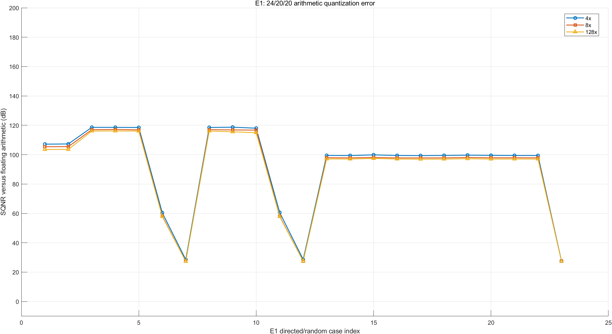
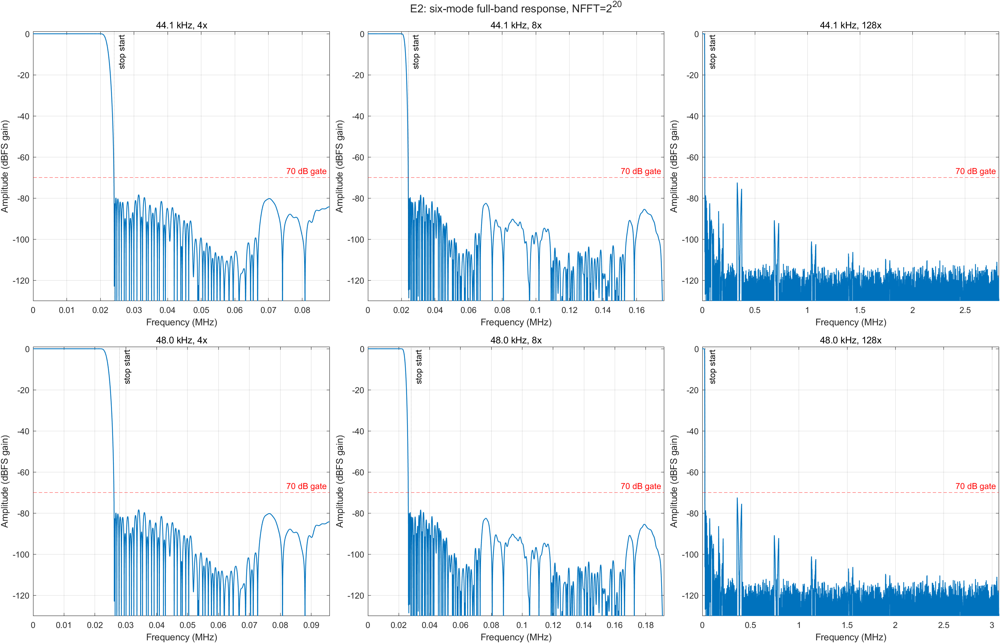
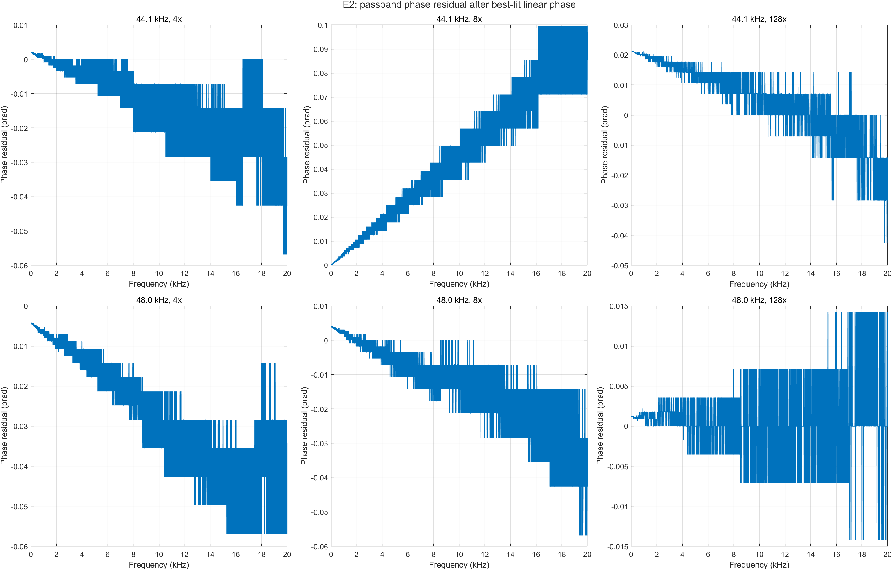
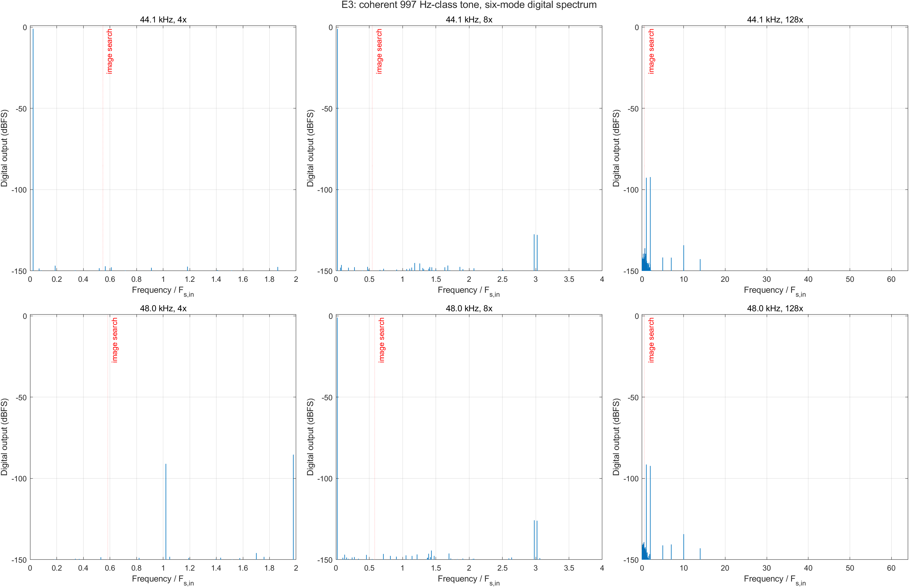
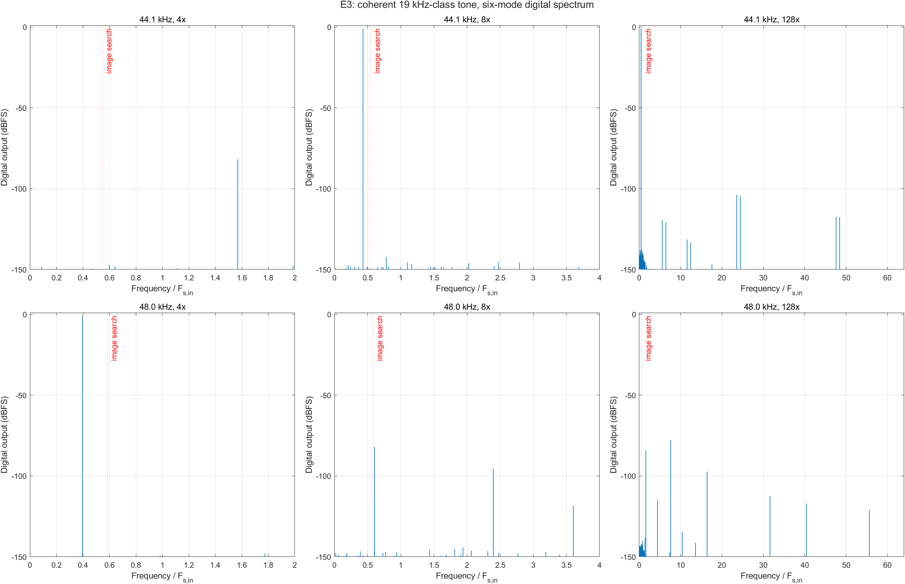
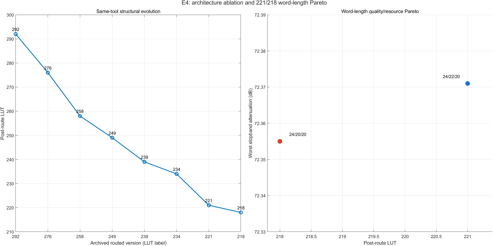

# 218-LUT 高阶数字插值滤波器补充测试报告

> 测试日期：2026-08-12
>
> 对象：Vivado 2025.2 正式板测基线，Stage1/2/3=`24/20/20`
>
> 配置标识：`NF-P3-STAGE123-24-20-20-CANDIDATE-R1`
>
> 器件：XC7A35T-FGG484-2
>
> 状态：数字域补充实验通过；218-LUT 版本功能板测已由用户确认

## 1. 测试指导可行性结论

`technical_report_supplementary_experiment_guide.md` 的总体方法可行，且比只列资源数字更适合
竞赛技术报告。它把证据分成数值正确性、信号质量、RTL 位真、实现结果和物理测量，能够避免
“RTL 0 LSB 等同于无定点损失”“示波器有波形等同于阻带达到 70 dB”等论证跳跃。

但指导实际上是一套完整论文级实验计划，不应把所有项目视为一次脚本即可完成。本轮按证据
可获得性执行如下：

| 项目 | 可行性 | 本轮状态 | 结论边界 |
|---|---|---|---|
| E0 环境与口径 | 可直接执行 | **完成** | 配置、源码、DCP、bitstream 和工具口径已记录 |
| E1 浮点—定点—RTL | 可执行 | **核心项完成** | 浮点端采用相同已量化系数、取消逐级舍入/饱和的算术参考；未恢复原始未量化设计系数 |
| E2 幅频/相位/群延迟 | 可直接执行 | **完成，6/6** | 使用正式 24/20/20 冲激向量和 `2^20` 点 FFT |
| E3 实际信号频谱/镜像 | 可直接执行 | **完成核心频点，18/18** | 997 Hz、10 kHz、19 kHz；双音、白噪声和 -60 dBFS 频谱仍可扩展 |
| E4 结构/字长消融 | 部分可直接执行 | **归档复核完成** | 292→221 为同工具链历史归档；没有伪装成全部重新实现 |
| E5 正式 Fmax | 技术上可行 | 未执行 | 必须 OOC 多频点重新实现及临界点多 seed，不能用当前 WNS 倒数代替 |
| E6 SAIF 功耗 | 技术上可行 | 未执行 | 当前只有 vectorless Medium-confidence 报告，不作为动态功耗结论 |
| E7 板级音频仪器测试 | 需外部仪器 | 未执行 | 缺少校准声卡/分析仪/频谱仪原始数据，不以仿真代替 |
| E8 长期切档压力 | 可执行但需专项长仿真 | **部分完成** | 新 Smoke 含 10 次全链切档、100 次时钟切换、1200 次 CDC 握手；尚非 10^6 样点/1000 次全链标准 |
| E9 221/218 配对 seed | 可执行但需 6 次以上实现 | 未执行 | 因此 3-LUT 收益仍写为两个已签核实现点，不宣称统计重复性 |

## 2. 测试目的和意义

本轮测试不是再次证明“工程能综合”，而是补足以下证据：

1. **字长优化的数值代价**：量化误差在正常音频电平下有多大，低电平信号是否异常归零；
2. **严格线性相位**：由冲激对称、相位拟合残差和群延迟波动共同证明，而非只看系数形式；
3. **镜像抑制的实际信号证据**：用定点正弦输出 FFT 检查插零产生的频谱镜像；
4. **模型到硬件的一致性**：固定模型、稳定 Golden、RTL 回归和 post-route 结果形成连续证据链；
5. **优化收益的正确归因**：把数值等价结构优化与 221→218 的有限字长 Pareto 分开。

这些数据使 218-LUT 版本可以表述为“资源低、频响合格、严格线性相位、镜像受控且 RTL 位真”，
而不只是“当前最小 LUT 且能上板”。

## 3. 环境、对象与复现口径（E0）

| 项目 | 固定值 |
|---|---|
| MATLAB | R2023a |
| Vivado / XSim | 2025.2，SW Build 6299465 |
| FPGA | XC7A35T-FGG484-2 |
| 完整板级顶层 | `board_demo_competition_dac8_top` |
| 输入 | 24-bit signed，44.1/48 kHz |
| 输出节点 | 4x、8x、128x，共六种正式工况 |
| 有效字长 | 24/20/20 |
| 正式资源口径 | Full-board Post-Route |
| 通带 | 10 Hz～20 kHz，最大绝对偏差不超过 0.05 dB |
| 阻带 | 从 `Fs_in-20 kHz` 起，衰减不低于 70 dB |
| E2 FFT | `NFFT=2^20` |
| E3 FFT | 每例 `NFFT=2^18`，相干矩形窗，丢弃 512 个输入样点启动区 |

关键文件 SHA-256、Git 提交、分支和配置见
[E0 环境清单](../../../matlab_fir/national_finals/report_experiments/technical_report_218/processed/e0_environment_manifest.csv)
与 [E0 哈希清单](../../../matlab_fir/national_finals/report_experiments/technical_report_218/processed/e0_sha256_manifest.csv)。

## 4. E1：浮点算术—定点—RTL 误差

### 4.1 方法

同一 24-bit PCM 输入进入两条 MATLAB 链：

```text
同一组正式 Q15 系数
  ├─ double 卷积，不做逐级舍入、饱和或有限状态截断
  └─ 24/20/20 bit-true，执行与 RTL 相同的舍入、饱和和 CIC 状态规则
```

这个对照隔离的是**数据路径有限字长误差**。系数量化造成的频响影响由 E2 直接测量；由于归档中
没有一组与当前补偿结构完全对应的未量化设计系数，本报告不把该 double 分支称为“无限精度原始
滤波器设计”。

输入覆盖正负满幅冲激、997 Hz/10 kHz/19 kHz 的 -1 dBFS 正弦、997 Hz 的 -60/-90 dBFS
小信号、10 个固定 seed 随机 PCM 和正负满幅交替边界。正弦在统计前丢弃 512 个输入样点启动区。

### 4.2 结果

| 类别 | 输出统计行 | 最低 SQNR | 最大 RMS 误差/LSB | 最大绝对误差/LSB | 累加器溢出 | 正常分析区触顶 |
|---|---:|---:|---:|---:|---:|---:|
| -1 dBFS，三频点×双 Fs×三节点 | 18 | **114.974 dB** | 9.425 | 29.764 | 0 | 0 |
| -60 dBFS，双 Fs×三节点 | 6 | **57.858 dB** | 7.601 | 26.596 | 0 | 0 |
| -90 dBFS，双 Fs×三节点 | 6 | **27.316 dB** | 8.051 | 22.306 | 0 | 0 |
| 10 seed 随机 PCM×三节点 | 30 | **96.925 dB** | 8.354 | 32.385 | 0 | 0 |



结果说明：

- 所有用例累加器溢出为 0；正常正弦和随机分析区没有输出触顶；
- -1 dBFS 的最差 SQNR 仍超过 114 dB，说明 24/20/20 对正常幅度数字音频的算术损失很小；
- -60/-90 dBFS 的 SQNR 随信号幅度下降，这是固定绝对量化误差的正常表现；-90 dBFS 仍未异常归零；
- 正负满幅交替是刻意的边界反例，整段出现 615 次内部饱和、分析区 454 个触顶样点，不能作为正常
  音频质量用例。正满幅冲激也触发一次预期边界饱和。失败/边界数据被保留，没有从统计中删除。

完整数据见 [E1 浮点—定点指标](../../../matlab_fir/national_finals/report_experiments/technical_report_218/processed/e1_float_fixed_case_metrics.csv)。

### 4.3 RTL 位真门禁

稳定冲激和随机向量在 4x/8x/128x 共 6 个比较项全部为 **0 LSB**。随后使用 Vivado 2025.2
重新运行当前 24/20/20、4-DSP Smoke，结果为 **17/17 PASS**：

- 全链冲激和随机向量三个节点逐样本 0 LSB；
- 8 组内部状态复位恢复均通过；
- 10 次无复位动态切档无窄脉冲、未知值或死锁；
- 100 次双时钟族切换和 1200 次 CDC 握手通过；
- RAMB18、Stage1 单 BRAM、Stage2/3 历史、CIC 三种 DSP 映射等价测试全部通过。

新运行目录：`matlab_fir/national_finals/_work/rtl_regression/20260812_000159`。逐项清单见
[RTL 回归摘要](../../../matlab_fir/national_finals/report_experiments/technical_report_218/processed/rtl_regression_summary.csv)。

## 5. E2：幅频、严格线性相位和群延迟

### 5.1 六工况结果

| 工况 | 输出 Fs | 最大绝对通带偏差/dB | 峰峰纹波/dB | 阻带衰减/dB | 群延迟/输出样点 | 群延迟/µs | 最大相位残差/rad | 对称误差/LSB |
|---|---:|---:|---:|---:|---:|---:|---:|---:|
| 44.1k / 4x | 176.4 kHz | 0.003022 | 0.005714 | 78.277 | 112 | 634.921 | 5.68e-14 | 0 |
| 44.1k / 8x | 352.8 kHz | 0.003474 | 0.006190 | 78.359 | 229 | 649.093 | 9.95e-14 | 0 |
| 44.1k / 128x | 5.6448 MHz | **0.007844** | 0.005972 | **72.355** | 3686.5 | 653.079 | 4.26e-14 | 0 |
| 48k / 4x | 192 kHz | 0.003022 | 0.005714 | 78.277 | 112 | 583.333 | 5.68e-14 | 0 |
| 48k / 8x | 384 kHz | 0.003028 | 0.005743 | 78.359 | 229 | 596.354 | 5.68e-14 | 0 |
| 48k / 128x | 6.144 MHz | 0.007605 | 0.005733 | **72.355** | 3686.5 | 600.016 | 1.42e-14 | 0 |

六工况全部满足 `±0.05 dB` 和 `≥70 dB`。最差通带余量约为 `0.05-0.007844=0.042156 dB`，
最差阻带余量为 `72.355-70=2.355 dB`。



### 5.2 严格线性相位证据

- 三个节点非零冲激支撑区的镜像对称误差均为 **0 LSB**；
- 六工况相位直线拟合最大残差不超过 `9.95e-14 rad`；
- 数值微分得到的最大群延迟波动不超过约 `2.66e-9` 输出样点；
- 4x/8x/128x 的群延迟分别固定为 112、229、3686.5 个输出样点。



因此“严格线性相位”由整数冲激完全对称和数值相位残差共同支持。完整结果见
[E2 六工况指标](../../../matlab_fir/national_finals/report_experiments/technical_report_218/processed/e2_mode_metrics.csv)。

## 6. E3：实际定点正弦频谱与镜像抑制

### 6.1 方法

对 997 Hz、10 kHz、19 kHz 选择最接近的相干频点，每个输出使用 `2^18` 个稳态样点和矩形窗。
镜像搜索从 `Fs_in-20 kHz` 开始，报告该区间到输出 Nyquist 的最坏谱线。该指标是实际定点
输出的频谱证据，不等同于 DAC 模拟输出测量。

### 6.2 结果

| 工况 | 三频点最差镜像抑制/dBc | 对应频点 | 70 dB 余量 | 稳态触顶 |
|---|---:|---:|---:|---:|
| 44.1k / 4x | 80.848 | 19 kHz | 10.848 | 0 |
| 44.1k / 8x | 81.216 | 19 kHz | 11.216 | 0 |
| 44.1k / 128x | **74.546** | 19 kHz | **4.546** | 0 |
| 48k / 4x | 80.508 | 19 kHz | 10.508 | 0 |
| 48k / 8x | 81.008 | 19 kHz | 11.008 | 0 |
| 48k / 128x | **76.850** | 19 kHz | **6.850** | 0 |

18 个用例全部通过，最差点为 44.1 kHz/128x 的约 19 kHz 输入，镜像抑制
**74.546 dBc**。它高于 70 dB，但不能替代 E2 的全频率最坏阻带搜索；单音没有正好落在
E2 找到的最坏阻带峰值频率。





第一轮门禁曾得到 17/18：48 kHz/128x 的 997 Hz 用例在整个有限序列中记录到 8 次启动瞬态
内部饱和。按指导把统一启动区与稳态区分开后，稳态输出触顶为 0，镜像抑制 88.232 dBc，故正式
稳态门禁为 18/18；原始启动计数仍保留在 CSV 的 `STARTUP_TRANSIENT_SATURATION_COUNT` 中。

完整数据见 [E3 频谱指标](../../../matlab_fir/national_finals/report_experiments/technical_report_218/processed/e3_spectrum_metrics.csv)。

## 7. E4：结构消融、字长 Pareto 与实现证据

### 7.1 结构演进

同一 Vivado 2025.2 归档链从 292 LUT 降到 221 LUT，下降 `71/292=24.32%`。这些点的主要变化
依次是 DSP 抽头门控、Stage1 顺序抽头、CIC DSP 角色交换、中心延迟 CE、控制合并和 routed
不变量复用。它们属于数值等价结构优化。

221→218 则把 Stage2 有效宽度从 22 bit 降到 20 bit，资源变化为 `-3 LUT/-2 FF`，约为
`1.36% LUT` 和 `0.54% FF`；该步骤属于有限字长 Pareto，不能写入逐样本等价结构表。



由于本轮没有完成 E9 的 3～5 组配对 seed，实现层面只能确认“221 和 218 都是同工具链下的正式
签核点且均已板测”，不能把 3-LUT 差异表述为已完成统计显著性证明。

### 7.2 当前完整板级实现

| LUT | FF | DSP48E1 | RAMB18E1 | BRAM Tile | MMCM | WNS/WHS | TNS/THS | DRC Error | Bitstream |
|---:|---:|---:|---:|---:|---:|---:|---:|---:|---|
| **218** | **365** | **4** | **4** | **2** | **2** | +45.279/+0.079 ns | 0/0 | 0 | 成功 |

vectorless 功耗报告为 Total/Dynamic/Static=`0.271/0.199/0.072 W`，置信度 Medium，两颗 MMCM
动态分项约 0.197 W。没有 SAIF 活动文件，因此该数字只作为工具基线，不用于宣称真实动态功耗或
每样点能效。

## 8. 综合结论

本轮可执行部分总门禁通过：

- E1 固定模型/稳定 RTL 向量：6/6、最大 0 LSB；新 RTL Smoke：17/17；
- E1 正常 -1 dBFS 最低算术 SQNR：114.974 dB；10 seed 随机最低 96.925 dB；
- E2 六工况：6/6，最差通带绝对偏差 0.007844 dB，最差阻带 72.355 dB；
- 严格线性相位：冲激对称误差 0 LSB，相位残差小于 `1e-13 rad`；
- E3 三频点×六工况：18/18，最差实际定点镜像抑制 74.546 dBc；
- Post-Route：218 LUT / 365 FF / 4 DSP / 2 BRAM Tile，时序、DRC、bitstream 全部通过；
- 218-LUT 版本功能板测已通过，但没有新增仪器级音频数据。

因此，指导中 E0～E3 的核心数字域路线可行且已得到有效补充证据；E4 的资源链可用于展示优化
演进，但 221/218 的 3-LUT 统计重复性仍需 E9。下一阶段最有价值的顺序为：

1. 先完成 221/218 三组配对 seed，关闭字长资源收益的统计缺口；
2. 若报告要主张低功耗，再建设至少两个 128x 工况的 SAIF 流程；
3. 增加 E3 的双音、白噪声和 -60 dBFS 频谱；
4. 使用校准声卡或音频分析仪完成 E7，且把 8-bit DAC 全链指标与 24-bit 数字核心分开；
5. E5 仅在需要面积—速度论文指标时做 OOC 多 seed Fmax 扫描。

## 9. 数据和复现入口

- [实验归档说明](../../../matlab_fir/national_finals/report_experiments/technical_report_218/README.md)
- [统一运行脚本](../../../matlab_fir/national_finals/report_experiments/run_technical_report_experiments.m)
- [机器可读总门禁](../../../matlab_fir/national_finals/report_experiments/technical_report_218/processed/experiment_summary.csv)
- [MATLAB 执行日志](../../../matlab_fir/national_finals/report_experiments/technical_report_218/logs/matlab_execution.txt)
- [证据来源清单](../../../matlab_fir/national_finals/report_experiments/technical_report_218/raw/evidence_sources.txt)

MATLAB 在受限账户下启动时提示无法读取用户偏好和工具箱缓存，但进程退出码为 0，CSV、PNG 和
最终门禁均成功生成；该环境告警不涉及实验输入、计算结果或 Vivado/XSim 回归。
